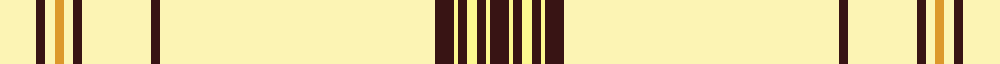

In pattern [BWBWBWBWBWBWYWBW](/stripes/bwbwbwbwbwbwywbw/).

This was sourced from tartans-authority.  It is a [16 stripe tartan](/stripes/stripes16/).

Original link http://www.tartansauthority.com/tartan-ferret/display/10024/

## Also known as

This cloth is also recorded under:

- UPS No. 2

## Thread count
LYa/16 K4 LYa4 Y4 LYa4 K4 LYa30 K4 LYa120 K8 LY2 K4 LY4 K4 LY2 K/8

## Palette
Each colour and the base-6 reference it is a variant of.

| Colour | Shade | Base |
|---|---|---|
| K | <code style="background-color:#381414;">#381414</code> `oklch(24.7% 0.058 22.2)` <small>#381414</small> | B <code style="background-color:#2A418A;">#2A418A</code> |
| LY | <code style="background-color:#FCF890;">#FCF890</code> `oklch(96.0% 0.126 106.6)` <small>#FCF890</small> | W <code style="background-color:#F7F7F7;">#F7F7F7</code> |
| LYa | <code style="background-color:#FCF4B4;">#FCF4B4</code> `oklch(95.8% 0.082 101.8)` <small>#FCF4B4</small> | W <code style="background-color:#F7F7F7;">#F7F7F7</code> |
| Y | <code style="background-color:#DC982C;">#DC982C</code> `oklch(73.0% 0.141 73.5)` <small>#DC982C</small> | Y <code style="background-color:#F2BF00;">#F2BF00</code> |

## Nearest tartans

The nearest existing variants by ΔTartan distance, with this tartan at the top so the swatches line up against it.

ΔTartan

Tartan

Sett

—

<a href="/ttd/edit/#slug=w8do2w2lo2w2do2w15do2w60do4w1do2w2do2w1do4~x2">UPS No. 2 (Corporate)</a> <a class="nn-out" href="/setts/s16/w8do2w2lo2w2do2w15do2w60do4w1do2w2do2w1do4~x2/" title="open its dictionary page">↗</a>

0.07

<a href="/ttd/edit/#slug=do2w8do4w1do2w2do2w1do4w60do2w15do2w2lo2w2~x2">UPS No.2</a> <a class="nn-out" href="/setts/s16/do2w8do4w1do2w2do2w1do4w60do2w15do2w2lo2w2~x2/" title="open its dictionary page">↗</a>

0.91

<a href="/ttd/edit/#slug=do4ly60do2ly15do2ly2lo2do2ly8do4w1do2w2do2w1~x2">UPS No.1</a> <a class="nn-out" href="/setts/s15/do4ly60do2ly15do2ly2lo2do2ly8do4w1do2w2do2w1~x2/" title="open its dictionary page">↗</a>

0.91

<a href="/ttd/edit/#slug=ly8do2ly2lo2ly2do2ly15do2ly60do4w1do2w2do2w1do4~x2">UPS No. 1 (Corporate)</a> <a class="nn-out" href="/setts/s16/ly8do2ly2lo2ly2do2ly15do2ly60do4w1do2w2do2w1do4~x2/" title="open its dictionary page">↗</a>

1.95

<a href="/ttd/edit/#slug=w46lr4w9k8w9r4w9do2w2do2w2do2~x2">Old England House Check</a> <a class="nn-out" href="/setts/s12/w46lr4w9k8w9r4w9do2w2do2w2do2~x2/" title="open its dictionary page">↗</a>

1.96

<a href="/ttd/edit/#slug=w100r14w13g13w13k1r14k1w13g13w13r12w100~x2">Wilson's Blanket Sett - Border</a> <a class="nn-out" href="/setts/s13/w100r14w13g13w13k1r14k1w13g13w13r12w100~x2/" title="open its dictionary page">↗</a>

2.06

<a href="/ttd/edit/#slug=w83k6w3k9r2k5w2ly2~x2">Crane of Cluny Dress (Personal)</a> <a class="nn-out" href="/setts/s8/w83k6w3k9r2k5w2ly2~x2/" title="open its dictionary page">↗</a>

2.13

<a href="/setts/s14/r2w2k2w28k8w9k1ly2~x2/">Summer Spirit</a>

2.19

<a href="/ttd/edit/#slug=w40o3w10o6w20k3w2k3w10r4w2r8w2">Virginia Quadricentennial</a> <a class="nn-out" href="/setts/s13/w40o3w10o6w20k3w2k3w10r4w2r8w2/" title="open its dictionary page">↗</a>

2.19

<a href="/ttd/edit/#slug=dp3w14g8w10dp4w32r1w2r1w2r1w2r1w2r1w2r1w6t3~x2">Shaw Dress (Personal)</a> <a class="nn-out" href="/setts/s19/dp3w14g8w10dp4w32r1w2r1w2r1w2r1w2r1w2r1w6t3~x2/" title="open its dictionary page">↗</a>

2.20

<a href="/ttd/edit/#slug=w46o9w4k8w9r4w9dy2w2dy2w2dy1~x2">Old England House Check</a> <a class="nn-out" href="/setts/s12/w46o9w4k8w9r4w9dy2w2dy2w2dy1~x2/" title="open its dictionary page">↗</a>

## Neighbour map

Every grey dot is one of 14299 variants placed by the first two principal components of the ΔTartan feature space (44% of its variance). Red is this tartan; blue dots are its nearest — click one to open its page.

<svg viewBox="0 0 640 380" role="img" style="max-width:100%;height:auto;border:1px solid #e0e0e0;border-radius:4px;display:block" xmlns="http://www.w3.org/2000/svg"><image href="/nn/cloud.v1.png" width="640" height="380"/><a href="/setts/s16/do2w8do4w1do2w2do2w1do4w60do2w15do2w2lo2w2~x2/"><circle cx="511.5" cy="20.9" r="4" fill="#3465a4"><title>UPS No.2</title></circle></a><a href="/setts/s15/do4ly60do2ly15do2ly2lo2do2ly8do4w1do2w2do2w1~x2/"><circle cx="523.2" cy="28.9" r="4" fill="#3465a4"><title>UPS No.1</title></circle></a><a href="/setts/s16/ly8do2ly2lo2ly2do2ly15do2ly60do4w1do2w2do2w1do4~x2/"><circle cx="526.5" cy="25.7" r="4" fill="#3465a4"><title>UPS No. 1 (Corporate)</title></circle></a><a href="/setts/s12/w46lr4w9k8w9r4w9do2w2do2w2do2~x2/"><circle cx="439.6" cy="68.4" r="4" fill="#3465a4"><title>Old England House Check</title></circle></a><a href="/setts/s13/w100r14w13g13w13k1r14k1w13g13w13r12w100~x2/"><circle cx="506.7" cy="62.8" r="4" fill="#3465a4"><title>Wilson's Blanket Sett - Border</title></circle></a><a href="/setts/s8/w83k6w3k9r2k5w2ly2~x2/"><circle cx="506.9" cy="59.3" r="4" fill="#3465a4"><title>Crane of Cluny Dress (Personal)</title></circle></a><a href="/setts/s14/r2w2k2w28k8w9k1ly2~x2/"><circle cx="423.2" cy="79.2" r="4" fill="#3465a4"><title>Summer Spirit</title></circle></a><a href="/setts/s13/w40o3w10o6w20k3w2k3w10r4w2r8w2/"><circle cx="427.9" cy="97.5" r="4" fill="#3465a4"><title>Virginia Quadricentennial</title></circle></a><a href="/setts/s19/dp3w14g8w10dp4w32r1w2r1w2r1w2r1w2r1w2r1w6t3~x2/"><circle cx="425.9" cy="38.2" r="4" fill="#3465a4"><title>Shaw Dress (Personal)</title></circle></a><a href="/setts/s12/w46o9w4k8w9r4w9dy2w2dy2w2dy1~x2/"><circle cx="439.8" cy="48.8" r="4" fill="#3465a4"><title>Old England House Check</title></circle></a><circle cx="511.8" cy="21.2" r="5" fill="#c00000"/></svg>

ID: /setts/s16/w8do2w2lo2w2do2w15do2w60do4w1do2w2do2w1do4~x2/
