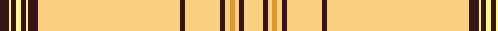

In pattern [BWBWBWBYBYBYYYBY](/patterns/bwbwbwbybybyyyby/).

This was sourced from tartans-authority.  It is a [16 stripes tartan](/stripes/stripes16/).

Original link http://www.tartansauthority.com/tartan-ferret/display/10023/

## Thread count
K/8 LY2 K4 LY4 K4 LY2 K8 LYa120 K4 LYa30 K4 LYa4 Y4 LYa4 K4 LYa/16

## Palette
Each colour and its ΔE from the base-6 reference it is a variant of.

| Colour | Shade | Base | ΔE (OKLab) |
|---|---|---|---|
| K | <code style="background-color:#381414;">#381414</code> `#381414` | B <code style="background-color:#2C4084;">#2C4084</code> | 0.21 |
| LY | <code style="background-color:#FCF890;">#FCF890</code> `#FCF890` | W <code style="background-color:#F4F4F0;">#F4F4F0</code> | 0.12 |
| LYa | <code style="background-color:#F8D080;">#F8D080</code> `#F8D080` | Y <code style="background-color:#E8C000;">#E8C000</code> | 0.09 |
| Y | <code style="background-color:#DC982C;">#DC982C</code> `#DC982C` | Y <code style="background-color:#E8C000;">#E8C000</code> | 0.11 |

ID: /setts/s16/y16b4y4ya4y4b4y30b4y120b8w2b4w4b4w2b8-b381414-wfcf890-yf8d080-yadc982c/
