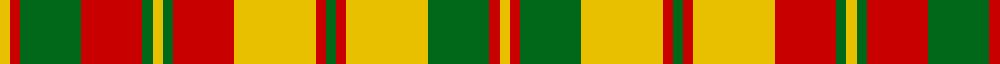

In pattern [YRGRGYGRYRGRYGRY](/patterns/yrgrgygryrgrygry/).

This was sourced from house-of-tartan.  It is a [16 stripes tartan](/stripes/stripes16/).

Original link http://www.house-of-tartan.scotland.net/house/TartanViewjs.asp?colr=Def&tnam=1890

## Thread count
Y/2 R2 G12 R12 G2 Y2 G2 R12 Y16 R2 G2 R2 Y16 G12 R2 Y/2

## Palette
Each colour and its ΔE from the base-6 reference it is a variant of.

| Colour | Shade | Base | ΔE (OKLab) |
|---|---|---|---|
| G | <code style="background-color:#006818;">#006818</code> `#006818` | G <code style="background-color:#006100;">#006100</code> | 0.02 |
| R | <code style="background-color:#C80000;">#C80000</code> `#C80000` | R <code style="background-color:#CC0000;">#CC0000</code> | 0.01 |
| Y | <code style="background-color:#E8C000;">#E8C000</code> `#E8C000` | Y <code style="background-color:#F2BF00;">#F2BF00</code> | 0.02 |

## Nearest tartans

The nearest existing variants by ΔTartan distance.

1. [Strathearn](/setts/s16/y2r2g12y16r2g2r2y16r12g2y2g2r12g12r2y2-g008000-rc00000-yf0c000/) — ΔT 0.28
1. [Strathearn (Royal)](/setts/s11/g4r4y32r24g4y4g4r24g24r4y4-g006818-rc80000-ye8c000/) — ΔT 1.00
1. [MacDougall (Lochcarron)](/setts/s19/w12r4g32r6g4r6g12w4r4w4g12r14g12r4g4r32w4r4w4-g006818-rc80000-we0e0e0/) — ΔT 1.24
1. [Strathearn](/setts/s30/r2g12r12g2y2g2r12y16r2g2r2y16g12r2y2r2g12y16r2g2r2y16r12g2y2g2r12g12r2y2-g006818-rc80000-ye8c000/) — ΔT 1.28
1. [MacNeish](/setts/s12/g12r6k6r48g8k20r4g8r4g48r12g4-g289c18-k101010-rc80000/) — ΔT 1.57
1. [Snaefell](/setts/s14/w32g28ga4g4ga4g4ga44g4ga4g4ga4g28w32g6-g604000-ga685838-we8e4d0/) — ΔT 1.58
1. [Prince George](/setts/s11/g12w8g6w8g4w14g4w4g10r30w4-g008000-rc00000-we0e0e0/) — ΔT 1.59
1. [Prince George Royal Family Tartan Tartan Number: 942. Earliest known date: pre 2003 The warmth and glow of the fertile soil, The green field and tree, The yellow and the brown of Autumn, The white of surf or a summer snow, Rust, green, yellow and white, Yes! That's our Island Tartan. See products available Copyright © Blair Urquhart, Comrie, 2015](/setts/s11/g12w8g6w8g4w14g4w4g10r30w4-g006818-rc80000-we0e0e0/) — ΔT 1.68
1. [Scrimgeour of Glassary](/setts/s12/r64k6y12g20r12k6y64k6r12g20y12k6-g408060-k101010-rc80000-yd09800/) — ΔT 1.70
1. [Highland Aircraft](/setts/s20/k4y8ya10yb4ya2k2ya4k24ya4k2ya4yb12y14yb6y24yb2ya8yb2ya24y2-k101010-yec8048-yafcb464-ybd87c00/) — ΔT 1.74

## Neighbour map

Every grey dot is one of 15726 variants placed by the first two principal components of the ΔTartan feature space (44% of its variance). Red is this tartan; blue dots are its nearest — click one to open its page.

<svg viewBox="0 0 640 380" role="img" style="max-width:100%;height:auto;border:1px solid #e0e0e0;border-radius:4px;display:block" xmlns="http://www.w3.org/2000/svg"><image href="/nn/cloud.v1.png" width="640" height="380"/><a href="/setts/s16/y2r2g12y16r2g2r2y16r12g2y2g2r12g12r2y2-g008000-rc00000-yf0c000/"><circle cx="202.4" cy="168.5" r="4" fill="#3465a4"><title>Strathearn</title></circle></a><a href="/setts/s11/g4r4y32r24g4y4g4r24g24r4y4-g006818-rc80000-ye8c000/"><circle cx="233.0" cy="183.7" r="4" fill="#3465a4"><title>Strathearn (Royal)</title></circle></a><a href="/setts/s19/w12r4g32r6g4r6g12w4r4w4g12r14g12r4g4r32w4r4w4-g006818-rc80000-we0e0e0/"><circle cx="227.7" cy="163.5" r="4" fill="#3465a4"><title>MacDougall (Lochcarron)</title></circle></a><a href="/setts/s30/r2g12r12g2y2g2r12y16r2g2r2y16g12r2y2r2g12y16r2g2r2y16r12g2y2g2r12g12r2y2-g006818-rc80000-ye8c000/"><circle cx="180.4" cy="143.7" r="4" fill="#3465a4"><title>Strathearn</title></circle></a><a href="/setts/s12/g12r6k6r48g8k20r4g8r4g48r12g4-g289c18-k101010-rc80000/"><circle cx="266.8" cy="163.6" r="4" fill="#3465a4"><title>MacNeish</title></circle></a><a href="/setts/s14/w32g28ga4g4ga4g4ga44g4ga4g4ga4g28w32g6-g604000-ga685838-we8e4d0/"><circle cx="212.1" cy="158.4" r="4" fill="#3465a4"><title>Snaefell</title></circle></a><a href="/setts/s11/g12w8g6w8g4w14g4w4g10r30w4-g008000-rc00000-we0e0e0/"><circle cx="172.3" cy="191.8" r="4" fill="#3465a4"><title>Prince George</title></circle></a><a href="/setts/s11/g12w8g6w8g4w14g4w4g10r30w4-g006818-rc80000-we0e0e0/"><circle cx="170.8" cy="190.7" r="4" fill="#3465a4"><title>Prince George Royal Family Tartan Tartan Number: 942. Earliest known date: pre 2003 The warmth and glow of the fertile soil, The green field and tree, The yellow and the brown of Autumn, The white of surf or a summer snow, Rust, green, yellow and white, Yes! That's our Island Tartan. See products available Copyright © Blair Urquhart, Comrie, 2015</title></circle></a><a href="/setts/s12/r64k6y12g20r12k6y64k6r12g20y12k6-g408060-k101010-rc80000-yd09800/"><circle cx="210.6" cy="149.5" r="4" fill="#3465a4"><title>Scrimgeour of Glassary</title></circle></a><a href="/setts/s20/k4y8ya10yb4ya2k2ya4k24ya4k2ya4yb12y14yb6y24yb2ya8yb2ya24y2-k101010-yec8048-yafcb464-ybd87c00/"><circle cx="153.3" cy="116.6" r="4" fill="#3465a4"><title>Highland Aircraft</title></circle></a><circle cx="200.3" cy="167.7" r="5" fill="#c00000"/></svg>

ID: /setts/s16/y2r2g12y16r2g2r2y16r12g2y2g2r12g12r2y2-g006818-rc80000-ye8c000/
