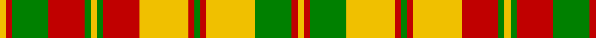

In pattern [YRGRGYGRYRGRYGRY](/patterns/yrgrgygryrgrygry/).

This was sourced from weddslist.  It is a [16 stripes tartan](/stripes/stripes16/).

Original link http://www.weddslist.com/cgi-bin/tartans/pg.pl?source=sts

## Thread count
Y/2 R2 G12 R12 G2 Y2 G2 R12 Y16 R2 G2 R2 Y16 G12 R2 Y/2

## Palette
Each colour and its ΔE from the base-6 reference it is a variant of.

| Colour | Shade | Base | ΔE (OKLab) |
|---|---|---|---|
| G | <code style="background-color:#008000;">#008000</code> `#008000` | G <code style="background-color:#006400;">#006400</code> | 0.09 |
| R | <code style="background-color:#C00000;">#C00000</code> `#C00000` | R <code style="background-color:#C80000;">#C80000</code> | 0.02 |
| Y | <code style="background-color:#F0C000;">#F0C000</code> `#F0C000` | Y <code style="background-color:#E8C000;">#E8C000</code> | 0.01 |

ID: /setts/s16/y2r2g12y16r2g2r2y16r12g2y2g2r12g12r2y2-g008000-rc00000-yf0c000/
