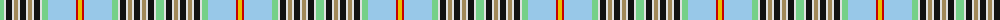

In pattern [YRWYWKWYWKWYWKWY](/patterns/yrwywkwywkwywkwy/).

This was sourced from tartans-authority.  It is a [16 stripes tartan](/stripes/stripes16/).

Original link http://www.tartansauthority.com/tartan-ferret/display/10090/

## Thread count
LG/8 LN2 K6 LN2 LT4 LN2 K6 LN2 LT4 LN2 K6 LN2 LG6 LB28 R2 Y/4

## Palette
Each colour and its ΔE from the base-6 reference it is a variant of.

| Colour | Shade | Base | ΔE (OKLab) |
|---|---|---|---|
| K | <code style="background-color:#101010;">#101010</code> `#101010` | K <code style="background-color:#000000;">#000000</code> | 0.17 |
| LB | <code style="background-color:#98C8E8;">#98C8E8</code> `#98C8E8` | W <code style="background-color:#F4F4F0;">#F4F4F0</code> | 0.17 |
| LG | <code style="background-color:#74D088;">#74D088</code> `#74D088` | Y <code style="background-color:#E8C000;">#E8C000</code> | 0.15 |
| LN | <code style="background-color:#E0E0E0;">#E0E0E0</code> `#E0E0E0` | W <code style="background-color:#F4F4F0;">#F4F4F0</code> | 0.06 |
| LT | <code style="background-color:#A08858;">#A08858</code> `#A08858` | Y <code style="background-color:#E8C000;">#E8C000</code> | 0.21 |
| R | <code style="background-color:#C80000;">#C80000</code> `#C80000` | R <code style="background-color:#C80000;">#C80000</code> | 0.00 |
| Y | <code style="background-color:#E8C000;">#E8C000</code> `#E8C000` | Y <code style="background-color:#E8C000;">#E8C000</code> | 0.00 |

ID: /setts/s16/y8w2k6w2ya4w2k6w2ya4w2k6w2y6wa28r2yb4-k101010-rc80000-we0e0e0-wa98c8e8-y74d088-yaa08858-ybe8c000/
