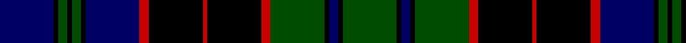

In pattern [BKGKGKBRKRKRGKBKG](/patterns/bkgkgkbrkrkrgkbkg/).

This was sourced from weddslist.  It is a [17 stripes tartan](/stripes/stripes17/).

Original link http://www.weddslist.com/cgi-bin/tartans/pg.pl?source=rb

## Thread count
DB/24 K2 G4 K2 G4 K2 DB24 R4 K24 R2 K24 R4 G24 K2 DB4 K2 G/24

## Palette
Each colour and its ΔE from the base-6 reference it is a variant of.

| Colour | Shade | Base | ΔE (OKLab) |
|---|---|---|---|
| DB | <code style="background-color:#000064;">#000064</code> `#000064` | B <code style="background-color:#2A418A;">#2A418A</code> | 0.18 |
| G | <code style="background-color:#004C00;">#004C00</code> `#004C00` | G <code style="background-color:#006100;">#006100</code> | 0.07 |
| K | <code style="background-color:#000000;">#000000</code> `#000000` | K <code style="background-color:#000000;">#000000</code> | 0.00 |
| R | <code style="background-color:#C80000;">#C80000</code> `#C80000` | R <code style="background-color:#CC0000;">#CC0000</code> | 0.01 |

## Nearest tartans

The nearest existing variants by ΔTartan distance.

1. [Stewart Old](/setts/s17/b12k1g2k1g2k1b12r2k12r1k12r2g12k1b2k1g12~b000052-g11450d-k000000-raa0000~x2/) — ΔT 0.49
1. [Breadalbane Fencibles](/setts/s13/b8k1b1k1b1k8y1g13y1k8b9k1b1~b00004c-g004c00-k000000-yffc800/) — ΔT 0.74
1. [Breadalbane Fencibles](/setts/s13/b8k1b1k1b1k8y1g14y1k8b8k1b1~b000052-g11450d-k000000-yaaaa00~x2/) — ΔT 0.76
1. [Breadalbane Fencibles](/setts/s13/b8k1b1k1b1k8y1g14y1k8b8k1b1~b000052-g11450d-k000000-yaaaa00/) — ΔT 0.76
1. [Murray of Atholl](/setts/s13/b12k2b2k2b2k12g12r3g12k12b12k1r3~b000064-g004c00-k000000-rc80000/) — ΔT 0.98
1. [MacKenzie](/setts/s15/b12k2b2k2b2k12g12k1w2k1g12k12b12k1r2~b000064-g004c00-k000000-rc80000-wd0d0d0/) — ΔT 1.00
1. [Robertson of Kindeace](/setts/s15/b12k2b2k2b2k12g16k1r3k1g16k12b12k1y3~b000052-g11450d-k000000-raa0000-yaaaaaa~x2/) — ΔT 1.03
1. [Urquhart L](/setts/s13/g8k1g1k1g1k8b8r1b8k8g8k1g1~b000064-g004c00-k000000-rc80000/) — ΔT 1.03
1. [MacKenzie](/setts/s15/b12k2b2k2b2k12g12k1y2k1g12k12b12k1r2~b000052-g11450d-k000000-raa0000-yaaaaaa~x2/) — ΔT 1.04
1. [MacKenzie](/setts/s15/b12k2b2k2b2k12g12k1y2k1g12k12b12k1r2~b000052-g11450d-k000000-raa0000-yaaaaaa/) — ΔT 1.04

## Neighbour map

Every grey dot is one of 15726 variants placed by the first two principal components of the ΔTartan feature space (44% of its variance). Red is this tartan; blue dots are its nearest — click one to open its page.

<svg viewBox="0 0 640 380" role="img" style="max-width:100%;height:auto;border:1px solid #e0e0e0;border-radius:4px;display:block" xmlns="http://www.w3.org/2000/svg"><image href="/nn/cloud.v1.png" width="640" height="380"/><a href="/setts/s17/b12k1g2k1g2k1b12r2k12r1k12r2g12k1b2k1g12~b000052-g11450d-k000000-raa0000~x2/"><circle cx="195.4" cy="167.5" r="4" fill="#3465a4"><title>Stewart Old</title></circle></a><a href="/setts/s13/b8k1b1k1b1k8y1g13y1k8b9k1b1~b00004c-g004c00-k000000-yffc800/"><circle cx="207.8" cy="170.2" r="4" fill="#3465a4"><title>Breadalbane Fencibles</title></circle></a><a href="/setts/s13/b8k1b1k1b1k8y1g14y1k8b8k1b1~b000052-g11450d-k000000-yaaaa00~x2/"><circle cx="215.7" cy="170.3" r="4" fill="#3465a4"><title>Breadalbane Fencibles</title></circle></a><a href="/setts/s13/b8k1b1k1b1k8y1g14y1k8b8k1b1~b000052-g11450d-k000000-yaaaa00/"><circle cx="215.7" cy="170.3" r="4" fill="#3465a4"><title>Breadalbane Fencibles</title></circle></a><a href="/setts/s13/b12k2b2k2b2k12g12r3g12k12b12k1r3~b000064-g004c00-k000000-rc80000/"><circle cx="166.2" cy="191.9" r="4" fill="#3465a4"><title>Murray of Atholl</title></circle></a><a href="/setts/s15/b12k2b2k2b2k12g12k1w2k1g12k12b12k1r2~b000064-g004c00-k000000-rc80000-wd0d0d0/"><circle cx="164.7" cy="158.5" r="4" fill="#3465a4"><title>MacKenzie</title></circle></a><a href="/setts/s15/b12k2b2k2b2k12g16k1r3k1g16k12b12k1y3~b000052-g11450d-k000000-raa0000-yaaaaaa~x2/"><circle cx="173.2" cy="149.3" r="4" fill="#3465a4"><title>Robertson of Kindeace</title></circle></a><a href="/setts/s13/g8k1g1k1g1k8b8r1b8k8g8k1g1~b000064-g004c00-k000000-rc80000/"><circle cx="179.5" cy="204.7" r="4" fill="#3465a4"><title>Urquhart L</title></circle></a><a href="/setts/s15/b12k2b2k2b2k12g12k1y2k1g12k12b12k1r2~b000052-g11450d-k000000-raa0000-yaaaaaa~x2/"><circle cx="180.0" cy="164.5" r="4" fill="#3465a4"><title>MacKenzie</title></circle></a><a href="/setts/s15/b12k2b2k2b2k12g12k1y2k1g12k12b12k1r2~b000052-g11450d-k000000-raa0000-yaaaaaa/"><circle cx="180.0" cy="164.5" r="4" fill="#3465a4"><title>MacKenzie</title></circle></a><circle cx="180.9" cy="161.7" r="5" fill="#c00000"/></svg>

ID: /setts/s17/b12k1g2k1g2k1b12r2k12r1k12r2g12k1b2k1g12~b000064-g004c00-k000000-rc80000~x2/
