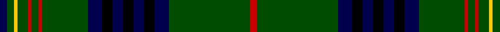

In pattern [BGYGRGRGBKBKBKBGR](/patterns/bgygrgrgbkbkbkbgr/).

This was sourced from weddslist.  It is a [17 stripes tartan](/stripes/stripes17/).

Original link http://www.weddslist.com/cgi-bin/tartans/pg.pl?source=rb

## Thread count
DB/4 G4 Y2 G6 R2 G4 R2 G26 DB8 K6 DB6 K6 DB6 K6 DB8 G46 R/4

## Palette
Each colour and its ΔE from the base-6 reference it is a variant of.

| Colour | Shade | Base | ΔE (OKLab) |
|---|---|---|---|
| DB | <code style="background-color:#00004C;">#00004C</code> `#00004C` | B <code style="background-color:#2A418A;">#2A418A</code> | 0.21 |
| G | <code style="background-color:#004C00;">#004C00</code> `#004C00` | G <code style="background-color:#006100;">#006100</code> | 0.07 |
| K | <code style="background-color:#000000;">#000000</code> `#000000` | K <code style="background-color:#000000;">#000000</code> | 0.00 |
| N | <code style="background-color:#D0D0D0;">#D0D0D0</code> `#D0D0D0` | W <code style="background-color:#F7F7F7;">#F7F7F7</code> | 0.12 |
| R | <code style="background-color:#C80000;">#C80000</code> `#C80000` | R <code style="background-color:#CC0000;">#CC0000</code> | 0.01 |
| Y | <code style="background-color:#FFC800;">#FFC800</code> `#FFC800` | Y <code style="background-color:#F2BF00;">#F2BF00</code> | 0.03 |

## Nearest tartans

The nearest existing variants by ΔTartan distance.

1. [Hyslop Hunting (Name)](/setts/s18/g4r2g24k2g2k6g2k6g2k2g3y1b3k2b1k2b3g2~b1c0070-g006818-k101010-r880000-yd09800~x2/) — ΔT 0.83
1. [Sarafilovic](/setts/s16/b15k18g3k2g2k2g44y4g44k2g2k2g3k18b15r4~b2c2c80-g006818-k101010-rc80000-ye8c000~x2/) — ΔT 0.95
1. [Kennedy](/setts/s17/k2g2y1g3b1g2b1g12ba4k3ba3k3ba3k3ba4g24r2~b59110d-ba000052-g11450d-k000000-raa0000-yaaaa00~x2/) — ΔT 1.06
1. [Kennedy](/setts/s17/k2g2y1g3b1g2b1g12ba4k3ba3k3ba3k3ba4g24r2~b59110d-ba000052-g11450d-k000000-raa0000-yaaaa00/) — ΔT 1.06
1. [Kinnear, Barony of (Personal)](/setts/s20/k4r2k8g3k8g36k8g3r4w2r3y2r4g3k8g36k8g3k8r2~g006818-k101010-rc80000-wc0c0c0-yd09800~x2/) — ΔT 1.13
1. [King Edward VII Royal Family Tartan Tartan Number: 1559. Earliest known date: pre 1992 Reputed to be a tartan specifically woven for King Edward VII. In the possession of Miss K Roberts of Torquay. See Kennedy See products available Copyright © Blair Urquhart, Comrie, 2015](/setts/s17/y8g84b21k10b10k10b10k10b21g62r3g6r3g10y3g5r6~b2c2c80-g006818-k101010-rc80000-ye8c000~x2/) — ΔT 1.16
1. [MacKean Hunting Family Tartan Tartan Number: 985. Earliest known date: 1987 1987 See products available Copyright © Blair Urquhart, Comrie, 2015](/setts/s15/g2r4g2k16g4k16g4k2g2k2g4k4b8k1w2~b2c2c80-g006818-k101010-rc80000-we0e0e0~x2/) — ΔT 1.27
1. [Grand Lodge of Scotland](/setts/s16/g18k6g1k1b1k6b1k2b1k6b1k1g1k6g21y1~b2c2c80-g006818-k101010-ye8c000~x2/) — ΔT 1.28
1. [MacKean Hunting](/setts/s15/g2r4g2k16g2k16g4k2g2k2g4k4b8k1w2~b1c0070-g006818-k101010-r880000-wc0c0c0~x2/) — ΔT 1.30
1. [Kinnear Barony of.. Family Tartan Tartan Number: 2136. Earliest known date: 13/10/92 Michael Jean George Pilette (Vlug) of Kinnear, Baron of Kinnear, commissioned the design of this new tartan. Based on the 'Duke of Fife' or Fife district tartan with an overcheck in the colours of the Kinnear Arms. The tartan was designed by Blair Urquhart for the Scottish Tartans Society and is intended for association with the bearer of the Kinnear Arms. See products available Copyright © Blair Urquhart, Comrie, 2015](/setts/s21/k2r1k6g2k6g24k4g2ra3y1ra2ya1ra3g2k4g24k6g2k6r1k2~g006818-k101010-rc80000-ra880000-yb8b8b8-yae8c000~x2/) — ΔT 1.37

## Neighbour map

Every grey dot is one of 15726 variants placed by the first two principal components of the ΔTartan feature space (44% of its variance). Red is this tartan; blue dots are its nearest — click one to open its page.

<svg viewBox="0 0 640 380" role="img" style="max-width:100%;height:auto;border:1px solid #e0e0e0;border-radius:4px;display:block" xmlns="http://www.w3.org/2000/svg"><image href="/nn/cloud.v1.png" width="640" height="380"/><a href="/setts/s18/g4r2g24k2g2k6g2k6g2k2g3y1b3k2b1k2b3g2~b1c0070-g006818-k101010-r880000-yd09800~x2/"><circle cx="341.9" cy="106.7" r="4" fill="#3465a4"><title>Hyslop Hunting (Name)</title></circle></a><a href="/setts/s16/b15k18g3k2g2k2g44y4g44k2g2k2g3k18b15r4~b2c2c80-g006818-k101010-rc80000-ye8c000~x2/"><circle cx="313.4" cy="116.4" r="4" fill="#3465a4"><title>Sarafilovic</title></circle></a><a href="/setts/s17/k2g2y1g3b1g2b1g12ba4k3ba3k3ba3k3ba4g24r2~b59110d-ba000052-g11450d-k000000-raa0000-yaaaa00~x2/"><circle cx="334.3" cy="99.8" r="4" fill="#3465a4"><title>Kennedy</title></circle></a><a href="/setts/s17/k2g2y1g3b1g2b1g12ba4k3ba3k3ba3k3ba4g24r2~b59110d-ba000052-g11450d-k000000-raa0000-yaaaa00/"><circle cx="334.3" cy="99.8" r="4" fill="#3465a4"><title>Kennedy</title></circle></a><a href="/setts/s20/k4r2k8g3k8g36k8g3r4w2r3y2r4g3k8g36k8g3k8r2~g006818-k101010-rc80000-wc0c0c0-yd09800~x2/"><circle cx="308.3" cy="108.0" r="4" fill="#3465a4"><title>Kinnear, Barony of (Personal)</title></circle></a><a href="/setts/s17/y8g84b21k10b10k10b10k10b21g62r3g6r3g10y3g5r6~b2c2c80-g006818-k101010-rc80000-ye8c000~x2/"><circle cx="349.1" cy="100.0" r="4" fill="#3465a4"><title>King Edward VII Royal Family Tartan Tartan Number: 1559. Earliest known date: pre 1992 Reputed to be a tartan specifically woven for King Edward VII. In the possession of Miss K Roberts of Torquay. See Kennedy See products available Copyright © Blair Urquhart, Comrie, 2015</title></circle></a><a href="/setts/s15/g2r4g2k16g4k16g4k2g2k2g4k4b8k1w2~b2c2c80-g006818-k101010-rc80000-we0e0e0~x2/"><circle cx="289.5" cy="143.5" r="4" fill="#3465a4"><title>MacKean Hunting Family Tartan Tartan Number: 985. Earliest known date: 1987 1987 See products available Copyright © Blair Urquhart, Comrie, 2015</title></circle></a><a href="/setts/s16/g18k6g1k1b1k6b1k2b1k6b1k1g1k6g21y1~b2c2c80-g006818-k101010-ye8c000~x2/"><circle cx="366.6" cy="136.1" r="4" fill="#3465a4"><title>Grand Lodge of Scotland</title></circle></a><a href="/setts/s15/g2r4g2k16g2k16g4k2g2k2g4k4b8k1w2~b1c0070-g006818-k101010-r880000-wc0c0c0~x2/"><circle cx="314.2" cy="147.9" r="4" fill="#3465a4"><title>MacKean Hunting</title></circle></a><a href="/setts/s21/k2r1k6g2k6g24k4g2ra3y1ra2ya1ra3g2k4g24k6g2k6r1k2~g006818-k101010-rc80000-ra880000-yb8b8b8-yae8c000~x2/"><circle cx="310.3" cy="82.3" r="4" fill="#3465a4"><title>Kinnear Barony of.. Family Tartan Tartan Number: 2136. Earliest known date: 13/10/92 Michael Jean George Pilette (Vlug) of Kinnear, Baron of Kinnear, commissioned the design of this new tartan. Based on the 'Duke of Fife' or Fife district tartan with an overcheck in the colours of the Kinnear Arms. The tartan was designed by Blair Urquhart for the Scottish Tartans Society and is intended for association with the bearer of the Kinnear Arms. See products available Copyright © Blair Urquhart, Comrie, 2015</title></circle></a><circle cx="332.3" cy="111.5" r="5" fill="#c00000"/></svg>

ID: /setts/s17/b2g2y1g3r1g2r1g13b4k3b3k3b3k3b4g23r2~b00004c-g004c00-k000000-rc80000-yffc800~x2/
