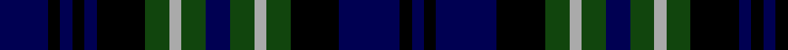

In pattern [BKBKBKGYGBGYGKBKB](/patterns/bkbkbkgygbgygkbkb/).

This was sourced from weddslist.  It is a [17 stripes tartan](/stripes/stripes17/).

Original link http://www.weddslist.com/cgi-bin/tartans/pg.pl?source=tinsel

## Thread count
DB/8 K2 DB2 K2 DB2 K8 DG4 N2 DG4 DB4 DG4 N2 DG4 K8 DB10 K2 DB/2

## Palette
Each colour and its ΔE from the base-6 reference it is a variant of.

| Colour | Shade | Base | ΔE (OKLab) |
|---|---|---|---|
| DB | <code style="background-color:#000052;">#000052</code> `#000052` | B <code style="background-color:#2A418A;">#2A418A</code> | 0.20 |
| DG | <code style="background-color:#11450D;">#11450D</code> `#11450D` | G <code style="background-color:#006100;">#006100</code> | 0.09 |
| K | <code style="background-color:#000000;">#000000</code> `#000000` | K <code style="background-color:#000000;">#000000</code> | 0.00 |
| N | <code style="background-color:#AAAAAA;">#AAAAAA</code> `#AAAAAA` | Y <code style="background-color:#F2BF00;">#F2BF00</code> | 0.19 |

## Nearest tartans

The nearest existing variants by ΔTartan distance.

1. [Arbuthnott](/setts/s17/b4k1b1k1b1k4g2y1g2b2g2y1g2k4b5k1b1~b000052-g11450d-k000000-yaaaaaa/) — ΔT 0.00
1. [Arbuthnott](/setts/s17/b4k1b1k1b1k4g2w1g2b2g2w1g2k4b5k1b1~b000064-g004c00-k000000-wd0d0d0/) — ΔT 0.55
1. [Lamont](/setts/s13/b3k1b1k1b1k4g4w1g4k4b4k1b1~b000064-g004c00-k000000-wd0d0d0/) — ΔT 0.78
1. [Lamont](/setts/s13/b3k1b1k1b1k4g4y1g4k4b4k1b1x2~b000052-g11450d-k000000-yaaaaaa/) — ΔT 0.78
1. [Lamont](/setts/s13/b3k1b1k1b1k4g4y1g4k4b4k1b1~b000052-g11450d-k000000-yaaaaaa/) — ΔT 0.78
1. [Murray](/setts/s13/b6k1b1k1b1k6g6r2g6k6b6k1b2~b00004c-g004c00-k000000-rc80000/) — ΔT 0.88
1. [MacKinlay](/setts/s15/b6k2b2k2b2k6g8k1r2k1g8k6b8k2b2x2~b000064-g004c00-k000000-rc80000/) — ΔT 0.94
1. [Murray](/setts/s13/b6k1b1k1b1k6g6r2g6k6b6k1b2x2~b000052-g11450d-k000000-raa0000/) — ΔT 0.98
1. [Murray](/setts/s13/b6k1b1k1b1k6g6r2g6k6b6k1b2~b000052-g11450d-k000000-raa0000/) — ΔT 0.98
1. [Gordon](/setts/s13/b12k2b2k2b2k12g12y2g12k12b11k2b2~b00004c-g004c00-k000000-yffc800/) — ΔT 0.98

## Neighbour map

Every grey dot is one of 15726 variants placed by the first two principal components of the ΔTartan feature space (44% of its variance). Red is this tartan; blue dots are its nearest — click one to open its page.

<svg viewBox="0 0 640 380" role="img" style="max-width:100%;height:auto;border:1px solid #e0e0e0;border-radius:4px;display:block" xmlns="http://www.w3.org/2000/svg"><image href="/nn/cloud.v1.png" width="640" height="380"/><a href="/setts/s17/b4k1b1k1b1k4g2y1g2b2g2y1g2k4b5k1b1~b000052-g11450d-k000000-yaaaaaa/"><circle cx="148.2" cy="225.1" r="4" fill="#3465a4"><title>Arbuthnott</title></circle></a><a href="/setts/s17/b4k1b1k1b1k4g2w1g2b2g2w1g2k4b5k1b1~b000064-g004c00-k000000-wd0d0d0/"><circle cx="132.2" cy="218.7" r="4" fill="#3465a4"><title>Arbuthnott</title></circle></a><a href="/setts/s13/b3k1b1k1b1k4g4w1g4k4b4k1b1~b000064-g004c00-k000000-wd0d0d0/"><circle cx="126.8" cy="243.2" r="4" fill="#3465a4"><title>Lamont</title></circle></a><a href="/setts/s13/b3k1b1k1b1k4g4y1g4k4b4k1b1x2~b000052-g11450d-k000000-yaaaaaa/"><circle cx="142.4" cy="249.3" r="4" fill="#3465a4"><title>Lamont</title></circle></a><a href="/setts/s13/b3k1b1k1b1k4g4y1g4k4b4k1b1~b000052-g11450d-k000000-yaaaaaa/"><circle cx="142.4" cy="249.3" r="4" fill="#3465a4"><title>Lamont</title></circle></a><a href="/setts/s13/b6k1b1k1b1k6g6r2g6k6b6k1b2~b00004c-g004c00-k000000-rc80000/"><circle cx="159.5" cy="227.8" r="4" fill="#3465a4"><title>Murray</title></circle></a><a href="/setts/s15/b6k2b2k2b2k6g8k1r2k1g8k6b8k2b2x2~b000064-g004c00-k000000-rc80000/"><circle cx="160.7" cy="210.1" r="4" fill="#3465a4"><title>MacKinlay</title></circle></a><a href="/setts/s13/b6k1b1k1b1k6g6r2g6k6b6k1b2x2~b000052-g11450d-k000000-raa0000/"><circle cx="168.5" cy="231.3" r="4" fill="#3465a4"><title>Murray</title></circle></a><a href="/setts/s13/b6k1b1k1b1k6g6r2g6k6b6k1b2~b000052-g11450d-k000000-raa0000/"><circle cx="168.5" cy="231.3" r="4" fill="#3465a4"><title>Murray</title></circle></a><a href="/setts/s13/b12k2b2k2b2k12g12y2g12k12b11k2b2~b00004c-g004c00-k000000-yffc800/"><circle cx="160.3" cy="220.3" r="4" fill="#3465a4"><title>Gordon</title></circle></a><circle cx="148.2" cy="225.1" r="5" fill="#c00000"/></svg>

ID: /setts/s17/b4k1b1k1b1k4g2y1g2b2g2y1g2k4b5k1b1x2~b000052-g11450d-k000000-yaaaaaa/
