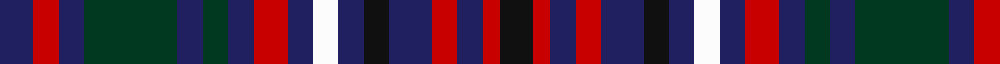

In pattern [BRBGBGBRBWBKBRBRK](/patterns/brbgbgbrbwbkbrbrk/).

This was sourced from register-of-tartans.  It is a [17 stripes tartan](/stripes/stripes17/).

Original link https://www.tartanregister.gov.uk/tartanDetails.aspx?ref=1862

## Attestations

This cloth appears in 2 source records; the oldest owns this page.

- 01/01/1996 — Isla Grant (Personal) (register-of-tartans, [record](https://www.tartanregister.gov.uk/tartanDetails.aspx?ref=1862))
- 1996 — Isla Grant (Personal) (tartans-authority, [record](http://www.tartansauthority.com/tartan-ferret/display/5278/))

## Thread count
DB/8 R6 DB6 DG22 DB6 DG6 DB6 R8 DB6 W6 DB6 K6 DB10 R6 DB6 R4 K/8

## Palette
Each colour and its ΔE from the base-6 reference it is a variant of.

| Colour | Shade | Base | ΔE (OKLab) |
|---|---|---|---|
| DB | <code style="background-color:#202060;">#202060</code> `#202060` | B <code style="background-color:#2A418A;">#2A418A</code> | 0.11 |
| DG | <code style="background-color:#003820;">#003820</code> `#003820` | G <code style="background-color:#006100;">#006100</code> | 0.15 |
| K | <code style="background-color:#101010;">#101010</code> `#101010` | K <code style="background-color:#000000;">#000000</code> | 0.17 |
| R | <code style="background-color:#C80000;">#C80000</code> `#C80000` | R <code style="background-color:#CC0000;">#CC0000</code> | 0.01 |
| W | <code style="background-color:#FCFCFC;">#FCFCFC</code> `#FCFCFC` | W <code style="background-color:#F7F7F7;">#F7F7F7</code> | 0.01 |

## Nearest tartans

The nearest existing variants by ΔTartan distance.

1. [Longford Irish County Tartan Tartan Number: 2281. Earliest known date: 1995 One of a series of Irish District tartans designed by Polly Wittering of the House of Edgar, with colours reminiscent of the Country with soft warm colours dominating. See products available Copyright © Blair Urquhart, Comrie, 2015](/setts/s12/b18k3b5k3b18g6k5g6r12ra5r12ra3x2~b200c60-g00643c-k000000-rb47c54-rad01010/) — ΔT 1.15
1. [Encyclopaedia Britannica (Corporate)](/setts/s14/g12k5b18k5w5k5b18k3b6k3b6k5g12r5x2~b2c2c80-g408060-k101010-rc80000-wf8f8f8/) — ΔT 1.18
1. [MacLellan](/setts/s14/b15k8g3r3g5k2y2k2g5r3g3k8b8k8x4~b382074-g2c7854-k181818-rc80000-ye8c000/) — ΔT 1.19
1. [Stuart/Stewart Old](/setts/s14/b5k2g2k2g2k2b8r3b3r3b8r3w5r3x2~b2c4084-g005020-k101010-rdc0000-we0e0e0/) — ΔT 1.27
1. [Stewart Old](/setts/s14/b5k2g2k2g2k2b8r3b3r3b8r3w5r3x2~b304080-g008000-k000000-rc00000-we0e0e0/) — ΔT 1.30
1. [Encyclopaedia Britannica](/setts/s14/b18k3b6k3b6k5g12r4g12k5b18k4w5k4x2~b2c2c80-g006818-k101010-rc80000-wffffff/) — ΔT 1.31
1. [Encyclopedia Britannica Corporate Tartan Tartan Number: 1968. Earliest known date: 1989 Based on Farquharson tartan after one of the company founders See products available Copyright © Blair Urquhart, Comrie, 2015](/setts/s14/b18k3b6k3b6k5g12r4g12k5b18k4w5k4x2~b2c2c80-g006818-k101010-rc80000-we0e0e0/) — ΔT 1.32
1. [MacRae #2](/setts/s15/g6k3g7r3g6k13b13k3b13k13g3w3g6k3r4x2~b2c4084-g005020-k101010-rdc0000-we0e0e0/) — ΔT 1.35
1. [Wcwm 1572-1](/setts/s17/b4w6r2ba6bb2b4bb2ba6y1ba2r2w2r2ba2y1ba6bb2x4~b1c0070-ba4c3428-bb2474e8-r880000-we8ccb8-yd09800/) — ΔT 1.37
1. [MacLellan Clan Tartan Tartan Number: 323. Earliest known date: pre 2003 Very similar to MacLaren See products available Copyright © Blair Urquhart, Comrie, 2015](/setts/s14/b29k15g5r5g8k4y4k4g8r5g5k15b7k15x2~b2c2c80-g006818-k101010-rc80000-ye8c000/) — ΔT 1.40

## Neighbour map

Every grey dot is one of 15726 variants placed by the first two principal components of the ΔTartan feature space (44% of its variance). Red is this tartan; blue dots are its nearest — click one to open its page.

<svg viewBox="0 0 640 380" role="img" style="max-width:100%;height:auto;border:1px solid #e0e0e0;border-radius:4px;display:block" xmlns="http://www.w3.org/2000/svg"><image href="/nn/cloud.v1.png" width="640" height="380"/><a href="/setts/s12/b18k3b5k3b18g6k5g6r12ra5r12ra3x2~b200c60-g00643c-k000000-rb47c54-rad01010/"><circle cx="129.7" cy="190.6" r="4" fill="#3465a4"><title>Longford Irish County Tartan Tartan Number: 2281. Earliest known date: 1995 One of a series of Irish District tartans designed by Polly Wittering of the House of Edgar, with colours reminiscent of the Country with soft warm colours dominating. See products available Copyright © Blair Urquhart, Comrie, 2015</title></circle></a><a href="/setts/s14/g12k5b18k5w5k5b18k3b6k3b6k5g12r5x2~b2c2c80-g408060-k101010-rc80000-wf8f8f8/"><circle cx="146.9" cy="195.9" r="4" fill="#3465a4"><title>Encyclopaedia Britannica (Corporate)</title></circle></a><a href="/setts/s14/b15k8g3r3g5k2y2k2g5r3g3k8b8k8x4~b382074-g2c7854-k181818-rc80000-ye8c000/"><circle cx="148.9" cy="192.1" r="4" fill="#3465a4"><title>MacLellan</title></circle></a><a href="/setts/s14/b5k2g2k2g2k2b8r3b3r3b8r3w5r3x2~b2c4084-g005020-k101010-rdc0000-we0e0e0/"><circle cx="124.2" cy="206.7" r="4" fill="#3465a4"><title>Stuart/Stewart Old</title></circle></a><a href="/setts/s14/b5k2g2k2g2k2b8r3b3r3b8r3w5r3x2~b304080-g008000-k000000-rc00000-we0e0e0/"><circle cx="114.6" cy="204.7" r="4" fill="#3465a4"><title>Stewart Old</title></circle></a><a href="/setts/s14/b18k3b6k3b6k5g12r4g12k5b18k4w5k4x2~b2c2c80-g006818-k101010-rc80000-wffffff/"><circle cx="158.2" cy="195.0" r="4" fill="#3465a4"><title>Encyclopaedia Britannica</title></circle></a><a href="/setts/s14/b18k3b6k3b6k5g12r4g12k5b18k4w5k4x2~b2c2c80-g006818-k101010-rc80000-we0e0e0/"><circle cx="165.4" cy="198.0" r="4" fill="#3465a4"><title>Encyclopedia Britannica Corporate Tartan Tartan Number: 1968. Earliest known date: 1989 Based on Farquharson tartan after one of the company founders See products available Copyright © Blair Urquhart, Comrie, 2015</title></circle></a><a href="/setts/s15/g6k3g7r3g6k13b13k3b13k13g3w3g6k3r4x2~b2c4084-g005020-k101010-rdc0000-we0e0e0/"><circle cx="110.1" cy="215.1" r="4" fill="#3465a4"><title>MacRae #2</title></circle></a><a href="/setts/s17/b4w6r2ba6bb2b4bb2ba6y1ba2r2w2r2ba2y1ba6bb2x4~b1c0070-ba4c3428-bb2474e8-r880000-we8ccb8-yd09800/"><circle cx="87.0" cy="162.9" r="4" fill="#3465a4"><title>Wcwm 1572-1</title></circle></a><a href="/setts/s14/b29k15g5r5g8k4y4k4g8r5g5k15b7k15x2~b2c2c80-g006818-k101010-rc80000-ye8c000/"><circle cx="160.8" cy="185.6" r="4" fill="#3465a4"><title>MacLellan Clan Tartan Tartan Number: 323. Earliest known date: pre 2003 Very similar to MacLaren See products available Copyright © Blair Urquhart, Comrie, 2015</title></circle></a><circle cx="120.7" cy="202.5" r="5" fill="#c00000"/></svg>

ID: /setts/s17/b4r3b3g11b3g3b3r4b3w3b3k3b5r3b3r2k4x2~b202060-g003820-k101010-rc80000-wfcfcfc/
