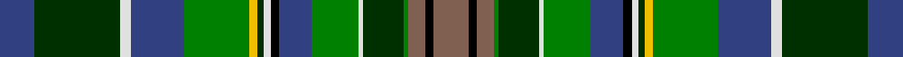

In pattern [BGWBGYGWKBGWGGRKR](/stripes/bgwbgygwkbgwggrkr/).

This was sourced from weddslist.  It is a [17 stripe tartan](/stripes/stripes17/).

Original link http://www.weddslist.com/cgi-bin/tartans/pg.pl?source=sts

## Thread count
B/32 DG80 LN10 B50 G60 Y8 DG6 LN6 K8 B30 G44 LN4 DG38 G4 LT16 K8 LT/32

## Palette
Each colour and the base-6 reference it is a variant of.

| Colour | Shade | Base |
|---|---|---|
| B | <code style="background-color:#304080;">#304080</code> `oklch(39.4% 0.109 270.2)` <small>#304080</small> | B <code style="background-color:#2A418A;">#2A418A</code> |
| DG | <code style="background-color:#003000;">#003000</code> `oklch(26.8% 0.091 142.5)` <small>#003000</small> | G <code style="background-color:#006100;">#006100</code> |
| G | <code style="background-color:#008000;">#008000</code> `oklch(52.0% 0.177 142.5)` <small>#008000</small> | G <code style="background-color:#006100;">#006100</code> |
| K | <code style="background-color:#000000;">#000000</code> `oklch(0.0% 0.000 0.0)` <small>#000000</small> | K <code style="background-color:#000000;">#000000</code> |
| LN | <code style="background-color:#E0E0E0;">#E0E0E0</code> `oklch(90.7% 0.000 89.9)` <small>#E0E0E0</small> | W <code style="background-color:#F7F7F7;">#F7F7F7</code> |
| LT | <code style="background-color:#806050;">#806050</code> `oklch(51.7% 0.049 47.8)` <small>#806050</small> | R <code style="background-color:#CC0000;">#CC0000</code> |
| Y | <code style="background-color:#F0C000;">#F0C000</code> `oklch(82.7% 0.169 90.5)` <small>#F0C000</small> | Y <code style="background-color:#F2BF00;">#F2BF00</code> |

## Nearest tartans

The nearest existing variants by ΔTartan distance, with this tartan at the top so the swatches line up against it.

ΔTartan

Tartan

Sett

—

<a href="/ttd/edit/#slug=db16dg40w5db25g30ly4dg3w3k4db15g22w2dg19g2o8k4o16~x2">Les Cercles de Fermieres du Quebec</a> <a class="nn-out" href="/setts/s17/db16dg40w5db25g30ly4dg3w3k4db15g22w2dg19g2o8k4o16~x2/" title="open its dictionary page">↗</a>

0.91

<a href="/ttd/edit/#slug=k12g16lb2do12g2y10k4y8o27k30lb6o27g20lo4k2lb4k4~x2">Le Cercle des Femmes (Corporate)</a> <a class="nn-out" href="/setts/s17/k12g16lb2do12g2y10k4y8o27k30lb6o27g20lo4k2lb4k4~x2/" title="open its dictionary page">↗</a>

0.99

<a href="/ttd/edit/#slug=dy16k4dy8g2dg19w2g22db15k4w3dg3ly4g30db25w5dg40db16~x2">Les Cercles de Fermieres du Quebec</a> <a class="nn-out" href="/setts/s17/dy16k4dy8g2dg19w2g22db15k4w3dg3ly4g30db25w5dg40db16~x2/" title="open its dictionary page">↗</a>

1.24

<a href="/ttd/edit/#slug=r3g18k10db12k1g2k1db12ly2k10g2g2g15g3~x2">Leinster</a> <a class="nn-out" href="/setts/s14/r3g18k10db12k1g2k1db12ly2k10g2g2g15g3~x2/" title="open its dictionary page">↗</a>

1.25

<a href="/ttd/edit/#slug=db14w1g8w1dg16t6w1db14w1g14t6g6r8dg6r8dg1~x2">Gordon 1</a> <a class="nn-out" href="/setts/s16/db14w1g8w1dg16t6w1db14w1g14t6g6r8dg6r8dg1~x2/" title="open its dictionary page">↗</a>

1.25

<a href="/setts/s12/db24r8g8r2g8k1ly2~x2/">Scout Mapping Service</a>

1.25

<a href="/ttd/edit/#slug=g24k2t6k2m12w1m12k2t6k2o12k2o12k2t6k2g12t6~x2">Buchanan, hunting</a> <a class="nn-out" href="/setts/s18/g24k2t6k2m12w1m12k2t6k2o12k2o12k2t6k2g12t6~x2/" title="open its dictionary page">↗</a>

1.36

<a href="/ttd/edit/#slug=r2k1m5k7w2k14db8g15w2g7r5g1lo2~x2">Nashotah House (Commemorative)</a> <a class="nn-out" href="/setts/s13/r2k1m5k7w2k14db8g15w2g7r5g1lo2~x2/" title="open its dictionary page">↗</a>

1.37

<a href="/ttd/edit/#slug=dp4dt20db4dt6g6w2ly4g4r2g18db4r1w4~x2">Pearl of the Orient</a> <a class="nn-out" href="/setts/s13/dp4dt20db4dt6g6w2ly4g4r2g18db4r1w4~x2/" title="open its dictionary page">↗</a>

1.42

<a href="/ttd/edit/#slug=r6g22dg8g4dg12g2dg18db8t12db35ly4">Bruntsfield Links Golfing Soc. (Corp</a> <a class="nn-out" href="/setts/s11/r6g22dg8g4dg12g2dg18db8t12db35ly4/" title="open its dictionary page">↗</a>

1.45

<a href="/ttd/edit/#slug=t8k4t8k20lo1g20r8w1r8w1r8g20lo1k20t8k4t4~x2">Cumming</a> <a class="nn-out" href="/setts/s17/t8k4t8k20lo1g20r8w1r8w1r8g20lo1k20t8k4t4~x2/" title="open its dictionary page">↗</a>

## Neighbour map

Every grey dot is one of 14299 variants placed by the first two principal components of the ΔTartan feature space (44% of its variance). Red is this tartan; blue dots are its nearest — click one to open its page.

<svg viewBox="0 0 640 380" role="img" style="max-width:100%;height:auto;border:1px solid #e0e0e0;border-radius:4px;display:block" xmlns="http://www.w3.org/2000/svg"><image href="/nn/cloud.v1.png" width="640" height="380"/><a href="/setts/s17/k12g16lb2do12g2y10k4y8o27k30lb6o27g20lo4k2lb4k4~x2/"><circle cx="73.9" cy="103.6" r="4" fill="#3465a4"><title>Le Cercle des Femmes (Corporate)</title></circle></a><a href="/setts/s17/dy16k4dy8g2dg19w2g22db15k4w3dg3ly4g30db25w5dg40db16~x2/"><circle cx="117.2" cy="113.7" r="4" fill="#3465a4"><title>Les Cercles de Fermieres du Quebec</title></circle></a><a href="/setts/s14/r3g18k10db12k1g2k1db12ly2k10g2g2g15g3~x2/"><circle cx="119.0" cy="135.8" r="4" fill="#3465a4"><title>Leinster</title></circle></a><a href="/setts/s16/db14w1g8w1dg16t6w1db14w1g14t6g6r8dg6r8dg1~x2/"><circle cx="81.2" cy="133.3" r="4" fill="#3465a4"><title>Gordon 1</title></circle></a><a href="/setts/s12/db24r8g8r2g8k1ly2~x2/"><circle cx="119.4" cy="98.6" r="4" fill="#3465a4"><title>Scout Mapping Service</title></circle></a><a href="/setts/s18/g24k2t6k2m12w1m12k2t6k2o12k2o12k2t6k2g12t6~x2/"><circle cx="114.6" cy="97.5" r="4" fill="#3465a4"><title>Buchanan, hunting</title></circle></a><a href="/setts/s13/r2k1m5k7w2k14db8g15w2g7r5g1lo2~x2/"><circle cx="91.0" cy="111.4" r="4" fill="#3465a4"><title>Nashotah House (Commemorative)</title></circle></a><a href="/setts/s13/dp4dt20db4dt6g6w2ly4g4r2g18db4r1w4~x2/"><circle cx="113.2" cy="90.9" r="4" fill="#3465a4"><title>Pearl of the Orient</title></circle></a><a href="/setts/s11/r6g22dg8g4dg12g2dg18db8t12db35ly4/"><circle cx="131.6" cy="145.7" r="4" fill="#3465a4"><title>Bruntsfield Links Golfing Soc. (Corp</title></circle></a><a href="/setts/s17/t8k4t8k20lo1g20r8w1r8w1r8g20lo1k20t8k4t4~x2/"><circle cx="129.8" cy="108.7" r="4" fill="#3465a4"><title>Cumming</title></circle></a><circle cx="93.4" cy="100.2" r="5" fill="#c00000"/></svg>

ID: /setts/s17/db16dg40w5db25g30ly4dg3w3k4db15g22w2dg19g2o8k4o16~x2/
