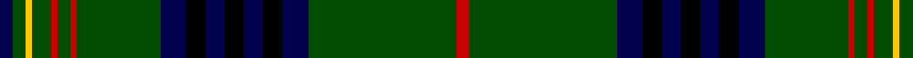

**Bands:** [BGYGRGRGBKBKBKBGR](/stripes/bgygrgrgbkbkbkbgr/) · **Stripes:** [DB DG LY DG R DG R DG DB K DB K DB K DB DG R](/stripes/stripes17/) DB DG LY DG R DG R DG DB K DB K DB K DB DG R

This was sourced from weddslist.  It is a [17 band tartan](/bands/bands17/).

Original link http://www.weddslist.com/cgi-bin/tartans/pg.pl?source=rb

## Register references

External register numbers recorded for this tartan.

- Scottish Register of Tartans: [2540](https://www.tartanregister.gov.uk/tartanDetails.aspx?ref=2540)
- Scottish Register of Tartans: [2666](https://www.tartanregister.gov.uk/tartanDetails.aspx?ref=2666)
- Scottish Register of Tartans: [3808](https://www.tartanregister.gov.uk/tartanDetails.aspx?ref=3808)
- Scottish Tartans Authority (ITI): 218
- Scottish Tartans World Register: 1010
- Scottish Tartans World Register: 1585
- Scottish Tartans World Register: 218

## Thread count
DB/4 G4 Y2 G6 R2 G4 R2 G26 DB8 K6 DB6 K6 DB6 K6 DB8 G46 R/4

## Palette
Each colour and its ΔE from the base-6 reference it is a variant of.

| Colour | Shade | Base | ΔE (OKLab) |
|---|---|---|---|
| DB | <code style="background-color:#00004C;">#00004C</code> `#00004C` | B <code style="background-color:#2A418A;">#2A418A</code> | 0.21 |
| G | <code style="background-color:#004C00;">#004C00</code> `#004C00` | G <code style="background-color:#006100;">#006100</code> | 0.07 |
| K | <code style="background-color:#000000;">#000000</code> `#000000` | K <code style="background-color:#000000;">#000000</code> | 0.00 |
| N | <code style="background-color:#D0D0D0;">#D0D0D0</code> `#D0D0D0` | W <code style="background-color:#F7F7F7;">#F7F7F7</code> | 0.12 |
| R | <code style="background-color:#C80000;">#C80000</code> `#C80000` | R <code style="background-color:#CC0000;">#CC0000</code> | 0.01 |
| Y | <code style="background-color:#FFC800;">#FFC800</code> `#FFC800` | Y <code style="background-color:#F2BF00;">#F2BF00</code> | 0.03 |

## Nearest tartans

The nearest existing variants by ΔTartan distance.

1. [Hyslop Hunting (Name)](/setts/s18/g4r2g24k2g2k6g2k6g2k2g3lo1db3k2db1k2db3g2~x2/) — ΔT 0.83
1. [Sarafilovic](/setts/s16/db15k18g3k2g2k2g44ly4g44k2g2k2g3k18db15r4~x2/) — ΔT 0.95
1. [Kennedy](/setts/s17/k2dg2ly1dg3dr1dg2dr1dg12db4k3db3k3db3k3db4dg24r2~x2/) — ΔT 1.06
1. [Kennedy](/setts/s17/k2dg2ly1dg3dr1dg2dr1dg12db4k3db3k3db3k3db4dg24r2/) — ΔT 1.06
1. [Kinnear, Barony of (Personal)](/setts/s20/k4r2k8g3k8g36k8g3r4lb2r3lo2r4g3k8g36k8g3k8r2~x2/) — ΔT 1.13
1. [MacKean Hunting Family Tartan Tartan Number: 985. Earliest known date: 1987 1987 See products available Copyright © Blair Urquhart, Comrie, 2015](/setts/s15/g2r4g2k16g4k16g4k2g2k2g4k4db8k1w2~x2/) — ΔT 1.28
1. [Grand Lodge of Scotland](/setts/s16/g18k6g1k1db1k6db1k2db1k6db1k1g1k6g21ly1~x2/) — ΔT 1.28
1. [MacKean Hunting](/setts/s15/g2r4g2k16g2k16g4k2g2k2g4k4db8k1lb2~x2/) — ΔT 1.31
1. [Kennedy Clan Tartan Tartan Number: 1123. Earliest known date: 1847 The Earls of Cassilis built Culzean Castle on the site of an ancient Kennedy stronghold. Dunure Castle near Culzean on the Ayrshire coast, was also owned by the Kennedys. The tartan was first recorded by MacIan in his book 'The Clans of the Scottish Highlands' (1847) which he co-authored with James Logan. See products available Copyright © Blair Urquhart, Comrie, 2015](/setts/s17/k2g2ly1g3m1g2m1g12db4k3db3k3db3k3db4g24r2~x2/) — ΔT 1.38
1. [Blairgowrie](/setts/s17/k20y3db10g3db5g25k1g1w3g1k1g25db5g3db10y1db2~x4/) — ΔT 1.43

## Neighbour map

Every grey dot is one of 14313 variants placed by the first two principal components of the ΔTartan feature space (44% of its variance). Red is this tartan; blue dots are its nearest — click one to open its page.

<svg viewBox="0 0 640 380" role="img" style="max-width:100%;height:auto;border:1px solid #e0e0e0;border-radius:4px;display:block" xmlns="http://www.w3.org/2000/svg"><image href="/nn/cloud.v1.png" width="640" height="380"/><a href="/setts/s18/g4r2g24k2g2k6g2k6g2k2g3lo1db3k2db1k2db3g2~x2/"><circle cx="345.0" cy="111.6" r="4" fill="#3465a4"><title>Hyslop Hunting (Name)</title></circle></a><a href="/setts/s16/db15k18g3k2g2k2g44ly4g44k2g2k2g3k18db15r4~x2/"><circle cx="316.5" cy="121.1" r="4" fill="#3465a4"><title>Sarafilovic</title></circle></a><a href="/setts/s17/k2dg2ly1dg3dr1dg2dr1dg12db4k3db3k3db3k3db4dg24r2~x2/"><circle cx="337.3" cy="105.5" r="4" fill="#3465a4"><title>Kennedy</title></circle></a><a href="/setts/s17/k2dg2ly1dg3dr1dg2dr1dg12db4k3db3k3db3k3db4dg24r2/"><circle cx="337.3" cy="105.5" r="4" fill="#3465a4"><title>Kennedy</title></circle></a><a href="/setts/s20/k4r2k8g3k8g36k8g3r4lb2r3lo2r4g3k8g36k8g3k8r2~x2/"><circle cx="311.1" cy="111.0" r="4" fill="#3465a4"><title>Kinnear, Barony of (Personal)</title></circle></a><a href="/setts/s15/g2r4g2k16g4k16g4k2g2k2g4k4db8k1w2~x2/"><circle cx="292.2" cy="146.0" r="4" fill="#3465a4"><title>MacKean Hunting Family Tartan Tartan Number: 985. Earliest known date: 1987 1987 See products available Copyright © Blair Urquhart, Comrie, 2015</title></circle></a><a href="/setts/s16/g18k6g1k1db1k6db1k2db1k6db1k1g1k6g21ly1~x2/"><circle cx="369.7" cy="139.9" r="4" fill="#3465a4"><title>Grand Lodge of Scotland</title></circle></a><a href="/setts/s15/g2r4g2k16g2k16g4k2g2k2g4k4db8k1lb2~x2/"><circle cx="316.8" cy="151.8" r="4" fill="#3465a4"><title>MacKean Hunting</title></circle></a><a href="/setts/s17/k2g2ly1g3m1g2m1g12db4k3db3k3db3k3db4g24r2~x2/"><circle cx="333.2" cy="99.6" r="4" fill="#3465a4"><title>Kennedy Clan Tartan Tartan Number: 1123. Earliest known date: 1847 The Earls of Cassilis built Culzean Castle on the site of an ancient Kennedy stronghold. Dunure Castle near Culzean on the Ayrshire coast, was also owned by the Kennedys. The tartan was first recorded by MacIan in his book 'The Clans of the Scottish Highlands' (1847) which he co-authored with James Logan. See products available Copyright © Blair Urquhart, Comrie, 2015</title></circle></a><a href="/setts/s17/k20y3db10g3db5g25k1g1w3g1k1g25db5g3db10y1db2~x4/"><circle cx="276.1" cy="113.1" r="4" fill="#3465a4"><title>Blairgowrie</title></circle></a><circle cx="335.5" cy="114.6" r="5" fill="#c00000"/></svg>

ID: /setts/s17/db2dg2ly1dg3r1dg2r1dg13db4k3db3k3db3k3db4dg23r2~x2/
