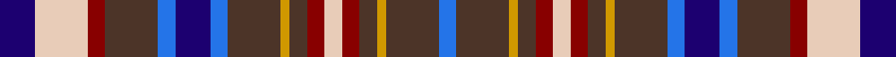

In pattern [BBYBRWRBYBBBBBRWB](/stripes/bbybrwrbybbbbbrwb/).

This was sourced from register-of-tartans.  It is a [17 stripe tartan](/stripes/stripes17/).

Original link https://www.tartanregister.gov.uk/tartanDetails.aspx?ref=4532

## Register references

External register numbers recorded for this tartan.

- Scottish Register of Tartans: [4532](https://www.tartanregister.gov.uk/tartanDetails.aspx?ref=4532)
- Scottish Tartans Authority (ITI): 4299

## Thread count
DB/16 LR24 DR8 T24 B8 DB16 B8 T24 DY4 T8 DR8 LR8 DR8 T8 DY4 T24 B/8

## Palette
Each colour and the base-6 reference it is a variant of.

| Colour | Shade | Base |
|---|---|---|
| B | <code style="background-color:#2474E8;">#2474E8</code> `oklch(57.8% 0.192 258.7)` <small>#2474E8</small> | B <code style="background-color:#2A418A;">#2A418A</code> |
| DB | <code style="background-color:#1C0070;">#1C0070</code> `oklch(26.3% 0.162 277.1)` <small>#1C0070</small> | B <code style="background-color:#2A418A;">#2A418A</code> |
| DR | <code style="background-color:#880000;">#880000</code> `oklch(39.4% 0.162 29.2)` <small>#880000</small> | R <code style="background-color:#CC0000;">#CC0000</code> |
| DY | <code style="background-color:#D09800;">#D09800</code> `oklch(71.4% 0.147 82.1)` <small>#D09800</small> | Y <code style="background-color:#F2BF00;">#F2BF00</code> |
| LR | <code style="background-color:#E8CCB8;">#E8CCB8</code> `oklch(86.3% 0.042 57.7)` <small>#E8CCB8</small> | W <code style="background-color:#F7F7F7;">#F7F7F7</code> |
| T | <code style="background-color:#4C3428;">#4C3428</code> `oklch(34.9% 0.040 47.5)` <small>#4C3428</small> | B <code style="background-color:#2A418A;">#2A418A</code> |

## Nearest tartans

The nearest existing variants by ΔTartan distance.

1. [MacLellan/McLellan (Personal)](/setts/s16/k2w1db7k4r1db4r2db4w2db4r2db4r1dg7w1ly2~x4/) — ΔT 0.87
1. [MacLellan, Blue McLellan](/setts/s16/k2w1db7k4r1db4r2db4w2db4r2db4r1g7w1ly2~x2/) — ΔT 1.03
1. [Kutztown (Berks Co., PA) (District)](/setts/s18/w2t2dg8k2t6dg5r5lo5r4w2r4lo5r5dg5t6k2r10lo2~x2/) — ΔT 1.13
1. [Ogilvy](/setts/s14/b10r3b10ly5k2r6lr2r6lr2r6n2ly2b5lr2~x2/) — ΔT 1.15
1. [Ogilvy](/setts/s14/b10r3b10ly5k2r6lr2r6lr2r6n2ly2b5lr2/) — ΔT 1.15
1. [Kutztown (Berks County, PA)](/setts/s18/w2db2dg8k2db6dg5r5lo5r4w2r4lo5r5dg5db6k2r10lo2~x2/) — ΔT 1.17
1. [St. Margaret's School Edinburgh](/setts/s17/k16g3g8k3m12k3m12k3g8k3lb12g8lb12g8g3k16w3~x2/) — ΔT 1.19
1. [Hoban (Personal)](/setts/s16/lp9k3lp4k9g15k9db11w2db11k9g15k9lp4k3lp9ly3~x4/) — ΔT 1.19
1. [Clauweart](/setts/s17/db4lo2db4n6w2k2n6w2k2n13o3k4o3k8db6w2r4~x2/) — ΔT 1.24
1. [Kilburnie (Fashion)](/setts/s17/db12k2db2k2r3k2t6k2w2k2t6k2ly2k2db6k2r2~x2/) — ΔT 1.30

## Neighbour map

Every grey dot is one of 14299 variants placed by the first two principal components of the ΔTartan feature space (44% of its variance). Red is this tartan; blue dots are its nearest — click one to open its page.

<svg viewBox="0 0 640 380" role="img" style="max-width:100%;height:auto;border:1px solid #e0e0e0;border-radius:4px;display:block" xmlns="http://www.w3.org/2000/svg"><image href="/nn/cloud.v1.png" width="640" height="380"/><a href="/setts/s16/k2w1db7k4r1db4r2db4w2db4r2db4r1dg7w1ly2~x4/"><circle cx="129.7" cy="161.3" r="4" fill="#3465a4"><title>MacLellan/McLellan (Personal)</title></circle></a><a href="/setts/s16/k2w1db7k4r1db4r2db4w2db4r2db4r1g7w1ly2~x2/"><circle cx="117.1" cy="156.3" r="4" fill="#3465a4"><title>MacLellan, Blue McLellan</title></circle></a><a href="/setts/s18/w2t2dg8k2t6dg5r5lo5r4w2r4lo5r5dg5t6k2r10lo2~x2/"><circle cx="48.9" cy="182.6" r="4" fill="#3465a4"><title>Kutztown (Berks Co., PA) (District)</title></circle></a><a href="/setts/s14/b10r3b10ly5k2r6lr2r6lr2r6n2ly2b5lr2~x2/"><circle cx="114.4" cy="180.9" r="4" fill="#3465a4"><title>Ogilvy</title></circle></a><a href="/setts/s14/b10r3b10ly5k2r6lr2r6lr2r6n2ly2b5lr2/"><circle cx="114.4" cy="180.9" r="4" fill="#3465a4"><title>Ogilvy</title></circle></a><a href="/setts/s18/w2db2dg8k2db6dg5r5lo5r4w2r4lo5r5dg5db6k2r10lo2~x2/"><circle cx="56.3" cy="186.3" r="4" fill="#3465a4"><title>Kutztown (Berks County, PA)</title></circle></a><a href="/setts/s17/k16g3g8k3m12k3m12k3g8k3lb12g8lb12g8g3k16w3~x2/"><circle cx="32.3" cy="163.6" r="4" fill="#3465a4"><title>St. Margaret's School Edinburgh</title></circle></a><a href="/setts/s16/lp9k3lp4k9g15k9db11w2db11k9g15k9lp4k3lp9ly3~x4/"><circle cx="47.1" cy="168.1" r="4" fill="#3465a4"><title>Hoban (Personal)</title></circle></a><a href="/setts/s17/db4lo2db4n6w2k2n6w2k2n13o3k4o3k8db6w2r4~x2/"><circle cx="48.0" cy="143.6" r="4" fill="#3465a4"><title>Clauweart</title></circle></a><a href="/setts/s17/db12k2db2k2r3k2t6k2w2k2t6k2ly2k2db6k2r2~x2/"><circle cx="85.9" cy="152.0" r="4" fill="#3465a4"><title>Kilburnie (Fashion)</title></circle></a><circle cx="89.5" cy="164.9" r="5" fill="#c00000"/></svg>

ID: /setts/s17/db4lb6r2do6b2db4b2do6lo1do2r2lb2r2do2lo1do6b2~x4/
