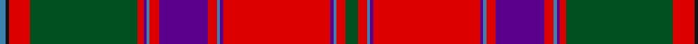

**Bands:** [BKRGRBBRBRBBRBBRG](/stripes/bkrgrbbrbrbbrbbrg/) · **Stripes:** [T K R DG R DP T R DP R T DP R DP T R DG](/stripes/stripes17/) T K R DG R DP T R DP R T DP R DP T R DG

This was sourced from register-of-tartans.  It is a [17 band tartan](/bands/bands17/).

Original link https://www.tartanregister.gov.uk/tartanDetails.aspx?ref=4215

## Register references

External register numbers recorded for this tartan.

- Scottish Register of Tartans: [4215](https://www.tartanregister.gov.uk/tartanDetails.aspx?ref=4215)
- Scottish Tartans World Register: 354

## Thread count
B/4 K2 R14 G70 R4 P2 B2 R6 P32 R6 B2 P2 R70 P2 B2 R6 G/8

## Palette
Each colour and its ΔE from the base-6 reference it is a variant of.

| Colour | Shade | Base | ΔE (OKLab) |
|---|---|---|---|
| B | <code style="background-color:#3C82AF;">#3C82AF</code> `#3C82AF` | B <code style="background-color:#2A418A;">#2A418A</code> | 0.19 |
| G | <code style="background-color:#005020;">#005020</code> `#005020` | G <code style="background-color:#006100;">#006100</code> | 0.07 |
| K | <code style="background-color:#101010;">#101010</code> `#101010` | K <code style="background-color:#000000;">#000000</code> | 0.17 |
| P | <code style="background-color:#5A008C;">#5A008C</code> `#5A008C` | B <code style="background-color:#2A418A;">#2A418A</code> | 0.13 |
| R | <code style="background-color:#DC0000;">#DC0000</code> `#DC0000` | R <code style="background-color:#CC0000;">#CC0000</code> | 0.03 |

## Nearest tartans

The nearest existing variants by ΔTartan distance.

1. [Unidentified 15](/setts/s17/g4r3t1p1r35p1t1r3p16r3t1p1r2g35r7k1t2~x2/) — ΔT 0.68
1. [MacDonald of Boisdale](/setts/s21/r16lb1db7lb1r6lb1db34lb1r26g1g16g1r4g1g7g1r4lb1db7lb1r16~x2/) — ΔT 0.89
1. [Stewart of Ardshiel - 1816 (Clan)](/setts/s18/dg14r6r2k3r65k2t2r6k34r6t2k2r4dg66r12r2k2t4/) — ΔT 0.93
1. [MacDonald of Boisdale](/setts/s21/r16w1db6w1r6w1db32w1r24g1g16g1r4g1g6g1r4w1db6w1r16~x2/) — ΔT 0.95
1. [K9](/setts/s13/r40k2w1lo40k3w2k3r5db22r3w1k3r7~x2/) — ΔT 0.97
1. [MacFarlane](/setts/s14/r42k1dg12lr2r3k1r3lr2dg2n12k4r3lr4dg3~x2/) — ΔT 1.06
1. [Birral/Burrell](/setts/s17/t4dp8w2g32w2r8r4dp2r4r8w2dp16r65w2dp8t4w2~x2/) — ΔT 1.08
1. [Birral (Clan)](/setts/s17/r65w2dp8t4w2t4dp8w2g32w2r8r4dp2r4r8w2dp16~x2/) — ΔT 1.08
1. [MacFarlane, or Lendrum](/setts/s14/r42k1g12w2r3k1r3w2g2p12k4r3w4g3~x2/) — ΔT 1.08
1. [Read Dress, Peter (Personal)](/setts/s18/r8k24y1k1y1k1y1k1y8k1y1k1y1k1y1r20lo1w1~x2/) — ΔT 1.13

## Neighbour map

Every grey dot is one of 14313 variants placed by the first two principal components of the ΔTartan feature space (44% of its variance). Red is this tartan; blue dots are its nearest — click one to open its page.

<svg viewBox="0 0 640 380" role="img" style="max-width:100%;height:auto;border:1px solid #e0e0e0;border-radius:4px;display:block" xmlns="http://www.w3.org/2000/svg"><image href="/nn/cloud.v1.png" width="640" height="380"/><a href="/setts/s17/g4r3t1p1r35p1t1r3p16r3t1p1r2g35r7k1t2~x2/"><circle cx="312.1" cy="57.3" r="4" fill="#3465a4"><title>Unidentified 15</title></circle></a><a href="/setts/s21/r16lb1db7lb1r6lb1db34lb1r26g1g16g1r4g1g7g1r4lb1db7lb1r16~x2/"><circle cx="283.9" cy="61.2" r="4" fill="#3465a4"><title>MacDonald of Boisdale</title></circle></a><a href="/setts/s18/dg14r6r2k3r65k2t2r6k34r6t2k2r4dg66r12r2k2t4/"><circle cx="276.1" cy="55.8" r="4" fill="#3465a4"><title>Stewart of Ardshiel - 1816 (Clan)</title></circle></a><a href="/setts/s21/r16w1db6w1r6w1db32w1r24g1g16g1r4g1g6g1r4w1db6w1r16~x2/"><circle cx="289.7" cy="66.2" r="4" fill="#3465a4"><title>MacDonald of Boisdale</title></circle></a><a href="/setts/s13/r40k2w1lo40k3w2k3r5db22r3w1k3r7~x2/"><circle cx="272.4" cy="63.3" r="4" fill="#3465a4"><title>K9</title></circle></a><a href="/setts/s14/r42k1dg12lr2r3k1r3lr2dg2n12k4r3lr4dg3~x2/"><circle cx="359.1" cy="63.1" r="4" fill="#3465a4"><title>MacFarlane</title></circle></a><a href="/setts/s17/t4dp8w2g32w2r8r4dp2r4r8w2dp16r65w2dp8t4w2~x2/"><circle cx="270.1" cy="36.3" r="4" fill="#3465a4"><title>Birral/Burrell</title></circle></a><a href="/setts/s17/r65w2dp8t4w2t4dp8w2g32w2r8r4dp2r4r8w2dp16~x2/"><circle cx="270.1" cy="36.3" r="4" fill="#3465a4"><title>Birral (Clan)</title></circle></a><a href="/setts/s14/r42k1g12w2r3k1r3w2g2p12k4r3w4g3~x2/"><circle cx="333.0" cy="50.0" r="4" fill="#3465a4"><title>MacFarlane, or Lendrum</title></circle></a><a href="/setts/s18/r8k24y1k1y1k1y1k1y8k1y1k1y1k1y1r20lo1w1~x2/"><circle cx="267.3" cy="64.2" r="4" fill="#3465a4"><title>Read Dress, Peter (Personal)</title></circle></a><circle cx="307.4" cy="53.9" r="5" fill="#c00000"/></svg>

ID: /setts/s17/dg4r3t1dp1r35dp1t1r3dp16r3t1dp1r2dg35r7k1t2~x2/
