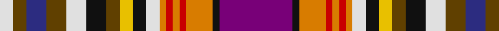

This page is one **sett** — a single exact thread-count. It belongs to the [tartan](/tartans/p11k1o4r1o1r1o1ln2k2y2t2k3ln3t3db3t2ln2/)
(the same proportion at any scale), whose colour order is pattern [BKYRYRYWKYGKWGBGW](/stripes/bkyryrywkygkwgbgw/).

Sourced from register-of-tartans.  It is a [17 stripe tartan](/stripes/stripes17/).

Original link https://www.tartanregister.gov.uk/tartanDetails.aspx?ref=4792

2 attestations — the source records this cloth was collapsed from (oldest owns this page)

<ul>
<li>01/01/2002 — York Puppet (register-of-tartans, <a href="https://www.tartanregister.gov.uk/tartanDetails.aspx?ref=4792">record</a>)</li>
<li>pre 2002 — York Puppet (Artefact) (tartans-authority, <a href="http://www.tartansauthority.com/tartan-ferret/display/348/">record</a>)</li>
</ul>

## Register references

External register numbers recorded for this tartan.

- Scottish Register of Tartans: [4792](https://www.tartanregister.gov.uk/tartanDetails.aspx?ref=4792)
- Scottish Tartans Authority (ITI): 348
- Scottish Tartans World Register: 348

## Thread count
P/22 K2 O8 R2 O2 R2 O2 LN4 K4 Y4 T4 K6 LN6 T6 DB6 T4 LN/4

## Palette
Each colour and the base-6 reference it is a variant of.

| Colour | Shade | Base |
|---|---|---|
| DB | <code style="background-color:#2C2C80;">#2C2C80</code> `oklch(35.0% 0.138 276.6)` <small>#2C2C80</small> | B <code style="background-color:#2A418A;">#2A418A</code> |
| K | <code style="background-color:#101010;">#101010</code> `oklch(17.3% 0.000 89.9)` <small>#101010</small> | K <code style="background-color:#000000;">#000000</code> |
| LN | <code style="background-color:#E0E0E0;">#E0E0E0</code> `oklch(90.7% 0.000 89.9)` <small>#E0E0E0</small> | W <code style="background-color:#F7F7F7;">#F7F7F7</code> |
| O | <code style="background-color:#D87C00;">#D87C00</code> `oklch(67.3% 0.155 61.8)` <small>#D87C00</small> | Y <code style="background-color:#F2BF00;">#F2BF00</code> |
| P | <code style="background-color:#780078;">#780078</code> `oklch(40.2% 0.185 328.4)` <small>#780078</small> | B <code style="background-color:#2A418A;">#2A418A</code> |
| R | <code style="background-color:#C80000;">#C80000</code> `oklch(52.3% 0.215 29.2)` <small>#C80000</small> | R <code style="background-color:#CC0000;">#CC0000</code> |
| T | <code style="background-color:#604000;">#604000</code> `oklch(39.8% 0.083 76.8)` <small>#604000</small> | G <code style="background-color:#006100;">#006100</code> |
| Y | <code style="background-color:#E8C000;">#E8C000</code> `oklch(81.9% 0.168 93.7)` <small>#E8C000</small> | Y <code style="background-color:#F2BF00;">#F2BF00</code> |

## Nearest tartans

The nearest existing variants by ΔTartan distance, with this tartan at the top so the swatches line up against it.

ΔTartan

Tartan

Sett

—

<a href="/ttd/edit/#slug=dp11k1lo4r1lo1r1lo1w2k2ly2dy2k3w3dy3db3dy2w2~x2">York Puppet</a> <a class="nn-out" href="/setts/s17/dp11k1lo4r1lo1r1lo1w2k2ly2dy2k3w3dy3db3dy2w2~x2/" title="open its dictionary page">↗</a>

0.23

<a href="/ttd/edit/#slug=dp11k1lo4r1lo1r1lo3w2k2ly2k3dy2w3dy3db3dy2w2~x2">York Puppet Tartan Tartan Number: 348. Earliest known date: York This sett comes from the MacGregor-Hastie collection which is housed at the Scottish Tartans Society. It was obtained from Andersons in 1947, one of several designs produced between 1930 and 1950 for Septs and Families of Scottish lineage. Wotherspoons are recorded in the Lowlands of Scotland from the beginning of the 14th century. The Rev. John Witherspoon (1722-94), born in Yester, East Lothian, was President of 'Princeton University' in 1768 and took an active part in the American Revolution. See products available Copyright © Blair Urquhart, Comrie, 2015</a> <a class="nn-out" href="/setts/s17/dp11k1lo4r1lo1r1lo3w2k2ly2k3dy2w3dy3db3dy2w2~x2/" title="open its dictionary page">↗</a>

0.45

<a href="/ttd/edit/#slug=p11k1lo4r1lo1r1lo3w2k2ly2k3o2w3o3db3o2w2~x2">York Puppet</a> <a class="nn-out" href="/setts/s17/p11k1lo4r1lo1r1lo3w2k2ly2k3o2w3o3db3o2w2~x2/" title="open its dictionary page">↗</a>

1.36

<a href="/ttd/edit/#slug=db8k2db3dg3k3r3dg10g3k3w3k3m16dg6k3db8ly13k2m2~x2">Kukri</a> <a class="nn-out" href="/setts/s18/db8k2db3dg3k3r3dg10g3k3w3k3m16dg6k3db8ly13k2m2~x2/" title="open its dictionary page">↗</a>

1.36

<a href="/ttd/edit/#slug=dp16w2r7w2k14t6w2dp15w2dg17t6dg6r8k6r8k2~x2">Gordon, Red (Clan/District)</a> <a class="nn-out" href="/setts/s16/dp16w2r7w2k14t6w2dp15w2dg17t6dg6r8k6r8k2~x2/" title="open its dictionary page">↗</a>

1.38

<a href="/ttd/edit/#slug=dp16w2r7w2k14t6w2dp15w2g17t6g6r8k6r8k2~x2">Gordon Red.. Family Tartan Tartan Number: 652. Earliest known date: pre 1819 Sample from the Telfer-Dunbar collection. Also known as 'Old Huntly' and frequently used as the Huntly District tartan. Not to be confused with the 'usual' Huntly District tartan which is based on the MacRae, Ross, Grant group with which it does not appear to be related. See products available Copyright © Blair Urquhart, Comrie, 2015</a> <a class="nn-out" href="/setts/s16/dp16w2r7w2k14t6w2dp15w2g17t6g6r8k6r8k2~x2/" title="open its dictionary page">↗</a>

1.39

<a href="/ttd/edit/#slug=p16w2r7w2k14t6w2p15w2g17t6g6r8k6r8k2~x2">Gordon, Red</a> <a class="nn-out" href="/setts/s16/p16w2r7w2k14t6w2p15w2g17t6g6r8k6r8k2~x2/" title="open its dictionary page">↗</a>

1.46

<a href="/ttd/edit/#slug=r36m2k16m2w19ly4w2k2w2ly4w12t2db10g10~x2">Dundee Dress District Tartan Tartan Number: 691. Earliest known date: 1986 Original index card confused. See products available Copyright © Blair Urquhart, Comrie, 2015</a> <a class="nn-out" href="/setts/s14/r36m2k16m2w19ly4w2k2w2ly4w12t2db10g10~x2/" title="open its dictionary page">↗</a>

1.50

<a href="/ttd/edit/#slug=r36r2k16r2w19ly4w2k2w2ly4w12t2db10g10~x2">Dundee Dress</a> <a class="nn-out" href="/setts/s14/r36r2k16r2w19ly4w2k2w2ly4w12t2db10g10~x2/" title="open its dictionary page">↗</a>

1.53

<a href="/ttd/edit/#slug=db14r15dp4k18dp4dg20ly4w2k4w2ly4r8k6db1w6~x2">Unidentified #22</a> <a class="nn-out" href="/setts/s15/db14r15dp4k18dp4dg20ly4w2k4w2ly4r8k6db1w6~x2/" title="open its dictionary page">↗</a>

1.54

<a href="/ttd/edit/#slug=ly9y7db3r28db4y7db5t4db5g7db3w6~x2">Mayo County Crest (Fashion)</a> <a class="nn-out" href="/setts/s12/ly9y7db3r28db4y7db5t4db5g7db3w6~x2/" title="open its dictionary page">↗</a>

## Neighbour map

Every grey dot is one of 14299 variants placed by the first two principal components of the ΔTartan feature space (44% of its variance). Red is this tartan; blue dots are its nearest — click one to open its page.

<svg viewBox="0 0 640 380" role="img" style="max-width:100%;height:auto;border:1px solid #e0e0e0;border-radius:4px;display:block" xmlns="http://www.w3.org/2000/svg"><image href="/nn/cloud.v1.png" width="640" height="380"/><a href="/setts/s17/dp11k1lo4r1lo1r1lo3w2k2ly2k3dy2w3dy3db3dy2w2~x2/"><circle cx="14.0" cy="72.8" r="4" fill="#3465a4"><title>York Puppet Tartan Tartan Number: 348. Earliest known date: York This sett comes from the MacGregor-Hastie collection which is housed at the Scottish Tartans Society. It was obtained from Andersons in 1947, one of several designs produced between 1930 and 1950 for Septs and Families of Scottish lineage. Wotherspoons are recorded in the Lowlands of Scotland from the beginning of the 14th century. The Rev. John Witherspoon (1722-94), born in Yester, East Lothian, was President of 'Princeton University' in 1768 and took an active part in the American Revolution. See products available Copyright © Blair Urquhart, Comrie, 2015</title></circle></a><a href="/setts/s17/p11k1lo4r1lo1r1lo3w2k2ly2k3o2w3o3db3o2w2~x2/"><circle cx="14.0" cy="66.0" r="4" fill="#3465a4"><title>York Puppet</title></circle></a><a href="/setts/s18/db8k2db3dg3k3r3dg10g3k3w3k3m16dg6k3db8ly13k2m2~x2/"><circle cx="14.0" cy="88.3" r="4" fill="#3465a4"><title>Kukri</title></circle></a><a href="/setts/s16/dp16w2r7w2k14t6w2dp15w2dg17t6dg6r8k6r8k2~x2/"><circle cx="20.2" cy="124.1" r="4" fill="#3465a4"><title>Gordon, Red (Clan/District)</title></circle></a><a href="/setts/s16/dp16w2r7w2k14t6w2dp15w2g17t6g6r8k6r8k2~x2/"><circle cx="20.3" cy="124.9" r="4" fill="#3465a4"><title>Gordon Red.. Family Tartan Tartan Number: 652. Earliest known date: pre 1819 Sample from the Telfer-Dunbar collection. Also known as 'Old Huntly' and frequently used as the Huntly District tartan. Not to be confused with the 'usual' Huntly District tartan which is based on the MacRae, Ross, Grant group with which it does not appear to be related. See products available Copyright © Blair Urquhart, Comrie, 2015</title></circle></a><a href="/setts/s16/p16w2r7w2k14t6w2p15w2g17t6g6r8k6r8k2~x2/"><circle cx="14.0" cy="117.0" r="4" fill="#3465a4"><title>Gordon, Red</title></circle></a><a href="/setts/s14/r36m2k16m2w19ly4w2k2w2ly4w12t2db10g10~x2/"><circle cx="60.7" cy="39.5" r="4" fill="#3465a4"><title>Dundee Dress District Tartan Tartan Number: 691. Earliest known date: 1986 Original index card confused. See products available Copyright © Blair Urquhart, Comrie, 2015</title></circle></a><a href="/setts/s14/r36r2k16r2w19ly4w2k2w2ly4w12t2db10g10~x2/"><circle cx="60.3" cy="39.2" r="4" fill="#3465a4"><title>Dundee Dress</title></circle></a><a href="/setts/s15/db14r15dp4k18dp4dg20ly4w2k4w2ly4r8k6db1w6~x2/"><circle cx="44.7" cy="82.1" r="4" fill="#3465a4"><title>Unidentified #22</title></circle></a><a href="/setts/s12/ly9y7db3r28db4y7db5t4db5g7db3w6~x2/"><circle cx="74.0" cy="113.2" r="4" fill="#3465a4"><title>Mayo County Crest (Fashion)</title></circle></a><circle cx="14.0" cy="69.0" r="5" fill="#c00000"/></svg>

ID: /setts/s17/dp11k1lo4r1lo1r1lo1w2k2ly2dy2k3w3dy3db3dy2w2~x2/
