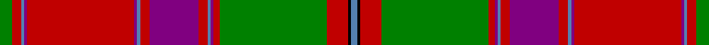

This page is one **sett** — a single exact thread-count. It belongs to the [tartan](/tartans/g4r3t1p1r35p1t1r3p16r3t1p1r2g35r7k1t2/)
(the same proportion at any scale), whose colour order is pattern [BKRGRBBRBRBBRBBRG](/stripes/bkrgrbbrbrbbrbbrg/).

Sourced from weddslist.  It is a [17 stripe tartan](/stripes/stripes17/).

Original link http://www.weddslist.com/cgi-bin/tartans/pg.pl?source=sts

## Thread count
G/8 R6 B2 P2 R70 P2 B2 R6 P32 R6 B2 P2 R4 G70 R14 K2 B/4

## Palette

Palette: <strong>Ingles Buchan</strong> <small style="color:#888">(1 of 5 colours)</small>
<table><thead><tr><th>Colour</th><th>Threads</th><th>Shade</th><th>Base</th><th>OKLCh</th></tr></thead><tbody><tr><td>G/</td><td style="text-align:right;font-variant-numeric:tabular-nums">8</td><td><code style="background-color:#008000;">#008000</code> <small style="color:#888">#008000</small></td><td>G <code style="background-color:#006100;">#006100</code></td><td><small style="color:#888">oklch(52.0% 0.177 142.5)</small></td></tr><tr><td>R</td><td style="text-align:right;font-variant-numeric:tabular-nums">6</td><td><code style="background-color:#C00000;">#C00000</code> <small style="color:#888">#C00000</small></td><td>R <code style="background-color:#CC0000;">#CC0000</code></td><td><small style="color:#888">oklch(50.7% 0.208 29.2)</small></td></tr><tr><td>B</td><td style="text-align:right;font-variant-numeric:tabular-nums">2</td><td><code style="background-color:#5480B0;">#5480B0</code> <small style="color:#888">#5480B0</small></td><td>B <code style="background-color:#2A418A;">#2A418A</code></td><td><small style="color:#888">oklch(58.8% 0.089 251.5)</small></td></tr><tr><td>P</td><td style="text-align:right;font-variant-numeric:tabular-nums">2</td><td><code style="background-color:#800080;">#800080</code> <small style="color:#888">#800080</small></td><td>B <code style="background-color:#2A418A;">#2A418A</code></td><td><small style="color:#888">oklch(42.1% 0.193 328.4)</small></td></tr><tr><td>R</td><td style="text-align:right;font-variant-numeric:tabular-nums">70</td><td><code style="background-color:#C00000;">#C00000</code> <small style="color:#888">#C00000</small></td><td>R <code style="background-color:#CC0000;">#CC0000</code></td><td><small style="color:#888">oklch(50.7% 0.208 29.2)</small></td></tr><tr><td>P</td><td style="text-align:right;font-variant-numeric:tabular-nums">2</td><td><code style="background-color:#800080;">#800080</code> <small style="color:#888">#800080</small></td><td>B <code style="background-color:#2A418A;">#2A418A</code></td><td><small style="color:#888">oklch(42.1% 0.193 328.4)</small></td></tr><tr><td>B</td><td style="text-align:right;font-variant-numeric:tabular-nums">2</td><td><code style="background-color:#5480B0;">#5480B0</code> <small style="color:#888">#5480B0</small></td><td>B <code style="background-color:#2A418A;">#2A418A</code></td><td><small style="color:#888">oklch(58.8% 0.089 251.5)</small></td></tr><tr><td>R</td><td style="text-align:right;font-variant-numeric:tabular-nums">6</td><td><code style="background-color:#C00000;">#C00000</code> <small style="color:#888">#C00000</small></td><td>R <code style="background-color:#CC0000;">#CC0000</code></td><td><small style="color:#888">oklch(50.7% 0.208 29.2)</small></td></tr><tr><td>P</td><td style="text-align:right;font-variant-numeric:tabular-nums">32</td><td><code style="background-color:#800080;">#800080</code> <small style="color:#888">#800080</small></td><td>B <code style="background-color:#2A418A;">#2A418A</code></td><td><small style="color:#888">oklch(42.1% 0.193 328.4)</small></td></tr><tr><td>R</td><td style="text-align:right;font-variant-numeric:tabular-nums">6</td><td><code style="background-color:#C00000;">#C00000</code> <small style="color:#888">#C00000</small></td><td>R <code style="background-color:#CC0000;">#CC0000</code></td><td><small style="color:#888">oklch(50.7% 0.208 29.2)</small></td></tr><tr><td>B</td><td style="text-align:right;font-variant-numeric:tabular-nums">2</td><td><code style="background-color:#5480B0;">#5480B0</code> <small style="color:#888">#5480B0</small></td><td>B <code style="background-color:#2A418A;">#2A418A</code></td><td><small style="color:#888">oklch(58.8% 0.089 251.5)</small></td></tr><tr><td>P</td><td style="text-align:right;font-variant-numeric:tabular-nums">2</td><td><code style="background-color:#800080;">#800080</code> <small style="color:#888">#800080</small></td><td>B <code style="background-color:#2A418A;">#2A418A</code></td><td><small style="color:#888">oklch(42.1% 0.193 328.4)</small></td></tr><tr><td>R</td><td style="text-align:right;font-variant-numeric:tabular-nums">4</td><td><code style="background-color:#C00000;">#C00000</code> <small style="color:#888">#C00000</small></td><td>R <code style="background-color:#CC0000;">#CC0000</code></td><td><small style="color:#888">oklch(50.7% 0.208 29.2)</small></td></tr><tr><td>G</td><td style="text-align:right;font-variant-numeric:tabular-nums">70</td><td><code style="background-color:#008000;">#008000</code> <small style="color:#888">#008000</small></td><td>G <code style="background-color:#006100;">#006100</code></td><td><small style="color:#888">oklch(52.0% 0.177 142.5)</small></td></tr><tr><td>R</td><td style="text-align:right;font-variant-numeric:tabular-nums">14</td><td><code style="background-color:#C00000;">#C00000</code> <small style="color:#888">#C00000</small></td><td>R <code style="background-color:#CC0000;">#CC0000</code></td><td><small style="color:#888">oklch(50.7% 0.208 29.2)</small></td></tr><tr><td>K</td><td style="text-align:right;font-variant-numeric:tabular-nums">2</td><td><code style="background-color:#000000;">#000000</code> <small style="color:#888">#000000</small></td><td>K <code style="background-color:#000000;">#000000</code></td><td><small style="color:#888">oklch(0.0% 0.000 0.0)</small></td></tr><tr><td>B/</td><td style="text-align:right;font-variant-numeric:tabular-nums">4</td><td><code style="background-color:#5480B0;">#5480B0</code> <small style="color:#888">#5480B0</small></td><td>B <code style="background-color:#2A418A;">#2A418A</code></td><td><small style="color:#888">oklch(58.8% 0.089 251.5)</small></td></tr></tbody></table>

## Nearest tartans

The nearest existing variants by ΔTartan distance, with this tartan at the top so the swatches line up against it.

ΔTartan

Tartan

Sett

—

<a href="/ttd/edit/#slug=g4r3t1p1r35p1t1r3p16r3t1p1r2g35r7k1t2~x2">Unidentified 15</a> <a class="nn-out" href="/setts/s17/g4r3t1p1r35p1t1r3p16r3t1p1r2g35r7k1t2~x2/" title="open its dictionary page">↗</a>

0.68

<a href="/ttd/edit/#slug=dg4r3t1dp1r35dp1t1r3dp16r3t1dp1r2dg35r7k1t2~x2">Unidentified #14</a> <a class="nn-out" href="/setts/s17/dg4r3t1dp1r35dp1t1r3dp16r3t1dp1r2dg35r7k1t2~x2/" title="open its dictionary page">↗</a>

0.76

<a href="/ttd/edit/#slug=g14r6ri2dt3r65dt2t2r6dt34r6t2dt2r4g66r12ri2dt2t4">Stewart of Ardshiel Clan Tartan Tartan Number: 73. Earliest known date: 1822 There are minor differences between the warp and weft in the blue not shown in the illustration. This is the earliest record of a Stewart of Ardshiel tartan. It differs from the Stewart of Appin in that the Red is interchanged with the blue. Ardshiel is part of Appin and it may be a variation on a sett common to the area. Stewarts of Ardshiel are regarded as a sept of the Appin branch. See products available Copyright © Blair Urquhart, Comrie, 2015</a> <a class="nn-out" href="/setts/s18/g14r6ri2dt3r65dt2t2r6dt34r6t2dt2r4g66r12ri2dt2t4/" title="open its dictionary page">↗</a>

0.95

<a href="/ttd/edit/#slug=r36ly2db1r3g41r3db1ly2r3db12r3ly2db1r36g3ri3g4~x2">Munro (Clan)</a> <a class="nn-out" href="/setts/s17/r36ly2db1r3g41r3db1ly2r3db12r3ly2db1r36g3ri3g4~x2/" title="open its dictionary page">↗</a>

1.00

<a href="/ttd/edit/#slug=dg14r6ri2k3r65k2t2r6k34r6t2k2r4dg66r12ri2k2t4">Stewart of Ardshiel - 1816 (Clan)</a> <a class="nn-out" href="/setts/s18/dg14r6ri2k3r65k2t2r6k34r6t2k2r4dg66r12ri2k2t4/" title="open its dictionary page">↗</a>

1.02

<a href="/ttd/edit/#slug=t1ri12r4dg72r8dg4r8db18ri12r4ri12dg18r18dg18r8db4r72ri6r4t1~x2">MacDougall (Logan)</a> <a class="nn-out" href="/setts/s20/t1ri12r4dg72r8dg4r8db18ri12r4ri12dg18r18dg18r8db4r72ri6r4t1~x2/" title="open its dictionary page">↗</a>

1.04

<a href="/ttd/edit/#slug=r16w1db6w1r6w1db32w1r24gi1g16gi1r4gi1g6gi1r4w1db6w1r16~x2">MacDonald of Boisdale</a> <a class="nn-out" href="/setts/s21/r16w1db6w1r6w1db32w1r24gi1g16gi1r4gi1g6gi1r4w1db6w1r16~x2/" title="open its dictionary page">↗</a>

1.05

<a href="/ttd/edit/#slug=r12p2r4p4r39t2r4p11r6g4r6g45r4p4db10">Grant or New Bruce</a> <a class="nn-out" href="/setts/s15/r12p2r4p4r39t2r4p11r6g4r6g45r4p4db10/" title="open its dictionary page">↗</a>

1.07

<a href="/ttd/edit/#slug=lb1ri3r1dg23r3dg1r3db6ri4r1ri4dg6r6dg6r2db1r24ri1r1lb1~x2">MacDougall</a> <a class="nn-out" href="/setts/s20/lb1ri3r1dg23r3dg1r3db6ri4r1ri4dg6r6dg6r2db1r24ri1r1lb1~x2/" title="open its dictionary page">↗</a>

1.09

<a href="/ttd/edit/#slug=r42k1dg12lr2r3k1r3lr2dg2n12k4r3lr4dg3~x2">MacFarlane</a> <a class="nn-out" href="/setts/s14/r42k1dg12lr2r3k1r3lr2dg2n12k4r3lr4dg3~x2/" title="open its dictionary page">↗</a>

1.09

<a href="/ttd/edit/#slug=r42k1dg12lr2r3k1r3lr2dg2n12k4r3lr4dg3">MacFarlane</a> <a class="nn-out" href="/setts/s14/r42k1dg12lr2r3k1r3lr2dg2n12k4r3lr4dg3/" title="open its dictionary page">↗</a>

## Neighbour map

Every grey dot is one of 14359 variants placed by the first two principal components of the ΔTartan feature space (44% of its variance). Red is this tartan; blue dots are its nearest — click one to open its page.

<svg viewBox="0 0 640 380" role="img" style="max-width:100%;height:auto;border:1px solid #e0e0e0;border-radius:4px;display:block" xmlns="http://www.w3.org/2000/svg"><image href="/nn/cloud.v1.png" width="640" height="380"/><a href="/setts/s17/dg4r3t1dp1r35dp1t1r3dp16r3t1dp1r2dg35r7k1t2~x2/"><circle cx="306.0" cy="54.0" r="4" fill="#3465a4"><title>Unidentified #14</title></circle></a><a href="/setts/s18/g14r6ri2dt3r65dt2t2r6dt34r6t2dt2r4g66r12ri2dt2t4/"><circle cx="296.4" cy="67.6" r="4" fill="#3465a4"><title>Stewart of Ardshiel Clan Tartan Tartan Number: 73. Earliest known date: 1822 There are minor differences between the warp and weft in the blue not shown in the illustration. This is the earliest record of a Stewart of Ardshiel tartan. It differs from the Stewart of Appin in that the Red is interchanged with the blue. Ardshiel is part of Appin and it may be a variation on a sett common to the area. Stewarts of Ardshiel are regarded as a sept of the Appin branch. See products available Copyright © Blair Urquhart, Comrie, 2015</title></circle></a><a href="/setts/s17/r36ly2db1r3g41r3db1ly2r3db12r3ly2db1r36g3ri3g4~x2/"><circle cx="360.8" cy="57.5" r="4" fill="#3465a4"><title>Munro (Clan)</title></circle></a><a href="/setts/s18/dg14r6ri2k3r65k2t2r6k34r6t2k2r4dg66r12ri2k2t4/"><circle cx="275.0" cy="56.0" r="4" fill="#3465a4"><title>Stewart of Ardshiel - 1816 (Clan)</title></circle></a><a href="/setts/s20/t1ri12r4dg72r8dg4r8db18ri12r4ri12dg18r18dg18r8db4r72ri6r4t1~x2/"><circle cx="302.3" cy="56.8" r="4" fill="#3465a4"><title>MacDougall (Logan)</title></circle></a><a href="/setts/s21/r16w1db6w1r6w1db32w1r24gi1g16gi1r4gi1g6gi1r4w1db6w1r16~x2/"><circle cx="288.4" cy="66.4" r="4" fill="#3465a4"><title>MacDonald of Boisdale</title></circle></a><a href="/setts/s15/r12p2r4p4r39t2r4p11r6g4r6g45r4p4db10/"><circle cx="294.0" cy="98.1" r="4" fill="#3465a4"><title>Grant or New Bruce</title></circle></a><a href="/setts/s20/lb1ri3r1dg23r3dg1r3db6ri4r1ri4dg6r6dg6r2db1r24ri1r1lb1~x2/"><circle cx="254.3" cy="69.7" r="4" fill="#3465a4"><title>MacDougall</title></circle></a><a href="/setts/s14/r42k1dg12lr2r3k1r3lr2dg2n12k4r3lr4dg3~x2/"><circle cx="357.7" cy="63.1" r="4" fill="#3465a4"><title>MacFarlane</title></circle></a><a href="/setts/s14/r42k1dg12lr2r3k1r3lr2dg2n12k4r3lr4dg3/"><circle cx="357.7" cy="63.1" r="4" fill="#3465a4"><title>MacFarlane</title></circle></a><circle cx="310.6" cy="57.3" r="5" fill="#c00000"/></svg>

ID: /setts/s17/g4r3t1p1r35p1t1r3p16r3t1p1r2g35r7k1t2~x2/
