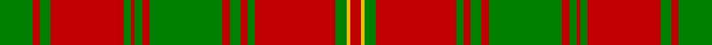

In pattern [GRGRGRGRGRGRGRGYR](/stripes/grgrgrgrgrgrgrgyr/).

This was sourced from weddslist.  It is a [17 stripe tartan](/stripes/stripes17/).

Original link http://www.weddslist.com/cgi-bin/tartans/pg.pl?source=sts

## Also known as

This cloth is also recorded under:

- Hebrides, Outer

## Thread count
G/18 R4 G6 R40 G4 R2 G4 R4 G40 R4 G6 R4 G4 R44 G6 Y2 R/6

## Palette
Each colour and the base-6 reference it is a variant of.

| Colour | Shade | Base |
|---|---|---|
| G | <code style="background-color:#008000;">#008000</code> `oklch(52.0% 0.177 142.5)` <small>#008000</small> | G <code style="background-color:#006100;">#006100</code> |
| R | <code style="background-color:#C00000;">#C00000</code> `oklch(50.7% 0.208 29.2)` <small>#C00000</small> | R <code style="background-color:#CC0000;">#CC0000</code> |
| Y | <code style="background-color:#F0C000;">#F0C000</code> `oklch(82.7% 0.169 90.5)` <small>#F0C000</small> | Y <code style="background-color:#F2BF00;">#F2BF00</code> |

## Nearest tartans

The nearest existing variants by ΔTartan distance.

1. [MacAlister of Glenbarr](/setts/s14/g20r3g6r6g6r8dp2r2g20r2dp2r46dp3r8~x2/) — ΔT 0.93
1. [Robertson - 1746 (Artefact)](/setts/s14/g15r1g1r1g1r18g24r1g1r18g1r1g1r3~x2/) — ΔT 1.09
1. [Donachie Clan Tartan Tartan Number: 6138. Earliest known date: 2004 A new tartan, a simplified sett based on the #893 Robertson tartan once presented by the Jacobite Prince to a Robertson during the '45.'' (The Setts of the Scottish Tartans, D.C. Stewart, 1950.) The Donachie of Brockloch Society have adopted this tartan. See products available Copyright © Blair Urquhart, Comrie, 2015](/setts/s18/r24g2r2g40r25g2r2g2r2g20~x2/) — ΔT 1.16
1. [Drummond](/setts/s12/r4g1r1g18k1g1k1g8r28g1r1g4~x2/) — ΔT 1.17
1. [MacGillivray](/setts/s14/g19r7g7r7g7r14db3r3g19r3db3r66db7r14~x2/) — ΔT 1.22
1. [Robertson #2](/setts/s14/dg15r1dg1r1dg1r18dg24r1dg1r18dg1r1dg1r3~x2/) — ΔT 1.29
1. [MacDonell of Glengarry](/setts/s11/g18r3g2r2db6r2g2r24g1r2g6~x2/) — ΔT 1.30
1. [Drummond #3](/setts/s12/dg4r1dg1r28dg8k1dg1k1dg18r1dg1r4~x2/) — ΔT 1.37
1. [Hayes (Fashion)](/setts/s14/r2dg1ly1dg12r1dg1r1dg4r17dg3r2dg1r2lr2~x4/) — ΔT 1.37
1. [Hebrides, Outer](/setts/s32/g9r2g3r20g2r1g2r2g20r2g3r2g2r22g3ly1r3~x2/) — ΔT 1.40

## Neighbour map

Every grey dot is one of 14299 variants placed by the first two principal components of the ΔTartan feature space (44% of its variance). Red is this tartan; blue dots are its nearest — click one to open its page.

<svg viewBox="0 0 640 380" role="img" style="max-width:100%;height:auto;border:1px solid #e0e0e0;border-radius:4px;display:block" xmlns="http://www.w3.org/2000/svg"><image href="/nn/cloud.v1.png" width="640" height="380"/><a href="/setts/s14/g20r3g6r6g6r8dp2r2g20r2dp2r46dp3r8~x2/"><circle cx="408.9" cy="136.5" r="4" fill="#3465a4"><title>MacAlister of Glenbarr</title></circle></a><a href="/setts/s14/g15r1g1r1g1r18g24r1g1r18g1r1g1r3~x2/"><circle cx="427.5" cy="151.7" r="4" fill="#3465a4"><title>Robertson - 1746 (Artefact)</title></circle></a><a href="/setts/s18/r24g2r2g40r25g2r2g2r2g20~x2/"><circle cx="428.1" cy="152.2" r="4" fill="#3465a4"><title>Donachie Clan Tartan Tartan Number: 6138. Earliest known date: 2004 A new tartan, a simplified sett based on the #893 Robertson tartan once presented by the Jacobite Prince to a Robertson during the '45.'' (The Setts of the Scottish Tartans, D.C. Stewart, 1950.) The Donachie of Brockloch Society have adopted this tartan. See products available Copyright © Blair Urquhart, Comrie, 2015</title></circle></a><a href="/setts/s12/r4g1r1g18k1g1k1g8r28g1r1g4~x2/"><circle cx="390.3" cy="121.3" r="4" fill="#3465a4"><title>Drummond</title></circle></a><a href="/setts/s14/g19r7g7r7g7r14db3r3g19r3db3r66db7r14~x2/"><circle cx="445.6" cy="136.6" r="4" fill="#3465a4"><title>MacGillivray</title></circle></a><a href="/setts/s14/dg15r1dg1r1dg1r18dg24r1dg1r18dg1r1dg1r3~x2/"><circle cx="415.1" cy="142.8" r="4" fill="#3465a4"><title>Robertson #2</title></circle></a><a href="/setts/s11/g18r3g2r2db6r2g2r24g1r2g6~x2/"><circle cx="363.3" cy="147.3" r="4" fill="#3465a4"><title>MacDonell of Glengarry</title></circle></a><a href="/setts/s12/dg4r1dg1r28dg8k1dg1k1dg18r1dg1r4~x2/"><circle cx="396.1" cy="120.3" r="4" fill="#3465a4"><title>Drummond #3</title></circle></a><a href="/setts/s14/r2dg1ly1dg12r1dg1r1dg4r17dg3r2dg1r2lr2~x4/"><circle cx="347.1" cy="124.4" r="4" fill="#3465a4"><title>Hayes (Fashion)</title></circle></a><a href="/setts/s32/g9r2g3r20g2r1g2r2g20r2g3r2g2r22g3ly1r3~x2/"><circle cx="407.1" cy="104.1" r="4" fill="#3465a4"><title>Hebrides, Outer</title></circle></a><circle cx="403.1" cy="130.7" r="5" fill="#c00000"/></svg>

ID: /setts/s17/g9r2g3r20g2r1g2r2g20r2g3r2g2r22g3ly1r3~x2/
