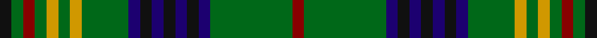

This page is one **sett** — a single exact thread-count. It belongs to the [tartan](/tartans/k1g1dr1g1dy1g1dy1g4db1k1db1k1db1k1db1g7dr1/)
(the same proportion at any scale), whose colour order is pattern [KGRGYGYGBKBKBKBGR](/stripes/kgrgygygbkbkbkbgr/).

Sourced from register-of-tartans.  It is a [17 stripe tartan](/stripes/stripes17/).

Original link https://www.tartanregister.gov.uk/tartanDetails.aspx?ref=3086

2 attestations — the source records this cloth was collapsed from (oldest owns this page)

<ul>
<li>01/01/1920 — Myron (register-of-tartans, <a href="https://www.tartanregister.gov.uk/tartanDetails.aspx?ref=3086">record</a>)</li>
<li>circa 1920s — Myron (Fashion) (tartans-authority, <a href="http://www.tartansauthority.com/tartan-ferret/display/1105/">record</a>)</li>
</ul>

## Register references

External register numbers recorded for this tartan.

- Scottish Register of Tartans: [3086](https://www.tartanregister.gov.uk/tartanDetails.aspx?ref=3086)
- Scottish Tartans Authority (ITI): 1105
- Scottish Tartans World Register: 1105

## Thread count
K/4 G4 DR4 G4 DY4 G4 DY4 G16 DB4 K4 DB4 K4 DB4 K4 DB4 G28 DR/4

## Palette
Each colour and the base-6 reference it is a variant of.

| Colour | Shade | Base |
|---|---|---|
| DB | <code style="background-color:#1C0070;">#1C0070</code> `oklch(26.3% 0.162 277.1)` <small>#1C0070</small> | B <code style="background-color:#2A418A;">#2A418A</code> |
| DR | <code style="background-color:#880000;">#880000</code> `oklch(39.4% 0.162 29.2)` <small>#880000</small> | R <code style="background-color:#CC0000;">#CC0000</code> |
| DY | <code style="background-color:#D09800;">#D09800</code> `oklch(71.4% 0.147 82.1)` <small>#D09800</small> | Y <code style="background-color:#F2BF00;">#F2BF00</code> |
| G | <code style="background-color:#006818;">#006818</code> `oklch(45.0% 0.142 145.0)` <small>#006818</small> | G <code style="background-color:#006100;">#006100</code> |
| K | <code style="background-color:#101010;">#101010</code> `oklch(17.3% 0.000 89.9)` <small>#101010</small> | K <code style="background-color:#000000;">#000000</code> |

## Nearest tartans

The nearest existing variants by ΔTartan distance, with this tartan at the top so the swatches line up against it.

ΔTartan

Tartan

Sett

—

<a href="/ttd/edit/#slug=k1g1r1g1lo1g1lo1g4db1k1db1k1db1k1db1g7r1~x4">Myron</a> <a class="nn-out" href="/setts/s17/k1g1r1g1lo1g1lo1g4db1k1db1k1db1k1db1g7r1~x4/" title="open its dictionary page">↗</a>

1.02

<a href="/ttd/edit/#slug=k3g3r2g3ly2g2ly2g11db3k3db3k3db3k3db3g20r3~x2">Myron Family Tartan Tartan Number: 1105. Earliest known date: pre 2003 Designed for the town celebrations of 1958-59 by G. Lawson of the Musselburgh Co-operative Society. See products available Copyright © Blair Urquhart, Comrie, 2015</a> <a class="nn-out" href="/setts/s17/k3g3r2g3ly2g2ly2g11db3k3db3k3db3k3db3g20r3~x2/" title="open its dictionary page">↗</a>

1.09

<a href="/ttd/edit/#slug=g16k3g20w2r3k2r3w2g2db18k2r4w2g3~x2">MacFarlane Hunting Clan Tartan Tartan Number: 779. Earliest known date: 1930-50 This sett comes from the MacGregor-Hastie collection in the Scottish Tartans Museum. The collection dates between 1930-50 and forms the major part of the cloth archive. The Hunting MacFarlane is based on Logans count (1831) with red changed to green. The MacFarlanes came originally from the lands about Arrochar in the West of Scotland. See products available Copyright © Blair Urquhart, Comrie, 2015</a> <a class="nn-out" href="/setts/s14/g16k3g20w2r3k2r3w2g2db18k2r4w2g3~x2/" title="open its dictionary page">↗</a>

1.13

<a href="/ttd/edit/#slug=w1r2g10r2g2k8g2db8g2r2g10r2w1~x2">Reid Family Tartan Tartan Number: 2066. Earliest known date: 1991 Designed for Mr. William Reid, President of DELCO Scottish games. See products available Copyright © Blair Urquhart, Comrie, 2015</a> <a class="nn-out" href="/setts/s13/w1r2g10r2g2k8g2db8g2r2g10r2w1~x2/" title="open its dictionary page">↗</a>

1.18

<a href="/ttd/edit/#slug=w1r2g10r2g2k8g2db8g2r2g10r2w1~x4">Reid, Green</a> <a class="nn-out" href="/setts/s13/w1r2g10r2g2k8g2db8g2r2g10r2w1~x4/" title="open its dictionary page">↗</a>

1.20

<a href="/ttd/edit/#slug=g5k24g12k16g26w4g24w4g26k16dt4k4dt4k4db28g3">O'Conner Irish Family Tartan Tartan Number: 2217. Earliest known date: 1985 Designed by Jerry O'Connor of Keltic Klassics, Hillsdale, New Jersey who names it &quot;Royal na Connaught&quot; .Woven by House of Edgar who said they would call it O'Connor. Ref made to Lawrence &amp; Gerald O'Connor - possibly customers of Macnaughtons of Pitlochry (part of same group as House of Edgar) See products available Copyright © Blair Urquhart, Comrie, 2015</a> <a class="nn-out" href="/setts/s16/g5k24g12k16g26w4g24w4g26k16dt4k4dt4k4db28g3/" title="open its dictionary page">↗</a>

1.22

<a href="/ttd/edit/#slug=b11k3b3k3b4k15g36w3g36k15b4k3b3k3b11r4~x2">Semple</a> <a class="nn-out" href="/setts/s16/b11k3b3k3b4k15g36w3g36k15b4k3b3k3b11r4~x2/" title="open its dictionary page">↗</a>

1.22

<a href="/ttd/edit/#slug=g10k1g1k1g1k1db4k1w1k1db1ly1k1g4k1r1~x4">Cockburn - 1830 (Clan)</a> <a class="nn-out" href="/setts/s16/g10k1g1k1g1k1db4k1w1k1db1ly1k1g4k1r1~x4/" title="open its dictionary page">↗</a>

1.23

<a href="/ttd/edit/#slug=y3g12k5g2k5y2r2y2k5g12w2y3~x2">Wilcox, Yu, Cruikshank Reunion</a> <a class="nn-out" href="/setts/s12/y3g12k5g2k5y2r2y2k5g12w2y3~x2/" title="open its dictionary page">↗</a>

1.25

<a href="/ttd/edit/#slug=dp2k2g6t4k2db5k4g20k4t5k2t4g6k2dp2~x2">Letham Hunting (Name)</a> <a class="nn-out" href="/setts/s15/dp2k2g6t4k2db5k4g20k4t5k2t4g6k2dp2~x2/" title="open its dictionary page">↗</a>

1.26

<a href="/ttd/edit/#slug=g17t3r3t3k19ly2g17r4g17ly2k19t3r3t3g17db8~x2">Wilson's No.033</a> <a class="nn-out" href="/setts/s16/g17t3r3t3k19ly2g17r4g17ly2k19t3r3t3g17db8~x2/" title="open its dictionary page">↗</a>

## Neighbour map

Every grey dot is one of 14299 variants placed by the first two principal components of the ΔTartan feature space (44% of its variance). Red is this tartan; blue dots are its nearest — click one to open its page.

<svg viewBox="0 0 640 380" role="img" style="max-width:100%;height:auto;border:1px solid #e0e0e0;border-radius:4px;display:block" xmlns="http://www.w3.org/2000/svg"><image href="/nn/cloud.v1.png" width="640" height="380"/><a href="/setts/s17/k3g3r2g3ly2g2ly2g11db3k3db3k3db3k3db3g20r3~x2/"><circle cx="235.7" cy="132.4" r="4" fill="#3465a4"><title>Myron Family Tartan Tartan Number: 1105. Earliest known date: pre 2003 Designed for the town celebrations of 1958-59 by G. Lawson of the Musselburgh Co-operative Society. See products available Copyright © Blair Urquhart, Comrie, 2015</title></circle></a><a href="/setts/s14/g16k3g20w2r3k2r3w2g2db18k2r4w2g3~x2/"><circle cx="224.6" cy="141.2" r="4" fill="#3465a4"><title>MacFarlane Hunting Clan Tartan Tartan Number: 779. Earliest known date: 1930-50 This sett comes from the MacGregor-Hastie collection in the Scottish Tartans Museum. The collection dates between 1930-50 and forms the major part of the cloth archive. The Hunting MacFarlane is based on Logans count (1831) with red changed to green. The MacFarlanes came originally from the lands about Arrochar in the West of Scotland. See products available Copyright © Blair Urquhart, Comrie, 2015</title></circle></a><a href="/setts/s13/w1r2g10r2g2k8g2db8g2r2g10r2w1~x2/"><circle cx="214.4" cy="165.1" r="4" fill="#3465a4"><title>Reid Family Tartan Tartan Number: 2066. Earliest known date: 1991 Designed for Mr. William Reid, President of DELCO Scottish games. See products available Copyright © Blair Urquhart, Comrie, 2015</title></circle></a><a href="/setts/s13/w1r2g10r2g2k8g2db8g2r2g10r2w1~x4/"><circle cx="208.8" cy="162.8" r="4" fill="#3465a4"><title>Reid, Green</title></circle></a><a href="/setts/s16/g5k24g12k16g26w4g24w4g26k16dt4k4dt4k4db28g3/"><circle cx="202.9" cy="179.8" r="4" fill="#3465a4"><title>O'Conner Irish Family Tartan Tartan Number: 2217. Earliest known date: 1985 Designed by Jerry O'Connor of Keltic Klassics, Hillsdale, New Jersey who names it &quot;Royal na Connaught&quot; .Woven by House of Edgar who said they would call it O'Connor. Ref made to Lawrence &amp; Gerald O'Connor - possibly customers of Macnaughtons of Pitlochry (part of same group as House of Edgar) See products available Copyright © Blair Urquhart, Comrie, 2015</title></circle></a><a href="/setts/s16/b11k3b3k3b4k15g36w3g36k15b4k3b3k3b11r4~x2/"><circle cx="226.3" cy="141.0" r="4" fill="#3465a4"><title>Semple</title></circle></a><a href="/setts/s16/g10k1g1k1g1k1db4k1w1k1db1ly1k1g4k1r1~x4/"><circle cx="223.1" cy="120.6" r="4" fill="#3465a4"><title>Cockburn - 1830 (Clan)</title></circle></a><a href="/setts/s12/y3g12k5g2k5y2r2y2k5g12w2y3~x2/"><circle cx="189.2" cy="200.3" r="4" fill="#3465a4"><title>Wilcox, Yu, Cruikshank Reunion</title></circle></a><a href="/setts/s15/dp2k2g6t4k2db5k4g20k4t5k2t4g6k2dp2~x2/"><circle cx="205.0" cy="163.8" r="4" fill="#3465a4"><title>Letham Hunting (Name)</title></circle></a><a href="/setts/s16/g17t3r3t3k19ly2g17r4g17ly2k19t3r3t3g17db8~x2/"><circle cx="187.0" cy="152.7" r="4" fill="#3465a4"><title>Wilson's No.033</title></circle></a><circle cx="235.4" cy="163.2" r="5" fill="#c00000"/></svg>

ID: /setts/s17/k1g1r1g1lo1g1lo1g4db1k1db1k1db1k1db1g7r1~x4/
