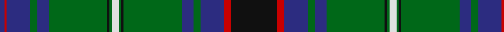

In pattern [BRBGBGKGWGKGBGBRK](/patterns/brbgbgkgwgkgbgbrk/).

This was sourced from house-of-tartan.  It is a [17 stripes tartan](/stripes/stripes17/).

Original link http://www.house-of-tartan.scotland.net/house/TartanViewjs.asp?colr=Def&tnam=443

## Thread count
DB/4 R2 DB20 G6 DB10 G50 K2 G2 LN6 G2 K2 G50 DB10 G6 DB20 R6 K/40

## Palette
Each colour and its ΔE from the base-6 reference it is a variant of.

| Colour | Shade | Base | ΔE (OKLab) |
|---|---|---|---|
| DB | <code style="background-color:#2C2C80;">#2C2C80</code> `#2C2C80` | B <code style="background-color:#2A418A;">#2A418A</code> | 0.06 |
| G | <code style="background-color:#006818;">#006818</code> `#006818` | G <code style="background-color:#006100;">#006100</code> | 0.02 |
| K | <code style="background-color:#101010;">#101010</code> `#101010` | K <code style="background-color:#000000;">#000000</code> | 0.17 |
| LN | <code style="background-color:#E0E0E0;">#E0E0E0</code> `#E0E0E0` | W <code style="background-color:#F7F7F7;">#F7F7F7</code> | 0.07 |
| R | <code style="background-color:#C80000;">#C80000</code> `#C80000` | R <code style="background-color:#CC0000;">#CC0000</code> | 0.01 |

## Nearest tartans

The nearest existing variants by ΔTartan distance.

1. [Blairgowrie](/setts/s17/k20g3b10ga3b5ga25k1ga1w3ga1k1ga25b5ga3b10g1b2x4~b2c2c80-g808080-ga006818-k101010-wffffff/) — ΔT 0.18
1. [Sarafilovic](/setts/s16/b15k18g3k2g2k2g44y4g44k2g2k2g3k18b15r4x2~b2c2c80-g006818-k101010-rc80000-ye8c000/) — ΔT 0.83
1. [Blairlogie or Blair Athol](/setts/s17/k28r1b8g2b4g19k2g1w2g1k1g19b4g2b8r2b3x4~b202060-g006818-k101010-rc80000-we0e0e0/) — ΔT 0.84
1. [Blairlogie (District)](/setts/s17/k28r2b9g2b4g20k1g1w2g1k1g20b4g2b9r1b3x2~b506878-g006818-k101010-rc80000-we0e0e0/) — ΔT 0.88
1. [Sutherland](/setts/s22/g6w2g24k12b3k2b2k2b12r1b1r3b1r1b12k2b2k2b3k12g24w2x2~b2c2c80-g006818-k101010-rc80000-wfcfcfc/) — ΔT 0.97
1. [Sutherland Old Clan Tartan Tartan Number: 930. Earliest known date: 1842 (1618) The earlier date refers to a letter from Gordon Earl of Sutherland instructing Murray of Dulrossie to 'remove the red and white lines from the plaids of the men so as to bring their dress into harmony with that of the other Septs.' This sett is also recorded by Smibert in 1850. Smiberts work lends greater authority to the accuracy of the tartan. Worn by the City of Nunawading Highland pipe band (Australia) (Strathallan 1994) See products available Copyright © Blair Urquhart, Comrie, 2015](/setts/s12/g6w2g24k12b3k2b2k2b12r1b1r3x2~b2c2c80-g006818-k101010-rc80000-we0e0e0/) — ΔT 0.98
1. [Ontario (Official)](/setts/s13/g19r1g2r2g15r1b13w1ba2r2ba21r1w3x2~b1c1c1c-ba2c2c80-g006818-rc80000-we0e0e0/) — ΔT 0.98
1. [Kerby/Kirby](/setts/s12/r6g1w2g24k3g3k3g3k8b8w2b4x2~b1c0070-g006818-k101010-r880000-wc0c0c0/) — ΔT 1.00
1. [Sutherland (Clan)](/setts/s12/g6w2g24k12b3k2b2k2b12r1b1r3x2~b2c2c80-g006818-k101010-rc80000-wfcfcfc/) — ΔT 1.02
1. [Cochrane (1984) Clan Tartan Tartan Number: 978. Earliest known date: 1984 Lord Dundonald originally registered a version missing a red and a green stripe in 1974. There is a story that a fragment of this design was discovered in the foundations of a Perthshire house in 1934. Around that time, a count was recorded from the sample books of Messrs William Anderson. The red and green have been restored in this version, which is now the 'approved' tartan, and appears in the 'Appendix' of the Lyon Court Books dated 12th November 1984. See products available Copyright © Blair Urquhart, Comrie, 2015](/setts/s15/g34r4g4r2g4r2g3r4g17k17r2b17r4b4y3x2~b2c2c80-g006818-k101010-rc80000-ye8c000/) — ΔT 1.05

## Neighbour map

Every grey dot is one of 15726 variants placed by the first two principal components of the ΔTartan feature space (44% of its variance). Red is this tartan; blue dots are its nearest — click one to open its page.

<svg viewBox="0 0 640 380" role="img" style="max-width:100%;height:auto;border:1px solid #e0e0e0;border-radius:4px;display:block" xmlns="http://www.w3.org/2000/svg"><image href="/nn/cloud.v1.png" width="640" height="380"/><a href="/setts/s17/k20g3b10ga3b5ga25k1ga1w3ga1k1ga25b5ga3b10g1b2x4~b2c2c80-g808080-ga006818-k101010-wffffff/"><circle cx="272.7" cy="108.2" r="4" fill="#3465a4"><title>Blairgowrie</title></circle></a><a href="/setts/s16/b15k18g3k2g2k2g44y4g44k2g2k2g3k18b15r4x2~b2c2c80-g006818-k101010-rc80000-ye8c000/"><circle cx="313.4" cy="116.4" r="4" fill="#3465a4"><title>Sarafilovic</title></circle></a><a href="/setts/s17/k28r1b8g2b4g19k2g1w2g1k1g19b4g2b8r2b3x4~b202060-g006818-k101010-rc80000-we0e0e0/"><circle cx="256.3" cy="101.9" r="4" fill="#3465a4"><title>Blairlogie or Blair Athol</title></circle></a><a href="/setts/s17/k28r2b9g2b4g20k1g1w2g1k1g20b4g2b9r1b3x2~b506878-g006818-k101010-rc80000-we0e0e0/"><circle cx="261.1" cy="100.5" r="4" fill="#3465a4"><title>Blairlogie (District)</title></circle></a><a href="/setts/s22/g6w2g24k12b3k2b2k2b12r1b1r3b1r1b12k2b2k2b3k12g24w2x2~b2c2c80-g006818-k101010-rc80000-wfcfcfc/"><circle cx="222.7" cy="92.6" r="4" fill="#3465a4"><title>Sutherland</title></circle></a><a href="/setts/s12/g6w2g24k12b3k2b2k2b12r1b1r3x2~b2c2c80-g006818-k101010-rc80000-we0e0e0/"><circle cx="242.6" cy="120.9" r="4" fill="#3465a4"><title>Sutherland Old Clan Tartan Tartan Number: 930. Earliest known date: 1842 (1618) The earlier date refers to a letter from Gordon Earl of Sutherland instructing Murray of Dulrossie to 'remove the red and white lines from the plaids of the men so as to bring their dress into harmony with that of the other Septs.' This sett is also recorded by Smibert in 1850. Smiberts work lends greater authority to the accuracy of the tartan. Worn by the City of Nunawading Highland pipe band (Australia) (Strathallan 1994) See products available Copyright © Blair Urquhart, Comrie, 2015</title></circle></a><a href="/setts/s13/g19r1g2r2g15r1b13w1ba2r2ba21r1w3x2~b1c1c1c-ba2c2c80-g006818-rc80000-we0e0e0/"><circle cx="234.0" cy="118.4" r="4" fill="#3465a4"><title>Ontario (Official)</title></circle></a><a href="/setts/s12/r6g1w2g24k3g3k3g3k8b8w2b4x2~b1c0070-g006818-k101010-r880000-wc0c0c0/"><circle cx="242.0" cy="123.1" r="4" fill="#3465a4"><title>Kerby/Kirby</title></circle></a><a href="/setts/s12/g6w2g24k12b3k2b2k2b12r1b1r3x2~b2c2c80-g006818-k101010-rc80000-wfcfcfc/"><circle cx="238.3" cy="119.2" r="4" fill="#3465a4"><title>Sutherland (Clan)</title></circle></a><a href="/setts/s15/g34r4g4r2g4r2g3r4g17k17r2b17r4b4y3x2~b2c2c80-g006818-k101010-rc80000-ye8c000/"><circle cx="263.1" cy="124.7" r="4" fill="#3465a4"><title>Cochrane (1984) Clan Tartan Tartan Number: 978. Earliest known date: 1984 Lord Dundonald originally registered a version missing a red and a green stripe in 1974. There is a story that a fragment of this design was discovered in the foundations of a Perthshire house in 1934. Around that time, a count was recorded from the sample books of Messrs William Anderson. The red and green have been restored in this version, which is now the 'approved' tartan, and appears in the 'Appendix' of the Lyon Court Books dated 12th November 1984. See products available Copyright © Blair Urquhart, Comrie, 2015</title></circle></a><circle cx="276.0" cy="108.4" r="5" fill="#c00000"/></svg>

ID: /setts/s17/k20r3b10g3b5g25k1g1w3g1k1g25b5g3b10r1b2x2~b2c2c80-g006818-k101010-rc80000-we0e0e0/
