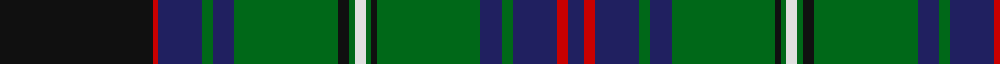

In pattern [BRBGBGKGWGKGBGBRK](/stripes/brbgbgkgwgkgbgbrk/).

This was sourced from register-of-tartans.  It is a [17 stripe tartan](/stripes/stripes17/).

Original link https://www.tartanregister.gov.uk/tartanDetails.aspx?ref=293

## Register references

External register numbers recorded for this tartan.

- Scottish Register of Tartans: [293](https://www.tartanregister.gov.uk/tartanDetails.aspx?ref=293)
- Scottish Tartans Authority (ITI): 443
- Scottish Tartans World Register: 443

## Thread count
K/112 R4 DB32 G8 DB16 G76 K8 G4 LN8 G4 K4 G76 DB16 G8 DB32 R8 DB/12

## Palette
Each colour and the base-6 reference it is a variant of.

| Colour | Shade | Base |
|---|---|---|
| DB | <code style="background-color:#202060;">#202060</code> `oklch(28.9% 0.111 276.9)` <small>#202060</small> | B <code style="background-color:#2A418A;">#2A418A</code> |
| DG | <code style="background-color:#003820;">#003820</code> `oklch(30.0% 0.070 158.3)` <small>#003820</small> | G <code style="background-color:#006100;">#006100</code> |
| G | <code style="background-color:#006818;">#006818</code> `oklch(45.0% 0.142 145.0)` <small>#006818</small> | G <code style="background-color:#006100;">#006100</code> |
| K | <code style="background-color:#101010;">#101010</code> `oklch(17.3% 0.000 89.9)` <small>#101010</small> | K <code style="background-color:#000000;">#000000</code> |
| LN | <code style="background-color:#E0E0E0;">#E0E0E0</code> `oklch(90.7% 0.000 89.9)` <small>#E0E0E0</small> | W <code style="background-color:#F7F7F7;">#F7F7F7</code> |
| R | <code style="background-color:#C80000;">#C80000</code> `oklch(52.3% 0.215 29.2)` <small>#C80000</small> | R <code style="background-color:#CC0000;">#CC0000</code> |

## Nearest tartans

The nearest existing variants by ΔTartan distance, with this tartan at the top so the swatches line up against it.

ΔTartan

Tartan

Sett

—

<a href="/ttd/edit/#slug=k28r1db8g2db4g19k2g1w2g1k1g19db4g2db8r2db3~x4">Blairlogie or Blair Athol</a> <a class="nn-out" href="/setts/s17/k28r1db8g2db4g19k2g1w2g1k1g19db4g2db8r2db3~x4/" title="open its dictionary page">↗</a>

0.57

<a href="/setts/s14/db28ly1db2k26g24k1g2r3~x2/">Ogilvie of Inverarity (V.S.)</a>

0.70

<a href="/ttd/edit/#slug=k28r2n9g2n4g20k1g1w2g1k1g20n4g2n9r1n3~x2">Blairlogie (District)</a> <a class="nn-out" href="/setts/s17/k28r2n9g2n4g20k1g1w2g1k1g20n4g2n9r1n3~x2/" title="open its dictionary page">↗</a>

0.80

<a href="/ttd/edit/#slug=db4w2db24k3db3k3db8k24g48k3g3r2~x2">Urquhart - 1842 (Clan)</a> <a class="nn-out" href="/setts/s12/db4w2db24k3db3k3db8k24g48k3g3r2~x2/" title="open its dictionary page">↗</a>

0.84

<a href="/setts/s22/g6w2g24k12db3k2db2k2db12r1db1r3~x2/">Sutherland</a>

0.87

<a href="/setts/s14/db64k11r2k4r2k4g32lo4~x2/">Sinclair-Brown (Personal)</a>

0.90

<a href="/ttd/edit/#slug=t2k1dg15w2dg15k1t2k1r2k20t2k2t2k2t25k1~x2">Rankin, John (Personal)</a> <a class="nn-out" href="/setts/s16/t2k1dg15w2dg15k1t2k1r2k20t2k2t2k2t25k1~x2/" title="open its dictionary page">↗</a>

0.90

<a href="/ttd/edit/#slug=k20y3db10g3db5g25k1g1w3g1k1g25db5g3db10y1db2~x4">Blairgowrie</a> <a class="nn-out" href="/setts/s17/k20y3db10g3db5g25k1g1w3g1k1g25db5g3db10y1db2~x4/" title="open its dictionary page">↗</a>

0.92

<a href="/setts/s18/g4t2db33r2k35g33k1r2k1g4~x2/">Lochaber</a>

0.94

<a href="/ttd/edit/#slug=dt36k5r2k5g15r2g10w2g10r2g15k5r2k5dt10r2dt2r2dt4w2~x2">Ranking Corporate Tartan Tartan Number: 3242. Earliest known date: 2002 Personal/Family tartan for the Ranking family and its close relatives as determined by the current head of the family. A minor variation of Rankine tartan. See products available Copyright © Blair Urquhart, Comrie, 2015</a> <a class="nn-out" href="/setts/s20/dt36k5r2k5g15r2g10w2g10r2g15k5r2k5dt10r2dt2r2dt4w2~x2/" title="open its dictionary page">↗</a>

1.00

<a href="/ttd/edit/#slug=g6w2g24k12db3k2db2k2db12r1db1r3~x2">Sutherland (Clan)</a> <a class="nn-out" href="/setts/s12/g6w2g24k12db3k2db2k2db12r1db1r3~x2/" title="open its dictionary page">↗</a>

## Neighbour map

Every grey dot is one of 14299 variants placed by the first two principal components of the ΔTartan feature space (44% of its variance). Red is this tartan; blue dots are its nearest — click one to open its page.

<svg viewBox="0 0 640 380" role="img" style="max-width:100%;height:auto;border:1px solid #e0e0e0;border-radius:4px;display:block" xmlns="http://www.w3.org/2000/svg"><image href="/nn/cloud.v1.png" width="640" height="380"/><a href="/setts/s14/db28ly1db2k26g24k1g2r3~x2/"><circle cx="251.9" cy="123.7" r="4" fill="#3465a4"><title>Ogilvie of Inverarity (V.S.)</title></circle></a><a href="/setts/s17/k28r2n9g2n4g20k1g1w2g1k1g20n4g2n9r1n3~x2/"><circle cx="264.2" cy="107.1" r="4" fill="#3465a4"><title>Blairlogie (District)</title></circle></a><a href="/setts/s12/db4w2db24k3db3k3db8k24g48k3g3r2~x2/"><circle cx="268.3" cy="128.4" r="4" fill="#3465a4"><title>Urquhart - 1842 (Clan)</title></circle></a><a href="/setts/s22/g6w2g24k12db3k2db2k2db12r1db1r3~x2/"><circle cx="226.1" cy="97.7" r="4" fill="#3465a4"><title>Sutherland</title></circle></a><a href="/setts/s14/db64k11r2k4r2k4g32lo4~x2/"><circle cx="258.8" cy="103.9" r="4" fill="#3465a4"><title>Sinclair-Brown (Personal)</title></circle></a><a href="/setts/s16/t2k1dg15w2dg15k1t2k1r2k20t2k2t2k2t25k1~x2/"><circle cx="225.7" cy="100.5" r="4" fill="#3465a4"><title>Rankin, John (Personal)</title></circle></a><a href="/setts/s17/k20y3db10g3db5g25k1g1w3g1k1g25db5g3db10y1db2~x4/"><circle cx="276.0" cy="113.2" r="4" fill="#3465a4"><title>Blairgowrie</title></circle></a><a href="/setts/s18/g4t2db33r2k35g33k1r2k1g4~x2/"><circle cx="238.8" cy="102.5" r="4" fill="#3465a4"><title>Lochaber</title></circle></a><a href="/setts/s20/dt36k5r2k5g15r2g10w2g10r2g15k5r2k5dt10r2dt2r2dt4w2~x2/"><circle cx="219.1" cy="120.4" r="4" fill="#3465a4"><title>Ranking Corporate Tartan Tartan Number: 3242. Earliest known date: 2002 Personal/Family tartan for the Ranking family and its close relatives as determined by the current head of the family. A minor variation of Rankine tartan. See products available Copyright © Blair Urquhart, Comrie, 2015</title></circle></a><a href="/setts/s12/g6w2g24k12db3k2db2k2db12r1db1r3~x2/"><circle cx="241.6" cy="123.1" r="4" fill="#3465a4"><title>Sutherland (Clan)</title></circle></a><circle cx="259.7" cy="108.3" r="5" fill="#c00000"/></svg>

ID: /setts/s17/k28r1db8g2db4g19k2g1w2g1k1g19db4g2db8r2db3~x4/
