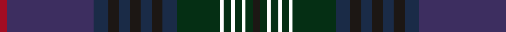

**Bands:** [KGKGKGKGBKBKBKBBR](/stripes/kgkgkgkgbkbkbkbbr/) · **Stripes:** [K DG K DG K DG K DG DT K DT K DT K DT DP R](/stripes/stripes17/) K DG K DG K DG K DG DT K DT K DT K DT DP R

This was sourced from register-of-tartans.  It is a [17 band tartan](/bands/bands17/).

Original link https://www.tartanregister.gov.uk/tartanDetails.aspx?ref=10699

## Attestations

This cloth appears in 2 source records; the oldest owns this page.

- 06/09/2012 — Rendell, Charles (register-of-tartans, [record](https://www.tartanregister.gov.uk/tartanDetails.aspx?ref=10699))
- undated — Rendell, Charles Name Tartan Tartan Number: 10699. Earliest known date: 13 September 2012 Ailsa and Alex Rendell designed this tartan to celebrate their father’s 60th birthday. The colours and threadcount are inspired by the Kennedy tartan STR #1942 with purple as the main base colour to give it a modern feel. See products available Copyright © Blair Urquhart, Comrie, 2015 (house-of-tartan, [record](http://www.house-of-tartan.scotland.net/house/TartanViewjs.asp?colr=Def&tnam=10699))

## Register references

External register numbers recorded for this tartan.

- Scottish Register of Tartans: [10699](https://www.tartanregister.gov.uk/tartanDetails.aspx?ref=10699)

## Thread count
DR/4 DB48 DN8 K6 DN6 K6 DN6 K6 DN8 DG24 LP2 DG4 LP2 DG4 LP2 DG4 K/4

## Palette
Each colour and its ΔE from the base-6 reference it is a variant of.

| Colour | Shade | Base | ΔE (OKLab) |
|---|---|---|---|
| DB | <code style="background-color:#3D2E60;">#3D2E60</code> `#3D2E60` | B <code style="background-color:#2A418A;">#2A418A</code> | 0.08 |
| DG | <code style="background-color:#052F14;">#052F14</code> `#052F14` | G <code style="background-color:#006100;">#006100</code> | 0.18 |
| DN | <code style="background-color:#1A2B47;">#1A2B47</code> `#1A2B47` | B <code style="background-color:#2A418A;">#2A418A</code> | 0.13 |
| DR | <code style="background-color:#A20D22;">#A20D22</code> `#A20D22` | R <code style="background-color:#CC0000;">#CC0000</code> | 0.09 |
| K | <code style="background-color:#1C1714;">#1C1714</code> `#1C1714` | K <code style="background-color:#000000;">#000000</code> | 0.21 |

## Nearest tartans

The nearest existing variants by ΔTartan distance.

1. [Doane](/setts/s12/p3dt1do3o8dg4o3dg17do11db6do4db21dt1~x2/) — ΔT 1.39
1. [Newlands, Charlie (Personal)](/setts/s11/db6k2dp9lb1dp9k2dt4k6dt24w1db6~x2/) — ΔT 1.73
1. [Spirit of Bannockburn Fashion Tartan Tartan Number: 3445. Earliest known date: 2000 Designed by Lochcarron of Scotland for ACS Clothing of Glasgow (0141 766 2600). Original name was 'Scotland the Brave' but changed to Spirit of Bannockburn by Lochcarron. See products available Copyright © Blair Urquhart, Comrie, 2015](/setts/s24/dp4dp4dp3dg20dp5k4dp3k7dp3k3db35lb2db35k3dp3k7dp3k4dp5dg20dp3dp4dp4k2~x2/) — ΔT 1.79
1. [Yeomans (2016)](/setts/s16/dt22k2o3k2dt22k4dg10k2dg10r3k4r3do10dg2do10k3~x2/) — ΔT 1.91
1. [Strathmore District Tartan Tartan Number: 10118. Earliest known date: 20/11/2009 The name 'Strathmore' means the big valley and its fertile lands have made this area lying between the Grampians to the North and the Sidlaws to the South one the wealthiest farming areas in Scotland. The tartan is thus influenced by the brown and black of the rich soil, the green of the pastures, the red for the abundance of soft fruit grown and the gold to represent its prosperity. See products available Copyright © Blair Urquhart, Comrie, 2015](/setts/s16/dg3r15dg2r2dg2r2dg18do2dg2do2dg2do27k2do2k6k2~x2/) — ΔT 1.94
1. [Bruma](/setts/s13/r2do1k1do10r1do10k13n4k1n11dy9n2lr1~x2/) — ΔT 1.98
1. [Dalgliesh, Ewen (Personal)](/setts/s10/db45dp6o6dp30dg6dp6dg30k4r4k3/) — ΔT 2.02
1. [Doyel (Name)](/setts/s15/dg38k3dg3k3dt6o1k2r2k2o1dt6k3dt3k3dt19~x2/) — ΔT 2.09
1. [Queensferry](/setts/s17/dg6n2lb1dg9dt2dg7dt4dg4dt7dg2dt20r1dt2r1dr3dt3r3~x2/) — ΔT 2.12
1. [LS Curling (Corporate)](/setts/s18/db2db4k2db25k4db2k4db10db4db2db4db11k2db2k24db4k2db2~x2/) — ΔT 2.18

## Neighbour map

Every grey dot is one of 14313 variants placed by the first two principal components of the ΔTartan feature space (44% of its variance). Red is this tartan; blue dots are its nearest — click one to open its page.

<svg viewBox="0 0 640 380" role="img" style="max-width:100%;height:auto;border:1px solid #e0e0e0;border-radius:4px;display:block" xmlns="http://www.w3.org/2000/svg"><image href="/nn/cloud.v1.png" width="640" height="380"/><a href="/setts/s12/p3dt1do3o8dg4o3dg17do11db6do4db21dt1~x2/"><circle cx="284.0" cy="197.3" r="4" fill="#3465a4"><title>Doane</title></circle></a><a href="/setts/s11/db6k2dp9lb1dp9k2dt4k6dt24w1db6~x2/"><circle cx="308.5" cy="183.8" r="4" fill="#3465a4"><title>Newlands, Charlie (Personal)</title></circle></a><a href="/setts/s24/dp4dp4dp3dg20dp5k4dp3k7dp3k3db35lb2db35k3dp3k7dp3k4dp5dg20dp3dp4dp4k2~x2/"><circle cx="263.6" cy="135.4" r="4" fill="#3465a4"><title>Spirit of Bannockburn Fashion Tartan Tartan Number: 3445. Earliest known date: 2000 Designed by Lochcarron of Scotland for ACS Clothing of Glasgow (0141 766 2600). Original name was 'Scotland the Brave' but changed to Spirit of Bannockburn by Lochcarron. See products available Copyright © Blair Urquhart, Comrie, 2015</title></circle></a><a href="/setts/s16/dt22k2o3k2dt22k4dg10k2dg10r3k4r3do10dg2do10k3~x2/"><circle cx="252.7" cy="196.1" r="4" fill="#3465a4"><title>Yeomans (2016)</title></circle></a><a href="/setts/s16/dg3r15dg2r2dg2r2dg18do2dg2do2dg2do27k2do2k6k2~x2/"><circle cx="300.3" cy="166.5" r="4" fill="#3465a4"><title>Strathmore District Tartan Tartan Number: 10118. Earliest known date: 20/11/2009 The name 'Strathmore' means the big valley and its fertile lands have made this area lying between the Grampians to the North and the Sidlaws to the South one the wealthiest farming areas in Scotland. The tartan is thus influenced by the brown and black of the rich soil, the green of the pastures, the red for the abundance of soft fruit grown and the gold to represent its prosperity. See products available Copyright © Blair Urquhart, Comrie, 2015</title></circle></a><a href="/setts/s13/r2do1k1do10r1do10k13n4k1n11dy9n2lr1~x2/"><circle cx="263.0" cy="210.8" r="4" fill="#3465a4"><title>Bruma</title></circle></a><a href="/setts/s10/db45dp6o6dp30dg6dp6dg30k4r4k3/"><circle cx="259.3" cy="191.7" r="4" fill="#3465a4"><title>Dalgliesh, Ewen (Personal)</title></circle></a><a href="/setts/s15/dg38k3dg3k3dt6o1k2r2k2o1dt6k3dt3k3dt19~x2/"><circle cx="401.5" cy="148.2" r="4" fill="#3465a4"><title>Doyel (Name)</title></circle></a><a href="/setts/s17/dg6n2lb1dg9dt2dg7dt4dg4dt7dg2dt20r1dt2r1dr3dt3r3~x2/"><circle cx="385.7" cy="188.9" r="4" fill="#3465a4"><title>Queensferry</title></circle></a><a href="/setts/s18/db2db4k2db25k4db2k4db10db4db2db4db11k2db2k24db4k2db2~x2/"><circle cx="323.4" cy="210.0" r="4" fill="#3465a4"><title>LS Curling (Corporate)</title></circle></a><circle cx="301.9" cy="155.0" r="5" fill="#c00000"/></svg>

ID: /setts/s17/k2dg2k1dg2k1dg2k1dg12dt4k3dt3k3dt3k3dt4dp24r2~x2/
