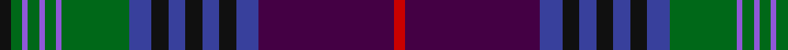

In pattern [KGBGBGBGBKBKBKBBR](/patterns/kgbgbgbgbkbkbkbbr/).

This was sourced from tartans-authority.  It is a [17 stripes tartan](/stripes/stripes17/).

Original link http://www.tartansauthority.com/tartan-ferret/display/10699/

## Thread count
K/4 G4 P2 G4 P2 G4 P2 G24 B8 K6 B6 K6 B6 K6 B8 DP48 R/4

## Palette
Each colour and its ΔE from the base-6 reference it is a variant of.

| Colour | Shade | Base | ΔE (OKLab) |
|---|---|---|---|
| B | <code style="background-color:#38409C;">#38409C</code> `#38409C` | B <code style="background-color:#2A418A;">#2A418A</code> | 0.04 |
| DP | <code style="background-color:#440044;">#440044</code> `#440044` | B <code style="background-color:#2A418A;">#2A418A</code> | 0.18 |
| G | <code style="background-color:#006818;">#006818</code> `#006818` | G <code style="background-color:#006100;">#006100</code> | 0.02 |
| K | <code style="background-color:#101010;">#101010</code> `#101010` | K <code style="background-color:#000000;">#000000</code> | 0.17 |
| P | <code style="background-color:#9058D8;">#9058D8</code> `#9058D8` | B <code style="background-color:#2A418A;">#2A418A</code> | 0.21 |
| R | <code style="background-color:#C80000;">#C80000</code> `#C80000` | R <code style="background-color:#CC0000;">#CC0000</code> | 0.01 |

## Nearest tartans

The nearest existing variants by ΔTartan distance.

1. [Smithsonian](/setts/s20/b24y1r2g2r2y1k24g24w2b2w2g24k24y1r2g2r2y1b24g2~b202060-g406054-k101010-rc80000-we0e0e0-ye8c000~x2/) — ΔT 0.81
1. [Spirit of Bannockburn (Fashion)](/setts/s13/k2b4r4b3g20b5k4b3k7b3k3ba35w2~b780078-ba2c2c80-g006818-k101010-rb468ac-wfcfcfc~x2/) — ΔT 0.98
1. [Spirit of Bannockburn](/setts/s24/b4r4b3g20b5k4b3k7b3k3ba35w2ba35k3b3k7b3k4b5g20b3r4b4k2~b780078-ba2c2c80-g006818-k101010-rb468ac-wfcfcfc~x2/) — ΔT 1.06
1. [Smithsonian (Corporate)](/setts/s11/b2w2g24k24y1r2g2r2y1b24g2~b202060-g406054-k101010-rc80000-we0e0e0-ye8c000~x2/) — ΔT 1.13
1. [Pride of Scotland](/setts/s11/g9r2ra2g3ra18g2k2g1k19b33w2~b2c2c80-g006818-k101010-ra00048-ra981c70-wfcfcfc~x2/) — ΔT 1.19
1. [McGuirk (2013)](/setts/s12/g4r1g1r3g16k12r1b27w2b3w1y2~b202060-g003820-k101010-ra00000-wa8ace8-ye8c000~x2/) — ΔT 1.24
1. [Unidentified #7](/setts/s11/b2r2b2r2b20k24g12y1k2g2ba2~b2c4084-ba3c82af-g005020-k101010-rdc0000-ye8c000~x2/) — ΔT 1.25
1. [Lang of Sherbrooke (Personal)](/setts/s11/g10y2k2g2k13g2k2g1b13ba24w2~b780078-ba2c2c80-g00643c-k101010-wfcfcfc-ye8c000~x2/) — ΔT 1.26
1. [Lang of Sherbrooke (Personal)](/setts/s11/g10y2b2g2b13g2b2g1k13ba24w2~b780078-ba2c2c80-g00643c-k101010-wfcfcfc-ye8c000~x2/) — ΔT 1.28
1. [Nicolson Green Hunting](/setts/s17/b12k1g1k1g1k1b9r2k18r2g9k1y1k1w1k1g12~b1c0070-g006818-k101010-r880000-wc0c0c0-yd09800~x2/) — ΔT 1.28

## Neighbour map

Every grey dot is one of 15726 variants placed by the first two principal components of the ΔTartan feature space (44% of its variance). Red is this tartan; blue dots are its nearest — click one to open its page.

<svg viewBox="0 0 640 380" role="img" style="max-width:100%;height:auto;border:1px solid #e0e0e0;border-radius:4px;display:block" xmlns="http://www.w3.org/2000/svg"><image href="/nn/cloud.v1.png" width="640" height="380"/><a href="/setts/s20/b24y1r2g2r2y1k24g24w2b2w2g24k24y1r2g2r2y1b24g2~b202060-g406054-k101010-rc80000-we0e0e0-ye8c000~x2/"><circle cx="186.6" cy="78.8" r="4" fill="#3465a4"><title>Smithsonian</title></circle></a><a href="/setts/s13/k2b4r4b3g20b5k4b3k7b3k3ba35w2~b780078-ba2c2c80-g006818-k101010-rb468ac-wfcfcfc~x2/"><circle cx="189.8" cy="102.5" r="4" fill="#3465a4"><title>Spirit of Bannockburn (Fashion)</title></circle></a><a href="/setts/s24/b4r4b3g20b5k4b3k7b3k3ba35w2ba35k3b3k7b3k4b5g20b3r4b4k2~b780078-ba2c2c80-g006818-k101010-rb468ac-wfcfcfc~x2/"><circle cx="188.3" cy="82.2" r="4" fill="#3465a4"><title>Spirit of Bannockburn</title></circle></a><a href="/setts/s11/b2w2g24k24y1r2g2r2y1b24g2~b202060-g406054-k101010-rc80000-we0e0e0-ye8c000~x2/"><circle cx="204.3" cy="102.1" r="4" fill="#3465a4"><title>Smithsonian (Corporate)</title></circle></a><a href="/setts/s11/g9r2ra2g3ra18g2k2g1k19b33w2~b2c2c80-g006818-k101010-ra00048-ra981c70-wfcfcfc~x2/"><circle cx="209.8" cy="90.0" r="4" fill="#3465a4"><title>Pride of Scotland</title></circle></a><a href="/setts/s12/g4r1g1r3g16k12r1b27w2b3w1y2~b202060-g003820-k101010-ra00000-wa8ace8-ye8c000~x2/"><circle cx="254.3" cy="103.5" r="4" fill="#3465a4"><title>McGuirk (2013)</title></circle></a><a href="/setts/s11/b2r2b2r2b20k24g12y1k2g2ba2~b2c4084-ba3c82af-g005020-k101010-rdc0000-ye8c000~x2/"><circle cx="229.3" cy="110.8" r="4" fill="#3465a4"><title>Unidentified #7</title></circle></a><a href="/setts/s11/g10y2k2g2k13g2k2g1b13ba24w2~b780078-ba2c2c80-g00643c-k101010-wfcfcfc-ye8c000~x2/"><circle cx="170.3" cy="107.0" r="4" fill="#3465a4"><title>Lang of Sherbrooke (Personal)</title></circle></a><a href="/setts/s11/g10y2b2g2b13g2b2g1k13ba24w2~b780078-ba2c2c80-g00643c-k101010-wfcfcfc-ye8c000~x2/"><circle cx="173.0" cy="106.4" r="4" fill="#3465a4"><title>Lang of Sherbrooke (Personal)</title></circle></a><a href="/setts/s17/b12k1g1k1g1k1b9r2k18r2g9k1y1k1w1k1g12~b1c0070-g006818-k101010-r880000-wc0c0c0-yd09800~x2/"><circle cx="180.9" cy="100.2" r="4" fill="#3465a4"><title>Nicolson Green Hunting</title></circle></a><circle cx="195.8" cy="81.8" r="5" fill="#c00000"/></svg>

ID: /setts/s17/k2g2b1g2b1g2b1g12ba4k3ba3k3ba3k3ba4bb24r2~b9058d8-ba38409c-bb440044-g006818-k101010-rc80000~x2/
