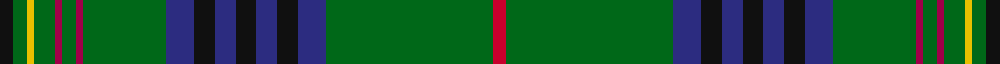

In pattern [KGYGRGRGBKBKBKBGR](/stripes/kgygrgrgbkbkbkbgr/).

This was sourced from house-of-tartan.  It is a [17 stripe tartan](/stripes/stripes17/).

Original link http://www.house-of-tartan.scotland.net/house/TartanViewjs.asp?colr=Def&tnam=1123

## Thread count
K/4 G4 Y2 G6 R2 G4 R2 G24 DB8 K6 DB6 K6 DB6 K6 DB8 G48 Ra/4

## Palette
Each colour and the base-6 reference it is a variant of.

| Colour | Shade | Base |
|---|---|---|
| DB | <code style="background-color:#2C2C80;">#2C2C80</code> `oklch(35.0% 0.138 276.6)` <small>#2C2C80</small> | B <code style="background-color:#2A418A;">#2A418A</code> |
| G | <code style="background-color:#006818;">#006818</code> `oklch(45.0% 0.142 145.0)` <small>#006818</small> | G <code style="background-color:#006100;">#006100</code> |
| K | <code style="background-color:#101010;">#101010</code> `oklch(17.3% 0.000 89.9)` <small>#101010</small> | K <code style="background-color:#000000;">#000000</code> |
| R | <code style="background-color:#A00048;">#A00048</code> `oklch(45.4% 0.182 5.3)` <small>#A00048</small> | R <code style="background-color:#CC0000;">#CC0000</code> |
| Ra | <code style="background-color:#C8002C;">#C8002C</code> `oklch(52.6% 0.212 22.0)` <small>#C8002C</small> | R <code style="background-color:#CC0000;">#CC0000</code> |
| Y | <code style="background-color:#E8C000;">#E8C000</code> `oklch(81.9% 0.168 93.7)` <small>#E8C000</small> | Y <code style="background-color:#F2BF00;">#F2BF00</code> |

## Nearest tartans

The nearest existing variants by ΔTartan distance.

1. [Hyslop Hunting (Name)](/setts/s18/g4r2g24k2g2k6g2k6g2k2g3lo1db3k2db1k2db3g2~x2/) — ΔT 0.98
1. [Sarafilovic](/setts/s16/db15k18g3k2g2k2g44ly4g44k2g2k2g3k18db15r4~x2/) — ΔT 1.00
1. [New York Caledonian Club Day](/setts/s11/g9lo1g2r3g28k16t1g8t1db8r1~x2/) — ΔT 1.05
1. [Irish Diaspora](/setts/s14/b14k3b14k10g40k1g3k1w3k1o3k1g40k10~x2/) — ΔT 1.08
1. [King Edward VII (Royal)](/setts/s17/ly8g84b21k10b10k10b10k10b21g62r3g6r3g10ly3g5r6/) — ΔT 1.10
1. [Kennedy](/setts/s17/k2dg2ly1dg3dr1dg2dr1dg12db4k3db3k3db3k3db4dg24r2~x2/) — ΔT 1.11
1. [New York Caledonian Club Day](/setts/s11/g9o1g2r3g28k16lb1g8lb1db8r1~x2/) — ΔT 1.14
1. [Kennedy](/setts/s17/k2dg2ly1dg3r1dg2r1dg12db4k3db3k3db3k3db4dg24r2~x2/) — ΔT 1.23
1. [Kennedy (Clan)](/setts/s17/r3g24dt4k3dt3k3dt3k3dt4g12dp2g2dp2g3lo2g2k2~x2/) — ΔT 1.26
1. [Kennedy #2](/setts/s15/ly8dg77db18k7db9k6db18dg64r4dg5r4dg9ly4dg5r6/) — ΔT 1.28

## Neighbour map

Every grey dot is one of 14299 variants placed by the first two principal components of the ΔTartan feature space (44% of its variance). Red is this tartan; blue dots are its nearest — click one to open its page.

<svg viewBox="0 0 640 380" role="img" style="max-width:100%;height:auto;border:1px solid #e0e0e0;border-radius:4px;display:block" xmlns="http://www.w3.org/2000/svg"><image href="/nn/cloud.v1.png" width="640" height="380"/><a href="/setts/s18/g4r2g24k2g2k6g2k6g2k2g3lo1db3k2db1k2db3g2~x2/"><circle cx="344.8" cy="111.6" r="4" fill="#3465a4"><title>Hyslop Hunting (Name)</title></circle></a><a href="/setts/s16/db15k18g3k2g2k2g44ly4g44k2g2k2g3k18db15r4~x2/"><circle cx="316.4" cy="121.1" r="4" fill="#3465a4"><title>Sarafilovic</title></circle></a><a href="/setts/s11/g9lo1g2r3g28k16t1g8t1db8r1~x2/"><circle cx="347.9" cy="121.1" r="4" fill="#3465a4"><title>New York Caledonian Club Day</title></circle></a><a href="/setts/s14/b14k3b14k10g40k1g3k1w3k1o3k1g40k10~x2/"><circle cx="329.7" cy="90.5" r="4" fill="#3465a4"><title>Irish Diaspora</title></circle></a><a href="/setts/s17/ly8g84b21k10b10k10b10k10b21g62r3g6r3g10ly3g5r6/"><circle cx="353.5" cy="105.9" r="4" fill="#3465a4"><title>King Edward VII (Royal)</title></circle></a><a href="/setts/s17/k2dg2ly1dg3dr1dg2dr1dg12db4k3db3k3db3k3db4dg24r2~x2/"><circle cx="337.3" cy="105.5" r="4" fill="#3465a4"><title>Kennedy</title></circle></a><a href="/setts/s11/g9o1g2r3g28k16lb1g8lb1db8r1~x2/"><circle cx="345.6" cy="114.5" r="4" fill="#3465a4"><title>New York Caledonian Club Day</title></circle></a><a href="/setts/s17/k2dg2ly1dg3r1dg2r1dg12db4k3db3k3db3k3db4dg24r2~x2/"><circle cx="366.4" cy="118.0" r="4" fill="#3465a4"><title>Kennedy</title></circle></a><a href="/setts/s17/r3g24dt4k3dt3k3dt3k3dt4g12dp2g2dp2g3lo2g2k2~x2/"><circle cx="289.3" cy="131.1" r="4" fill="#3465a4"><title>Kennedy (Clan)</title></circle></a><a href="/setts/s15/ly8dg77db18k7db9k6db18dg64r4dg5r4dg9ly4dg5r6/"><circle cx="402.0" cy="129.9" r="4" fill="#3465a4"><title>Kennedy #2</title></circle></a><circle cx="333.1" cy="99.6" r="5" fill="#c00000"/></svg>

ID: /setts/s17/k2g2ly1g3m1g2m1g12db4k3db3k3db3k3db4g24r2~x2/
