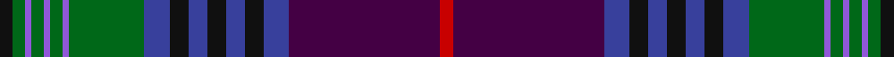

In pattern [KGBGBGBGBKBKBKBBR](/stripes/kgbgbgbgbkbkbkbbr/).

This was sourced from tartans-authority.  It is a [17 stripe tartan](/stripes/stripes17/).

Original link http://www.tartansauthority.com/tartan-ferret/display/10699/

## Thread count
K/4 G4 P2 G4 P2 G4 P2 G24 B8 K6 B6 K6 B6 K6 B8 DP48 R/4

## Palette
Each colour and the base-6 reference it is a variant of.

| Colour | Shade | Base |
|---|---|---|
| B | <code style="background-color:#38409C;">#38409C</code> `oklch(42.1% 0.148 274.4)` <small>#38409C</small> | B <code style="background-color:#2A418A;">#2A418A</code> |
| DP | <code style="background-color:#440044;">#440044</code> `oklch(27.1% 0.125 328.4)` <small>#440044</small> | B <code style="background-color:#2A418A;">#2A418A</code> |
| G | <code style="background-color:#006818;">#006818</code> `oklch(45.0% 0.142 145.0)` <small>#006818</small> | G <code style="background-color:#006100;">#006100</code> |
| K | <code style="background-color:#101010;">#101010</code> `oklch(17.3% 0.000 89.9)` <small>#101010</small> | K <code style="background-color:#000000;">#000000</code> |
| P | <code style="background-color:#9058D8;">#9058D8</code> `oklch(58.4% 0.190 300.8)` <small>#9058D8</small> | B <code style="background-color:#2A418A;">#2A418A</code> |
| R | <code style="background-color:#C80000;">#C80000</code> `oklch(52.3% 0.215 29.2)` <small>#C80000</small> | R <code style="background-color:#CC0000;">#CC0000</code> |

## Nearest tartans

The nearest existing variants by ΔTartan distance.

1. [Smithsonian](/setts/s20/db24ly1r2y2r2ly1k24y24w2db2w2y24k24ly1r2y2r2ly1db24y2~x2/) — ΔT 0.81
1. [Spirit of Bannockburn (Fashion)](/setts/s13/k2dp4m4dp3g20dp5k4dp3k7dp3k3db35w2~x2/) — ΔT 0.98
1. [Spirit of Bannockburn](/setts/s24/dp4m4dp3g20dp5k4dp3k7dp3k3db35w2db35k3dp3k7dp3k4dp5g20dp3m4dp4k2~x2/) — ΔT 1.06
1. [Smithsonian (Corporate)](/setts/s11/db2w2y24k24ly1r2y2r2ly1db24y2~x2/) — ΔT 1.13
1. [Pride of Scotland](/setts/s11/g9m2m2g3m18g2k2g1k19db33w2~x2/) — ΔT 1.19
1. [McGuirk (2013)](/setts/s12/dg4r1dg1r3dg16k12r1db27lb2db3lb1ly2~x2/) — ΔT 1.24
1. [Unidentified #7](/setts/s11/db2r2db2r2db20k24dg12ly1k2dg2t2~x2/) — ΔT 1.25
1. [Lang of Sherbrooke (Personal)](/setts/s11/g10ly2k2g2k13g2k2g1dp13db24w2~x2/) — ΔT 1.26
1. [Lang of Sherbrooke (Personal)](/setts/s11/g10ly2dp2g2dp13g2dp2g1k13db24w2~x2/) — ΔT 1.28
1. [Nicolson Green Hunting](/setts/s17/db12k1g1k1g1k1db9r2k18r2g9k1lo1k1lb1k1g12~x2/) — ΔT 1.29

## Neighbour map

Every grey dot is one of 14299 variants placed by the first two principal components of the ΔTartan feature space (44% of its variance). Red is this tartan; blue dots are its nearest — click one to open its page.

<svg viewBox="0 0 640 380" role="img" style="max-width:100%;height:auto;border:1px solid #e0e0e0;border-radius:4px;display:block" xmlns="http://www.w3.org/2000/svg"><image href="/nn/cloud.v1.png" width="640" height="380"/><a href="/setts/s20/db24ly1r2y2r2ly1k24y24w2db2w2y24k24ly1r2y2r2ly1db24y2~x2/"><circle cx="189.9" cy="86.2" r="4" fill="#3465a4"><title>Smithsonian</title></circle></a><a href="/setts/s13/k2dp4m4dp3g20dp5k4dp3k7dp3k3db35w2~x2/"><circle cx="193.1" cy="109.1" r="4" fill="#3465a4"><title>Spirit of Bannockburn (Fashion)</title></circle></a><a href="/setts/s24/dp4m4dp3g20dp5k4dp3k7dp3k3db35w2db35k3dp3k7dp3k4dp5g20dp3m4dp4k2~x2/"><circle cx="191.5" cy="90.4" r="4" fill="#3465a4"><title>Spirit of Bannockburn</title></circle></a><a href="/setts/s11/db2w2y24k24ly1r2y2r2ly1db24y2~x2/"><circle cx="207.6" cy="108.7" r="4" fill="#3465a4"><title>Smithsonian (Corporate)</title></circle></a><a href="/setts/s11/g9m2m2g3m18g2k2g1k19db33w2~x2/"><circle cx="212.7" cy="95.9" r="4" fill="#3465a4"><title>Pride of Scotland</title></circle></a><a href="/setts/s12/dg4r1dg1r3dg16k12r1db27lb2db3lb1ly2~x2/"><circle cx="257.3" cy="112.0" r="4" fill="#3465a4"><title>McGuirk (2013)</title></circle></a><a href="/setts/s11/db2r2db2r2db20k24dg12ly1k2dg2t2~x2/"><circle cx="232.6" cy="118.4" r="4" fill="#3465a4"><title>Unidentified #7</title></circle></a><a href="/setts/s11/g10ly2k2g2k13g2k2g1dp13db24w2~x2/"><circle cx="173.6" cy="113.0" r="4" fill="#3465a4"><title>Lang of Sherbrooke (Personal)</title></circle></a><a href="/setts/s11/g10ly2dp2g2dp13g2dp2g1k13db24w2~x2/"><circle cx="176.2" cy="112.5" r="4" fill="#3465a4"><title>Lang of Sherbrooke (Personal)</title></circle></a><a href="/setts/s17/db12k1g1k1g1k1db9r2k18r2g9k1lo1k1lb1k1g12~x2/"><circle cx="184.6" cy="107.6" r="4" fill="#3465a4"><title>Nicolson Green Hunting</title></circle></a><circle cx="198.9" cy="90.1" r="5" fill="#c00000"/></svg>

ID: /setts/s17/k2g2p1g2p1g2p1g12db4k3db3k3db3k3db4dp24r2~x2/
