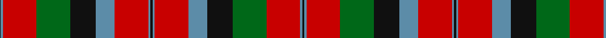

**Bands:** [KBRGKBRBKBRBKGRBK](/stripes/kbrgkbrbkbrbkgrbk/) · **Stripes:** [K T R G K T R T K T R T K G R T K](/stripes/stripes17/) K T R G K T R T K T R T K G R T K

This was sourced from logan-1831.  It is a [17 band tartan](/bands/bands17/).

Original link /posts/logans-scottish-gael/

## Provenance

James Logan recorded the **MacNaughton** sett in 1831, on page 406 of the *Table of Clan Tartans* in *The Scottish Gaël* — the earliest systematic published collection of clan setts. Logan gives the stripe widths in eighths of an inch, measured across the cloth and reflected about each end (a half-sett):

> ¼ black · ½ azure · 8 red · 8 green · 6 black · 4½ azure · 8 red · ½ azure · ½ black · ½ azure · 8 red · 4½ azure · 6 black · 8 green · 8 red · ½ azure · ½ black

In threads (at 8 to the eighth-inch) that is `K/2 A4 R64 G64 K48 A36 R64 A4 K4 A4 R64 A36 K48 G64 R64 A4 K/4`. Logan named his colours rather than dyeing to a standard, so the palette here is the Dictionary's modern reading of his names.

See [Logan's Scottish Gaël](/posts/logans-scottish-gael/) for the full table and method.

## Related setts

Later records of the **MacNaughton** name adjusted Logan's counts: [MacNaughton](/setts/s9/b2k2r27g27k12b12r27k2b2~b3c82af-g005020-k101010-rdc0000~x2/); [MacNaughton (Logan)](/setts/s7/b5r17g16k10b10r17b5~b080848-g002814-k101010-rdc0000~x2/); [MacNaughton (Logan) #2](/setts/s9/k2b2r26g25k13b13r26b2k2~b2c2c80-g285800-k101010-rfc3800~x2/); [MacNaughton Dress](/setts/s9/r2b2w26g25k14b13w26b2r2~b343494-g347800-k101010-rc80000-we0e0e0~x2/). Compare their thread counts with Logan's above.

## Thread count
K/2 B4 R64 G64 K48 B36 R64 B4 K4 B4 R64 B36 K48 G64 R64 B4 K/4

## Palette
Each colour and its ΔE from the base-6 reference it is a variant of.

| Colour | Shade | Base | ΔE (OKLab) |
|---|---|---|---|
| B | <code style="background-color:#5C8CA8;">#5C8CA8</code> `#5C8CA8` | B <code style="background-color:#2A418A;">#2A418A</code> | 0.23 |
| G | <code style="background-color:#006818;">#006818</code> `#006818` | G <code style="background-color:#006100;">#006100</code> | 0.02 |
| K | <code style="background-color:#101010;">#101010</code> `#101010` | K <code style="background-color:#000000;">#000000</code> | 0.17 |
| R | <code style="background-color:#C80000;">#C80000</code> `#C80000` | R <code style="background-color:#CC0000;">#CC0000</code> | 0.01 |

## Nearest tartans

The nearest existing variants by ΔTartan distance.

1. [Unnamed C18/19th - Antigonish (A)](/setts/s18/dt13r6dt2r6w1y26r2dt26y6r26y6dt26r2y26w1r6dt2r6~x2/) — ΔT 1.24
1. [Brown-Wells (Personal)](/setts/s16/r4dt1ly3dt1r20dt4g9r3g9dt4lb3dt1g7dt2r6ly2~x2/) — ΔT 1.28
1. [Shaw of Tordarroch Red (Dress)](/setts/s14/t5k1r30dp15r8g30r8dp2r8g30r8dp15r30k1~x2/) — ΔT 1.30
1. [MacKinnon](/setts/s27/w4r6g4db4r12g32r4db8g4r32g16w4r8w4r8w4g16r32g4db8r4g32r12db4g4r6w1~x2/) — ΔT 1.39
1. [Unidentified Scarlett #10](/setts/s16/r3ly1lb9r9db9r18lb2r2g28r2lb2r18db9r9lb9ly1~x2/) — ΔT 1.44
1. [Fiddes](/setts/s18/g12r11p12k1p1k1r32g8p8g8p8r32k1p1k1p12r11g12~x2/) — ΔT 1.45
1. [Oriel #1](/setts/s16/r12db2r3g20k4g20r30k2r1k2r30g20k4g20r3db2~x2/) — ΔT 1.47
1. [Aboyne](/setts/s13/lo12k1lo1r28lo4k8lr1do11k8lo32r11lo6r4~x2/) — ΔT 1.49
1. [Leach Family Tartan Tartan Number: 2356. Earliest known date: pre 1997 Originally the name given to physicians and has been in Scotland for centuries. Can be worn by all people with all spellings of the name Leach. See products available Copyright © Blair Urquhart, Comrie, 2015](/setts/s16/r24lb1k3lb1g14r8k3dp3lb2dp3k3r8g14lb1k3lb1~x4/) — ΔT 1.51
1. [Army Cadet Force (Military)](/setts/s11/k9r1g1k3g20r5k3r20k5r3ly2~x2/) — ΔT 1.52

## Neighbour map

Every grey dot is one of 14313 variants placed by the first two principal components of the ΔTartan feature space (44% of its variance). Red is this tartan; blue dots are its nearest — click one to open its page.

<svg viewBox="0 0 640 380" role="img" style="max-width:100%;height:auto;border:1px solid #e0e0e0;border-radius:4px;display:block" xmlns="http://www.w3.org/2000/svg"><image href="/nn/cloud.v1.png" width="640" height="380"/><a href="/setts/s18/dt13r6dt2r6w1y26r2dt26y6r26y6dt26r2y26w1r6dt2r6~x2/"><circle cx="255.7" cy="127.3" r="4" fill="#3465a4"><title>Unnamed C18/19th - Antigonish (A)</title></circle></a><a href="/setts/s16/r4dt1ly3dt1r20dt4g9r3g9dt4lb3dt1g7dt2r6ly2~x2/"><circle cx="219.6" cy="112.7" r="4" fill="#3465a4"><title>Brown-Wells (Personal)</title></circle></a><a href="/setts/s14/t5k1r30dp15r8g30r8dp2r8g30r8dp15r30k1~x2/"><circle cx="283.8" cy="118.7" r="4" fill="#3465a4"><title>Shaw of Tordarroch Red (Dress)</title></circle></a><a href="/setts/s27/w4r6g4db4r12g32r4db8g4r32g16w4r8w4r8w4g16r32g4db8r4g32r12db4g4r6w1~x2/"><circle cx="278.3" cy="89.2" r="4" fill="#3465a4"><title>MacKinnon</title></circle></a><a href="/setts/s16/r3ly1lb9r9db9r18lb2r2g28r2lb2r18db9r9lb9ly1~x2/"><circle cx="242.6" cy="95.4" r="4" fill="#3465a4"><title>Unidentified Scarlett #10</title></circle></a><a href="/setts/s18/g12r11p12k1p1k1r32g8p8g8p8r32k1p1k1p12r11g12~x2/"><circle cx="317.6" cy="106.0" r="4" fill="#3465a4"><title>Fiddes</title></circle></a><a href="/setts/s16/r12db2r3g20k4g20r30k2r1k2r30g20k4g20r3db2~x2/"><circle cx="318.2" cy="124.4" r="4" fill="#3465a4"><title>Oriel #1</title></circle></a><a href="/setts/s13/lo12k1lo1r28lo4k8lr1do11k8lo32r11lo6r4~x2/"><circle cx="246.9" cy="93.2" r="4" fill="#3465a4"><title>Aboyne</title></circle></a><a href="/setts/s16/r24lb1k3lb1g14r8k3dp3lb2dp3k3r8g14lb1k3lb1~x4/"><circle cx="253.7" cy="106.3" r="4" fill="#3465a4"><title>Leach Family Tartan Tartan Number: 2356. Earliest known date: pre 1997 Originally the name given to physicians and has been in Scotland for centuries. Can be worn by all people with all spellings of the name Leach. See products available Copyright © Blair Urquhart, Comrie, 2015</title></circle></a><a href="/setts/s11/k9r1g1k3g20r5k3r20k5r3ly2~x2/"><circle cx="246.4" cy="137.1" r="4" fill="#3465a4"><title>Army Cadet Force (Military)</title></circle></a><circle cx="246.0" cy="119.5" r="5" fill="#c00000"/></svg>

ID: /setts/s17/k2t2r32g32k24t18r32t2k2t2r32t18k24g32r32t2k1~x2/
