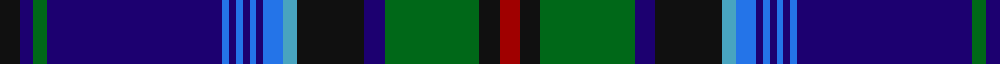

This page is one **sett** — a single exact thread-count. It belongs to the [tartan](/tartans/k3db2g2db26ba1db1ba1db1ba1db1ba3b2k10db3g14k3dr3/)
(the same proportion at any scale), whose colour order is pattern [KBGBBBBBBBBYKBGKR](/stripes/kbgbbbbbbbbykbgkr/).

Sourced from register-of-tartans.  It is a [17 stripe tartan](/stripes/stripes17/).

Original link https://www.tartanregister.gov.uk/tartanDetails.aspx?ref=3897

2 attestations — the source records this cloth was collapsed from (oldest owns this page)

<ul>
<li>01/01/1963 — St. Lawrence (register-of-tartans, <a href="https://www.tartanregister.gov.uk/tartanDetails.aspx?ref=3897">record</a>)</li>
<li>1963 — St. Lawrence (District) (tartans-authority, <a href="http://www.tartansauthority.com/tartan-ferret/display/1030/">record</a>)</li>
</ul>

## Register references

External register numbers recorded for this tartan.

- Scottish Register of Tartans: [3897](https://www.tartanregister.gov.uk/tartanDetails.aspx?ref=3897)
- Scottish Tartans Authority (ITI): 1030
- Scottish Tartans World Register: 1030

## Thread count
K/6 DB4 G4 DB52 Ba2 DB2 Ba2 DB2 Ba2 DB2 Ba6 B4 K20 DB6 G28 K6 DR/6

## Palette
Each colour and the base-6 reference it is a variant of.

| Colour | Shade | Base |
|---|---|---|
| B | <code style="background-color:#48A4C0;">#48A4C0</code> `oklch(67.5% 0.096 221.0)` <small>#48A4C0</small> | Y <code style="background-color:#F2BF00;">#F2BF00</code> |
| Ba | <code style="background-color:#2474E8;">#2474E8</code> `oklch(57.8% 0.192 258.7)` <small>#2474E8</small> | B <code style="background-color:#2A418A;">#2A418A</code> |
| DB | <code style="background-color:#1C0070;">#1C0070</code> `oklch(26.3% 0.162 277.1)` <small>#1C0070</small> | B <code style="background-color:#2A418A;">#2A418A</code> |
| DR | <code style="background-color:#A00000;">#A00000</code> `oklch(44.3% 0.182 29.2)` <small>#A00000</small> | R <code style="background-color:#CC0000;">#CC0000</code> |
| G | <code style="background-color:#006818;">#006818</code> `oklch(45.0% 0.142 145.0)` <small>#006818</small> | G <code style="background-color:#006100;">#006100</code> |
| K | <code style="background-color:#101010;">#101010</code> `oklch(17.3% 0.000 89.9)` <small>#101010</small> | K <code style="background-color:#000000;">#000000</code> |

## Nearest tartans

The nearest existing variants by ΔTartan distance, with this tartan at the top so the swatches line up against it.

ΔTartan

Tartan

Sett

—

<a href="/ttd/edit/#slug=k3db2g2db26b1db1b1db1b1db1b3lg2k10db3g14k3r3~x2">St. Lawrence</a> <a class="nn-out" href="/setts/s17/k3db2g2db26b1db1b1db1b1db1b3lg2k10db3g14k3r3~x2/" title="open its dictionary page">↗</a>

0.63

<a href="/ttd/edit/#slug=k3db2g2db26t1db1t1db1t1db1t3t2k10db3g14k3r3~x2">St Lawrence District Tartan Tartan Number: 1030. Earliest known date: pre 1963 Presented to the STS collection by Mr A Yule in 1963. designed by Mrs. Helene Cobb of Clayton and is the registered trademark of the Thousand Islands Museum in Clayton, New York State - www.timuseum.org Woven by Peter MacArthur of Biggar, Scotland. The greens are for the cedars along the shore, the blues are for the St Lawrence River, and the red is the sunset over the Islands. John Fitzpatrick in his review of Canadian tartans in July 2008, pointed out that there were two slightly different thread counts given in the CIDD. See products available Copyright © Blair Urquhart, Comrie, 2015</a> <a class="nn-out" href="/setts/s17/k3db2g2db26t1db1t1db1t1db1t3t2k10db3g14k3r3~x2/" title="open its dictionary page">↗</a>

0.87

<a href="/ttd/edit/#slug=db64r3k3lb2db3r28dg26db3r3k3ly2db3dg16~x2">Wcwm 1571</a> <a class="nn-out" href="/setts/s13/db64r3k3lb2db3r28dg26db3r3k3ly2db3dg16~x2/" title="open its dictionary page">↗</a>

1.17

<a href="/ttd/edit/#slug=r2k2db3lo1db20k1g18k1r2db2k1db2k1db2k2g2k2r2~x2">Craig (Personal)</a> <a class="nn-out" href="/setts/s18/r2k2db3lo1db20k1g18k1r2db2k1db2k1db2k2g2k2r2~x2/" title="open its dictionary page">↗</a>

1.24

<a href="/ttd/edit/#slug=k3db2g2db26b1db1b1db1b1db1b3t2k10db3g14k3r3~x2">St Lawrence</a> <a class="nn-out" href="/setts/s17/k3db2g2db26b1db1b1db1b1db1b3t2k10db3g14k3r3~x2/" title="open its dictionary page">↗</a>

1.28

<a href="/ttd/edit/#slug=dp4db5dp3db50k15g3k5g32w2g3w2g32k5g5k15db50dp3k5dp3">Spirit of Morningside</a> <a class="nn-out" href="/setts/s19/dp4db5dp3db50k15g3k5g32w2g3w2g32k5g5k15db50dp3k5dp3/" title="open its dictionary page">↗</a>

1.33

<a href="/ttd/edit/#slug=db5r2ly7r2db42dg28k5db10k15dg5w3r3">Héritage Séquane</a> <a class="nn-out" href="/setts/s12/db5r2ly7r2db42dg28k5db10k15dg5w3r3/" title="open its dictionary page">↗</a>

1.35

<a href="/setts/s18/db6w1db40m1k12dg12m6dg2dp2dg4~x2/">Scotland the Brave</a>

1.36

<a href="/ttd/edit/#slug=ly3dt2k1dt24k2dt2k2dt2k2dg8m2dg8k1w2~x2">Alexander-Johnstone (Personal)</a> <a class="nn-out" href="/setts/s14/ly3dt2k1dt24k2dt2k2dt2k2dg8m2dg8k1w2~x2/" title="open its dictionary page">↗</a>

1.36

<a href="/ttd/edit/#slug=db22g2g2g2g2g2db6k3g14db1g4db1g2g2g2g2g1db1k1r2~x2">Peter Pan</a> <a class="nn-out" href="/setts/s20/db22g2g2g2g2g2db6k3g14db1g4db1g2g2g2g2g1db1k1r2~x2/" title="open its dictionary page">↗</a>

1.37

<a href="/ttd/edit/#slug=db54db14ly3db3w3db3g9dr7db2dr9w2~x2">Holyrood Corporate Tartan Tartan Number: 98. Earliest known date: 1980 Holyrood is the Scottish equivalent of Buckingham Palace, the Queens official residence in Scotland. She is guarded by 'The Royal Company of Archers', a non military force provided by the chiefs of the clans. A sample of the Holyrood tartan was presented to the Scottish Tartans Society by Lochcarron Weavers in 1980. See products available Copyright © Blair Urquhart, Comrie, 2015</a> <a class="nn-out" href="/setts/s11/db54db14ly3db3w3db3g9dr7db2dr9w2~x2/" title="open its dictionary page">↗</a>

## Neighbour map

Every grey dot is one of 14299 variants placed by the first two principal components of the ΔTartan feature space (44% of its variance). Red is this tartan; blue dots are its nearest — click one to open its page.

<svg viewBox="0 0 640 380" role="img" style="max-width:100%;height:auto;border:1px solid #e0e0e0;border-radius:4px;display:block" xmlns="http://www.w3.org/2000/svg"><image href="/nn/cloud.v1.png" width="640" height="380"/><a href="/setts/s17/k3db2g2db26t1db1t1db1t1db1t3t2k10db3g14k3r3~x2/"><circle cx="253.2" cy="85.7" r="4" fill="#3465a4"><title>St Lawrence District Tartan Tartan Number: 1030. Earliest known date: pre 1963 Presented to the STS collection by Mr A Yule in 1963. designed by Mrs. Helene Cobb of Clayton and is the registered trademark of the Thousand Islands Museum in Clayton, New York State - www.timuseum.org Woven by Peter MacArthur of Biggar, Scotland. The greens are for the cedars along the shore, the blues are for the St Lawrence River, and the red is the sunset over the Islands. John Fitzpatrick in his review of Canadian tartans in July 2008, pointed out that there were two slightly different thread counts given in the CIDD. See products available Copyright © Blair Urquhart, Comrie, 2015</title></circle></a><a href="/setts/s13/db64r3k3lb2db3r28dg26db3r3k3ly2db3dg16~x2/"><circle cx="272.9" cy="81.6" r="4" fill="#3465a4"><title>Wcwm 1571</title></circle></a><a href="/setts/s18/r2k2db3lo1db20k1g18k1r2db2k1db2k1db2k2g2k2r2~x2/"><circle cx="269.0" cy="103.3" r="4" fill="#3465a4"><title>Craig (Personal)</title></circle></a><a href="/setts/s17/k3db2g2db26b1db1b1db1b1db1b3t2k10db3g14k3r3~x2/"><circle cx="215.5" cy="66.3" r="4" fill="#3465a4"><title>St Lawrence</title></circle></a><a href="/setts/s19/dp4db5dp3db50k15g3k5g32w2g3w2g32k5g5k15db50dp3k5dp3/"><circle cx="268.9" cy="110.2" r="4" fill="#3465a4"><title>Spirit of Morningside</title></circle></a><a href="/setts/s12/db5r2ly7r2db42dg28k5db10k15dg5w3r3/"><circle cx="230.2" cy="113.2" r="4" fill="#3465a4"><title>Héritage Séquane</title></circle></a><a href="/setts/s18/db6w1db40m1k12dg12m6dg2dp2dg4~x2/"><circle cx="322.3" cy="77.9" r="4" fill="#3465a4"><title>Scotland the Brave</title></circle></a><a href="/setts/s14/ly3dt2k1dt24k2dt2k2dt2k2dg8m2dg8k1w2~x2/"><circle cx="262.0" cy="94.1" r="4" fill="#3465a4"><title>Alexander-Johnstone (Personal)</title></circle></a><a href="/setts/s20/db22g2g2g2g2g2db6k3g14db1g4db1g2g2g2g2g1db1k1r2~x2/"><circle cx="216.9" cy="78.4" r="4" fill="#3465a4"><title>Peter Pan</title></circle></a><a href="/setts/s11/db54db14ly3db3w3db3g9dr7db2dr9w2~x2/"><circle cx="296.4" cy="100.8" r="4" fill="#3465a4"><title>Holyrood Corporate Tartan Tartan Number: 98. Earliest known date: 1980 Holyrood is the Scottish equivalent of Buckingham Palace, the Queens official residence in Scotland. She is guarded by 'The Royal Company of Archers', a non military force provided by the chiefs of the clans. A sample of the Holyrood tartan was presented to the Scottish Tartans Society by Lochcarron Weavers in 1980. See products available Copyright © Blair Urquhart, Comrie, 2015</title></circle></a><circle cx="244.4" cy="83.5" r="5" fill="#c00000"/></svg>

ID: /setts/s17/k3db2g2db26b1db1b1db1b1db1b3lg2k10db3g14k3r3~x2/
