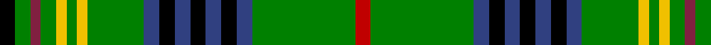

In pattern [KGRGYGYGBKBKBKBGR](/patterns/kgrgygygbkbkbkbgr/).

This was sourced from weddslist.  It is a [17 stripes tartan](/stripes/stripes17/).

Original link http://www.weddslist.com/cgi-bin/tartans/pg.pl?source=sts

## Thread count
K/6 G6 DR4 G6 Y4 G4 Y4 G22 B6 K6 B6 K6 B6 K6 B6 G40 R/6

## Palette
Each colour and its ΔE from the base-6 reference it is a variant of.

| Colour | Shade | Base | ΔE (OKLab) |
|---|---|---|---|
| B | <code style="background-color:#304080;">#304080</code> `#304080` | B <code style="background-color:#2A418A;">#2A418A</code> | 0.02 |
| DR | <code style="background-color:#802040;">#802040</code> `#802040` | R <code style="background-color:#CC0000;">#CC0000</code> | 0.17 |
| G | <code style="background-color:#008000;">#008000</code> `#008000` | G <code style="background-color:#006100;">#006100</code> | 0.10 |
| K | <code style="background-color:#000000;">#000000</code> `#000000` | K <code style="background-color:#000000;">#000000</code> | 0.00 |
| R | <code style="background-color:#C00000;">#C00000</code> `#C00000` | R <code style="background-color:#CC0000;">#CC0000</code> | 0.03 |
| Y | <code style="background-color:#F0C000;">#F0C000</code> `#F0C000` | Y <code style="background-color:#F2BF00;">#F2BF00</code> | 0.00 |

## Nearest tartans

The nearest existing variants by ΔTartan distance.

1. [Lorne - Marquis of (Personal)](/setts/s18/b3k3g2k14g2k2g20r2g2w2g2y2g20k2g2k14g2k3~b5f749c-g649848-k101010-rc80000-we0e0e0-yd09800~x2/) — ΔT 0.92
1. [Cockburn - 1830 (Clan)](/setts/s16/g10k1g1k1g1k1b4k1w1k1b1y1k1g4k1r1~b2c2c80-g006818-k101010-rc80000-wfcfcfc-ye8c000~x4/) — ΔT 0.99
1. [Lorne, Marquis of](/setts/s18/b3k3g2k14g2k2g20r2g2w2g2y2g20k2g2k14g2k3~b304080-g30a010-k000000-rc00000-we0e0e0-yf0c000~x2/) — ΔT 1.13
1. [Myron Family Tartan Tartan Number: 1105. Earliest known date: pre 2003 Designed for the town celebrations of 1958-59 by G. Lawson of the Musselburgh Co-operative Society. See products available Copyright © Blair Urquhart, Comrie, 2015](/setts/s17/k3g3r2g3y2g2y2g11b3k3b3k3b3k3b3g20ra3~b2c2c80-g006818-k101010-r901c38-rac80000-ye8c000~x2/) — ΔT 1.14
1. [Campbell, Marquis of Lorne](/setts/s18/b6k6g4k22g3k3g32y3g3w3g3r3g32k3g3k22g4k6~b800080-g008000-k000000-rc00000-we0e0e0-yf0c000/) — ΔT 1.18
1. [Duncan of Sketraw](/setts/s17/b2k1g14k1w2k1b5r1b5k1y2k1g14k2g2k6r2~b1474b4-g006818-k101010-rc80000-we0e0e0-ye8c000~x2/) — ΔT 1.22
1. [Campbell, Marquis of Lorne](/setts/s18/b6k6g4k22g3k3g32y3g3w3g3r3g32k3g3k22g4k6~b780078-g006818-k101010-rc80000-wfcfcfc-ye8c000/) — ΔT 1.23
1. [Wilson's No.033 #2](/setts/s16/g17b3r3b3k19w2g17r4g17w2k19b3r3b3g17ba8~b5c8ca8-ba202060-g006818-k101010-rc80000-wfcfcfc~x2/) — ΔT 1.29
1. [Stewart (King George VI)](/setts/s14/r2g11g2b2k3y1k1ya1k1g4r2k1r2ya1~b2474e8-g006818-k101010-r880000-ybc8c00-yab8b8b8~x4/) — ΔT 1.32
1. [Steel (Personal)](/setts/s11/b6g48k4y4k4w4g20r10k4r6w5~b003c64-g006818-k101010-rc80000-wf8f8f8-ye8c000/) — ΔT 1.36

## Neighbour map

Every grey dot is one of 15726 variants placed by the first two principal components of the ΔTartan feature space (44% of its variance). Red is this tartan; blue dots are its nearest — click one to open its page.

<svg viewBox="0 0 640 380" role="img" style="max-width:100%;height:auto;border:1px solid #e0e0e0;border-radius:4px;display:block" xmlns="http://www.w3.org/2000/svg"><image href="/nn/cloud.v1.png" width="640" height="380"/><a href="/setts/s18/b3k3g2k14g2k2g20r2g2w2g2y2g20k2g2k14g2k3~b5f749c-g649848-k101010-rc80000-we0e0e0-yd09800~x2/"><circle cx="231.6" cy="107.4" r="4" fill="#3465a4"><title>Lorne - Marquis of (Personal)</title></circle></a><a href="/setts/s16/g10k1g1k1g1k1b4k1w1k1b1y1k1g4k1r1~b2c2c80-g006818-k101010-rc80000-wfcfcfc-ye8c000~x4/"><circle cx="219.9" cy="117.5" r="4" fill="#3465a4"><title>Cockburn - 1830 (Clan)</title></circle></a><a href="/setts/s18/b3k3g2k14g2k2g20r2g2w2g2y2g20k2g2k14g2k3~b304080-g30a010-k000000-rc00000-we0e0e0-yf0c000~x2/"><circle cx="209.5" cy="106.8" r="4" fill="#3465a4"><title>Lorne, Marquis of</title></circle></a><a href="/setts/s17/k3g3r2g3y2g2y2g11b3k3b3k3b3k3b3g20ra3~b2c2c80-g006818-k101010-r901c38-rac80000-ye8c000~x2/"><circle cx="232.8" cy="128.3" r="4" fill="#3465a4"><title>Myron Family Tartan Tartan Number: 1105. Earliest known date: pre 2003 Designed for the town celebrations of 1958-59 by G. Lawson of the Musselburgh Co-operative Society. See products available Copyright © Blair Urquhart, Comrie, 2015</title></circle></a><a href="/setts/s18/b6k6g4k22g3k3g32y3g3w3g3r3g32k3g3k22g4k6~b800080-g008000-k000000-rc00000-we0e0e0-yf0c000/"><circle cx="217.8" cy="110.9" r="4" fill="#3465a4"><title>Campbell, Marquis of Lorne</title></circle></a><a href="/setts/s17/b2k1g14k1w2k1b5r1b5k1y2k1g14k2g2k6r2~b1474b4-g006818-k101010-rc80000-we0e0e0-ye8c000~x2/"><circle cx="207.0" cy="105.9" r="4" fill="#3465a4"><title>Duncan of Sketraw</title></circle></a><a href="/setts/s18/b6k6g4k22g3k3g32y3g3w3g3r3g32k3g3k22g4k6~b780078-g006818-k101010-rc80000-wfcfcfc-ye8c000/"><circle cx="253.8" cy="122.0" r="4" fill="#3465a4"><title>Campbell, Marquis of Lorne</title></circle></a><a href="/setts/s16/g17b3r3b3k19w2g17r4g17w2k19b3r3b3g17ba8~b5c8ca8-ba202060-g006818-k101010-rc80000-wfcfcfc~x2/"><circle cx="177.2" cy="145.7" r="4" fill="#3465a4"><title>Wilson's No.033 #2</title></circle></a><a href="/setts/s14/r2g11g2b2k3y1k1ya1k1g4r2k1r2ya1~b2474e8-g006818-k101010-r880000-ybc8c00-yab8b8b8~x4/"><circle cx="214.2" cy="128.4" r="4" fill="#3465a4"><title>Stewart (King George VI)</title></circle></a><a href="/setts/s11/b6g48k4y4k4w4g20r10k4r6w5~b003c64-g006818-k101010-rc80000-wf8f8f8-ye8c000/"><circle cx="267.7" cy="118.6" r="4" fill="#3465a4"><title>Steel (Personal)</title></circle></a><circle cx="201.1" cy="116.9" r="5" fill="#c00000"/></svg>

ID: /setts/s17/k3g3r2g3y2g2y2g11b3k3b3k3b3k3b3g20ra3~b304080-g008000-k000000-r802040-rac00000-yf0c000~x2/
