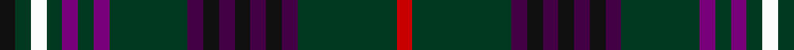

In pattern [KGWGBGBGBKBKBKBGR](/patterns/kgwgbgbgbkbkbkbgr/).

This was sourced from register-of-tartans.  It is a [17 stripes tartan](/stripes/stripes17/).

Original link https://www.tartanregister.gov.uk/tartanDetails.aspx?ref=2447

## Thread count
K/6 DG6 W6 DG6 P6 DG6 P6 DG30 DP6 K6 DP6 K6 DP6 K6 DP6 DG38 R/6

## Palette
Each colour and its ΔE from the base-6 reference it is a variant of.

| Colour | Shade | Base | ΔE (OKLab) |
|---|---|---|---|
| DG | <code style="background-color:#003820;">#003820</code> `#003820` | G <code style="background-color:#006100;">#006100</code> | 0.15 |
| DP | <code style="background-color:#440044;">#440044</code> `#440044` | B <code style="background-color:#2A418A;">#2A418A</code> | 0.18 |
| K | <code style="background-color:#101010;">#101010</code> `#101010` | K <code style="background-color:#000000;">#000000</code> | 0.17 |
| P | <code style="background-color:#780078;">#780078</code> `#780078` | B <code style="background-color:#2A418A;">#2A418A</code> | 0.17 |
| R | <code style="background-color:#C80000;">#C80000</code> `#C80000` | R <code style="background-color:#CC0000;">#CC0000</code> | 0.01 |
| W | <code style="background-color:#FCFCFC;">#FCFCFC</code> `#FCFCFC` | W <code style="background-color:#F7F7F7;">#F7F7F7</code> | 0.01 |

## Nearest tartans

The nearest existing variants by ΔTartan distance.

1. [van der Watt Personal)](/setts/s12/r1b6k1b1k8g1k8ba2g1k1g6y1~b202060-ba440044-g006818-k101010-rc80000-yd09800~x4/) — ΔT 1.08
1. [Survivor (Fashion)](/setts/s13/k1r1k8g1k1g8y1b8k1b1k8w1k1~b384858-g006818-k101010-rc80000-we0e0e0-ye8c000~x3/) — ΔT 1.15
1. [Clifford](/setts/s13/b10k3g3k8ba9k3ba10ga3ba28g3k3w3k3~b14283c-ba4c0000-g006818-ga0098a0-k101010-wfcfcfc~x2/) — ΔT 1.31
1. [Dow-Aerlift (Name)](/setts/s22/b14g2b2g14k2g14k2g2k9r2k8y2k9g2k2g14k2g14b2g2b14w2~b9058d8-g003820-k101010-rc80000-wfcfcfc-ybc8c00~x2/) — ΔT 1.33
1. [Bhoyrub Clan/Family Tartan Tartan Number: 6953. Earliest known date: 2006 The tartan first appeared at the wedding of Iggy Bhoyrub in Aug 2006. Based on the colours of the two nations flags, Scotland and Mauritius. Robert Farquhar was first governor of Mauritius. See products available Copyright © Blair Urquhart, Comrie, 2015](/setts/s12/b20g3y3b3r7g6b3k12b3k3b24w3~b003c64-g006818-k101010-rc80000-we0e0e0-ye8c000~x2/) — ΔT 1.41
1. [Sturm (2016)](/setts/s11/k12g3y2k2g3k18ga4k2b18g2ba2~b440044-ba00008c-g5c6428-ga604000-k101010-yd09800~x2/) — ΔT 1.50
1. [Unidentified #32](/setts/s12/g8k2y1k1g8k8b8k2w1k1b1k8~b5a008c-g005020-k101010-we0e0e0-ye8c000~x2/) — ΔT 1.56
1. [Hynett, William (Personal)](/setts/s13/r1b14k10b10k1b2k1b10k10ra8b2rb2w1~b003c64-k101010-re87878-raa00000-rbff0000-wffffff~x2/) — ΔT 1.59
1. [Scottish Borders Tourist Board](/setts/s16/b24g4b3g4b24g6w3g4r3g8y3g8r3g4w3g6~b202060-g5c6428-rc80000-we8ccb8-ybc8c00~x2/) — ΔT 1.59
1. [Scottish Tartans Authority](/setts/s11/k16ka2b2ka4g16r2k15ka6b2k3b4~b5c8ca8-g285800-k101010-ka00002c-rc80000~x2/) — ΔT 1.60

## Neighbour map

Every grey dot is one of 15726 variants placed by the first two principal components of the ΔTartan feature space (44% of its variance). Red is this tartan; blue dots are its nearest — click one to open its page.

<svg viewBox="0 0 640 380" role="img" style="max-width:100%;height:auto;border:1px solid #e0e0e0;border-radius:4px;display:block" xmlns="http://www.w3.org/2000/svg"><image href="/nn/cloud.v1.png" width="640" height="380"/><a href="/setts/s12/r1b6k1b1k8g1k8ba2g1k1g6y1~b202060-ba440044-g006818-k101010-rc80000-yd09800~x4/"><circle cx="223.4" cy="171.3" r="4" fill="#3465a4"><title>van der Watt Personal)</title></circle></a><a href="/setts/s13/k1r1k8g1k1g8y1b8k1b1k8w1k1~b384858-g006818-k101010-rc80000-we0e0e0-ye8c000~x3/"><circle cx="211.6" cy="151.3" r="4" fill="#3465a4"><title>Survivor (Fashion)</title></circle></a><a href="/setts/s13/b10k3g3k8ba9k3ba10ga3ba28g3k3w3k3~b14283c-ba4c0000-g006818-ga0098a0-k101010-wfcfcfc~x2/"><circle cx="260.8" cy="153.5" r="4" fill="#3465a4"><title>Clifford</title></circle></a><a href="/setts/s22/b14g2b2g14k2g14k2g2k9r2k8y2k9g2k2g14k2g14b2g2b14w2~b9058d8-g003820-k101010-rc80000-wfcfcfc-ybc8c00~x2/"><circle cx="172.1" cy="140.6" r="4" fill="#3465a4"><title>Dow-Aerlift (Name)</title></circle></a><a href="/setts/s12/b20g3y3b3r7g6b3k12b3k3b24w3~b003c64-g006818-k101010-rc80000-we0e0e0-ye8c000~x2/"><circle cx="258.0" cy="161.5" r="4" fill="#3465a4"><title>Bhoyrub Clan/Family Tartan Tartan Number: 6953. Earliest known date: 2006 The tartan first appeared at the wedding of Iggy Bhoyrub in Aug 2006. Based on the colours of the two nations flags, Scotland and Mauritius. Robert Farquhar was first governor of Mauritius. See products available Copyright © Blair Urquhart, Comrie, 2015</title></circle></a><a href="/setts/s11/k12g3y2k2g3k18ga4k2b18g2ba2~b440044-ba00008c-g5c6428-ga604000-k101010-yd09800~x2/"><circle cx="266.1" cy="169.1" r="4" fill="#3465a4"><title>Sturm (2016)</title></circle></a><a href="/setts/s12/g8k2y1k1g8k8b8k2w1k1b1k8~b5a008c-g005020-k101010-we0e0e0-ye8c000~x2/"><circle cx="211.3" cy="188.9" r="4" fill="#3465a4"><title>Unidentified #32</title></circle></a><a href="/setts/s13/r1b14k10b10k1b2k1b10k10ra8b2rb2w1~b003c64-k101010-re87878-raa00000-rbff0000-wffffff~x2/"><circle cx="268.5" cy="153.3" r="4" fill="#3465a4"><title>Hynett, William (Personal)</title></circle></a><a href="/setts/s16/b24g4b3g4b24g6w3g4r3g8y3g8r3g4w3g6~b202060-g5c6428-rc80000-we8ccb8-ybc8c00~x2/"><circle cx="230.9" cy="156.4" r="4" fill="#3465a4"><title>Scottish Borders Tourist Board</title></circle></a><a href="/setts/s11/k16ka2b2ka4g16r2k15ka6b2k3b4~b5c8ca8-g285800-k101010-ka00002c-rc80000~x2/"><circle cx="216.4" cy="190.4" r="4" fill="#3465a4"><title>Scottish Tartans Authority</title></circle></a><circle cx="233.8" cy="156.0" r="5" fill="#c00000"/></svg>

ID: /setts/s17/k3g3w3g3b3g3b3g15ba3k3ba3k3ba3k3ba3g19r3~b780078-ba440044-g003820-k101010-rc80000-wfcfcfc~x2/
