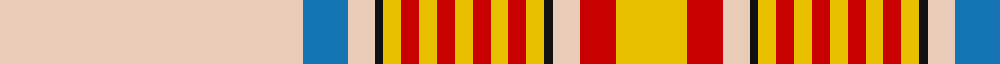

**Bands:** [WBWKYRYRYRYRYKWRY](/stripes/wbwkyryryryrykwry/) · **Stripes:** [LB B LB K LY R LY R LY R LY R LY K LB R LY](/stripes/stripes17/) LB B LB K LY R LY R LY R LY R LY K LB R LY

This was sourced from register-of-tartans.  It is a [17 band tartan](/bands/bands17/).

Original link https://www.tartanregister.gov.uk/tartanDetails.aspx?ref=1130

## Attestations

This cloth appears in 2 source records; the oldest owns this page.

- 01/01/1997 — Espana (register-of-tartans, [record](https://www.tartanregister.gov.uk/tartanDetails.aspx?ref=1130))
- 1997 — Espana (District) (tartans-authority, [record](http://www.tartansauthority.com/tartan-ferret/display/4824/))

## Register references

External register numbers recorded for this tartan.

- Scottish Register of Tartans: [1130](https://www.tartanregister.gov.uk/tartanDetails.aspx?ref=1130)
- Scottish Tartans Authority (ITI): 4824

## Thread count
LR/68 B10 LR6 K2 Y4 R4 Y4 R4 Y4 R4 Y4 R4 Y4 K2 LR6 R8 Y/16

## Palette
Each colour and its ΔE from the base-6 reference it is a variant of.

| Colour | Shade | Base | ΔE (OKLab) |
|---|---|---|---|
| B | <code style="background-color:#1474B4;">#1474B4</code> `#1474B4` | B <code style="background-color:#2A418A;">#2A418A</code> | 0.15 |
| K | <code style="background-color:#101010;">#101010</code> `#101010` | K <code style="background-color:#000000;">#000000</code> | 0.17 |
| LR | <code style="background-color:#E8CCB8;">#E8CCB8</code> `#E8CCB8` | W <code style="background-color:#F7F7F7;">#F7F7F7</code> | 0.12 |
| R | <code style="background-color:#C80000;">#C80000</code> `#C80000` | R <code style="background-color:#CC0000;">#CC0000</code> | 0.01 |
| Y | <code style="background-color:#E8C000;">#E8C000</code> `#E8C000` | Y <code style="background-color:#F2BF00;">#F2BF00</code> | 0.02 |

## Nearest tartans

The nearest existing variants by ΔTartan distance.

1. [Snowy Owl (Fashion)](/setts/s14/w40o1w6o3lo1o7lo3n1lo8n3k1n9k2w8~x2/) — ΔT 1.63
1. [Canna](/setts/s11/w32r9lo1r2w1r2o7o4r1o2w1~x4/) — ΔT 1.70
1. [Grant of Auchnarrow](/setts/s13/w6r2w38g8db6w2db2w2lo14r7g2r3w2~x2/) — ΔT 1.73
1. [Grant of Acharrow](/setts/s13/w6r2w38g8db6w2db2w2o14r7g2r3w2~x2/) — ΔT 1.78
1. [Australian, dress](/setts/s9/w50o4lo2k2lo2o4lo10o15t2~x2/) — ΔT 1.79
1. [Bell's Whisky](/setts/s9/r3w5dy16lo2dy1lo40w6o3r2~x4/) — ΔT 1.88
1. [Ben Cleuch (Fashion)](/setts/s11/o68w3o3w8o3w3w24dy16r3dy20w3~x2/) — ΔT 1.89
1. [Morgan Jocelyn Osmélian Peregrine (Personal)](/setts/s13/g40lo2r3w2g4lo1r18w1g2lo1n4w1lo3~x2/) — ΔT 1.94
1. [Unidentified #54](/setts/s12/lb24r2lb3dy1ly1dy1lb1dy6o6b1o2lb1~x4/) — ΔT 1.96
1. [Seller, Sillar](/setts/s12/w63k4t9ly2t4ly2t4o11r8t2r4w5~x2/) — ΔT 1.97

## Neighbour map

Every grey dot is one of 14313 variants placed by the first two principal components of the ΔTartan feature space (44% of its variance). Red is this tartan; blue dots are its nearest — click one to open its page.

<svg viewBox="0 0 640 380" role="img" style="max-width:100%;height:auto;border:1px solid #e0e0e0;border-radius:4px;display:block" xmlns="http://www.w3.org/2000/svg"><image href="/nn/cloud.v1.png" width="640" height="380"/><a href="/setts/s14/w40o1w6o3lo1o7lo3n1lo8n3k1n9k2w8~x2/"><circle cx="340.7" cy="54.7" r="4" fill="#3465a4"><title>Snowy Owl (Fashion)</title></circle></a><a href="/setts/s11/w32r9lo1r2w1r2o7o4r1o2w1~x4/"><circle cx="301.9" cy="46.0" r="4" fill="#3465a4"><title>Canna</title></circle></a><a href="/setts/s13/w6r2w38g8db6w2db2w2lo14r7g2r3w2~x2/"><circle cx="275.0" cy="88.2" r="4" fill="#3465a4"><title>Grant of Auchnarrow</title></circle></a><a href="/setts/s13/w6r2w38g8db6w2db2w2o14r7g2r3w2~x2/"><circle cx="261.1" cy="80.2" r="4" fill="#3465a4"><title>Grant of Acharrow</title></circle></a><a href="/setts/s9/w50o4lo2k2lo2o4lo10o15t2~x2/"><circle cx="319.5" cy="84.0" r="4" fill="#3465a4"><title>Australian, dress</title></circle></a><a href="/setts/s9/r3w5dy16lo2dy1lo40w6o3r2~x4/"><circle cx="340.6" cy="81.6" r="4" fill="#3465a4"><title>Bell's Whisky</title></circle></a><a href="/setts/s11/o68w3o3w8o3w3w24dy16r3dy20w3~x2/"><circle cx="292.8" cy="102.7" r="4" fill="#3465a4"><title>Ben Cleuch (Fashion)</title></circle></a><a href="/setts/s13/g40lo2r3w2g4lo1r18w1g2lo1n4w1lo3~x2/"><circle cx="374.2" cy="64.6" r="4" fill="#3465a4"><title>Morgan Jocelyn Osmélian Peregrine (Personal)</title></circle></a><a href="/setts/s12/lb24r2lb3dy1ly1dy1lb1dy6o6b1o2lb1~x4/"><circle cx="319.0" cy="58.4" r="4" fill="#3465a4"><title>Unidentified #54</title></circle></a><a href="/setts/s12/w63k4t9ly2t4ly2t4o11r8t2r4w5~x2/"><circle cx="306.0" cy="34.8" r="4" fill="#3465a4"><title>Seller, Sillar</title></circle></a><circle cx="318.2" cy="38.4" r="5" fill="#c00000"/></svg>

ID: /setts/s17/lb34b5lb3k1ly2r2ly2r2ly2r2ly2r2ly2k1lb3r4ly8~x2/
