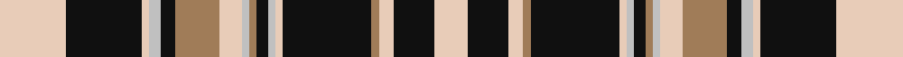

In pattern [WKWRKWWKRWWRKWWKW](/stripes/wkwrkwwkrwwrkwwkw/).

This was sourced from register-of-tartans.  It is a [17 stripe tartan](/stripes/stripes17/).

Original link https://www.tartanregister.gov.uk/tartanDetails.aspx?ref=4885

## Register references

External register numbers recorded for this tartan.

- Scottish Register of Tartans: [4885](https://www.tartanregister.gov.uk/tartanDetails.aspx?ref=4885)
- Scottish Tartans Authority (ITI): 3013

## Thread count
LR/36 K41 LR4 N6 K8 LT24 LR12 N4 LT4 K6 N4 LR4 K48 LT4 LR8 K22 LR/18

## Palette
Each colour and the base-6 reference it is a variant of.

| Colour | Shade | Base |
|---|---|---|
| K | <code style="background-color:#101010;">#101010</code> `oklch(17.3% 0.000 89.9)` <small>#101010</small> | K <code style="background-color:#000000;">#000000</code> |
| LR | <code style="background-color:#E8CCB8;">#E8CCB8</code> `oklch(86.3% 0.042 57.7)` <small>#E8CCB8</small> | W <code style="background-color:#F7F7F7;">#F7F7F7</code> |
| LT | <code style="background-color:#A07C58;">#A07C58</code> `oklch(61.2% 0.067 66.0)` <small>#A07C58</small> | R <code style="background-color:#CC0000;">#CC0000</code> |
| N | <code style="background-color:#C0C0C0;">#C0C0C0</code> `oklch(80.8% 0.000 89.9)` <small>#C0C0C0</small> | W <code style="background-color:#F7F7F7;">#F7F7F7</code> |

## Nearest tartans

The nearest existing variants by ΔTartan distance, with this tartan at the top so the swatches line up against it.

ΔTartan

Tartan

Sett

—

<a href="/ttd/edit/#slug=lb36k41lb4lb6k8o24lb12lb4o4k6lb4lb4k48o4lb8k22lb18">Abergavenny</a> <a class="nn-out" href="/setts/s17/lb36k41lb4lb6k8o24lb12lb4o4k6lb4lb4k48o4lb8k22lb18/" title="open its dictionary page">↗</a>

0.88

<a href="/ttd/edit/#slug=w12lb2k5lb2k10lb2k15lb2k20lb2y25lb2~x2">Liberty Square</a> <a class="nn-out" href="/setts/s12/w12lb2k5lb2k10lb2k15lb2k20lb2y25lb2~x2/" title="open its dictionary page">↗</a>

0.91

<a href="/ttd/edit/#slug=k4w2k9k3r3w3r3w23k10w2k6w2~x2">Auld Lang Syne, Grey (Fashion)</a> <a class="nn-out" href="/setts/s12/k4w2k9k3r3w3r3w23k10w2k6w2~x2/" title="open its dictionary page">↗</a>

1.06

<a href="/ttd/edit/#slug=r2k12g2w5g2k2r2k5lb10k2lb4k2lb4k2lb4k10w2k1r2~x2">Southwick (Name)</a> <a class="nn-out" href="/setts/s19/r2k12g2w5g2k2r2k5lb10k2lb4k2lb4k2lb4k10w2k1r2~x2/" title="open its dictionary page">↗</a>

1.09

<a href="/ttd/edit/#slug=k4db2w1k16w1db3w16db2w6r2w6db2w16db3w1k16w1db2k4r2~x2">Scott (MacRae)</a> <a class="nn-out" href="/setts/s20/k4db2w1k16w1db3w16db2w6r2w6db2w16db3w1k16w1db2k4r2~x2/" title="open its dictionary page">↗</a>

1.19

<a href="/ttd/edit/#slug=w4k2o9o3r3k3r3k23o10k2o6k2~x2">Auld Lang Syne, Grey Weavers Tartan Tartan Number: 8081. Earliest known date: pre 2007 From a woven sample from the weavers, Marton Mills. See products available Copyright © Blair Urquhart, Comrie, 2015</a> <a class="nn-out" href="/setts/s12/w4k2o9o3r3k3r3k23o10k2o6k2~x2/" title="open its dictionary page">↗</a>

1.19

<a href="/ttd/edit/#slug=k1b1k8r1k1r8b1ly8k1ly1k8b1k1~x6">Robieson QAHS</a> <a class="nn-out" href="/setts/s13/k1b1k8r1k1r8b1ly8k1ly1k8b1k1~x6/" title="open its dictionary page">↗</a>

1.20

<a href="/ttd/edit/#slug=k36lb8lb33k4lb6lb8lb24k12lb4lb4lb6lb4k4lb48lb4k4k4lb6lb16k6k12">Abergaveny (Fashion)</a> <a class="nn-out" href="/setts/s21/k36lb8lb33k4lb6lb8lb24k12lb4lb4lb6lb4k4lb48lb4k4k4lb6lb16k6k12/" title="open its dictionary page">↗</a>

1.26

<a href="/ttd/edit/#slug=k24o8lb3k3lb3k3lb40k3lb3k3lb3o8k24o8~x2">O'Sullivan-Beare</a> <a class="nn-out" href="/setts/s14/k24o8lb3k3lb3k3lb40k3lb3k3lb3o8k24o8~x2/" title="open its dictionary page">↗</a>

1.28

<a href="/ttd/edit/#slug=k34y5k5y8k5y56lb5y5lb36ly5lb36y5lb5y56k5y8k5y5k34ly5">Chartered Institute of Bankers</a> <a class="nn-out" href="/setts/s20/k34y5k5y8k5y56lb5y5lb36ly5lb36y5lb5y56k5y8k5y5k34ly5/" title="open its dictionary page">↗</a>

1.30

<a href="/ttd/edit/#slug=r4k2ly13lo3k22r2k2w13k7r3k7w4~x2">Tyrone County Crest (Fashion)</a> <a class="nn-out" href="/setts/s12/r4k2ly13lo3k22r2k2w13k7r3k7w4~x2/" title="open its dictionary page">↗</a>

## Neighbour map

Every grey dot is one of 14299 variants placed by the first two principal components of the ΔTartan feature space (44% of its variance). Red is this tartan; blue dots are its nearest — click one to open its page.

<svg viewBox="0 0 640 380" role="img" style="max-width:100%;height:auto;border:1px solid #e0e0e0;border-radius:4px;display:block" xmlns="http://www.w3.org/2000/svg"><image href="/nn/cloud.v1.png" width="640" height="380"/><a href="/setts/s12/w12lb2k5lb2k10lb2k15lb2k20lb2y25lb2~x2/"><circle cx="222.6" cy="145.3" r="4" fill="#3465a4"><title>Liberty Square</title></circle></a><a href="/setts/s12/k4w2k9k3r3w3r3w23k10w2k6w2~x2/"><circle cx="211.9" cy="137.1" r="4" fill="#3465a4"><title>Auld Lang Syne, Grey (Fashion)</title></circle></a><a href="/setts/s19/r2k12g2w5g2k2r2k5lb10k2lb4k2lb4k2lb4k10w2k1r2~x2/"><circle cx="167.7" cy="120.2" r="4" fill="#3465a4"><title>Southwick (Name)</title></circle></a><a href="/setts/s20/k4db2w1k16w1db3w16db2w6r2w6db2w16db3w1k16w1db2k4r2~x2/"><circle cx="210.1" cy="100.8" r="4" fill="#3465a4"><title>Scott (MacRae)</title></circle></a><a href="/setts/s12/w4k2o9o3r3k3r3k23o10k2o6k2~x2/"><circle cx="238.4" cy="154.7" r="4" fill="#3465a4"><title>Auld Lang Syne, Grey Weavers Tartan Tartan Number: 8081. Earliest known date: pre 2007 From a woven sample from the weavers, Marton Mills. See products available Copyright © Blair Urquhart, Comrie, 2015</title></circle></a><a href="/setts/s13/k1b1k8r1k1r8b1ly8k1ly1k8b1k1~x6/"><circle cx="199.1" cy="142.0" r="4" fill="#3465a4"><title>Robieson QAHS</title></circle></a><a href="/setts/s21/k36lb8lb33k4lb6lb8lb24k12lb4lb4lb6lb4k4lb48lb4k4k4lb6lb16k6k12/"><circle cx="214.4" cy="109.5" r="4" fill="#3465a4"><title>Abergaveny (Fashion)</title></circle></a><a href="/setts/s14/k24o8lb3k3lb3k3lb40k3lb3k3lb3o8k24o8~x2/"><circle cx="241.1" cy="139.2" r="4" fill="#3465a4"><title>O'Sullivan-Beare</title></circle></a><a href="/setts/s20/k34y5k5y8k5y56lb5y5lb36ly5lb36y5lb5y56k5y8k5y5k34ly5/"><circle cx="205.4" cy="121.8" r="4" fill="#3465a4"><title>Chartered Institute of Bankers</title></circle></a><a href="/setts/s12/r4k2ly13lo3k22r2k2w13k7r3k7w4~x2/"><circle cx="181.3" cy="138.7" r="4" fill="#3465a4"><title>Tyrone County Crest (Fashion)</title></circle></a><circle cx="216.5" cy="128.6" r="5" fill="#c00000"/></svg>

ID: /setts/s17/lb36k41lb4lb6k8o24lb12lb4o4k6lb4lb4k48o4lb8k22lb18/
