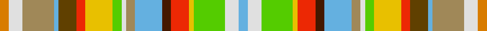

This page is one **sett** — a single exact thread-count. It belongs to the [tartan](/tartans/lo2w3loi7lt1dy4r2ly6lg2w1loi2lt6do2r4ly1lg7w3lt2/)
(the same proportion at any scale), whose colour order is pattern [WWYYRBWYWYYRGWYWY](/stripes/wwyyrbwywyyrgwywy/).

Sourced from register-of-tartans.  It is a [17 stripe tartan](/stripes/stripes17/).

Original link https://www.tartanregister.gov.uk/tartanDetails.aspx?ref=3911

2 attestations — the source records this cloth was collapsed from (oldest owns this page)

<ul>
<li>01/01/2002 — Ste-Anne-de-Portneuf (register-of-tartans, <a href="https://www.tartanregister.gov.uk/tartanDetails.aspx?ref=3911">record</a>)</li>
<li>2002 — Ste-Anne-de-Portneuf (District) (tartans-authority, <a href="http://www.tartansauthority.com/tartan-ferret/display/5779/">record</a>)</li>
</ul>

## Register references

External register numbers recorded for this tartan.

- Scottish Register of Tartans: [3911](https://www.tartanregister.gov.uk/tartanDetails.aspx?ref=3911)
- Scottish Tartans Authority (ITI): 5779

## Thread count
O/8 LN12 LT28 B4 T16 R8 Y24 G8 LN4 LT8 B24 DR8 R16 Y4 G28 LN12 B/8

## Palette

Palette: <strong>Tartan Register</strong> <small style="color:#888">(7 of 10 colours)</small>
<table><thead><tr><th>Colour</th><th>Threads</th><th>Shade</th><th>Base</th><th>OKLCh</th></tr></thead><tbody><tr><td>O/</td><td style="text-align:right;font-variant-numeric:tabular-nums">8</td><td><code style="background-color:#D87C00;">#D87C00</code> <small style="color:#888">#D87C00</small></td><td>Y <code style="background-color:#F2BF00;">#F2BF00</code></td><td><small style="color:#888">oklch(67.3% 0.155 61.8)</small></td></tr><tr><td>LN</td><td style="text-align:right;font-variant-numeric:tabular-nums">12</td><td><code style="background-color:#E0E0E0;">#E0E0E0</code> <small style="color:#888">#E0E0E0</small></td><td>W <code style="background-color:#F7F7F7;">#F7F7F7</code></td><td><small style="color:#888">oklch(90.7% 0.000 89.9)</small></td></tr><tr><td>LT</td><td style="text-align:right;font-variant-numeric:tabular-nums">28</td><td><code style="background-color:#A08858;">#A08858</code> <small style="color:#888">#A08858</small></td><td>Y <code style="background-color:#F2BF00;">#F2BF00</code></td><td><small style="color:#888">oklch(63.7% 0.071 84.0)</small></td></tr><tr><td>B</td><td style="text-align:right;font-variant-numeric:tabular-nums">4</td><td><code style="background-color:#64B0E0;">#64B0E0</code> <small style="color:#888">#64B0E0</small></td><td>W <code style="background-color:#F7F7F7;">#F7F7F7</code></td><td><small style="color:#888">oklch(72.7% 0.103 238.1)</small></td></tr><tr><td>T</td><td style="text-align:right;font-variant-numeric:tabular-nums">16</td><td><code style="background-color:#604000;">#604000</code> <small style="color:#888">#604000</small></td><td>G <code style="background-color:#006100;">#006100</code></td><td><small style="color:#888">oklch(39.8% 0.083 76.8)</small></td></tr><tr><td>R</td><td style="text-align:right;font-variant-numeric:tabular-nums">8</td><td><code style="background-color:#EC2804;">#EC2804</code> <small style="color:#888">#EC2804</small></td><td>R <code style="background-color:#CC0000;">#CC0000</code></td><td><small style="color:#888">oklch(60.6% 0.231 31.5)</small></td></tr><tr><td>Y</td><td style="text-align:right;font-variant-numeric:tabular-nums">24</td><td><code style="background-color:#E8C000;">#E8C000</code> <small style="color:#888">#E8C000</small></td><td>Y <code style="background-color:#F2BF00;">#F2BF00</code></td><td><small style="color:#888">oklch(81.9% 0.168 93.7)</small></td></tr><tr><td>G</td><td style="text-align:right;font-variant-numeric:tabular-nums">8</td><td><code style="background-color:#54CC00;">#54CC00</code> <small style="color:#888">#54CC00</small></td><td>Y <code style="background-color:#F2BF00;">#F2BF00</code></td><td><small style="color:#888">oklch(74.6% 0.231 138.1)</small></td></tr><tr><td>LN</td><td style="text-align:right;font-variant-numeric:tabular-nums">4</td><td><code style="background-color:#E0E0E0;">#E0E0E0</code> <small style="color:#888">#E0E0E0</small></td><td>W <code style="background-color:#F7F7F7;">#F7F7F7</code></td><td><small style="color:#888">oklch(90.7% 0.000 89.9)</small></td></tr><tr><td>LT</td><td style="text-align:right;font-variant-numeric:tabular-nums">8</td><td><code style="background-color:#A08858;">#A08858</code> <small style="color:#888">#A08858</small></td><td>Y <code style="background-color:#F2BF00;">#F2BF00</code></td><td><small style="color:#888">oklch(63.7% 0.071 84.0)</small></td></tr><tr><td>B</td><td style="text-align:right;font-variant-numeric:tabular-nums">24</td><td><code style="background-color:#64B0E0;">#64B0E0</code> <small style="color:#888">#64B0E0</small></td><td>W <code style="background-color:#F7F7F7;">#F7F7F7</code></td><td><small style="color:#888">oklch(72.7% 0.103 238.1)</small></td></tr><tr><td>DR</td><td style="text-align:right;font-variant-numeric:tabular-nums">8</td><td><code style="background-color:#441800;">#441800</code> <small style="color:#888">#441800</small></td><td>B <code style="background-color:#2A418A;">#2A418A</code></td><td><small style="color:#888">oklch(27.3% 0.076 46.3)</small></td></tr><tr><td>R</td><td style="text-align:right;font-variant-numeric:tabular-nums">16</td><td><code style="background-color:#EC2804;">#EC2804</code> <small style="color:#888">#EC2804</small></td><td>R <code style="background-color:#CC0000;">#CC0000</code></td><td><small style="color:#888">oklch(60.6% 0.231 31.5)</small></td></tr><tr><td>Y</td><td style="text-align:right;font-variant-numeric:tabular-nums">4</td><td><code style="background-color:#E8C000;">#E8C000</code> <small style="color:#888">#E8C000</small></td><td>Y <code style="background-color:#F2BF00;">#F2BF00</code></td><td><small style="color:#888">oklch(81.9% 0.168 93.7)</small></td></tr><tr><td>G</td><td style="text-align:right;font-variant-numeric:tabular-nums">28</td><td><code style="background-color:#54CC00;">#54CC00</code> <small style="color:#888">#54CC00</small></td><td>Y <code style="background-color:#F2BF00;">#F2BF00</code></td><td><small style="color:#888">oklch(74.6% 0.231 138.1)</small></td></tr><tr><td>LN</td><td style="text-align:right;font-variant-numeric:tabular-nums">12</td><td><code style="background-color:#E0E0E0;">#E0E0E0</code> <small style="color:#888">#E0E0E0</small></td><td>W <code style="background-color:#F7F7F7;">#F7F7F7</code></td><td><small style="color:#888">oklch(90.7% 0.000 89.9)</small></td></tr><tr><td>B/</td><td style="text-align:right;font-variant-numeric:tabular-nums">8</td><td><code style="background-color:#64B0E0;">#64B0E0</code> <small style="color:#888">#64B0E0</small></td><td>W <code style="background-color:#F7F7F7;">#F7F7F7</code></td><td><small style="color:#888">oklch(72.7% 0.103 238.1)</small></td></tr></tbody></table>

## Nearest tartans

The nearest existing variants by ΔTartan distance, with this tartan at the top so the swatches line up against it.

ΔTartan

Tartan

Sett

—

<a href="/ttd/edit/#slug=lo2w3loi7lt1dy4r2ly6lg2w1loi2lt6do2r4ly1lg7w3lt2~x4">Ste-Anne-de-Portneuf</a> <a class="nn-out" href="/setts/s17/lo2w3loi7lt1dy4r2ly6lg2w1loi2lt6do2r4ly1lg7w3lt2~x4/" title="open its dictionary page">↗</a>

1.58

<a href="/ttd/edit/#slug=gi4lr1gi5ly4p3ly5g6w3b5w2lb3w4r3w1~x2">Werris Creek Catholic Parish (Corp.)</a> <a class="nn-out" href="/setts/s14/gi4lr1gi5ly4p3ly5g6w3b5w2lb3w4r3w1~x2/" title="open its dictionary page">↗</a>

1.63

<a href="/ttd/edit/#slug=t2w3dg7ly1r4do2db6loi2w1dg2ly6r2dy4db1loi7w3lo2~x2">St Anne de Portneuf Canadian District Tartan Tartan Number: 5779. Earliest known date: 2002 Ste-Anne-de-Portneuf is a village of about 1000 population on the north shore of the St lawrence River in Quebec. The first permanent residents established themselvs there in 1902 and the original industrialists were mainly of English and Scottish origin whilst the work force was French Canadian. This tartan was woven in cotton by a company called Leclerc. The tartan is unconventional in that it has 10 colours, is non-repeating. See products available Copyright © Blair Urquhart, Comrie, 2015</a> <a class="nn-out" href="/setts/s17/t2w3dg7ly1r4do2db6loi2w1dg2ly6r2dy4db1loi7w3lo2~x2/" title="open its dictionary page">↗</a>

2.05

<a href="/ttd/edit/#slug=g4lr1g5ly4p3ly5lg6w3db5w2b3w4r3w1~x2">Werris Creek Catholic Parish</a> <a class="nn-out" href="/setts/s14/g4lr1g5ly4p3ly5lg6w3db5w2b3w4r3w1~x2/" title="open its dictionary page">↗</a>

2.53

<a href="/ttd/edit/#slug=o1r1o3lo1o1dy8ly7g1o1t1w1~x4">Porcupine</a> <a class="nn-out" href="/setts/s11/o1r1o3lo1o1dy8ly7g1o1t1w1~x4/" title="open its dictionary page">↗</a>

2.60

<a href="/ttd/edit/#slug=lb17r2w2db9ly2yi16w1r6w1g5ly1y8ly2~x2">Okanagan(District)</a> <a class="nn-out" href="/setts/s13/lb17r2w2db9ly2yi16w1r6w1g5ly1y8ly2~x2/" title="open its dictionary page">↗</a>

2.63

<a href="/ttd/edit/#slug=ly12lo12o12g2r2ly2dp12db12g12dp2r2db1~x2">Rainbow Kilt (Fashion)</a> <a class="nn-out" href="/setts/s12/ly12lo12o12g2r2ly2dp12db12g12dp2r2db1~x2/" title="open its dictionary page">↗</a>

2.66

<a href="/ttd/edit/#slug=w2r2g3r6w1k1w1r6k1g3k1dy4k1w1t2w1k1dy4k1g3k1ly6w1k1w1ly6g3ly2w2~x2">Glassary (Initial)</a> <a class="nn-out" href="/setts/s29/w2r2g3r6w1k1w1r6k1g3k1dy4k1w1t2w1k1dy4k1g3k1ly6w1k1w1ly6g3ly2w2~x2/" title="open its dictionary page">↗</a>

2.66

<a href="/ttd/edit/#slug=k2w1lo6r6w1k2lb2do3lb2k1lb2g3lb2~x2">Hovington (2014)</a> <a class="nn-out" href="/setts/s13/k2w1lo6r6w1k2lb2do3lb2k1lb2g3lb2~x2/" title="open its dictionary page">↗</a>

2.70

<a href="/ttd/edit/#slug=dg18ly3db14t6w3k2w3t6k2r4m3ri4k2ri4m3r2k2t6w3k2w3t6db14ly3dg18r12w3r12w3r12~x2">Unidentified Cant #01 (Cumming)</a> <a class="nn-out" href="/setts/s30/dg18ly3db14t6w3k2w3t6k2r4m3ri4k2ri4m3r2k2t6w3k2w3t6db14ly3dg18r12w3r12w3r12~x2/" title="open its dictionary page">↗</a>

2.73

<a href="/ttd/edit/#slug=ly3dp5g2dp2g2w1g4lr12r2t2k2~x4">Oregon, State of</a> <a class="nn-out" href="/setts/s11/ly3dp5g2dp2g2w1g4lr12r2t2k2~x4/" title="open its dictionary page">↗</a>

## Neighbour map

Every grey dot is one of 14359 variants placed by the first two principal components of the ΔTartan feature space (44% of its variance). Red is this tartan; blue dots are its nearest — click one to open its page.

<svg viewBox="0 0 640 380" role="img" style="max-width:100%;height:auto;border:1px solid #e0e0e0;border-radius:4px;display:block" xmlns="http://www.w3.org/2000/svg"><image href="/nn/cloud.v1.png" width="640" height="380"/><a href="/setts/s14/gi4lr1gi5ly4p3ly5g6w3b5w2lb3w4r3w1~x2/"><circle cx="14.0" cy="141.5" r="4" fill="#3465a4"><title>Werris Creek Catholic Parish (Corp.)</title></circle></a><a href="/setts/s17/t2w3dg7ly1r4do2db6loi2w1dg2ly6r2dy4db1loi7w3lo2~x2/"><circle cx="14.0" cy="84.0" r="4" fill="#3465a4"><title>St Anne de Portneuf Canadian District Tartan Tartan Number: 5779. Earliest known date: 2002 Ste-Anne-de-Portneuf is a village of about 1000 population on the north shore of the St lawrence River in Quebec. The first permanent residents established themselvs there in 1902 and the original industrialists were mainly of English and Scottish origin whilst the work force was French Canadian. This tartan was woven in cotton by a company called Leclerc. The tartan is unconventional in that it has 10 colours, is non-repeating. See products available Copyright © Blair Urquhart, Comrie, 2015</title></circle></a><a href="/setts/s14/g4lr1g5ly4p3ly5lg6w3db5w2b3w4r3w1~x2/"><circle cx="14.0" cy="126.4" r="4" fill="#3465a4"><title>Werris Creek Catholic Parish</title></circle></a><a href="/setts/s11/o1r1o3lo1o1dy8ly7g1o1t1w1~x4/"><circle cx="79.8" cy="102.2" r="4" fill="#3465a4"><title>Porcupine</title></circle></a><a href="/setts/s13/lb17r2w2db9ly2yi16w1r6w1g5ly1y8ly2~x2/"><circle cx="29.8" cy="69.0" r="4" fill="#3465a4"><title>Okanagan(District)</title></circle></a><a href="/setts/s12/ly12lo12o12g2r2ly2dp12db12g12dp2r2db1~x2/"><circle cx="14.0" cy="115.0" r="4" fill="#3465a4"><title>Rainbow Kilt (Fashion)</title></circle></a><a href="/setts/s29/w2r2g3r6w1k1w1r6k1g3k1dy4k1w1t2w1k1dy4k1g3k1ly6w1k1w1ly6g3ly2w2~x2/"><circle cx="14.0" cy="95.3" r="4" fill="#3465a4"><title>Glassary (Initial)</title></circle></a><a href="/setts/s13/k2w1lo6r6w1k2lb2do3lb2k1lb2g3lb2~x2/"><circle cx="14.0" cy="133.7" r="4" fill="#3465a4"><title>Hovington (2014)</title></circle></a><a href="/setts/s30/dg18ly3db14t6w3k2w3t6k2r4m3ri4k2ri4m3r2k2t6w3k2w3t6db14ly3dg18r12w3r12w3r12~x2/"><circle cx="14.0" cy="50.3" r="4" fill="#3465a4"><title>Unidentified Cant #01 (Cumming)</title></circle></a><a href="/setts/s11/ly3dp5g2dp2g2w1g4lr12r2t2k2~x4/"><circle cx="60.2" cy="94.0" r="4" fill="#3465a4"><title>Oregon, State of</title></circle></a><circle cx="14.0" cy="103.8" r="5" fill="#c00000"/></svg>

ID: /setts/s17/lo2w3loi7lt1dy4r2ly6lg2w1loi2lt6do2r4ly1lg7w3lt2~x4/
