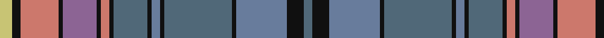

In pattern [BKBKBKBKBKRKBKRKY](/stripes/bkbkbkbkbkrkbkrky/).

This was sourced from tartans-authority.  It is a [17 stripe tartan](/stripes/stripes17/).

Original link http://www.tartansauthority.com/tartan-ferret/display/10291/

## Thread count
LG/6 K4 LR18 K2 LP16 K2 LR4 K2 N16 K2 B4 K2 N32 K2 B24 K8 N/4

## Palette
Each colour and the base-6 reference it is a variant of.

| Colour | Shade | Base |
|---|---|---|
| B | <code style="background-color:#687C9C;">#687C9C</code> `oklch(58.3% 0.055 259.7)` <small>#687C9C</small> | B <code style="background-color:#2A418A;">#2A418A</code> |
| K | <code style="background-color:#101010;">#101010</code> `oklch(17.3% 0.000 89.9)` <small>#101010</small> | K <code style="background-color:#000000;">#000000</code> |
| LG | <code style="background-color:#C8C474;">#C8C474</code> `oklch(80.6% 0.102 106.0)` <small>#C8C474</small> | Y <code style="background-color:#F2BF00;">#F2BF00</code> |
| LP | <code style="background-color:#8C6494;">#8C6494</code> `oklch(56.2% 0.086 320.7)` <small>#8C6494</small> | B <code style="background-color:#2A418A;">#2A418A</code> |
| LR | <code style="background-color:#CC786C;">#CC786C</code> `oklch(66.1% 0.108 28.9)` <small>#CC786C</small> | R <code style="background-color:#CC0000;">#CC0000</code> |
| N | <code style="background-color:#506878;">#506878</code> `oklch(50.4% 0.038 237.7)` <small>#506878</small> | B <code style="background-color:#2A418A;">#2A418A</code> |

## Nearest tartans

The nearest existing variants by ΔTartan distance, with this tartan at the top so the swatches line up against it.

ΔTartan

Tartan

Sett

—

<a href="/ttd/edit/#slug=ly3k2o9k1n8k1o2k1n8k1t2k1n16k1t12k4n2~x2">Golden Glow (Fashion)</a> <a class="nn-out" href="/setts/s17/ly3k2o9k1n8k1o2k1n8k1t2k1n16k1t12k4n2~x2/" title="open its dictionary page">↗</a>

0.87

<a href="/ttd/edit/#slug=ly3k2r9k1n8k1r2k1n8k1n2k1n16k1n12k4n2~x2">Golden Glow</a> <a class="nn-out" href="/setts/s17/ly3k2r9k1n8k1r2k1n8k1n2k1n16k1n12k4n2~x2/" title="open its dictionary page">↗</a>

1.08

<a href="/ttd/edit/#slug=dt8n3lb3n3o28lb4o8n12dt3n3dt3n3dt8dy3dt3dy3dt3dy12g4">Glenlea</a> <a class="nn-out" href="/setts/s19/dt8n3lb3n3o28lb4o8n12dt3n3dt3n3dt8dy3dt3dy3dt3dy12g4/" title="open its dictionary page">↗</a>

1.21

<a href="/ttd/edit/#slug=g3n3dp2db14g16dp18n2dp3n14db4ly3lo1n2~x2">ENABLE Scotland</a> <a class="nn-out" href="/setts/s13/g3n3dp2db14g16dp18n2dp3n14db4ly3lo1n2~x2/" title="open its dictionary page">↗</a>

1.31

<a href="/ttd/edit/#slug=t30y8r2k8ly2k8r2y8db11r2t10r3t2r2db3~x2">Mungall Family Tartan Tartan Number: 4070. Earliest known date: 2001 This tartan was first produced in ancient colours. It is a personal tartan to commemorate the signing of the Ragman's Roll by William de Mungall See products available Copyright © Blair Urquhart, Comrie, 2015</a> <a class="nn-out" href="/setts/s15/t30y8r2k8ly2k8r2y8db11r2t10r3t2r2db3~x2/" title="open its dictionary page">↗</a>

1.33

<a href="/ttd/edit/#slug=db20t8lo5k6t4r3t3y30r2t3~x2">Thousand Islands</a> <a class="nn-out" href="/setts/s10/db20t8lo5k6t4r3t3y30r2t3~x2/" title="open its dictionary page">↗</a>

1.34

<a href="/ttd/edit/#slug=w1k2g10b1g2b1g2k2b15o1b2o1b2o1b2o15k1ly1~x2">Daniel Melrose Family Tartan Tartan Number: 7548. Earliest known date: 2008 Daniel Melrose says, &quot;This Tartan is in memory of our ancestors who lived in the Newbigging and Dunsyre area for over 200 years.&quot; The tartan was designed to be woven in Ancient colours. (Corrects the 2 yellow stripes error. It should only be one yellow.) See products available Copyright © Blair Urquhart, Comrie, 2015</a> <a class="nn-out" href="/setts/s18/w1k2g10b1g2b1g2k2b15o1b2o1b2o1b2o15k1ly1~x2/" title="open its dictionary page">↗</a>

1.35

<a href="/ttd/edit/#slug=g4db34g4dy4db4dy4g3dy13g21dy4lb3r11lo3~x2">State Seal of Illinois (Fashion)</a> <a class="nn-out" href="/setts/s13/g4db34g4dy4db4dy4g3dy13g21dy4lb3r11lo3~x2/" title="open its dictionary page">↗</a>

1.42

<a href="/setts/s18/b5w1m9b5r4b5g20ly1g1ly1~x4/">Hobkirk</a>

1.43

<a href="/ttd/edit/#slug=ly6n2ly2n1k1n1lo4n2lo2n17k2n3k8n3k2n17k2n2lo2~x2">Ferrari (Coldrerio)</a> <a class="nn-out" href="/setts/s19/ly6n2ly2n1k1n1lo4n2lo2n17k2n3k8n3k2n17k2n2lo2~x2/" title="open its dictionary page">↗</a>

1.45

<a href="/ttd/edit/#slug=k2t6lo2t2lo2t19r2y2r2t2dt4k2dt11y2dt2y2dt6lo2~x2">Harmon of Plenderleith Personal Tartan Tartan Number: 10021. Earliest known date: Mar. 2009 A personal tartan for the Baron of Plenderleith, his family and members of his household. Developed with the help of the House of Tartan, Comrie, Perthshire. See products available Copyright © Blair Urquhart, Comrie, 2015</a> <a class="nn-out" href="/setts/s18/k2t6lo2t2lo2t19r2y2r2t2dt4k2dt11y2dt2y2dt6lo2~x2/" title="open its dictionary page">↗</a>

## Neighbour map

Every grey dot is one of 14299 variants placed by the first two principal components of the ΔTartan feature space (44% of its variance). Red is this tartan; blue dots are its nearest — click one to open its page.

<svg viewBox="0 0 640 380" role="img" style="max-width:100%;height:auto;border:1px solid #e0e0e0;border-radius:4px;display:block" xmlns="http://www.w3.org/2000/svg"><image href="/nn/cloud.v1.png" width="640" height="380"/><a href="/setts/s17/ly3k2r9k1n8k1r2k1n8k1n2k1n16k1n12k4n2~x2/"><circle cx="176.6" cy="119.2" r="4" fill="#3465a4"><title>Golden Glow</title></circle></a><a href="/setts/s19/dt8n3lb3n3o28lb4o8n12dt3n3dt3n3dt8dy3dt3dy3dt3dy12g4/"><circle cx="128.3" cy="138.0" r="4" fill="#3465a4"><title>Glenlea</title></circle></a><a href="/setts/s13/g3n3dp2db14g16dp18n2dp3n14db4ly3lo1n2~x2/"><circle cx="153.6" cy="135.8" r="4" fill="#3465a4"><title>ENABLE Scotland</title></circle></a><a href="/setts/s15/t30y8r2k8ly2k8r2y8db11r2t10r3t2r2db3~x2/"><circle cx="174.6" cy="110.0" r="4" fill="#3465a4"><title>Mungall Family Tartan Tartan Number: 4070. Earliest known date: 2001 This tartan was first produced in ancient colours. It is a personal tartan to commemorate the signing of the Ragman's Roll by William de Mungall See products available Copyright © Blair Urquhart, Comrie, 2015</title></circle></a><a href="/setts/s10/db20t8lo5k6t4r3t3y30r2t3~x2/"><circle cx="172.1" cy="134.1" r="4" fill="#3465a4"><title>Thousand Islands</title></circle></a><a href="/setts/s18/w1k2g10b1g2b1g2k2b15o1b2o1b2o1b2o15k1ly1~x2/"><circle cx="192.6" cy="95.6" r="4" fill="#3465a4"><title>Daniel Melrose Family Tartan Tartan Number: 7548. Earliest known date: 2008 Daniel Melrose says, &quot;This Tartan is in memory of our ancestors who lived in the Newbigging and Dunsyre area for over 200 years.&quot; The tartan was designed to be woven in Ancient colours. (Corrects the 2 yellow stripes error. It should only be one yellow.) See products available Copyright © Blair Urquhart, Comrie, 2015</title></circle></a><a href="/setts/s13/g4db34g4dy4db4dy4g3dy13g21dy4lb3r11lo3~x2/"><circle cx="176.9" cy="147.5" r="4" fill="#3465a4"><title>State Seal of Illinois (Fashion)</title></circle></a><a href="/setts/s18/b5w1m9b5r4b5g20ly1g1ly1~x4/"><circle cx="239.5" cy="113.2" r="4" fill="#3465a4"><title>Hobkirk</title></circle></a><a href="/setts/s19/ly6n2ly2n1k1n1lo4n2lo2n17k2n3k8n3k2n17k2n2lo2~x2/"><circle cx="144.9" cy="91.5" r="4" fill="#3465a4"><title>Ferrari (Coldrerio)</title></circle></a><a href="/setts/s18/k2t6lo2t2lo2t19r2y2r2t2dt4k2dt11y2dt2y2dt6lo2~x2/"><circle cx="171.0" cy="122.6" r="4" fill="#3465a4"><title>Harmon of Plenderleith Personal Tartan Tartan Number: 10021. Earliest known date: Mar. 2009 A personal tartan for the Baron of Plenderleith, his family and members of his household. Developed with the help of the House of Tartan, Comrie, Perthshire. See products available Copyright © Blair Urquhart, Comrie, 2015</title></circle></a><circle cx="164.2" cy="114.9" r="5" fill="#c00000"/></svg>

ID: /setts/s17/ly3k2o9k1n8k1o2k1n8k1t2k1n16k1t12k4n2~x2/
