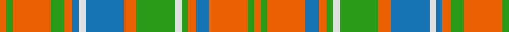

In pattern [RGRBRGWGRBWBRGRGR](/stripes/rgrbrgwgrbwbrgrgr/).

This was sourced from register-of-tartans.  It is a [17 stripe tartan](/stripes/stripes17/).

Original link https://www.tartanregister.gov.uk/tartanDetails.aspx?ref=3494

## Register references

External register numbers recorded for this tartan.

- Scottish Register of Tartans: [3494](https://www.tartanregister.gov.uk/tartanDetails.aspx?ref=3494)
- Scottish Tartans Authority (ITI): 4079

## Thread count
O/6 G6 O36 G12 O8 B6 LN6 B36 O12 G36 LN6 G6 O8 B12 O36 G6 O/6

## Palette
Each colour and the base-6 reference it is a variant of.

| Colour | Shade | Base |
|---|---|---|
| B | <code style="background-color:#1474B4;">#1474B4</code> `oklch(54.0% 0.129 245.1)` <small>#1474B4</small> | B <code style="background-color:#2A418A;">#2A418A</code> |
| G | <code style="background-color:#289C18;">#289C18</code> `oklch(60.6% 0.191 141.6)` <small>#289C18</small> | G <code style="background-color:#006100;">#006100</code> |
| LN | <code style="background-color:#E0E0E0;">#E0E0E0</code> `oklch(90.7% 0.000 89.9)` <small>#E0E0E0</small> | W <code style="background-color:#F7F7F7;">#F7F7F7</code> |
| O | <code style="background-color:#E86000;">#E86000</code> `oklch(65.3% 0.187 44.9)` <small>#E86000</small> | R <code style="background-color:#CC0000;">#CC0000</code> |

## Nearest tartans

The nearest existing variants by ΔTartan distance, with this tartan at the top so the swatches line up against it.

ΔTartan

Tartan

Sett

—

<a href="/ttd/edit/#slug=o3g3o18g6o4b3w3b18o6g18w3g3o4b6o18g3o3~x2">Reid of Straloch (Personal)</a> <a class="nn-out" href="/setts/s17/o3g3o18g6o4b3w3b18o6g18w3g3o4b6o18g3o3~x2/" title="open its dictionary page">↗</a>

1.34

<a href="/ttd/edit/#slug=r2g2r12db10t3g10r2g2r2g10r12g2r2~x2">Matheson</a> <a class="nn-out" href="/setts/s13/r2g2r12db10t3g10r2g2r2g10r12g2r2~x2/" title="open its dictionary page">↗</a>

1.42

<a href="/ttd/edit/#slug=r1t1r6db3r1g6r1g6r6db1r1t1~x2">MacQuarrie 4</a> <a class="nn-out" href="/setts/s12/r1t1r6db3r1g6r1g6r6db1r1t1~x2/" title="open its dictionary page">↗</a>

1.47

<a href="/ttd/edit/#slug=g21r5g21r21g5r4g5r21w4r5db21r4">MacRae</a> <a class="nn-out" href="/setts/s12/g21r5g21r21g5r4g5r21w4r5db21r4/" title="open its dictionary page">↗</a>

1.48

<a href="/ttd/edit/#slug=t2r3g2db2r6g16r2db4g2r16g8t2r4w2~x2">MacKinnon 6</a> <a class="nn-out" href="/setts/s14/t2r3g2db2r6g16r2db4g2r16g8t2r4w2~x2/" title="open its dictionary page">↗</a>

1.50

<a href="/setts/s14/o16k4w2k4o6o11o2o16~x2/">Sydney (Nova Scotia) #2</a>

1.53

<a href="/ttd/edit/#slug=do18lo3do3lo3do3lo16w16y3w16lo16do17lo3do3lo3do17lo16w16y3~x2">Lamont Heather (Corporate)</a> <a class="nn-out" href="/setts/s18/do18lo3do3lo3do3lo16w16y3w16lo16do17lo3do3lo3do17lo16w16y3~x2/" title="open its dictionary page">↗</a>

1.54

<a href="/ttd/edit/#slug=dg6lo2db2lo11dg2lo2m3lo2dg2lo11db2lo2dg6m3~x2">Invertere (Daks #1)</a> <a class="nn-out" href="/setts/s14/dg6lo2db2lo11dg2lo2m3lo2dg2lo11db2lo2dg6m3~x2/" title="open its dictionary page">↗</a>

1.57

<a href="/ttd/edit/#slug=w2r4g8r16t2r3g16r4t2r4w2~x2">MacKinnon 7</a> <a class="nn-out" href="/setts/s11/w2r4g8r16t2r3g16r4t2r4w2~x2/" title="open its dictionary page">↗</a>

1.59

<a href="/ttd/edit/#slug=r3lg8r2lg18dp5lg3o3lg3o16lg3o3lg3~x2">Dublin Irish County Tartan Tartan Number: 2250. Earliest known date: 1996 One of a series of Irish District tartans designed by Polly Wittering of the House of Edgar, with colours reminiscent of the Country with soft warm colours dominating. See products available Copyright © Blair Urquhart, Comrie, 2015</a> <a class="nn-out" href="/setts/s12/r3lg8r2lg18dp5lg3o3lg3o16lg3o3lg3~x2/" title="open its dictionary page">↗</a>

1.61

<a href="/ttd/edit/#slug=p2r3g2db2r6g16r2db4g2r16g8p2r4w2~x2">MacKinnon 5</a> <a class="nn-out" href="/setts/s14/p2r3g2db2r6g16r2db4g2r16g8p2r4w2~x2/" title="open its dictionary page">↗</a>

## Neighbour map

Every grey dot is one of 14299 variants placed by the first two principal components of the ΔTartan feature space (44% of its variance). Red is this tartan; blue dots are its nearest — click one to open its page.

<svg viewBox="0 0 640 380" role="img" style="max-width:100%;height:auto;border:1px solid #e0e0e0;border-radius:4px;display:block" xmlns="http://www.w3.org/2000/svg"><image href="/nn/cloud.v1.png" width="640" height="380"/><a href="/setts/s13/r2g2r12db10t3g10r2g2r2g10r12g2r2~x2/"><circle cx="226.4" cy="200.3" r="4" fill="#3465a4"><title>Matheson</title></circle></a><a href="/setts/s12/r1t1r6db3r1g6r1g6r6db1r1t1~x2/"><circle cx="240.1" cy="200.6" r="4" fill="#3465a4"><title>MacQuarrie 4</title></circle></a><a href="/setts/s12/g21r5g21r21g5r4g5r21w4r5db21r4/"><circle cx="203.8" cy="210.3" r="4" fill="#3465a4"><title>MacRae</title></circle></a><a href="/setts/s14/t2r3g2db2r6g16r2db4g2r16g8t2r4w2~x2/"><circle cx="218.8" cy="155.0" r="4" fill="#3465a4"><title>MacKinnon 6</title></circle></a><a href="/setts/s14/o16k4w2k4o6o11o2o16~x2/"><circle cx="203.8" cy="180.2" r="4" fill="#3465a4"><title>Sydney (Nova Scotia) #2</title></circle></a><a href="/setts/s18/do18lo3do3lo3do3lo16w16y3w16lo16do17lo3do3lo3do17lo16w16y3~x2/"><circle cx="126.6" cy="175.9" r="4" fill="#3465a4"><title>Lamont Heather (Corporate)</title></circle></a><a href="/setts/s14/dg6lo2db2lo11dg2lo2m3lo2dg2lo11db2lo2dg6m3~x2/"><circle cx="250.7" cy="201.8" r="4" fill="#3465a4"><title>Invertere (Daks #1)</title></circle></a><a href="/setts/s11/w2r4g8r16t2r3g16r4t2r4w2~x2/"><circle cx="265.2" cy="179.4" r="4" fill="#3465a4"><title>MacKinnon 7</title></circle></a><a href="/setts/s12/r3lg8r2lg18dp5lg3o3lg3o16lg3o3lg3~x2/"><circle cx="300.1" cy="189.2" r="4" fill="#3465a4"><title>Dublin Irish County Tartan Tartan Number: 2250. Earliest known date: 1996 One of a series of Irish District tartans designed by Polly Wittering of the House of Edgar, with colours reminiscent of the Country with soft warm colours dominating. See products available Copyright © Blair Urquhart, Comrie, 2015</title></circle></a><a href="/setts/s14/p2r3g2db2r6g16r2db4g2r16g8p2r4w2~x2/"><circle cx="218.0" cy="153.0" r="4" fill="#3465a4"><title>MacKinnon 5</title></circle></a><circle cx="209.9" cy="175.7" r="5" fill="#c00000"/></svg>

ID: /setts/s17/o3g3o18g6o4b3w3b18o6g18w3g3o4b6o18g3o3~x2/
