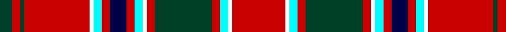

**Bands:** [GRGRWWRBRWWRGRWWR](/stripes/grgrwwrbrwwrgrwwr/) · **Stripes:** [DG R DG R W LT R DB R LT W R DG R LT W R](/stripes/stripes17/) DG R DG R W LT R DB R LT W R DG R LT W R

This was sourced from register-of-tartans.  It is a [17 band tartan](/bands/bands17/).

Original link https://www.tartanregister.gov.uk/tartanDetails.aspx?ref=2365

## Attestations

This cloth appears in 2 source records; the oldest owns this page.

- 01/01/1950 — MacDonald of Lochmaddy (register-of-tartans, [record](https://www.tartanregister.gov.uk/tartanDetails.aspx?ref=2365))
- 1950? — MacDonald of Lochmaddy (Clan?) (tartans-authority, [record](http://www.tartansauthority.com/tartan-ferret/display/971/))

## Register references

External register numbers recorded for this tartan.

- Scottish Register of Tartans: [2365](https://www.tartanregister.gov.uk/tartanDetails.aspx?ref=2365)
- Scottish Tartans Authority (ITI): 971
- Scottish Tartans World Register: 971

## Thread count
DG/6 R4 DG2 R32 W2 LB4 R4 DB8 R4 LB4 W2 R4 DG28 R4 LB4 W2 R/26

## Palette
Each colour and its ΔE from the base-6 reference it is a variant of.

| Colour | Shade | Base | ΔE (OKLab) |
|---|---|---|---|
| DB | <code style="background-color:#000048;">#000048</code> `#000048` | B <code style="background-color:#2A418A;">#2A418A</code> | 0.22 |
| DG | <code style="background-color:#004028;">#004028</code> `#004028` | G <code style="background-color:#006100;">#006100</code> | 0.13 |
| LB | <code style="background-color:#00FCFC;">#00FCFC</code> `#00FCFC` | W <code style="background-color:#F7F7F7;">#F7F7F7</code> | 0.17 |
| R | <code style="background-color:#C80000;">#C80000</code> `#C80000` | R <code style="background-color:#CC0000;">#CC0000</code> | 0.01 |
| W | <code style="background-color:#FCFCFC;">#FCFCFC</code> `#FCFCFC` | W <code style="background-color:#F7F7F7;">#F7F7F7</code> | 0.01 |

## Nearest tartans

The nearest existing variants by ΔTartan distance.

1. [Moir (Loch Insch) (Personal)](/setts/s15/r31g3r2g2r3g2r2g3r15k15g2t15g3t3w2~x2/) — ΔT 0.80
1. [MacPherson](/setts/s15/r12lb2r12dg8ly1k6lb4k1lb1k1lb4r12lb1k1r1/) — ΔT 0.97
1. [Confrerie de Vouvray](/setts/s17/dt8r4ly18r4r19ly4r19dt6r4g1r4g1r4g1r4g1r4~x2/) — ΔT 1.00
1. [City of New Bern 300](/setts/s18/o12k2ly2k2o2k2ly2k2o12k1w2db3w2k1o12k2ly2k2~x2/) — ΔT 1.01
1. [Ainslie](/setts/s15/r6k2r2k4r2k2r6g18r2ly1r2k1r10w1r2~x4/) — ΔT 1.05
1. [Stewart of Appin 5](/setts/s15/r3g1r2g1r18k4ly1k2w1db4g6r3k1r2w1~x2/) — ΔT 1.10
1. [Winthrop University](/setts/s15/ly2w2ly6r2ly2r2ly1r20db1r2db2r2db6w2r2~x2/) — ΔT 1.11
1. [Sabrettes (Corporate)](/setts/s16/r15k5w2o7k4w8k2r26k5o2w2k7w2r5w2g2~x2/) — ΔT 1.11
1. [Hepburn (Clan)](/setts/s12/r21db4k5ly2k2ly2k2r7g4r2db3ly2~x4/) — ΔT 1.13
1. [Heart of Midlothian Football Club](/setts/s16/r24w2r2w2r4k11w12db3w12k11r4w2r2w2r24ly3~x2/) — ΔT 1.15

## Neighbour map

Every grey dot is one of 14313 variants placed by the first two principal components of the ΔTartan feature space (44% of its variance). Red is this tartan; blue dots are its nearest — click one to open its page.

<svg viewBox="0 0 640 380" role="img" style="max-width:100%;height:auto;border:1px solid #e0e0e0;border-radius:4px;display:block" xmlns="http://www.w3.org/2000/svg"><image href="/nn/cloud.v1.png" width="640" height="380"/><a href="/setts/s15/r31g3r2g2r3g2r2g3r15k15g2t15g3t3w2~x2/"><circle cx="257.5" cy="95.3" r="4" fill="#3465a4"><title>Moir (Loch Insch) (Personal)</title></circle></a><a href="/setts/s15/r12lb2r12dg8ly1k6lb4k1lb1k1lb4r12lb1k1r1/"><circle cx="243.5" cy="109.4" r="4" fill="#3465a4"><title>MacPherson</title></circle></a><a href="/setts/s17/dt8r4ly18r4r19ly4r19dt6r4g1r4g1r4g1r4g1r4~x2/"><circle cx="278.9" cy="101.3" r="4" fill="#3465a4"><title>Confrerie de Vouvray</title></circle></a><a href="/setts/s18/o12k2ly2k2o2k2ly2k2o12k1w2db3w2k1o12k2ly2k2~x2/"><circle cx="269.5" cy="107.4" r="4" fill="#3465a4"><title>City of New Bern 300</title></circle></a><a href="/setts/s15/r6k2r2k4r2k2r6g18r2ly1r2k1r10w1r2~x4/"><circle cx="269.9" cy="97.8" r="4" fill="#3465a4"><title>Ainslie</title></circle></a><a href="/setts/s15/r3g1r2g1r18k4ly1k2w1db4g6r3k1r2w1~x2/"><circle cx="269.0" cy="69.2" r="4" fill="#3465a4"><title>Stewart of Appin 5</title></circle></a><a href="/setts/s15/ly2w2ly6r2ly2r2ly1r20db1r2db2r2db6w2r2~x2/"><circle cx="304.5" cy="88.9" r="4" fill="#3465a4"><title>Winthrop University</title></circle></a><a href="/setts/s16/r15k5w2o7k4w8k2r26k5o2w2k7w2r5w2g2~x2/"><circle cx="205.8" cy="96.2" r="4" fill="#3465a4"><title>Sabrettes (Corporate)</title></circle></a><a href="/setts/s12/r21db4k5ly2k2ly2k2r7g4r2db3ly2~x4/"><circle cx="245.3" cy="115.9" r="4" fill="#3465a4"><title>Hepburn (Clan)</title></circle></a><a href="/setts/s16/r24w2r2w2r4k11w12db3w12k11r4w2r2w2r24ly3~x2/"><circle cx="218.3" cy="104.3" r="4" fill="#3465a4"><title>Heart of Midlothian Football Club</title></circle></a><circle cx="280.0" cy="87.6" r="5" fill="#c00000"/></svg>

ID: /setts/s17/r13w1lt2r2dg14r2w1lt2r2db4r2lt2w1r16dg1r2dg3~x2/
