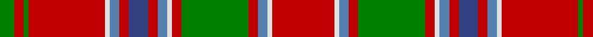

This page is one **sett** — a single exact thread-count. It belongs to the [tartan](/tartans/r13w1t2r2g14r2w1t2r2db4r2t2w1r16g1r2g3/)
(the same proportion at any scale), whose colour order is pattern [GRGRWBRBRBWRGRBWR](/stripes/grgrwbrbrbwrgrbwr/).

Sourced from weddslist.  It is a [17 stripe tartan](/stripes/stripes17/).

Original link http://www.weddslist.com/cgi-bin/tartans/pg.pl?source=sts

## Thread count
R/26 LN2 Ba4 R4 G28 R4 LN2 Ba4 R4 B8 R4 Ba4 LN2 R32 G2 R4 G/6

## Palette

Palette: <strong>Tartan Dictionary</strong> <small style="color:#888">(1 of 5 colours)</small>
<table><thead><tr><th>Colour</th><th>Threads</th><th>Shade</th><th>Base</th><th>OKLCh</th></tr></thead><tbody><tr><td>R/</td><td style="text-align:right;font-variant-numeric:tabular-nums">26</td><td><code style="background-color:#C00000;">#C00000</code> <small style="color:#888">#C00000</small></td><td>R <code style="background-color:#CC0000;">#CC0000</code></td><td><small style="color:#888">oklch(50.7% 0.208 29.2)</small></td></tr><tr><td>LN</td><td style="text-align:right;font-variant-numeric:tabular-nums">2</td><td><code style="background-color:#E0E0E0;">#E0E0E0</code> <small style="color:#888">#E0E0E0</small></td><td>W <code style="background-color:#F7F7F7;">#F7F7F7</code></td><td><small style="color:#888">oklch(90.7% 0.000 89.9)</small></td></tr><tr><td>Ba</td><td style="text-align:right;font-variant-numeric:tabular-nums">4</td><td><code style="background-color:#5480B0;">#5480B0</code> <small style="color:#888">#5480B0</small></td><td>B <code style="background-color:#2A418A;">#2A418A</code></td><td><small style="color:#888">oklch(58.8% 0.089 251.5)</small></td></tr><tr><td>R</td><td style="text-align:right;font-variant-numeric:tabular-nums">4</td><td><code style="background-color:#C00000;">#C00000</code> <small style="color:#888">#C00000</small></td><td>R <code style="background-color:#CC0000;">#CC0000</code></td><td><small style="color:#888">oklch(50.7% 0.208 29.2)</small></td></tr><tr><td>G</td><td style="text-align:right;font-variant-numeric:tabular-nums">28</td><td><code style="background-color:#008000;">#008000</code> <small style="color:#888">#008000</small></td><td>G <code style="background-color:#006100;">#006100</code></td><td><small style="color:#888">oklch(52.0% 0.177 142.5)</small></td></tr><tr><td>R</td><td style="text-align:right;font-variant-numeric:tabular-nums">4</td><td><code style="background-color:#C00000;">#C00000</code> <small style="color:#888">#C00000</small></td><td>R <code style="background-color:#CC0000;">#CC0000</code></td><td><small style="color:#888">oklch(50.7% 0.208 29.2)</small></td></tr><tr><td>LN</td><td style="text-align:right;font-variant-numeric:tabular-nums">2</td><td><code style="background-color:#E0E0E0;">#E0E0E0</code> <small style="color:#888">#E0E0E0</small></td><td>W <code style="background-color:#F7F7F7;">#F7F7F7</code></td><td><small style="color:#888">oklch(90.7% 0.000 89.9)</small></td></tr><tr><td>Ba</td><td style="text-align:right;font-variant-numeric:tabular-nums">4</td><td><code style="background-color:#5480B0;">#5480B0</code> <small style="color:#888">#5480B0</small></td><td>B <code style="background-color:#2A418A;">#2A418A</code></td><td><small style="color:#888">oklch(58.8% 0.089 251.5)</small></td></tr><tr><td>R</td><td style="text-align:right;font-variant-numeric:tabular-nums">4</td><td><code style="background-color:#C00000;">#C00000</code> <small style="color:#888">#C00000</small></td><td>R <code style="background-color:#CC0000;">#CC0000</code></td><td><small style="color:#888">oklch(50.7% 0.208 29.2)</small></td></tr><tr><td>B</td><td style="text-align:right;font-variant-numeric:tabular-nums">8</td><td><code style="background-color:#304080;">#304080</code> <small style="color:#888">#304080</small></td><td>B <code style="background-color:#2A418A;">#2A418A</code></td><td><small style="color:#888">oklch(39.4% 0.109 270.2)</small></td></tr><tr><td>R</td><td style="text-align:right;font-variant-numeric:tabular-nums">4</td><td><code style="background-color:#C00000;">#C00000</code> <small style="color:#888">#C00000</small></td><td>R <code style="background-color:#CC0000;">#CC0000</code></td><td><small style="color:#888">oklch(50.7% 0.208 29.2)</small></td></tr><tr><td>Ba</td><td style="text-align:right;font-variant-numeric:tabular-nums">4</td><td><code style="background-color:#5480B0;">#5480B0</code> <small style="color:#888">#5480B0</small></td><td>B <code style="background-color:#2A418A;">#2A418A</code></td><td><small style="color:#888">oklch(58.8% 0.089 251.5)</small></td></tr><tr><td>LN</td><td style="text-align:right;font-variant-numeric:tabular-nums">2</td><td><code style="background-color:#E0E0E0;">#E0E0E0</code> <small style="color:#888">#E0E0E0</small></td><td>W <code style="background-color:#F7F7F7;">#F7F7F7</code></td><td><small style="color:#888">oklch(90.7% 0.000 89.9)</small></td></tr><tr><td>R</td><td style="text-align:right;font-variant-numeric:tabular-nums">32</td><td><code style="background-color:#C00000;">#C00000</code> <small style="color:#888">#C00000</small></td><td>R <code style="background-color:#CC0000;">#CC0000</code></td><td><small style="color:#888">oklch(50.7% 0.208 29.2)</small></td></tr><tr><td>G</td><td style="text-align:right;font-variant-numeric:tabular-nums">2</td><td><code style="background-color:#008000;">#008000</code> <small style="color:#888">#008000</small></td><td>G <code style="background-color:#006100;">#006100</code></td><td><small style="color:#888">oklch(52.0% 0.177 142.5)</small></td></tr><tr><td>R</td><td style="text-align:right;font-variant-numeric:tabular-nums">4</td><td><code style="background-color:#C00000;">#C00000</code> <small style="color:#888">#C00000</small></td><td>R <code style="background-color:#CC0000;">#CC0000</code></td><td><small style="color:#888">oklch(50.7% 0.208 29.2)</small></td></tr><tr><td>G/</td><td style="text-align:right;font-variant-numeric:tabular-nums">6</td><td><code style="background-color:#008000;">#008000</code> <small style="color:#888">#008000</small></td><td>G <code style="background-color:#006100;">#006100</code></td><td><small style="color:#888">oklch(52.0% 0.177 142.5)</small></td></tr></tbody></table>

## Nearest tartans

The nearest existing variants by ΔTartan distance, with this tartan at the top so the swatches line up against it.

ΔTartan

Tartan

Sett

—

<a href="/ttd/edit/#slug=r13w1t2r2g14r2w1t2r2db4r2t2w1r16g1r2g3~x2">MacDonald of Lochmaddy</a> <a class="nn-out" href="/setts/s17/r13w1t2r2g14r2w1t2r2db4r2t2w1r16g1r2g3~x2/" title="open its dictionary page">↗</a>

0.73

<a href="/ttd/edit/#slug=r36ly2db2r3g40r3db2ly2r3db12r3ly2db2r36g3dr3g4~x2">Lochiel, (Cameron)</a> <a class="nn-out" href="/setts/s17/r36ly2db2r3g40r3db2ly2r3db12r3ly2db2r36g3dr3g4~x2/" title="open its dictionary page">↗</a>

0.98

<a href="/ttd/edit/#slug=r46ly2db2r5g46r5db2ly2r5db10r5ly2db2r49g5w5g5~x2">Stirling, Weavers Guild</a> <a class="nn-out" href="/setts/s17/r46ly2db2r5g46r5db2ly2r5db10r5ly2db2r49g5w5g5~x2/" title="open its dictionary page">↗</a>

0.99

<a href="/setts/s18/b10r2w2r16g6r1g2r1g3r6~x4/">Harkness Dress</a>

1.00

<a href="/ttd/edit/#slug=dt8r4ly18r4ri19ly4ri19dt6ri4g1ri4g1ri4g1ri4g1ri4~x2">Confrerie de Vouvray</a> <a class="nn-out" href="/setts/s17/dt8r4ly18r4ri19ly4ri19dt6ri4g1ri4g1ri4g1ri4g1ri4~x2/" title="open its dictionary page">↗</a>

1.02

<a href="/ttd/edit/#slug=r6dg4ly2dg17r2dg2r2dg8r26dg6r4k2r4w6~x2">Hay</a> <a class="nn-out" href="/setts/s14/r6dg4ly2dg17r2dg2r2dg8r26dg6r4k2r4w6~x2/" title="open its dictionary page">↗</a>

1.03

<a href="/ttd/edit/#slug=r12p2r4p4r39t2r4p11r6g4r6g45r4p4db10">Grant or New Bruce</a> <a class="nn-out" href="/setts/s15/r12p2r4p4r39t2r4p11r6g4r6g45r4p4db10/" title="open its dictionary page">↗</a>

1.04

<a href="/ttd/edit/#slug=r24ly1db1r3g16r3db1ly1r3db6r3ly1db1r16g2ri2g2~x2">Munro</a> <a class="nn-out" href="/setts/s17/r24ly1db1r3g16r3db1ly1r3db6r3ly1db1r16g2ri2g2~x2/" title="open its dictionary page">↗</a>

1.09

<a href="/ttd/edit/#slug=r4t2r50db26r10dg44ri4r10ri4dg44r51db2r4t2~x2">MacQuarrie #2</a> <a class="nn-out" href="/setts/s14/r4t2r50db26r10dg44ri4r10ri4dg44r51db2r4t2~x2/" title="open its dictionary page">↗</a>

1.10

<a href="/ttd/edit/#slug=ri4t2ri50db26ri10g44r4ri10r4g44ri51db2ri4t2~x2">MacQuarrie 1</a> <a class="nn-out" href="/setts/s14/ri4t2ri50db26ri10g44r4ri10r4g44ri51db2ri4t2~x2/" title="open its dictionary page">↗</a>

1.11

<a href="/ttd/edit/#slug=r24w1dp1r3dg24r3dp1w1r3dp6r3w1dp1r24dg3lr3dg3~x2">King George IV - 1824 (Artefact)</a> <a class="nn-out" href="/setts/s17/r24w1dp1r3dg24r3dp1w1r3dp6r3w1dp1r24dg3lr3dg3~x2/" title="open its dictionary page">↗</a>

## Neighbour map

Every grey dot is one of 14359 variants placed by the first two principal components of the ΔTartan feature space (44% of its variance). Red is this tartan; blue dots are its nearest — click one to open its page.

<svg viewBox="0 0 640 380" role="img" style="max-width:100%;height:auto;border:1px solid #e0e0e0;border-radius:4px;display:block" xmlns="http://www.w3.org/2000/svg"><image href="/nn/cloud.v1.png" width="640" height="380"/><a href="/setts/s17/r36ly2db2r3g40r3db2ly2r3db12r3ly2db2r36g3dr3g4~x2/"><circle cx="323.5" cy="84.5" r="4" fill="#3465a4"><title>Lochiel, (Cameron)</title></circle></a><a href="/setts/s17/r46ly2db2r5g46r5db2ly2r5db10r5ly2db2r49g5w5g5~x2/"><circle cx="359.4" cy="75.2" r="4" fill="#3465a4"><title>Stirling, Weavers Guild</title></circle></a><a href="/setts/s18/b10r2w2r16g6r1g2r1g3r6~x4/"><circle cx="315.7" cy="121.9" r="4" fill="#3465a4"><title>Harkness Dress</title></circle></a><a href="/setts/s17/dt8r4ly18r4ri19ly4ri19dt6ri4g1ri4g1ri4g1ri4g1ri4~x2/"><circle cx="277.4" cy="101.6" r="4" fill="#3465a4"><title>Confrerie de Vouvray</title></circle></a><a href="/setts/s14/r6dg4ly2dg17r2dg2r2dg8r26dg6r4k2r4w6~x2/"><circle cx="271.8" cy="127.6" r="4" fill="#3465a4"><title>Hay</title></circle></a><a href="/setts/s15/r12p2r4p4r39t2r4p11r6g4r6g45r4p4db10/"><circle cx="294.0" cy="98.1" r="4" fill="#3465a4"><title>Grant or New Bruce</title></circle></a><a href="/setts/s17/r24ly1db1r3g16r3db1ly1r3db6r3ly1db1r16g2ri2g2~x2/"><circle cx="374.8" cy="85.6" r="4" fill="#3465a4"><title>Munro</title></circle></a><a href="/setts/s14/r4t2r50db26r10dg44ri4r10ri4dg44r51db2r4t2~x2/"><circle cx="308.7" cy="106.0" r="4" fill="#3465a4"><title>MacQuarrie #2</title></circle></a><a href="/setts/s14/ri4t2ri50db26ri10g44r4ri10r4g44ri51db2ri4t2~x2/"><circle cx="311.9" cy="110.9" r="4" fill="#3465a4"><title>MacQuarrie 1</title></circle></a><a href="/setts/s17/r24w1dp1r3dg24r3dp1w1r3dp6r3w1dp1r24dg3lr3dg3~x2/"><circle cx="348.0" cy="75.5" r="4" fill="#3465a4"><title>King George IV - 1824 (Artefact)</title></circle></a><circle cx="309.2" cy="103.5" r="5" fill="#c00000"/></svg>

ID: /setts/s17/r13w1t2r2g14r2w1t2r2db4r2t2w1r16g1r2g3~x2/
