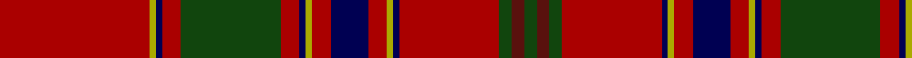

In pattern [GBGRBYRBRYBRGRBYR](/stripes/gbgrbyrbrybrgrbyr/).

This was sourced from weddslist.  It is a [17 stripe tartan](/stripes/stripes17/).

Original link http://www.weddslist.com/cgi-bin/tartans/pg.pl?source=tinsel

## Attestations

This cloth appears in 2 source records; the oldest owns this page.

- undated — Munro (weddslist, [record](http://www.weddslist.com/cgi-bin/tartans/pg.pl?source=tinsel))
- undated — Munro (weddslist, [record](http://www.weddslist.com/cgi-bin/tartans/pg.pl?source=x))

## Register references

External register numbers recorded for this tartan.

- Scottish Register of Tartans: [1166](https://www.tartanregister.gov.uk/tartanDetails.aspx?ref=1166)
- Scottish Register of Tartans: [1510](https://www.tartanregister.gov.uk/tartanDetails.aspx?ref=1510)
- Scottish Register of Tartans: [1758](https://www.tartanregister.gov.uk/tartanDetails.aspx?ref=1758)
- Scottish Register of Tartans: [2307](https://www.tartanregister.gov.uk/tartanDetails.aspx?ref=2307)
- Scottish Register of Tartans: [2349](https://www.tartanregister.gov.uk/tartanDetails.aspx?ref=2349)
- Scottish Register of Tartans: [2540](https://www.tartanregister.gov.uk/tartanDetails.aspx?ref=2540)
- Scottish Register of Tartans: [2582](https://www.tartanregister.gov.uk/tartanDetails.aspx?ref=2582)
- Scottish Register of Tartans: [2585](https://www.tartanregister.gov.uk/tartanDetails.aspx?ref=2585)
- Scottish Register of Tartans: [2625](https://www.tartanregister.gov.uk/tartanDetails.aspx?ref=2625)
- Scottish Register of Tartans: [2730](https://www.tartanregister.gov.uk/tartanDetails.aspx?ref=2730)
- Scottish Register of Tartans: [2862](https://www.tartanregister.gov.uk/tartanDetails.aspx?ref=2862)
- Scottish Register of Tartans: [3072](https://www.tartanregister.gov.uk/tartanDetails.aspx?ref=3072)
- Scottish Register of Tartans: [3555](https://www.tartanregister.gov.uk/tartanDetails.aspx?ref=3555)
- Scottish Register of Tartans: [4925](https://www.tartanregister.gov.uk/tartanDetails.aspx?ref=4925)
- Scottish Register of Tartans: [696](https://www.tartanregister.gov.uk/tartanDetails.aspx?ref=696)
- Scottish Register of Tartans: [697](https://www.tartanregister.gov.uk/tartanDetails.aspx?ref=697)
- Scottish Register of Tartans: [982](https://www.tartanregister.gov.uk/tartanDetails.aspx?ref=982)
- Scottish Tartans Authority (ITI): 1277
- Scottish Tartans Authority (ITI): 1429
- Scottish Tartans Authority (ITI): 218
- Scottish Tartans Authority (ITI): 977
- Scottish Tartans World Register: 1042
- Scottish Tartans World Register: 127
- Scottish Tartans World Register: 1277
- Scottish Tartans World Register: 1399
- Scottish Tartans World Register: 1429
- Scottish Tartans World Register: 1593
- Scottish Tartans World Register: 218
- Scottish Tartans World Register: 2218
- Scottish Tartans World Register: 3061
- Scottish Tartans World Register: 441
- Scottish Tartans World Register: 737
- Scottish Tartans World Register: 858
- Scottish Tartans World Register: 864
- Scottish Tartans World Register: 873
- Scottish Tartans World Register: 897
- Scottish Tartans World Register: 977
- Scottish Tartans World Register: 978

## Thread count
DR/48 LG2 DB2 DR6 DG32 DR6 DB2 LG2 DR6 DB12 DR6 LG2 DB2 DR32 DG4 DRa4 DG/4

## Palette
Each colour and its ΔE from the base-6 reference it is a variant of.

| Colour | Shade | Base | ΔE (OKLab) |
|---|---|---|---|
| DB | <code style="background-color:#000052;">#000052</code> `#000052` | B <code style="background-color:#2A418A;">#2A418A</code> | 0.20 |
| DG | <code style="background-color:#11450D;">#11450D</code> `#11450D` | G <code style="background-color:#006100;">#006100</code> | 0.09 |
| DR | <code style="background-color:#AA0000;">#AA0000</code> `#AA0000` | R <code style="background-color:#CC0000;">#CC0000</code> | 0.07 |
| DRa | <code style="background-color:#59110D;">#59110D</code> `#59110D` | B <code style="background-color:#2A418A;">#2A418A</code> | 0.22 |
| LG | <code style="background-color:#AAAA00;">#AAAA00</code> `#AAAA00` | Y <code style="background-color:#F2BF00;">#F2BF00</code> | 0.13 |

## Nearest tartans

The nearest existing variants by ΔTartan distance.

1. [Dalzell](/setts/s17/r24lr1db2r4dg32r4db2lr1r4db6r4lr1db2r32dg2dr3dg6~x2/) — ΔT 0.70
1. [Munro Clan Tartan Tartan Number: 974. Earliest known date: 1810-15 This sett is usually regarded as the correct form of the Munro tartan. It is illustrated by Smibert and the Smith brothers (both works published in 1850). In early versions bright pink replaces the crimson between the three green lines. Munros wear the 'Black Watch' as a Hunting tartan. See products available Copyright © Blair Urquhart, Comrie, 2015](/setts/s17/r24ly1db1r3g16r3db1ly1r3db6r3ly1db1r16g2m2g2~x2/) — ΔT 0.80
1. [Munro](/setts/s17/r24ly1db1r3g16r3db1ly1r3db6r3ly1db1r16g2r2g2~x4/) — ΔT 0.82
1. [Munro](/setts/s17/r24ly1db1r3g16r3db1ly1r3db6r3ly1db1r16g2r2g2~x2/) — ΔT 0.89
1. [Dalziel (Logan) Family Tartan Tartan Number: 969. Earliest known date: 1831 Dalziel or Dalzell tartan is similar to the Munro. The basic form of the design was used for a 'George IV' tartan produced in honour of the King's visit in 1822. The Barony of Dalzell in Lanarkshire is the origin of the name. In Old Scots it means 'I dare' and this is also the motto on the family coat of arms. A cadet branch of the family built the House of the Binns in West Lothian which is now owned by the National Trust for Scotland. See products available Copyright © Blair Urquhart, Comrie, 2015](/setts/s17/r24w1db2r4g32r4db2w1r4db6r4w1db2r32g2m3g6~x2/) — ΔT 0.97
1. [King George IV - 1824 (Artefact)](/setts/s17/r24w1dp1r3dg24r3dp1w1r3dp6r3w1dp1r24dg3lr3dg3~x2/) — ΔT 0.98
1. [Methodist Church](/setts/s12/r6dg2r2dg3k2r2db16k3dg4r34lo2r2~x2/) — ΔT 1.01
1. [Dalziel #2](/setts/s17/r24w1dp2r4g32r4dp2w1r4dp6r4w1dp2r32g2r3g6~x2/) — ΔT 1.01
1. [Grant](/setts/s15/r6db2r2dg24r2dg2r2db8r2b1r32db2r2db1r6~x2/) — ΔT 1.10
1. [All Ireland Red](/setts/s15/r6y2db2r30g2r2g4r2g2r1g20r1y2db2r4~x2/) — ΔT 1.15

## Neighbour map

Every grey dot is one of 14299 variants placed by the first two principal components of the ΔTartan feature space (44% of its variance). Red is this tartan; blue dots are its nearest — click one to open its page.

<svg viewBox="0 0 640 380" role="img" style="max-width:100%;height:auto;border:1px solid #e0e0e0;border-radius:4px;display:block" xmlns="http://www.w3.org/2000/svg"><image href="/nn/cloud.v1.png" width="640" height="380"/><a href="/setts/s17/r24lr1db2r4dg32r4db2lr1r4db6r4lr1db2r32dg2dr3dg6~x2/"><circle cx="371.3" cy="84.7" r="4" fill="#3465a4"><title>Dalzell</title></circle></a><a href="/setts/s17/r24ly1db1r3g16r3db1ly1r3db6r3ly1db1r16g2m2g2~x2/"><circle cx="375.6" cy="84.1" r="4" fill="#3465a4"><title>Munro Clan Tartan Tartan Number: 974. Earliest known date: 1810-15 This sett is usually regarded as the correct form of the Munro tartan. It is illustrated by Smibert and the Smith brothers (both works published in 1850). In early versions bright pink replaces the crimson between the three green lines. Munros wear the 'Black Watch' as a Hunting tartan. See products available Copyright © Blair Urquhart, Comrie, 2015</title></circle></a><a href="/setts/s17/r24ly1db1r3g16r3db1ly1r3db6r3ly1db1r16g2r2g2~x4/"><circle cx="375.8" cy="84.2" r="4" fill="#3465a4"><title>Munro</title></circle></a><a href="/setts/s17/r24ly1db1r3g16r3db1ly1r3db6r3ly1db1r16g2r2g2~x2/"><circle cx="376.1" cy="85.6" r="4" fill="#3465a4"><title>Munro</title></circle></a><a href="/setts/s17/r24w1db2r4g32r4db2w1r4db6r4w1db2r32g2m3g6~x2/"><circle cx="358.8" cy="72.8" r="4" fill="#3465a4"><title>Dalziel (Logan) Family Tartan Tartan Number: 969. Earliest known date: 1831 Dalziel or Dalzell tartan is similar to the Munro. The basic form of the design was used for a 'George IV' tartan produced in honour of the King's visit in 1822. The Barony of Dalzell in Lanarkshire is the origin of the name. In Old Scots it means 'I dare' and this is also the motto on the family coat of arms. A cadet branch of the family built the House of the Binns in West Lothian which is now owned by the National Trust for Scotland. See products available Copyright © Blair Urquhart, Comrie, 2015</title></circle></a><a href="/setts/s17/r24w1dp1r3dg24r3dp1w1r3dp6r3w1dp1r24dg3lr3dg3~x2/"><circle cx="349.2" cy="75.4" r="4" fill="#3465a4"><title>King George IV - 1824 (Artefact)</title></circle></a><a href="/setts/s12/r6dg2r2dg3k2r2db16k3dg4r34lo2r2~x2/"><circle cx="369.2" cy="113.9" r="4" fill="#3465a4"><title>Methodist Church</title></circle></a><a href="/setts/s17/r24w1dp2r4g32r4dp2w1r4dp6r4w1dp2r32g2r3g6~x2/"><circle cx="366.5" cy="74.0" r="4" fill="#3465a4"><title>Dalziel #2</title></circle></a><a href="/setts/s15/r6db2r2dg24r2dg2r2db8r2b1r32db2r2db1r6~x2/"><circle cx="403.7" cy="100.8" r="4" fill="#3465a4"><title>Grant</title></circle></a><a href="/setts/s15/r6y2db2r30g2r2g4r2g2r1g20r1y2db2r4~x2/"><circle cx="370.3" cy="78.1" r="4" fill="#3465a4"><title>All Ireland Red</title></circle></a><circle cx="381.1" cy="93.3" r="5" fill="#c00000"/></svg>

ID: /setts/s17/r24ly1db1r3dg16r3db1ly1r3db6r3ly1db1r16dg2dr2dg2~x2/
