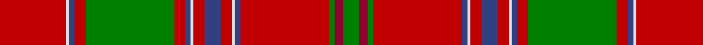

In pattern [GRGRBWRBRWBRGRBWR](/stripes/grgrbwrbrwbrgrbwr/).

This was sourced from weddslist.  It is a [17 stripe tartan](/stripes/stripes17/).

Original link http://www.weddslist.com/cgi-bin/tartans/pg.pl?source=sts

## Thread count
R/48 LN2 B4 R8 G64 R8 B4 LN2 R8 B12 R8 LN2 B4 R64 G4 DR6 G/12

## Palette
Each colour and the base-6 reference it is a variant of.

| Colour | Shade | Base |
|---|---|---|
| B | <code style="background-color:#304080;">#304080</code> `oklch(39.4% 0.109 270.2)` <small>#304080</small> | B <code style="background-color:#2A418A;">#2A418A</code> |
| DR | <code style="background-color:#900030;">#900030</code> `oklch(41.6% 0.166 13.6)` <small>#900030</small> | R <code style="background-color:#CC0000;">#CC0000</code> |
| G | <code style="background-color:#008000;">#008000</code> `oklch(52.0% 0.177 142.5)` <small>#008000</small> | G <code style="background-color:#006100;">#006100</code> |
| LN | <code style="background-color:#E0E0E0;">#E0E0E0</code> `oklch(90.7% 0.000 89.9)` <small>#E0E0E0</small> | W <code style="background-color:#F7F7F7;">#F7F7F7</code> |
| R | <code style="background-color:#C00000;">#C00000</code> `oklch(50.7% 0.208 29.2)` <small>#C00000</small> | R <code style="background-color:#CC0000;">#CC0000</code> |

## Nearest tartans

The nearest existing variants by ΔTartan distance.

1. [Dalziel (Logan) Family Tartan Tartan Number: 969. Earliest known date: 1831 Dalziel or Dalzell tartan is similar to the Munro. The basic form of the design was used for a 'George IV' tartan produced in honour of the King's visit in 1822. The Barony of Dalzell in Lanarkshire is the origin of the name. In Old Scots it means 'I dare' and this is also the motto on the family coat of arms. A cadet branch of the family built the House of the Binns in West Lothian which is now owned by the National Trust for Scotland. See products available Copyright © Blair Urquhart, Comrie, 2015](/setts/s17/r24w1db2r4g32r4db2w1r4db6r4w1db2r32g2m3g6~x2/) — ΔT 0.36
1. [All Ireland Red](/setts/s15/r6y2db2r30g2r2g4r2g2r1g20r1y2db2r4~x2/) — ΔT 0.42
1. [Munro (Clan)](/setts/s17/r36ly2db1r3g41r3db1ly2r3db12r3ly2db1r36g3r3g4~x2/) — ΔT 0.53
1. [Stirling, Weavers Guild](/setts/s17/r46ly2db2r5g46r5db2ly2r5db10r5ly2db2r49g5w5g5~x2/) — ΔT 0.56
1. [Dalziel #2](/setts/s17/r24w1dp2r4g32r4dp2w1r4dp6r4w1dp2r32g2r3g6~x2/) — ΔT 0.59
1. [Dalziel (Clan)](/setts/s17/r24w1dp2r4g32r4dp2w1r4dp6r4w1dp2r32g6r6g6~x2/) — ΔT 0.64
1. [Lochiel (Cameron)](/setts/s17/r36ly2dp1r3g41r3dp1ly2r3dp12r3ly2dp1r37g3r3g4~x2/) — ΔT 0.70
1. [Dalzell](/setts/s17/r24w1db2r8g52r8db2w1r8db12r8w1db2r52g4r6g6~x2/) — ΔT 0.76
1. [Munro](/setts/s17/r24ly1db1r3g16r3db1ly1r3db6r3ly1db1r16g2r2g2~x2/) — ΔT 0.77
1. [Lochiel, (Cameron)](/setts/s17/r36ly2db2r3g40r3db2ly2r3db12r3ly2db2r36g3dr3g4~x2/) — ΔT 0.79

## Neighbour map

Every grey dot is one of 14299 variants placed by the first two principal components of the ΔTartan feature space (44% of its variance). Red is this tartan; blue dots are its nearest — click one to open its page.

<svg viewBox="0 0 640 380" role="img" style="max-width:100%;height:auto;border:1px solid #e0e0e0;border-radius:4px;display:block" xmlns="http://www.w3.org/2000/svg"><image href="/nn/cloud.v1.png" width="640" height="380"/><a href="/setts/s17/r24w1db2r4g32r4db2w1r4db6r4w1db2r32g2m3g6~x2/"><circle cx="358.8" cy="72.8" r="4" fill="#3465a4"><title>Dalziel (Logan) Family Tartan Tartan Number: 969. Earliest known date: 1831 Dalziel or Dalzell tartan is similar to the Munro. The basic form of the design was used for a 'George IV' tartan produced in honour of the King's visit in 1822. The Barony of Dalzell in Lanarkshire is the origin of the name. In Old Scots it means 'I dare' and this is also the motto on the family coat of arms. A cadet branch of the family built the House of the Binns in West Lothian which is now owned by the National Trust for Scotland. See products available Copyright © Blair Urquhart, Comrie, 2015</title></circle></a><a href="/setts/s15/r6y2db2r30g2r2g4r2g2r1g20r1y2db2r4~x2/"><circle cx="370.3" cy="78.1" r="4" fill="#3465a4"><title>All Ireland Red</title></circle></a><a href="/setts/s17/r36ly2db1r3g41r3db1ly2r3db12r3ly2db1r36g3r3g4~x2/"><circle cx="361.9" cy="57.6" r="4" fill="#3465a4"><title>Munro (Clan)</title></circle></a><a href="/setts/s17/r46ly2db2r5g46r5db2ly2r5db10r5ly2db2r49g5w5g5~x2/"><circle cx="360.6" cy="75.2" r="4" fill="#3465a4"><title>Stirling, Weavers Guild</title></circle></a><a href="/setts/s17/r24w1dp2r4g32r4dp2w1r4dp6r4w1dp2r32g2r3g6~x2/"><circle cx="366.5" cy="74.0" r="4" fill="#3465a4"><title>Dalziel #2</title></circle></a><a href="/setts/s17/r24w1dp2r4g32r4dp2w1r4dp6r4w1dp2r32g6r6g6~x2/"><circle cx="345.3" cy="79.2" r="4" fill="#3465a4"><title>Dalziel (Clan)</title></circle></a><a href="/setts/s17/r36ly2dp1r3g41r3dp1ly2r3dp12r3ly2dp1r37g3r3g4~x2/"><circle cx="371.6" cy="58.5" r="4" fill="#3465a4"><title>Lochiel (Cameron)</title></circle></a><a href="/setts/s17/r24w1db2r8g52r8db2w1r8db12r8w1db2r52g4r6g6~x2/"><circle cx="376.5" cy="58.5" r="4" fill="#3465a4"><title>Dalzell</title></circle></a><a href="/setts/s17/r24ly1db1r3g16r3db1ly1r3db6r3ly1db1r16g2r2g2~x2/"><circle cx="376.1" cy="85.6" r="4" fill="#3465a4"><title>Munro</title></circle></a><a href="/setts/s17/r36ly2db2r3g40r3db2ly2r3db12r3ly2db2r36g3dr3g4~x2/"><circle cx="324.5" cy="84.4" r="4" fill="#3465a4"><title>Lochiel, (Cameron)</title></circle></a><circle cx="357.5" cy="73.4" r="5" fill="#c00000"/></svg>

ID: /setts/s17/r24w1db2r4g32r4db2w1r4db6r4w1db2r32g2r3g6~x2/
