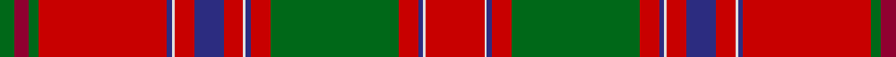

This page is one **sett** — a single exact thread-count. It belongs to the [tartan](/tartans/r24w1db2r8g52r8db2w1r8db12r8w1db2r52g4r6g6/)
(the same proportion at any scale), whose colour order is pattern [GRGRBWRBRWBRGRBWR](/stripes/grgrbwrbrwbrgrbwr/).

Sourced from logan-1831.  It is a [17 stripe tartan](/stripes/stripes17/).

Original link /posts/logans-scottish-gael/

## Provenance

<figure class="logan-scan">

<figcaption>Logan, The Scottish Gaël (1831), vol. II p. 403 — page-scan crop (276,1593)–(530,2249)</figcaption>
</figure>

James Logan recorded the **Dalzell** sett in 1831, on page 403 of the *Table of Clan Tartans* in *The Scottish Gaël* — the earliest systematic published collection of clan setts. Logan gives the stripe widths in eighths of an inch, measured across the cloth and reflected about each end (a half-sett):

> 6 red · ¼ white · ½ blue · 2 red · 13 green · 2 red · ½ blue · ¼ white · 2 red · 3 blue · 2 red · ¼ white · ½ blue · 13 red · 1 green · 1½ crimson · 1½ green

In threads (at 8 to the eighth-inch) that is `R/48 W2 B4 R16 G104 R16 B4 W2 R16 B24 R16 W2 B4 R104 G8 C12 G/12`. Logan named his colours rather than dyeing to a standard, so the palette here is the Dictionary's modern reading of his names.

See [Logan's Scottish Gaël](/posts/logans-scottish-gael/) for the full table and method.

## Related setts

Later records of the **Dalzell** name adjusted Logan's counts: [Dalzell](/setts/s17/r24w1b2r4g32r4b2w1r4b6r4w1b2r32g2r3g6~b00004c-g004c00-rc80000-wd0d0d0/); [Dalzell](/setts/s17/r24y1b2r4g32r4b2y1r4b6r4y1b2r32g2ba3g6~b000052-ba59110d-g11450d-raa0000-yaaaaaa~x2/); [Dalzell](/setts/s17/r24y1b2r4g32r4b2y1r4b6r4y1b2r32g2ba3g6~b000052-ba59110d-g11450d-raa0000-yaaaaaa/). Compare their thread counts with Logan's above.

## Thread count
R/48 LN2 DB4 R16 G104 R16 DB4 LN2 R16 DB24 R16 LN2 DB4 R104 G8 DR12 G/12

## Palette

Palette: <strong>Tartan Register</strong> <small style="color:#888">(4 of 5 colours)</small>
<table><thead><tr><th>Colour</th><th>Threads</th><th>Shade</th><th>Base</th><th>OKLCh</th></tr></thead><tbody><tr><td>R/</td><td style="text-align:right;font-variant-numeric:tabular-nums">48</td><td><code style="background-color:#C80000;">#C80000</code> <small style="color:#888">#C80000</small></td><td>R <code style="background-color:#CC0000;">#CC0000</code></td><td><small style="color:#888">oklch(52.3% 0.215 29.2)</small></td></tr><tr><td>LN</td><td style="text-align:right;font-variant-numeric:tabular-nums">2</td><td><code style="background-color:#E0E0E0;">#E0E0E0</code> <small style="color:#888">#E0E0E0</small></td><td>W <code style="background-color:#F7F7F7;">#F7F7F7</code></td><td><small style="color:#888">oklch(90.7% 0.000 89.9)</small></td></tr><tr><td>DB</td><td style="text-align:right;font-variant-numeric:tabular-nums">4</td><td><code style="background-color:#2C2C80;">#2C2C80</code> <small style="color:#888">#2C2C80</small></td><td>B <code style="background-color:#2A418A;">#2A418A</code></td><td><small style="color:#888">oklch(35.0% 0.138 276.6)</small></td></tr><tr><td>R</td><td style="text-align:right;font-variant-numeric:tabular-nums">16</td><td><code style="background-color:#C80000;">#C80000</code> <small style="color:#888">#C80000</small></td><td>R <code style="background-color:#CC0000;">#CC0000</code></td><td><small style="color:#888">oklch(52.3% 0.215 29.2)</small></td></tr><tr><td>G</td><td style="text-align:right;font-variant-numeric:tabular-nums">104</td><td><code style="background-color:#006818;">#006818</code> <small style="color:#888">#006818</small></td><td>G <code style="background-color:#006100;">#006100</code></td><td><small style="color:#888">oklch(45.0% 0.142 145.0)</small></td></tr><tr><td>R</td><td style="text-align:right;font-variant-numeric:tabular-nums">16</td><td><code style="background-color:#C80000;">#C80000</code> <small style="color:#888">#C80000</small></td><td>R <code style="background-color:#CC0000;">#CC0000</code></td><td><small style="color:#888">oklch(52.3% 0.215 29.2)</small></td></tr><tr><td>DB</td><td style="text-align:right;font-variant-numeric:tabular-nums">4</td><td><code style="background-color:#2C2C80;">#2C2C80</code> <small style="color:#888">#2C2C80</small></td><td>B <code style="background-color:#2A418A;">#2A418A</code></td><td><small style="color:#888">oklch(35.0% 0.138 276.6)</small></td></tr><tr><td>LN</td><td style="text-align:right;font-variant-numeric:tabular-nums">2</td><td><code style="background-color:#E0E0E0;">#E0E0E0</code> <small style="color:#888">#E0E0E0</small></td><td>W <code style="background-color:#F7F7F7;">#F7F7F7</code></td><td><small style="color:#888">oklch(90.7% 0.000 89.9)</small></td></tr><tr><td>R</td><td style="text-align:right;font-variant-numeric:tabular-nums">16</td><td><code style="background-color:#C80000;">#C80000</code> <small style="color:#888">#C80000</small></td><td>R <code style="background-color:#CC0000;">#CC0000</code></td><td><small style="color:#888">oklch(52.3% 0.215 29.2)</small></td></tr><tr><td>DB</td><td style="text-align:right;font-variant-numeric:tabular-nums">24</td><td><code style="background-color:#2C2C80;">#2C2C80</code> <small style="color:#888">#2C2C80</small></td><td>B <code style="background-color:#2A418A;">#2A418A</code></td><td><small style="color:#888">oklch(35.0% 0.138 276.6)</small></td></tr><tr><td>R</td><td style="text-align:right;font-variant-numeric:tabular-nums">16</td><td><code style="background-color:#C80000;">#C80000</code> <small style="color:#888">#C80000</small></td><td>R <code style="background-color:#CC0000;">#CC0000</code></td><td><small style="color:#888">oklch(52.3% 0.215 29.2)</small></td></tr><tr><td>LN</td><td style="text-align:right;font-variant-numeric:tabular-nums">2</td><td><code style="background-color:#E0E0E0;">#E0E0E0</code> <small style="color:#888">#E0E0E0</small></td><td>W <code style="background-color:#F7F7F7;">#F7F7F7</code></td><td><small style="color:#888">oklch(90.7% 0.000 89.9)</small></td></tr><tr><td>DB</td><td style="text-align:right;font-variant-numeric:tabular-nums">4</td><td><code style="background-color:#2C2C80;">#2C2C80</code> <small style="color:#888">#2C2C80</small></td><td>B <code style="background-color:#2A418A;">#2A418A</code></td><td><small style="color:#888">oklch(35.0% 0.138 276.6)</small></td></tr><tr><td>R</td><td style="text-align:right;font-variant-numeric:tabular-nums">104</td><td><code style="background-color:#C80000;">#C80000</code> <small style="color:#888">#C80000</small></td><td>R <code style="background-color:#CC0000;">#CC0000</code></td><td><small style="color:#888">oklch(52.3% 0.215 29.2)</small></td></tr><tr><td>G</td><td style="text-align:right;font-variant-numeric:tabular-nums">8</td><td><code style="background-color:#006818;">#006818</code> <small style="color:#888">#006818</small></td><td>G <code style="background-color:#006100;">#006100</code></td><td><small style="color:#888">oklch(45.0% 0.142 145.0)</small></td></tr><tr><td>DR</td><td style="text-align:right;font-variant-numeric:tabular-nums">12</td><td><code style="background-color:#900030;">#900030</code> <small style="color:#888">#900030</small></td><td>R <code style="background-color:#CC0000;">#CC0000</code></td><td><small style="color:#888">oklch(41.6% 0.166 13.6)</small></td></tr><tr><td>G/</td><td style="text-align:right;font-variant-numeric:tabular-nums">12</td><td><code style="background-color:#006818;">#006818</code> <small style="color:#888">#006818</small></td><td>G <code style="background-color:#006100;">#006100</code></td><td><small style="color:#888">oklch(45.0% 0.142 145.0)</small></td></tr></tbody></table>

## Nearest tartans

The nearest existing variants by ΔTartan distance, with this tartan at the top so the swatches line up against it.

ΔTartan

Tartan

Sett

—

<a href="/ttd/edit/#slug=r24w1db2r8g52r8db2w1r8db12r8w1db2r52g4r6g6~x2">Dalzell</a> <a class="nn-out" href="/setts/s17/r24w1db2r8g52r8db2w1r8db12r8w1db2r52g4r6g6~x2/" title="open its dictionary page">↗</a>

0.44

<a href="/ttd/edit/#slug=r36ly2db1r3g41r3db1ly2r3db12r3ly2db1r36g3r3g4~x2">Munro (Clan)</a> <a class="nn-out" href="/setts/s17/r36ly2db1r3g41r3db1ly2r3db12r3ly2db1r36g3r3g4~x2/" title="open its dictionary page">↗</a>

0.52

<a href="/ttd/edit/#slug=r36ly2dp1r3g41r3dp1ly2r3dp12r3ly2dp1r37g3r3g4~x2">Lochiel (Cameron)</a> <a class="nn-out" href="/setts/s17/r36ly2dp1r3g41r3dp1ly2r3dp12r3ly2dp1r37g3r3g4~x2/" title="open its dictionary page">↗</a>

0.68

<a href="/ttd/edit/#slug=r24w1db2r4g32r4db2w1r4db6r4w1db2r32g2m3g6~x2">Dalziel (Logan) Family Tartan Tartan Number: 969. Earliest known date: 1831 Dalziel or Dalzell tartan is similar to the Munro. The basic form of the design was used for a 'George IV' tartan produced in honour of the King's visit in 1822. The Barony of Dalzell in Lanarkshire is the origin of the name. In Old Scots it means 'I dare' and this is also the motto on the family coat of arms. A cadet branch of the family built the House of the Binns in West Lothian which is now owned by the National Trust for Scotland. See products available Copyright © Blair Urquhart, Comrie, 2015</a> <a class="nn-out" href="/setts/s17/r24w1db2r4g32r4db2w1r4db6r4w1db2r32g2m3g6~x2/" title="open its dictionary page">↗</a>

0.76

<a href="/ttd/edit/#slug=r24w1dp2r4g32r4dp2w1r4dp6r4w1dp2r32g2r3g6~x2">Dalziel #2</a> <a class="nn-out" href="/setts/s17/r24w1dp2r4g32r4dp2w1r4dp6r4w1dp2r32g2r3g6~x2/" title="open its dictionary page">↗</a>

0.76

<a href="/ttd/edit/#slug=r24w1db2r4g32r4db2w1r4db6r4w1db2r32g2r3g6~x2">Dalziel</a> <a class="nn-out" href="/setts/s17/r24w1db2r4g32r4db2w1r4db6r4w1db2r32g2r3g6~x2/" title="open its dictionary page">↗</a>

0.81

<a href="/ttd/edit/#slug=r24w1dp2r4g32r4dp2w1r4dp6r4w1dp2r32g6r6g6~x2">Dalziel (Clan)</a> <a class="nn-out" href="/setts/s17/r24w1dp2r4g32r4dp2w1r4dp6r4w1dp2r32g6r6g6~x2/" title="open its dictionary page">↗</a>

0.83

<a href="/ttd/edit/#slug=r55w1r1g2r2g49r2g2r2db15r2g2r2r53g2r2r2g10~x4">Dalriada</a> <a class="nn-out" href="/setts/s18/r55w1r1g2r2g49r2g2r2db15r2g2r2r53g2r2r2g10~x4/" title="open its dictionary page">↗</a>

0.91

<a href="/ttd/edit/#slug=r6y2db2r30g2r2g4r2g2r1g20r1y2db2r4~x2">All Ireland Red</a> <a class="nn-out" href="/setts/s15/r6y2db2r30g2r2g4r2g2r1g20r1y2db2r4~x2/" title="open its dictionary page">↗</a>

0.97

<a href="/ttd/edit/#slug=r42k1dg12lr2r3k1r3lr2dg2n12k4r3lr4dg3~x2">MacFarlane</a> <a class="nn-out" href="/setts/s14/r42k1dg12lr2r3k1r3lr2dg2n12k4r3lr4dg3~x2/" title="open its dictionary page">↗</a>

0.97

<a href="/ttd/edit/#slug=r42k1dg12lr2r3k1r3lr2dg2n12k4r3lr4dg3">MacFarlane</a> <a class="nn-out" href="/setts/s14/r42k1dg12lr2r3k1r3lr2dg2n12k4r3lr4dg3/" title="open its dictionary page">↗</a>

## Neighbour map

Every grey dot is one of 14299 variants placed by the first two principal components of the ΔTartan feature space (44% of its variance). Red is this tartan; blue dots are its nearest — click one to open its page.

<svg viewBox="0 0 640 380" role="img" style="max-width:100%;height:auto;border:1px solid #e0e0e0;border-radius:4px;display:block" xmlns="http://www.w3.org/2000/svg"><image href="/nn/cloud.v1.png" width="640" height="380"/><a href="/setts/s17/r36ly2db1r3g41r3db1ly2r3db12r3ly2db1r36g3r3g4~x2/"><circle cx="361.9" cy="57.6" r="4" fill="#3465a4"><title>Munro (Clan)</title></circle></a><a href="/setts/s17/r36ly2dp1r3g41r3dp1ly2r3dp12r3ly2dp1r37g3r3g4~x2/"><circle cx="371.6" cy="58.5" r="4" fill="#3465a4"><title>Lochiel (Cameron)</title></circle></a><a href="/setts/s17/r24w1db2r4g32r4db2w1r4db6r4w1db2r32g2m3g6~x2/"><circle cx="358.8" cy="72.8" r="4" fill="#3465a4"><title>Dalziel (Logan) Family Tartan Tartan Number: 969. Earliest known date: 1831 Dalziel or Dalzell tartan is similar to the Munro. The basic form of the design was used for a 'George IV' tartan produced in honour of the King's visit in 1822. The Barony of Dalzell in Lanarkshire is the origin of the name. In Old Scots it means 'I dare' and this is also the motto on the family coat of arms. A cadet branch of the family built the House of the Binns in West Lothian which is now owned by the National Trust for Scotland. See products available Copyright © Blair Urquhart, Comrie, 2015</title></circle></a><a href="/setts/s17/r24w1dp2r4g32r4dp2w1r4dp6r4w1dp2r32g2r3g6~x2/"><circle cx="366.5" cy="74.0" r="4" fill="#3465a4"><title>Dalziel #2</title></circle></a><a href="/setts/s17/r24w1db2r4g32r4db2w1r4db6r4w1db2r32g2r3g6~x2/"><circle cx="357.5" cy="73.4" r="4" fill="#3465a4"><title>Dalziel</title></circle></a><a href="/setts/s17/r24w1dp2r4g32r4dp2w1r4dp6r4w1dp2r32g6r6g6~x2/"><circle cx="345.3" cy="79.2" r="4" fill="#3465a4"><title>Dalziel (Clan)</title></circle></a><a href="/setts/s18/r55w1r1g2r2g49r2g2r2db15r2g2r2r53g2r2r2g10~x4/"><circle cx="385.3" cy="34.2" r="4" fill="#3465a4"><title>Dalriada</title></circle></a><a href="/setts/s15/r6y2db2r30g2r2g4r2g2r1g20r1y2db2r4~x2/"><circle cx="370.3" cy="78.1" r="4" fill="#3465a4"><title>All Ireland Red</title></circle></a><a href="/setts/s14/r42k1dg12lr2r3k1r3lr2dg2n12k4r3lr4dg3~x2/"><circle cx="358.7" cy="63.1" r="4" fill="#3465a4"><title>MacFarlane</title></circle></a><a href="/setts/s14/r42k1dg12lr2r3k1r3lr2dg2n12k4r3lr4dg3/"><circle cx="358.7" cy="63.1" r="4" fill="#3465a4"><title>MacFarlane</title></circle></a><circle cx="376.5" cy="58.5" r="5" fill="#c00000"/></svg>

ID: /setts/s17/r24w1db2r8g52r8db2w1r8db12r8w1db2r52g4r6g6~x2/
