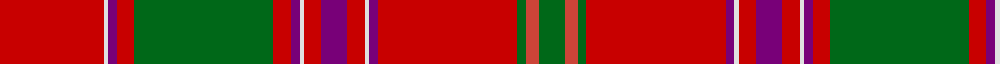

This page is one **sett** — a single exact thread-count. It belongs to the [tartan](/tartans/ra24ln1p2ra4g32ra4p2ln1ra4p6ra4ln1p2ra32g2r3g6/)
(the same proportion at any scale), whose colour order is pattern [GRGRBWRBRWBRGRBWR](/stripes/grgrbwrbrwbrgrbwr/).

Sourced from register-of-tartans.  It is a [17 stripe tartan](/stripes/stripes17/).

Original link https://www.tartanregister.gov.uk/tartanDetails.aspx?ref=886

## Register references

External register numbers recorded for this tartan.

- Scottish Register of Tartans: [886](https://www.tartanregister.gov.uk/tartanDetails.aspx?ref=886)
- Scottish Tartans Authority (ITI): 969
- Scottish Tartans World Register: 969

## Thread count
Ra/48 LN2 P4 Ra8 G64 Ra8 P4 LN2 Ra8 P12 Ra8 LN2 P4 Ra64 G4 R6 G/12

## Palette
Each colour and the base-6 reference it is a variant of.

| Colour | Shade | Base |
|---|---|---|
| G | <code style="background-color:#006818;">#006818</code> `oklch(45.0% 0.142 145.0)` <small>#006818</small> | G <code style="background-color:#006100;">#006100</code> |
| LN | <code style="background-color:#E0E0E0;">#E0E0E0</code> `oklch(90.7% 0.000 89.9)` <small>#E0E0E0</small> | W <code style="background-color:#F7F7F7;">#F7F7F7</code> |
| P | <code style="background-color:#780078;">#780078</code> `oklch(40.2% 0.185 328.4)` <small>#780078</small> | B <code style="background-color:#2A418A;">#2A418A</code> |
| R | <code style="background-color:#CC4438;">#CC4438</code> `oklch(57.7% 0.174 28.7)` <small>#CC4438</small> | R <code style="background-color:#CC0000;">#CC0000</code> |
| Ra | <code style="background-color:#C80000;">#C80000</code> `oklch(52.3% 0.215 29.2)` <small>#C80000</small> | R <code style="background-color:#CC0000;">#CC0000</code> |

## Nearest tartans

The nearest existing variants by ΔTartan distance, with this tartan at the top so the swatches line up against it.

ΔTartan

Tartan

Sett

—

<a href="/ttd/edit/#slug=r24w1dp2r4g32r4dp2w1r4dp6r4w1dp2r32g2r3g6~x2">Dalziel #2</a> <a class="nn-out" href="/setts/s17/r24w1dp2r4g32r4dp2w1r4dp6r4w1dp2r32g2r3g6~x2/" title="open its dictionary page">↗</a>

0.37

<a href="/ttd/edit/#slug=r24w1db2r4g32r4db2w1r4db6r4w1db2r32g2m3g6~x2">Dalziel (Logan) Family Tartan Tartan Number: 969. Earliest known date: 1831 Dalziel or Dalzell tartan is similar to the Munro. The basic form of the design was used for a 'George IV' tartan produced in honour of the King's visit in 1822. The Barony of Dalzell in Lanarkshire is the origin of the name. In Old Scots it means 'I dare' and this is also the motto on the family coat of arms. A cadet branch of the family built the House of the Binns in West Lothian which is now owned by the National Trust for Scotland. See products available Copyright © Blair Urquhart, Comrie, 2015</a> <a class="nn-out" href="/setts/s17/r24w1db2r4g32r4db2w1r4db6r4w1db2r32g2m3g6~x2/" title="open its dictionary page">↗</a>

0.38

<a href="/ttd/edit/#slug=r24w1dp2r4g32r4dp2w1r4dp6r4w1dp2r32g6r6g6~x2">Dalziel (Clan)</a> <a class="nn-out" href="/setts/s17/r24w1dp2r4g32r4dp2w1r4dp6r4w1dp2r32g6r6g6~x2/" title="open its dictionary page">↗</a>

0.49

<a href="/ttd/edit/#slug=r36ly2dp1r3g41r3dp1ly2r3dp12r3ly2dp1r37g3r3g4~x2">Lochiel (Cameron)</a> <a class="nn-out" href="/setts/s17/r36ly2dp1r3g41r3dp1ly2r3dp12r3ly2dp1r37g3r3g4~x2/" title="open its dictionary page">↗</a>

0.59

<a href="/ttd/edit/#slug=r24w1db2r4g32r4db2w1r4db6r4w1db2r32g2r3g6~x2">Dalziel</a> <a class="nn-out" href="/setts/s17/r24w1db2r4g32r4db2w1r4db6r4w1db2r32g2r3g6~x2/" title="open its dictionary page">↗</a>

0.64

<a href="/ttd/edit/#slug=r6y2db2r30g2r2g4r2g2r1g20r1y2db2r4~x2">All Ireland Red</a> <a class="nn-out" href="/setts/s15/r6y2db2r30g2r2g4r2g2r1g20r1y2db2r4~x2/" title="open its dictionary page">↗</a>

0.65

<a href="/ttd/edit/#slug=r24ly1db1r3g16r3db1ly1r3db6r3ly1db1r16g2r2g2~x4">Munro</a> <a class="nn-out" href="/setts/s17/r24ly1db1r3g16r3db1ly1r3db6r3ly1db1r16g2r2g2~x4/" title="open its dictionary page">↗</a>

0.65

<a href="/ttd/edit/#slug=r36ly2db1r3g41r3db1ly2r3db12r3ly2db1r36g3r3g4~x2">Munro (Clan)</a> <a class="nn-out" href="/setts/s17/r36ly2db1r3g41r3db1ly2r3db12r3ly2db1r36g3r3g4~x2/" title="open its dictionary page">↗</a>

0.66

<a href="/ttd/edit/#slug=r24ly1db1r3g16r3db1ly1r3db6r3ly1db1r16g2r2g2~x2">Munro</a> <a class="nn-out" href="/setts/s17/r24ly1db1r3g16r3db1ly1r3db6r3ly1db1r16g2r2g2~x2/" title="open its dictionary page">↗</a>

0.66

<a href="/ttd/edit/#slug=r24ly1db1r3g16r3db1ly1r3db6r3ly1db1r16g2m2g2~x2">Munro Clan Tartan Tartan Number: 974. Earliest known date: 1810-15 This sett is usually regarded as the correct form of the Munro tartan. It is illustrated by Smibert and the Smith brothers (both works published in 1850). In early versions bright pink replaces the crimson between the three green lines. Munros wear the 'Black Watch' as a Hunting tartan. See products available Copyright © Blair Urquhart, Comrie, 2015</a> <a class="nn-out" href="/setts/s17/r24ly1db1r3g16r3db1ly1r3db6r3ly1db1r16g2m2g2~x2/" title="open its dictionary page">↗</a>

0.76

<a href="/ttd/edit/#slug=r24w1db2r8g52r8db2w1r8db12r8w1db2r52g4r6g6~x2">Dalzell</a> <a class="nn-out" href="/setts/s17/r24w1db2r8g52r8db2w1r8db12r8w1db2r52g4r6g6~x2/" title="open its dictionary page">↗</a>

## Neighbour map

Every grey dot is one of 14299 variants placed by the first two principal components of the ΔTartan feature space (44% of its variance). Red is this tartan; blue dots are its nearest — click one to open its page.

<svg viewBox="0 0 640 380" role="img" style="max-width:100%;height:auto;border:1px solid #e0e0e0;border-radius:4px;display:block" xmlns="http://www.w3.org/2000/svg"><image href="/nn/cloud.v1.png" width="640" height="380"/><a href="/setts/s17/r24w1db2r4g32r4db2w1r4db6r4w1db2r32g2m3g6~x2/"><circle cx="358.8" cy="72.8" r="4" fill="#3465a4"><title>Dalziel (Logan) Family Tartan Tartan Number: 969. Earliest known date: 1831 Dalziel or Dalzell tartan is similar to the Munro. The basic form of the design was used for a 'George IV' tartan produced in honour of the King's visit in 1822. The Barony of Dalzell in Lanarkshire is the origin of the name. In Old Scots it means 'I dare' and this is also the motto on the family coat of arms. A cadet branch of the family built the House of the Binns in West Lothian which is now owned by the National Trust for Scotland. See products available Copyright © Blair Urquhart, Comrie, 2015</title></circle></a><a href="/setts/s17/r24w1dp2r4g32r4dp2w1r4dp6r4w1dp2r32g6r6g6~x2/"><circle cx="345.3" cy="79.2" r="4" fill="#3465a4"><title>Dalziel (Clan)</title></circle></a><a href="/setts/s17/r36ly2dp1r3g41r3dp1ly2r3dp12r3ly2dp1r37g3r3g4~x2/"><circle cx="371.6" cy="58.5" r="4" fill="#3465a4"><title>Lochiel (Cameron)</title></circle></a><a href="/setts/s17/r24w1db2r4g32r4db2w1r4db6r4w1db2r32g2r3g6~x2/"><circle cx="357.5" cy="73.4" r="4" fill="#3465a4"><title>Dalziel</title></circle></a><a href="/setts/s15/r6y2db2r30g2r2g4r2g2r1g20r1y2db2r4~x2/"><circle cx="370.3" cy="78.1" r="4" fill="#3465a4"><title>All Ireland Red</title></circle></a><a href="/setts/s17/r24ly1db1r3g16r3db1ly1r3db6r3ly1db1r16g2r2g2~x4/"><circle cx="375.8" cy="84.2" r="4" fill="#3465a4"><title>Munro</title></circle></a><a href="/setts/s17/r36ly2db1r3g41r3db1ly2r3db12r3ly2db1r36g3r3g4~x2/"><circle cx="361.9" cy="57.6" r="4" fill="#3465a4"><title>Munro (Clan)</title></circle></a><a href="/setts/s17/r24ly1db1r3g16r3db1ly1r3db6r3ly1db1r16g2r2g2~x2/"><circle cx="376.1" cy="85.6" r="4" fill="#3465a4"><title>Munro</title></circle></a><a href="/setts/s17/r24ly1db1r3g16r3db1ly1r3db6r3ly1db1r16g2m2g2~x2/"><circle cx="375.6" cy="84.1" r="4" fill="#3465a4"><title>Munro Clan Tartan Tartan Number: 974. Earliest known date: 1810-15 This sett is usually regarded as the correct form of the Munro tartan. It is illustrated by Smibert and the Smith brothers (both works published in 1850). In early versions bright pink replaces the crimson between the three green lines. Munros wear the 'Black Watch' as a Hunting tartan. See products available Copyright © Blair Urquhart, Comrie, 2015</title></circle></a><a href="/setts/s17/r24w1db2r8g52r8db2w1r8db12r8w1db2r52g4r6g6~x2/"><circle cx="376.5" cy="58.5" r="4" fill="#3465a4"><title>Dalzell</title></circle></a><circle cx="366.5" cy="74.0" r="5" fill="#c00000"/></svg>

ID: /setts/s17/r24w1dp2r4g32r4dp2w1r4dp6r4w1dp2r32g2r3g6~x2/
