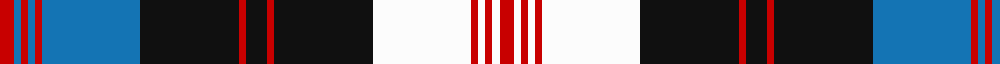

In pattern [RBRBRBKRKRKWRWRWR](/patterns/rbrbrbkrkrkwrwrwr/).

This was sourced from register-of-tartans.  It is a [17 stripes tartan](/stripes/stripes17/).

Original link https://www.tartanregister.gov.uk/tartanDetails.aspx?ref=5121

## Register references

External register numbers recorded for this tartan.

- Scottish Register of Tartans: [5121](https://www.tartanregister.gov.uk/tartanDetails.aspx?ref=5121)
- Scottish Tartans Authority (ITI): 3515

## Thread count
R/8 B4 R4 B4 R4 B56 K56 R4 K12 R4 K56 Wa56 R4 Wa4 R4 Wa4 R/8

## Palette
Each colour and its ΔE from the base-6 reference it is a variant of.

| Colour | Shade | Base | ΔE (OKLab) |
|---|---|---|---|
| B | <code style="background-color:#1474B4;">#1474B4</code> `#1474B4` | B <code style="background-color:#2A418A;">#2A418A</code> | 0.15 |
| DB | <code style="background-color:#1C0070;">#1C0070</code> `#1C0070` | B <code style="background-color:#2A418A;">#2A418A</code> | 0.14 |
| DBa | <code style="background-color:#2C2C80;">#2C2C80</code> `#2C2C80` | B <code style="background-color:#2A418A;">#2A418A</code> | 0.06 |
| DR | <code style="background-color:#880000;">#880000</code> `#880000` | R <code style="background-color:#CC0000;">#CC0000</code> | 0.15 |
| K | <code style="background-color:#101010;">#101010</code> `#101010` | K <code style="background-color:#000000;">#000000</code> | 0.17 |
| R | <code style="background-color:#C80000;">#C80000</code> `#C80000` | R <code style="background-color:#CC0000;">#CC0000</code> | 0.01 |
| W | <code style="background-color:#FCFCFC;">#FCFCFC</code> `#FCFCFC` | W <code style="background-color:#F7F7F7;">#F7F7F7</code> | 0.01 |
| Wa | <code style="background-color:#FCFCFC;">#FCFCFC</code> `#FCFCFC` | W <code style="background-color:#F7F7F7;">#F7F7F7</code> | 0.01 |

## Nearest tartans

The nearest existing variants by ΔTartan distance.

1. [Scott (MacRae)](/setts/s20/k4b2w1k16w1b3w16b2w6r2w6b2w16b3w1k16w1b2k4r2~b2c2c80-k101010-rc80000-we0e0e0~x2/) — ΔT 1.10
1. [Tiger of Sweden](/setts/s14/b3g1k1b2w16b2k4g1k1b16w2b2k1g3~b202060-g006818-k101010-wc0c0c0~x2/) — ΔT 1.11
1. [Scott, (MacRae)](/setts/s11/r2w6b2w16b3w1k16w1b2k4r2~b304080-k000000-rc00000-we0e0e0~x2/) — ΔT 1.16
1. [Anderson Blue](/setts/s15/b8k1r1k1b22r1k14r1w2r1w6k3r1w3r1~b6480ac-k101010-ra07c58-we0e0e0~x2/) — ΔT 1.19
1. [Carsaig](/setts/s12/y12r3y3b4y16ra3y3ra3y3ra16b52y4~b000048-r880000-rab07430-yacacac/) — ΔT 1.23
1. [MacRae Dress Clan Tartan Tartan Number: 2186. Earliest known date: pre 2003 Also known as Scott Dress. See products available Copyright © Blair Urquhart, Comrie, 2015](/setts/s11/r2w6b2w16b3w1k16w1b2k4r2~b2c2c80-k101010-rc80000-we0e0e0~x2/) — ΔT 1.23
1. [Walker, dress](/setts/s12/g4k2r7k15r3k3r3k7w28r7w6r2~g908000-k000030-r900030-we0e0e0/) — ΔT 1.23
1. [Chartered Institute of Bankers](/setts/s20/k34g5k5g8k5g56w5g5w36y5w36g5w5g56k5g8k5g5k34y5~g808080-k101010-w98d0f0-ye8c000/) — ΔT 1.27
1. [O'Sullivan-Beare](/setts/s14/k24r8w3k3w3k3w40k3w3k3w3r8k24r8~k101010-r888888-wc0c0c0~x2/) — ΔT 1.30
1. [Wcwm 1586](/setts/s18/b3w8r2w2r2w2r8k2r2k2r2k8w2b22w2b2r2b3~b3474fc-k000000-ra0783c-wf0f0b0~x2/) — ΔT 1.31

## Neighbour map

Every grey dot is one of 15726 variants placed by the first two principal components of the ΔTartan feature space (44% of its variance). Red is this tartan; blue dots are its nearest — click one to open its page.

<svg viewBox="0 0 640 380" role="img" style="max-width:100%;height:auto;border:1px solid #e0e0e0;border-radius:4px;display:block" xmlns="http://www.w3.org/2000/svg"><image href="/nn/cloud.v1.png" width="640" height="380"/><a href="/setts/s20/k4b2w1k16w1b3w16b2w6r2w6b2w16b3w1k16w1b2k4r2~b2c2c80-k101010-rc80000-we0e0e0~x2/"><circle cx="207.3" cy="104.3" r="4" fill="#3465a4"><title>Scott (MacRae)</title></circle></a><a href="/setts/s14/b3g1k1b2w16b2k4g1k1b16w2b2k1g3~b202060-g006818-k101010-wc0c0c0~x2/"><circle cx="234.8" cy="117.6" r="4" fill="#3465a4"><title>Tiger of Sweden</title></circle></a><a href="/setts/s11/r2w6b2w16b3w1k16w1b2k4r2~b304080-k000000-rc00000-we0e0e0~x2/"><circle cx="205.5" cy="127.9" r="4" fill="#3465a4"><title>Scott, (MacRae)</title></circle></a><a href="/setts/s15/b8k1r1k1b22r1k14r1w2r1w6k3r1w3r1~b6480ac-k101010-ra07c58-we0e0e0~x2/"><circle cx="244.1" cy="96.1" r="4" fill="#3465a4"><title>Anderson Blue</title></circle></a><a href="/setts/s12/y12r3y3b4y16ra3y3ra3y3ra16b52y4~b000048-r880000-rab07430-yacacac/"><circle cx="250.6" cy="116.9" r="4" fill="#3465a4"><title>Carsaig</title></circle></a><a href="/setts/s11/r2w6b2w16b3w1k16w1b2k4r2~b2c2c80-k101010-rc80000-we0e0e0~x2/"><circle cx="209.2" cy="126.4" r="4" fill="#3465a4"><title>MacRae Dress Clan Tartan Tartan Number: 2186. Earliest known date: pre 2003 Also known as Scott Dress. See products available Copyright © Blair Urquhart, Comrie, 2015</title></circle></a><a href="/setts/s12/g4k2r7k15r3k3r3k7w28r7w6r2~g908000-k000030-r900030-we0e0e0/"><circle cx="175.0" cy="130.5" r="4" fill="#3465a4"><title>Walker, dress</title></circle></a><a href="/setts/s20/k34g5k5g8k5g56w5g5w36y5w36g5w5g56k5g8k5g5k34y5~g808080-k101010-w98d0f0-ye8c000/"><circle cx="202.5" cy="122.6" r="4" fill="#3465a4"><title>Chartered Institute of Bankers</title></circle></a><a href="/setts/s14/k24r8w3k3w3k3w40k3w3k3w3r8k24r8~k101010-r888888-wc0c0c0~x2/"><circle cx="238.2" cy="142.7" r="4" fill="#3465a4"><title>O'Sullivan-Beare</title></circle></a><a href="/setts/s18/b3w8r2w2r2w2r8k2r2k2r2k8w2b22w2b2r2b3~b3474fc-k000000-ra0783c-wf0f0b0~x2/"><circle cx="150.1" cy="113.6" r="4" fill="#3465a4"><title>Wcwm 1586</title></circle></a><circle cx="188.1" cy="103.2" r="5" fill="#c00000"/></svg>

ID: /setts/s17/r2b1r1b1r1b14k14r1k3r1k14w14r1w1r1w1r2~b1474b4-k101010-rc80000-wfcfcfc~x4/
