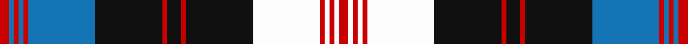

This page is one **sett** — a single exact thread-count. It belongs to the [tartan](/tartans/r2b1r1b1r1b14k14r1k3r1k14w14r1w1r1w1r2/)
(the same proportion at any scale), whose colour order is pattern [RBRBRBKRKRKWRWRWR](/stripes/rbrbrbkrkrkwrwrwr/).

Sourced from register-of-tartans.  It is a [17 stripe tartan](/stripes/stripes17/).

Original link https://www.tartanregister.gov.uk/tartanDetails.aspx?ref=5121

## Register references

External register numbers recorded for this tartan.

- Scottish Register of Tartans: [5121](https://www.tartanregister.gov.uk/tartanDetails.aspx?ref=5121)
- Scottish Tartans Authority (ITI): 3515

## Thread count
R/8 B4 R4 B4 R4 B56 K56 R4 K12 R4 K56 Wa56 R4 Wa4 R4 Wa4 R/8

## Palette

Palette: <strong>Tartan Register</strong>
<table><thead><tr><th>Colour</th><th>Threads</th><th>Shade</th><th>Base</th><th>OKLCh</th></tr></thead><tbody><tr><td>R/</td><td style="text-align:right;font-variant-numeric:tabular-nums">8</td><td><code style="background-color:#C80000;">#C80000</code> <small style="color:#888">#C80000</small></td><td>R <code style="background-color:#CC0000;">#CC0000</code></td><td><small style="color:#888">oklch(52.3% 0.215 29.2)</small></td></tr><tr><td>B</td><td style="text-align:right;font-variant-numeric:tabular-nums">4</td><td><code style="background-color:#1474B4;">#1474B4</code> <small style="color:#888">#1474B4</small></td><td>B <code style="background-color:#2A418A;">#2A418A</code></td><td><small style="color:#888">oklch(54.0% 0.129 245.1)</small></td></tr><tr><td>R</td><td style="text-align:right;font-variant-numeric:tabular-nums">4</td><td><code style="background-color:#C80000;">#C80000</code> <small style="color:#888">#C80000</small></td><td>R <code style="background-color:#CC0000;">#CC0000</code></td><td><small style="color:#888">oklch(52.3% 0.215 29.2)</small></td></tr><tr><td>B</td><td style="text-align:right;font-variant-numeric:tabular-nums">4</td><td><code style="background-color:#1474B4;">#1474B4</code> <small style="color:#888">#1474B4</small></td><td>B <code style="background-color:#2A418A;">#2A418A</code></td><td><small style="color:#888">oklch(54.0% 0.129 245.1)</small></td></tr><tr><td>R</td><td style="text-align:right;font-variant-numeric:tabular-nums">4</td><td><code style="background-color:#C80000;">#C80000</code> <small style="color:#888">#C80000</small></td><td>R <code style="background-color:#CC0000;">#CC0000</code></td><td><small style="color:#888">oklch(52.3% 0.215 29.2)</small></td></tr><tr><td>B</td><td style="text-align:right;font-variant-numeric:tabular-nums">56</td><td><code style="background-color:#1474B4;">#1474B4</code> <small style="color:#888">#1474B4</small></td><td>B <code style="background-color:#2A418A;">#2A418A</code></td><td><small style="color:#888">oklch(54.0% 0.129 245.1)</small></td></tr><tr><td>K</td><td style="text-align:right;font-variant-numeric:tabular-nums">56</td><td><code style="background-color:#101010;">#101010</code> <small style="color:#888">#101010</small></td><td>K <code style="background-color:#000000;">#000000</code></td><td><small style="color:#888">oklch(17.3% 0.000 89.9)</small></td></tr><tr><td>R</td><td style="text-align:right;font-variant-numeric:tabular-nums">4</td><td><code style="background-color:#C80000;">#C80000</code> <small style="color:#888">#C80000</small></td><td>R <code style="background-color:#CC0000;">#CC0000</code></td><td><small style="color:#888">oklch(52.3% 0.215 29.2)</small></td></tr><tr><td>K</td><td style="text-align:right;font-variant-numeric:tabular-nums">12</td><td><code style="background-color:#101010;">#101010</code> <small style="color:#888">#101010</small></td><td>K <code style="background-color:#000000;">#000000</code></td><td><small style="color:#888">oklch(17.3% 0.000 89.9)</small></td></tr><tr><td>R</td><td style="text-align:right;font-variant-numeric:tabular-nums">4</td><td><code style="background-color:#C80000;">#C80000</code> <small style="color:#888">#C80000</small></td><td>R <code style="background-color:#CC0000;">#CC0000</code></td><td><small style="color:#888">oklch(52.3% 0.215 29.2)</small></td></tr><tr><td>K</td><td style="text-align:right;font-variant-numeric:tabular-nums">56</td><td><code style="background-color:#101010;">#101010</code> <small style="color:#888">#101010</small></td><td>K <code style="background-color:#000000;">#000000</code></td><td><small style="color:#888">oklch(17.3% 0.000 89.9)</small></td></tr><tr><td>Wa</td><td style="text-align:right;font-variant-numeric:tabular-nums">56</td><td><code style="background-color:#FCFCFC;">#FCFCFC</code> <small style="color:#888">#FCFCFC</small></td><td>W <code style="background-color:#F7F7F7;">#F7F7F7</code></td><td><small style="color:#888">oklch(99.1% 0.000 89.9)</small></td></tr><tr><td>R</td><td style="text-align:right;font-variant-numeric:tabular-nums">4</td><td><code style="background-color:#C80000;">#C80000</code> <small style="color:#888">#C80000</small></td><td>R <code style="background-color:#CC0000;">#CC0000</code></td><td><small style="color:#888">oklch(52.3% 0.215 29.2)</small></td></tr><tr><td>Wa</td><td style="text-align:right;font-variant-numeric:tabular-nums">4</td><td><code style="background-color:#FCFCFC;">#FCFCFC</code> <small style="color:#888">#FCFCFC</small></td><td>W <code style="background-color:#F7F7F7;">#F7F7F7</code></td><td><small style="color:#888">oklch(99.1% 0.000 89.9)</small></td></tr><tr><td>R</td><td style="text-align:right;font-variant-numeric:tabular-nums">4</td><td><code style="background-color:#C80000;">#C80000</code> <small style="color:#888">#C80000</small></td><td>R <code style="background-color:#CC0000;">#CC0000</code></td><td><small style="color:#888">oklch(52.3% 0.215 29.2)</small></td></tr><tr><td>Wa</td><td style="text-align:right;font-variant-numeric:tabular-nums">4</td><td><code style="background-color:#FCFCFC;">#FCFCFC</code> <small style="color:#888">#FCFCFC</small></td><td>W <code style="background-color:#F7F7F7;">#F7F7F7</code></td><td><small style="color:#888">oklch(99.1% 0.000 89.9)</small></td></tr><tr><td>R/</td><td style="text-align:right;font-variant-numeric:tabular-nums">8</td><td><code style="background-color:#C80000;">#C80000</code> <small style="color:#888">#C80000</small></td><td>R <code style="background-color:#CC0000;">#CC0000</code></td><td><small style="color:#888">oklch(52.3% 0.215 29.2)</small></td></tr></tbody></table>

## Nearest tartans

The nearest existing variants by ΔTartan distance, with this tartan at the top so the swatches line up against it.

ΔTartan

Tartan

Sett

—

<a href="/ttd/edit/#slug=r2b1r1b1r1b14k14r1k3r1k14w14r1w1r1w1r2~x4">Angus Dress (Convergence 98)</a> <a class="nn-out" href="/setts/s17/r2b1r1b1r1b14k14r1k3r1k14w14r1w1r1w1r2~x4/" title="open its dictionary page">↗</a>

1.10

<a href="/ttd/edit/#slug=k4db2w1k16w1db3w16db2w6r2w6db2w16db3w1k16w1db2k4r2~x2">Scott (MacRae)</a> <a class="nn-out" href="/setts/s20/k4db2w1k16w1db3w16db2w6r2w6db2w16db3w1k16w1db2k4r2~x2/" title="open its dictionary page">↗</a>

1.11

<a href="/ttd/edit/#slug=db3g1k1db2lb16db2k4g1k1db16lb2db2k1g3~x2">Tiger of Sweden</a> <a class="nn-out" href="/setts/s14/db3g1k1db2lb16db2k4g1k1db16lb2db2k1g3~x2/" title="open its dictionary page">↗</a>

1.16

<a href="/ttd/edit/#slug=r2w6db2w16db3w1k16w1db2k4r2~x2">Scott, (MacRae)</a> <a class="nn-out" href="/setts/s11/r2w6db2w16db3w1k16w1db2k4r2~x2/" title="open its dictionary page">↗</a>

1.19

<a href="/ttd/edit/#slug=t8k1o1k1t22o1k14o1w2o1w6k3o1w3o1~x2">Anderson Blue</a> <a class="nn-out" href="/setts/s15/t8k1o1k1t22o1k14o1w2o1w6k3o1w3o1~x2/" title="open its dictionary page">↗</a>

1.23

<a href="/ttd/edit/#slug=lr12r3lr3db4lr16o3lr3o3lr3o16db52lr4">Carsaig</a> <a class="nn-out" href="/setts/s12/lr12r3lr3db4lr16o3lr3o3lr3o16db52lr4/" title="open its dictionary page">↗</a>

1.24

<a href="/ttd/edit/#slug=y4k2r7k15r3k3r3k7w28r7w6r2">Walker, dress</a> <a class="nn-out" href="/setts/s12/y4k2r7k15r3k3r3k7w28r7w6r2/" title="open its dictionary page">↗</a>

1.28

<a href="/ttd/edit/#slug=k34y5k5y8k5y56lb5y5lb36ly5lb36y5lb5y56k5y8k5y5k34ly5">Chartered Institute of Bankers</a> <a class="nn-out" href="/setts/s20/k34y5k5y8k5y56lb5y5lb36ly5lb36y5lb5y56k5y8k5y5k34ly5/" title="open its dictionary page">↗</a>

1.30

<a href="/ttd/edit/#slug=k24o8lb3k3lb3k3lb40k3lb3k3lb3o8k24o8~x2">O'Sullivan-Beare</a> <a class="nn-out" href="/setts/s14/k24o8lb3k3lb3k3lb40k3lb3k3lb3o8k24o8~x2/" title="open its dictionary page">↗</a>

1.31

<a href="/ttd/edit/#slug=b3w8o2w2o2w2o8k2o2k2o2k8w2b22w2b2o2b3~x2">Wcwm 1586</a> <a class="nn-out" href="/setts/s18/b3w8o2w2o2w2o8k2o2k2o2k8w2b22w2b2o2b3~x2/" title="open its dictionary page">↗</a>

1.33

<a href="/ttd/edit/#slug=b5w2b2w4k27w2g2w2g6w2g2w22m2~x2">Robert Wiseman Dairies, Golden Jubilee</a> <a class="nn-out" href="/setts/s13/b5w2b2w4k27w2g2w2g6w2g2w22m2~x2/" title="open its dictionary page">↗</a>

## Neighbour map

Every grey dot is one of 14299 variants placed by the first two principal components of the ΔTartan feature space (44% of its variance). Red is this tartan; blue dots are its nearest — click one to open its page.

<svg viewBox="0 0 640 380" role="img" style="max-width:100%;height:auto;border:1px solid #e0e0e0;border-radius:4px;display:block" xmlns="http://www.w3.org/2000/svg"><image href="/nn/cloud.v1.png" width="640" height="380"/><a href="/setts/s20/k4db2w1k16w1db3w16db2w6r2w6db2w16db3w1k16w1db2k4r2~x2/"><circle cx="210.1" cy="100.8" r="4" fill="#3465a4"><title>Scott (MacRae)</title></circle></a><a href="/setts/s14/db3g1k1db2lb16db2k4g1k1db16lb2db2k1g3~x2/"><circle cx="238.2" cy="116.7" r="4" fill="#3465a4"><title>Tiger of Sweden</title></circle></a><a href="/setts/s11/r2w6db2w16db3w1k16w1db2k4r2~x2/"><circle cx="208.5" cy="123.5" r="4" fill="#3465a4"><title>Scott, (MacRae)</title></circle></a><a href="/setts/s15/t8k1o1k1t22o1k14o1w2o1w6k3o1w3o1~x2/"><circle cx="247.1" cy="95.2" r="4" fill="#3465a4"><title>Anderson Blue</title></circle></a><a href="/setts/s12/lr12r3lr3db4lr16o3lr3o3lr3o16db52lr4/"><circle cx="253.8" cy="114.8" r="4" fill="#3465a4"><title>Carsaig</title></circle></a><a href="/setts/s12/y4k2r7k15r3k3r3k7w28r7w6r2/"><circle cx="177.6" cy="126.7" r="4" fill="#3465a4"><title>Walker, dress</title></circle></a><a href="/setts/s20/k34y5k5y8k5y56lb5y5lb36ly5lb36y5lb5y56k5y8k5y5k34ly5/"><circle cx="205.4" cy="121.8" r="4" fill="#3465a4"><title>Chartered Institute of Bankers</title></circle></a><a href="/setts/s14/k24o8lb3k3lb3k3lb40k3lb3k3lb3o8k24o8~x2/"><circle cx="241.1" cy="139.2" r="4" fill="#3465a4"><title>O'Sullivan-Beare</title></circle></a><a href="/setts/s18/b3w8o2w2o2w2o8k2o2k2o2k8w2b22w2b2o2b3~x2/"><circle cx="153.7" cy="112.2" r="4" fill="#3465a4"><title>Wcwm 1586</title></circle></a><a href="/setts/s13/b5w2b2w4k27w2g2w2g6w2g2w22m2~x2/"><circle cx="176.8" cy="93.0" r="4" fill="#3465a4"><title>Robert Wiseman Dairies, Golden Jubilee</title></circle></a><circle cx="191.2" cy="100.8" r="5" fill="#c00000"/></svg>

ID: /setts/s17/r2b1r1b1r1b14k14r1k3r1k14w14r1w1r1w1r2~x4/
