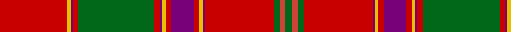

**Bands:** [RYBRGRBYRBRYBRGRG](/stripes/rybrgrbyrbrybrgrg/) · **Stripes:** [R LY DP R G R DP LY R DP R LY DP R G R G](/stripes/stripes17/) R LY DP R G R DP LY R DP R LY DP R G R G

This was sourced from register-of-tartans.  It is a [17 band tartan](/bands/bands17/).

Original link https://www.tartanregister.gov.uk/tartanDetails.aspx?ref=2173

## Attestations

This cloth appears in 2 source records; the oldest owns this page.

- 01/01/1819 — Lochiel (Cameron) (register-of-tartans, [record](https://www.tartanregister.gov.uk/tartanDetails.aspx?ref=2173))
- undated — Lochiel (Cameron) Tartan Tartan Number: 973. Earliest known date: 1819 Nothing See products available Copyright © Blair Urquhart, Comrie, 2015 (house-of-tartan, [record](http://www.house-of-tartan.scotland.net/house/TartanViewjs.asp?colr=Def&tnam=973))

## Register references

External register numbers recorded for this tartan.

- Scottish Register of Tartans: [2173](https://www.tartanregister.gov.uk/tartanDetails.aspx?ref=2173)
- Scottish Tartans Authority (ITI): 973
- Scottish Tartans World Register: 973

## Thread count
Ra/72 Y4 P2 Ra6 G82 Ra6 P2 Y4 Ra6 P24 Ra6 Y4 P2 Ra74 G6 R6 G/8

## Palette
Each colour and its ΔE from the base-6 reference it is a variant of.

| Colour | Shade | Base | ΔE (OKLab) |
|---|---|---|---|
| G | <code style="background-color:#006818;">#006818</code> `#006818` | G <code style="background-color:#006100;">#006100</code> | 0.02 |
| P | <code style="background-color:#780078;">#780078</code> `#780078` | B <code style="background-color:#2A418A;">#2A418A</code> | 0.17 |
| R | <code style="background-color:#CC4438;">#CC4438</code> `#CC4438` | R <code style="background-color:#CC0000;">#CC0000</code> | 0.06 |
| Ra | <code style="background-color:#C80000;">#C80000</code> `#C80000` | R <code style="background-color:#CC0000;">#CC0000</code> | 0.01 |
| Y | <code style="background-color:#E8C000;">#E8C000</code> `#E8C000` | Y <code style="background-color:#F2BF00;">#F2BF00</code> | 0.02 |

## Nearest tartans

The nearest existing variants by ΔTartan distance.

1. [Munro (Clan)](/setts/s17/r36ly2db1r3g41r3db1ly2r3db12r3ly2db1r36g3r3g4~x2/) — ΔT 0.39
1. [Dalziel #2](/setts/s17/r24w1dp2r4g32r4dp2w1r4dp6r4w1dp2r32g2r3g6~x2/) — ΔT 0.49
1. [Dalzell](/setts/s17/r24w1db2r8g52r8db2w1r8db12r8w1db2r52g4r6g6~x2/) — ΔT 0.52
1. [Dalziel (Logan) Family Tartan Tartan Number: 969. Earliest known date: 1831 Dalziel or Dalzell tartan is similar to the Munro. The basic form of the design was used for a 'George IV' tartan produced in honour of the King's visit in 1822. The Barony of Dalzell in Lanarkshire is the origin of the name. In Old Scots it means 'I dare' and this is also the motto on the family coat of arms. A cadet branch of the family built the House of the Binns in West Lothian which is now owned by the National Trust for Scotland. See products available Copyright © Blair Urquhart, Comrie, 2015](/setts/s17/r24w1db2r4g32r4db2w1r4db6r4w1db2r32g2m3g6~x2/) — ΔT 0.60
1. [Dalziel (Clan)](/setts/s17/r24w1dp2r4g32r4dp2w1r4dp6r4w1dp2r32g6r6g6~x2/) — ΔT 0.61
1. [Dalziel](/setts/s17/r24w1db2r4g32r4db2w1r4db6r4w1db2r32g2r3g6~x2/) — ΔT 0.70
1. [All Ireland Red](/setts/s15/r6y2db2r30g2r2g4r2g2r1g20r1y2db2r4~x2/) — ΔT 0.73
1. [Dalriada](/setts/s18/r55w1r1g2r2g49r2g2r2db15r2g2r2r53g2r2r2g10~x4/) — ΔT 0.84
1. [MacFarlane](/setts/s14/r42k1dg12lr2r3k1r3lr2dg2n12k4r3lr4dg3~x2/) — ΔT 0.94
1. [MacFarlane](/setts/s14/r42k1dg12lr2r3k1r3lr2dg2n12k4r3lr4dg3/) — ΔT 0.94

## Neighbour map

Every grey dot is one of 14299 variants placed by the first two principal components of the ΔTartan feature space (44% of its variance). Red is this tartan; blue dots are its nearest — click one to open its page.

<svg viewBox="0 0 640 380" role="img" style="max-width:100%;height:auto;border:1px solid #e0e0e0;border-radius:4px;display:block" xmlns="http://www.w3.org/2000/svg"><image href="/nn/cloud.v1.png" width="640" height="380"/><a href="/setts/s17/r36ly2db1r3g41r3db1ly2r3db12r3ly2db1r36g3r3g4~x2/"><circle cx="361.9" cy="57.6" r="4" fill="#3465a4"><title>Munro (Clan)</title></circle></a><a href="/setts/s17/r24w1dp2r4g32r4dp2w1r4dp6r4w1dp2r32g2r3g6~x2/"><circle cx="366.5" cy="74.0" r="4" fill="#3465a4"><title>Dalziel #2</title></circle></a><a href="/setts/s17/r24w1db2r8g52r8db2w1r8db12r8w1db2r52g4r6g6~x2/"><circle cx="376.5" cy="58.5" r="4" fill="#3465a4"><title>Dalzell</title></circle></a><a href="/setts/s17/r24w1db2r4g32r4db2w1r4db6r4w1db2r32g2m3g6~x2/"><circle cx="358.8" cy="72.8" r="4" fill="#3465a4"><title>Dalziel (Logan) Family Tartan Tartan Number: 969. Earliest known date: 1831 Dalziel or Dalzell tartan is similar to the Munro. The basic form of the design was used for a 'George IV' tartan produced in honour of the King's visit in 1822. The Barony of Dalzell in Lanarkshire is the origin of the name. In Old Scots it means 'I dare' and this is also the motto on the family coat of arms. A cadet branch of the family built the House of the Binns in West Lothian which is now owned by the National Trust for Scotland. See products available Copyright © Blair Urquhart, Comrie, 2015</title></circle></a><a href="/setts/s17/r24w1dp2r4g32r4dp2w1r4dp6r4w1dp2r32g6r6g6~x2/"><circle cx="345.3" cy="79.2" r="4" fill="#3465a4"><title>Dalziel (Clan)</title></circle></a><a href="/setts/s17/r24w1db2r4g32r4db2w1r4db6r4w1db2r32g2r3g6~x2/"><circle cx="357.5" cy="73.4" r="4" fill="#3465a4"><title>Dalziel</title></circle></a><a href="/setts/s15/r6y2db2r30g2r2g4r2g2r1g20r1y2db2r4~x2/"><circle cx="370.3" cy="78.1" r="4" fill="#3465a4"><title>All Ireland Red</title></circle></a><a href="/setts/s18/r55w1r1g2r2g49r2g2r2db15r2g2r2r53g2r2r2g10~x4/"><circle cx="385.3" cy="34.2" r="4" fill="#3465a4"><title>Dalriada</title></circle></a><a href="/setts/s14/r42k1dg12lr2r3k1r3lr2dg2n12k4r3lr4dg3~x2/"><circle cx="358.7" cy="63.1" r="4" fill="#3465a4"><title>MacFarlane</title></circle></a><a href="/setts/s14/r42k1dg12lr2r3k1r3lr2dg2n12k4r3lr4dg3/"><circle cx="358.7" cy="63.1" r="4" fill="#3465a4"><title>MacFarlane</title></circle></a><circle cx="371.6" cy="58.5" r="5" fill="#c00000"/></svg>

ID: /setts/s17/r36ly2dp1r3g41r3dp1ly2r3dp12r3ly2dp1r37g3r3g4~x2/
