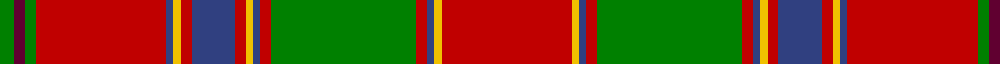

In pattern [GBGRBYRBRYBRGRBYR](/patterns/gbgrbyrbrybrgrbyr/).

This was sourced from weddslist.  It is a [17 stripes tartan](/stripes/stripes17/).

Original link http://www.weddslist.com/cgi-bin/tartans/pg.pl?source=sts

## Thread count
G/8 DR6 G6 R72 B4 Y4 R6 B24 R6 Y4 B4 R6 G80 R6 B4 Y4 R/72

## Palette
Each colour and its ΔE from the base-6 reference it is a variant of.

| Colour | Shade | Base | ΔE (OKLab) |
|---|---|---|---|
| B | <code style="background-color:#304080;">#304080</code> `#304080` | B <code style="background-color:#2A418A;">#2A418A</code> | 0.02 |
| DR | <code style="background-color:#600030;">#600030</code> `#600030` | B <code style="background-color:#2A418A;">#2A418A</code> | 0.20 |
| G | <code style="background-color:#008000;">#008000</code> `#008000` | G <code style="background-color:#006100;">#006100</code> | 0.10 |
| R | <code style="background-color:#C00000;">#C00000</code> `#C00000` | R <code style="background-color:#CC0000;">#CC0000</code> | 0.03 |
| Y | <code style="background-color:#F0C000;">#F0C000</code> `#F0C000` | Y <code style="background-color:#F2BF00;">#F2BF00</code> | 0.00 |

## Nearest tartans

The nearest existing variants by ΔTartan distance.

1. [Stirling, Weavers Guild](/setts/s17/r46y2b2r5g46r5b2y2r5b10r5y2b2r49g5w5g5~b304080-g008000-rc00000-we0e0e0-yf0c000~x2/) — ΔT 0.68
1. [MacDonald of Lochmaddy](/setts/s17/r13w1b2r2g14r2w1b2r2ba4r2b2w1r16g1r2g3~b5480b0-ba304080-g008000-rc00000-we0e0e0~x2/) — ΔT 0.73
1. [Stirling Weavers Guild Artifact Tartan Tartan Number: 936. Earliest known date: 1820 Similar to King George IV tartan - See Wilson letters. See products available Copyright © Blair Urquhart, Comrie, 2015](/setts/s17/r46y2b2r5g46r5b2y2r5b10r5y2b2r49g5w5g5~b2c2c80-g006818-rc80000-we0e0e0-ye8c000~x2/) — ΔT 0.76
1. [Dalziel](/setts/s17/r24w1b2r4g32r4b2w1r4b6r4w1b2r32g2ra3g6~b304080-g008000-rc00000-ra900030-we0e0e0~x2/) — ΔT 0.79
1. [All Ireland Red](/setts/s15/r6g2b2r30ga2r2gb4r2ga2r1ga20r1g2b2r4~b202060-g789484-ga006818-gb289c18-rc80000~x2/) — ΔT 0.79
1. [Hay - 1842 (Clan)](/setts/s14/r3g2y1g18r1g1r1g6r24g2r1k1r1w3~g285800-k101010-rc80000-we0e0e0-yd8b000~x2/) — ΔT 0.83
1. [Dalziel (Logan) Family Tartan Tartan Number: 969. Earliest known date: 1831 Dalziel or Dalzell tartan is similar to the Munro. The basic form of the design was used for a 'George IV' tartan produced in honour of the King's visit in 1822. The Barony of Dalzell in Lanarkshire is the origin of the name. In Old Scots it means 'I dare' and this is also the motto on the family coat of arms. A cadet branch of the family built the House of the Binns in West Lothian which is now owned by the National Trust for Scotland. See products available Copyright © Blair Urquhart, Comrie, 2015](/setts/s17/r24w1b2r4g32r4b2w1r4b6r4w1b2r32g2ra3g6~b2c2c80-g006818-rc80000-raa00048-we0e0e0~x2/) — ΔT 0.89
1. [Grant or New Bruce](/setts/s15/r12b2r4b4r39ba2r4b11r6g4r6g45r4b4bb10~b800080-ba5480b0-bb304080-g008000-rc00000/) — ΔT 0.91
1. [King George IV - 1824 (Artefact)](/setts/s17/r24w1b1r3g24r3b1w1r3b6r3w1b1r24g3y3g3~b280034-g285800-rc80000-wf8f8f8-yfca098~x2/) — ΔT 0.97
1. [Munro](/setts/s17/r24y1b1r3g16r3b1y1r3b6r3y1b1r16g2ra2g2~b304080-g008000-rc00000-ra900030-yf0c000~x2/) — ΔT 0.98

## Neighbour map

Every grey dot is one of 15726 variants placed by the first two principal components of the ΔTartan feature space (44% of its variance). Red is this tartan; blue dots are its nearest — click one to open its page.

<svg viewBox="0 0 640 380" role="img" style="max-width:100%;height:auto;border:1px solid #e0e0e0;border-radius:4px;display:block" xmlns="http://www.w3.org/2000/svg"><image href="/nn/cloud.v1.png" width="640" height="380"/><a href="/setts/s17/r46y2b2r5g46r5b2y2r5b10r5y2b2r49g5w5g5~b304080-g008000-rc00000-we0e0e0-yf0c000~x2/"><circle cx="360.5" cy="76.2" r="4" fill="#3465a4"><title>Stirling, Weavers Guild</title></circle></a><a href="/setts/s17/r13w1b2r2g14r2w1b2r2ba4r2b2w1r16g1r2g3~b5480b0-ba304080-g008000-rc00000-we0e0e0~x2/"><circle cx="310.0" cy="103.4" r="4" fill="#3465a4"><title>MacDonald of Lochmaddy</title></circle></a><a href="/setts/s17/r46y2b2r5g46r5b2y2r5b10r5y2b2r49g5w5g5~b2c2c80-g006818-rc80000-we0e0e0-ye8c000~x2/"><circle cx="361.2" cy="75.6" r="4" fill="#3465a4"><title>Stirling Weavers Guild Artifact Tartan Tartan Number: 936. Earliest known date: 1820 Similar to King George IV tartan - See Wilson letters. See products available Copyright © Blair Urquhart, Comrie, 2015</title></circle></a><a href="/setts/s17/r24w1b2r4g32r4b2w1r4b6r4w1b2r32g2ra3g6~b304080-g008000-rc00000-ra900030-we0e0e0~x2/"><circle cx="357.3" cy="73.1" r="4" fill="#3465a4"><title>Dalziel</title></circle></a><a href="/setts/s15/r6g2b2r30ga2r2gb4r2ga2r1ga20r1g2b2r4~b202060-g789484-ga006818-gb289c18-rc80000~x2/"><circle cx="370.2" cy="77.5" r="4" fill="#3465a4"><title>All Ireland Red</title></circle></a><a href="/setts/s14/r3g2y1g18r1g1r1g6r24g2r1k1r1w3~g285800-k101010-rc80000-we0e0e0-yd8b000~x2/"><circle cx="334.4" cy="85.1" r="4" fill="#3465a4"><title>Hay - 1842 (Clan)</title></circle></a><a href="/setts/s17/r24w1b2r4g32r4b2w1r4b6r4w1b2r32g2ra3g6~b2c2c80-g006818-rc80000-raa00048-we0e0e0~x2/"><circle cx="358.7" cy="72.8" r="4" fill="#3465a4"><title>Dalziel (Logan) Family Tartan Tartan Number: 969. Earliest known date: 1831 Dalziel or Dalzell tartan is similar to the Munro. The basic form of the design was used for a 'George IV' tartan produced in honour of the King's visit in 1822. The Barony of Dalzell in Lanarkshire is the origin of the name. In Old Scots it means 'I dare' and this is also the motto on the family coat of arms. A cadet branch of the family built the House of the Binns in West Lothian which is now owned by the National Trust for Scotland. See products available Copyright © Blair Urquhart, Comrie, 2015</title></circle></a><a href="/setts/s15/r12b2r4b4r39ba2r4b11r6g4r6g45r4b4bb10~b800080-ba5480b0-bb304080-g008000-rc00000/"><circle cx="294.3" cy="96.3" r="4" fill="#3465a4"><title>Grant or New Bruce</title></circle></a><a href="/setts/s17/r24w1b1r3g24r3b1w1r3b6r3w1b1r24g3y3g3~b280034-g285800-rc80000-wf8f8f8-yfca098~x2/"><circle cx="349.3" cy="77.1" r="4" fill="#3465a4"><title>King George IV - 1824 (Artefact)</title></circle></a><a href="/setts/s17/r24y1b1r3g16r3b1y1r3b6r3y1b1r16g2ra2g2~b304080-g008000-rc00000-ra900030-yf0c000~x2/"><circle cx="376.4" cy="85.9" r="4" fill="#3465a4"><title>Munro</title></circle></a><circle cx="324.1" cy="84.0" r="5" fill="#c00000"/></svg>

ID: /setts/s17/r36y2b2r3g40r3b2y2r3b12r3y2b2r36g3ba3g4~b304080-ba600030-g008000-rc00000-yf0c000~x2/
