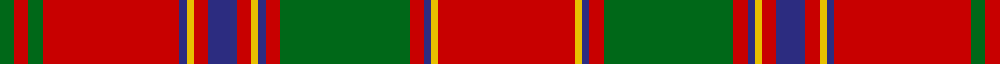

In pattern [GRGRBYRBRYBRGRBYR](/patterns/grgrbyrbrybrgrbyr/).

This was sourced from register-of-tartans.  It is a [17 stripes tartan](/stripes/stripes17/).

Original link https://www.tartanregister.gov.uk/tartanDetails.aspx?ref=3051

## Thread count
G/4 R4 G4 R38 DB2 Y2 R4 DB8 R4 Y2 DB2 R4 G36 R4 DB2 Y2 R/38

## Palette
Each colour and its ΔE from the base-6 reference it is a variant of.

| Colour | Shade | Base | ΔE (OKLab) |
|---|---|---|---|
| DB | <code style="background-color:#2C2C80;">#2C2C80</code> `#2C2C80` | B <code style="background-color:#2A418A;">#2A418A</code> | 0.06 |
| G | <code style="background-color:#006818;">#006818</code> `#006818` | G <code style="background-color:#006100;">#006100</code> | 0.02 |
| R | <code style="background-color:#C80000;">#C80000</code> `#C80000` | R <code style="background-color:#CC0000;">#CC0000</code> | 0.01 |
| Y | <code style="background-color:#E8C000;">#E8C000</code> `#E8C000` | Y <code style="background-color:#F2BF00;">#F2BF00</code> | 0.02 |

## Nearest tartans

The nearest existing variants by ΔTartan distance.

1. [Munro](/setts/s17/r24y1b1r3g16r3b1y1r3b6r3y1b1r16g2r2g2-b000064-g004c00-rc80000-yffc800/) — ΔT 0.81
1. [Munro](/setts/s17/r48y2b2r6g32r6b2y2r6b12r6y2b2r32g4ra4g4-b304080-g008000-rc00000-ra900030-yf0c000/) — ΔT 0.95
1. [Munro](/setts/s17/r96y4b4r12g64r12b4y4r12b24r12y4b4r64g8ra8g8-b2c2c80-g006818-rc80000-racc4438-ye8c000/) — ΔT 0.96
1. [Grant, or Drummond](/setts/s15/r12b4r4g48r4g4r4b16r4ba2r64b4r4b2r12-b304080-ba5480b0-g008000-rc00000/) — ΔT 0.97
1. [Munro Clan Tartan Tartan Number: 974. Earliest known date: 1810-15 This sett is usually regarded as the correct form of the Munro tartan. It is illustrated by Smibert and the Smith brothers (both works published in 1850). In early versions bright pink replaces the crimson between the three green lines. Munros wear the 'Black Watch' as a Hunting tartan. See products available Copyright © Blair Urquhart, Comrie, 2015](/setts/s17/r48y2b2r6g32r6b2y2r6b12r6y2b2r32g4ra4g4-b2c2c80-g006818-rc80000-raa00048-ye8c000/) — ΔT 0.97
1. [Stirling Weavers Guild Artifact Tartan Tartan Number: 936. Earliest known date: 1820 Similar to King George IV tartan - See Wilson letters. See products available Copyright © Blair Urquhart, Comrie, 2015](/setts/s17/r92y4b4r10g92r10b4y4r10b20r10y4b4r98g10w10g10-b2c2c80-g006818-rc80000-we0e0e0-ye8c000/) — ΔT 0.98
1. [Grant or Drummond Clan Tartan Tartan Number: 1384. Earliest known date: 1831 The usual design is sometimes called Drummond. It is recorded by Logan (1831), Smibert (1850), and Smith (1850). McIan's drawing of the Grant tartan is too roughly done to make out the pattern details. A certain difficulty arises in establishing a single Grant tartan to represent the clan, illustrated by the existance of ten Grant portraits at Cullen House in which each brother is wearing a different tartan, and where a coat or plaid is worn, these also differ. The chief of the Grants is Lord Strathspey. See products available Copyright © Blair Urquhart, Comrie, 2015](/setts/s15/r12b4r4g48r4g4r4b16r4ba4r64b4r4b2r12-b2c2c80-ba2888c4-g006818-rc80000/) — ΔT 1.00
1. [Drummond](/setts/s15/r12b4r4g48r4g4r4b16r4ba2r64b4r4b2r12-b1474b4-ba5c8ca8-g006818-rc80000/) — ΔT 1.00
1. [Drummond - 1819 (Clan)](/setts/s15/r12b4r4g48r4g4r4b16r4ba2r64b4r4b2r12-b440044-ba5c8ca8-g285800-rd40000/) — ΔT 1.01
1. [Munro](/setts/s20/r40g4r4g4r4g4r38b2y2r4b8r4y2b2r4g36r4b2y2r38-b304080-g008000-rc00000-yf0c000/) — ΔT 1.01

## Neighbour map

Every grey dot is one of 15726 variants placed by the first two principal components of the ΔTartan feature space (44% of its variance). Red is this tartan; blue dots are its nearest — click one to open its page.

<svg viewBox="0 0 640 380" role="img" style="max-width:100%;height:auto;border:1px solid #e0e0e0;border-radius:4px;display:block" xmlns="http://www.w3.org/2000/svg"><image href="/nn/cloud.v1.png" width="640" height="380"/><a href="/setts/s17/r24y1b1r3g16r3b1y1r3b6r3y1b1r16g2r2g2-b000064-g004c00-rc80000-yffc800/"><circle cx="393.4" cy="93.5" r="4" fill="#3465a4"><title>Munro</title></circle></a><a href="/setts/s17/r48y2b2r6g32r6b2y2r6b12r6y2b2r32g4ra4g4-b304080-g008000-rc00000-ra900030-yf0c000/"><circle cx="374.3" cy="84.5" r="4" fill="#3465a4"><title>Munro</title></circle></a><a href="/setts/s17/r96y4b4r12g64r12b4y4r12b24r12y4b4r64g8ra8g8-b2c2c80-g006818-rc80000-racc4438-ye8c000/"><circle cx="374.2" cy="83.3" r="4" fill="#3465a4"><title>Munro</title></circle></a><a href="/setts/s15/r12b4r4g48r4g4r4b16r4ba2r64b4r4b2r12-b304080-ba5480b0-g008000-rc00000/"><circle cx="396.8" cy="92.2" r="4" fill="#3465a4"><title>Grant, or Drummond</title></circle></a><a href="/setts/s17/r48y2b2r6g32r6b2y2r6b12r6y2b2r32g4ra4g4-b2c2c80-g006818-rc80000-raa00048-ye8c000/"><circle cx="374.0" cy="83.3" r="4" fill="#3465a4"><title>Munro Clan Tartan Tartan Number: 974. Earliest known date: 1810-15 This sett is usually regarded as the correct form of the Munro tartan. It is illustrated by Smibert and the Smith brothers (both works published in 1850). In early versions bright pink replaces the crimson between the three green lines. Munros wear the 'Black Watch' as a Hunting tartan. See products available Copyright © Blair Urquhart, Comrie, 2015</title></circle></a><a href="/setts/s17/r92y4b4r10g92r10b4y4r10b20r10y4b4r98g10w10g10-b2c2c80-g006818-rc80000-we0e0e0-ye8c000/"><circle cx="359.1" cy="74.0" r="4" fill="#3465a4"><title>Stirling Weavers Guild Artifact Tartan Tartan Number: 936. Earliest known date: 1820 Similar to King George IV tartan - See Wilson letters. See products available Copyright © Blair Urquhart, Comrie, 2015</title></circle></a><a href="/setts/s15/r12b4r4g48r4g4r4b16r4ba4r64b4r4b2r12-b2c2c80-ba2888c4-g006818-rc80000/"><circle cx="388.9" cy="91.5" r="4" fill="#3465a4"><title>Grant or Drummond Clan Tartan Tartan Number: 1384. Earliest known date: 1831 The usual design is sometimes called Drummond. It is recorded by Logan (1831), Smibert (1850), and Smith (1850). McIan's drawing of the Grant tartan is too roughly done to make out the pattern details. A certain difficulty arises in establishing a single Grant tartan to represent the clan, illustrated by the existance of ten Grant portraits at Cullen House in which each brother is wearing a different tartan, and where a coat or plaid is worn, these also differ. The chief of the Grants is Lord Strathspey. See products available Copyright © Blair Urquhart, Comrie, 2015</title></circle></a><a href="/setts/s15/r12b4r4g48r4g4r4b16r4ba2r64b4r4b2r12-b1474b4-ba5c8ca8-g006818-rc80000/"><circle cx="398.8" cy="92.7" r="4" fill="#3465a4"><title>Drummond</title></circle></a><a href="/setts/s15/r12b4r4g48r4g4r4b16r4ba2r64b4r4b2r12-b440044-ba5c8ca8-g285800-rd40000/"><circle cx="400.6" cy="88.3" r="4" fill="#3465a4"><title>Drummond - 1819 (Clan)</title></circle></a><a href="/setts/s20/r40g4r4g4r4g4r38b2y2r4b8r4y2b2r4g36r4b2y2r38-b304080-g008000-rc00000-yf0c000/"><circle cx="441.0" cy="100.9" r="4" fill="#3465a4"><title>Munro</title></circle></a><circle cx="386.3" cy="103.2" r="5" fill="#c00000"/></svg>

ID: /setts/s17/r38y2b2r4g36r4b2y2r4b8r4y2b2r38g4r4g4-b2c2c80-g006818-rc80000-ye8c000/
