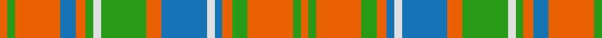

In pattern [RGRBRGWGRBWBRGRGR](/patterns/rgrbrgwgrbwbrgrgr/).

This was sourced from register-of-tartans.  It is a [17 stripes tartan](/stripes/stripes17/).

Original link https://www.tartanregister.gov.uk/tartanDetails.aspx?ref=3494

## Thread count
O/6 G6 O36 B12 O8 G6 LN6 G36 O12 B36 LN6 B6 O8 G12 O36 G6 O/6

## Palette
Each colour and its ΔE from the base-6 reference it is a variant of.

| Colour | Shade | Base | ΔE (OKLab) |
|---|---|---|---|
| B | <code style="background-color:#1474B4;">#1474B4</code> `#1474B4` | B <code style="background-color:#2A418A;">#2A418A</code> | 0.15 |
| G | <code style="background-color:#289C18;">#289C18</code> `#289C18` | G <code style="background-color:#006100;">#006100</code> | 0.19 |
| LN | <code style="background-color:#E0E0E0;">#E0E0E0</code> `#E0E0E0` | W <code style="background-color:#F7F7F7;">#F7F7F7</code> | 0.07 |
| O | <code style="background-color:#E86000;">#E86000</code> `#E86000` | R <code style="background-color:#CC0000;">#CC0000</code> | 0.14 |

## Nearest tartans

The nearest existing variants by ΔTartan distance.

1. [Matheson](/setts/s13/r2g2r12b10ba3g10r2g2r2g10r12g2r2~b304080-ba5480b0-g008000-rc00000~x2/) — ΔT 1.34
1. [MacQuarrie 4](/setts/s12/b1r1ba1r6g6r1g6r1ba3r6b1r1~b5480b0-ba304080-g008000-rc00000~x2/) — ΔT 1.42
1. [MacRae](/setts/s12/g21r5g21r21g5r4g5r21w4r5b21r4~b304080-g008000-rc00000-we0e0e0/) — ΔT 1.46
1. [MacKinnon 6](/setts/s14/b2r3g2ba2r6g16r2ba4g2r16g8b2r4w2~b5480b0-ba304080-g008000-rc00000-we0e0e0~x2/) — ΔT 1.48
1. [Sydney (Nova Scotia) #2](/setts/s14/r16k4w2k4r6ra11r2ra16r2ra11r6k4w2k4~k101010-r888888-rab84c00-we0e0e0~x2/) — ΔT 1.50
1. [Invertere (Daks #1)](/setts/s14/g6y2b2y11g2y2r3y2g2y11b2y2g6r3~b202060-g003820-ra00048-ya08858~x2/) — ΔT 1.53
1. [Lamont Heather (Corporate)](/setts/s18/b18y3b3y3b3y16w16g3w16y16b17y3b3y3b17y16w16g3~b4c3428-g5c6428-we0e0e0-ya08858~x2/) — ΔT 1.54
1. [MacKinnon 7](/setts/s11/w2r4g8r16b2r3g16r4b2r4w2~b5480b0-g008000-rc00000-we0e0e0~x2/) — ΔT 1.57
1. [Dublin Irish County Tartan Tartan Number: 2250. Earliest known date: 1996 One of a series of Irish District tartans designed by Polly Wittering of the House of Edgar, with colours reminiscent of the Country with soft warm colours dominating. See products available Copyright © Blair Urquhart, Comrie, 2015](/setts/s12/r3y8r2y18b5y3ra3y3ra16y3ra3y3~b300438-r8c0020-ra906010-y6cac84~x2/) — ΔT 1.59
1. [MacKinnon 5](/setts/s14/b2r3g2ba2r6g16r2ba4g2r16g8b2r4w2~b800080-ba304080-g008000-rc00000-we0e0e0~x2/) — ΔT 1.60

## Neighbour map

Every grey dot is one of 15726 variants placed by the first two principal components of the ΔTartan feature space (44% of its variance). Red is this tartan; blue dots are its nearest — click one to open its page.

<svg viewBox="0 0 640 380" role="img" style="max-width:100%;height:auto;border:1px solid #e0e0e0;border-radius:4px;display:block" xmlns="http://www.w3.org/2000/svg"><image href="/nn/cloud.v1.png" width="640" height="380"/><a href="/setts/s13/r2g2r12b10ba3g10r2g2r2g10r12g2r2~b304080-ba5480b0-g008000-rc00000~x2/"><circle cx="225.3" cy="199.0" r="4" fill="#3465a4"><title>Matheson</title></circle></a><a href="/setts/s12/b1r1ba1r6g6r1g6r1ba3r6b1r1~b5480b0-ba304080-g008000-rc00000~x2/"><circle cx="239.1" cy="199.6" r="4" fill="#3465a4"><title>MacQuarrie 4</title></circle></a><a href="/setts/s12/g21r5g21r21g5r4g5r21w4r5b21r4~b304080-g008000-rc00000-we0e0e0/"><circle cx="202.6" cy="210.0" r="4" fill="#3465a4"><title>MacRae</title></circle></a><a href="/setts/s14/b2r3g2ba2r6g16r2ba4g2r16g8b2r4w2~b5480b0-ba304080-g008000-rc00000-we0e0e0~x2/"><circle cx="217.5" cy="153.5" r="4" fill="#3465a4"><title>MacKinnon 6</title></circle></a><a href="/setts/s14/r16k4w2k4r6ra11r2ra16r2ra11r6k4w2k4~k101010-r888888-rab84c00-we0e0e0~x2/"><circle cx="202.6" cy="179.9" r="4" fill="#3465a4"><title>Sydney (Nova Scotia) #2</title></circle></a><a href="/setts/s14/g6y2b2y11g2y2r3y2g2y11b2y2g6r3~b202060-g003820-ra00048-ya08858~x2/"><circle cx="249.1" cy="200.9" r="4" fill="#3465a4"><title>Invertere (Daks #1)</title></circle></a><a href="/setts/s18/b18y3b3y3b3y16w16g3w16y16b17y3b3y3b17y16w16g3~b4c3428-g5c6428-we0e0e0-ya08858~x2/"><circle cx="124.6" cy="176.0" r="4" fill="#3465a4"><title>Lamont Heather (Corporate)</title></circle></a><a href="/setts/s11/w2r4g8r16b2r3g16r4b2r4w2~b5480b0-g008000-rc00000-we0e0e0~x2/"><circle cx="264.5" cy="180.7" r="4" fill="#3465a4"><title>MacKinnon 7</title></circle></a><a href="/setts/s12/r3y8r2y18b5y3ra3y3ra16y3ra3y3~b300438-r8c0020-ra906010-y6cac84~x2/"><circle cx="298.8" cy="186.6" r="4" fill="#3465a4"><title>Dublin Irish County Tartan Tartan Number: 2250. Earliest known date: 1996 One of a series of Irish District tartans designed by Polly Wittering of the House of Edgar, with colours reminiscent of the Country with soft warm colours dominating. See products available Copyright © Blair Urquhart, Comrie, 2015</title></circle></a><a href="/setts/s14/b2r3g2ba2r6g16r2ba4g2r16g8b2r4w2~b800080-ba304080-g008000-rc00000-we0e0e0~x2/"><circle cx="216.8" cy="152.0" r="4" fill="#3465a4"><title>MacKinnon 5</title></circle></a><circle cx="208.7" cy="174.3" r="5" fill="#c00000"/></svg>

ID: /setts/s17/r3g3r18b6r4g3w3g18r6b18w3b3r4g6r18g3r3~b1474b4-g289c18-re86000-we0e0e0~x2/
