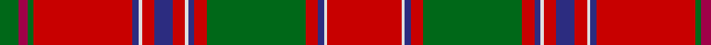

In pattern [GRGRBWRBRWBRGRBWR](/patterns/grgrbwrbrwbrgrbwr/).

This was sourced from house-of-tartan.  It is a [17 stripes tartan](/stripes/stripes17/).

Original link http://www.house-of-tartan.scotland.net/house/TartanViewjs.asp?colr=Def&tnam=969

## Thread count
G/12 R6 G4 Ra64 DB4 LN2 Ra8 DB12 Ra8 LN2 DB4 Ra8 G64 Ra8 DB4 LN2 Ra/48

## Palette
Each colour and its ΔE from the base-6 reference it is a variant of.

| Colour | Shade | Base | ΔE (OKLab) |
|---|---|---|---|
| DB | <code style="background-color:#2C2C80;">#2C2C80</code> `#2C2C80` | B <code style="background-color:#2C4084;">#2C4084</code> | 0.05 |
| G | <code style="background-color:#006818;">#006818</code> `#006818` | G <code style="background-color:#006400;">#006400</code> | 0.02 |
| LN | <code style="background-color:#E0E0E0;">#E0E0E0</code> `#E0E0E0` | W <code style="background-color:#F4F4F0;">#F4F4F0</code> | 0.06 |
| R | <code style="background-color:#A00048;">#A00048</code> `#A00048` | R <code style="background-color:#C80000;">#C80000</code> | 0.11 |
| Ra | <code style="background-color:#C80000;">#C80000</code> `#C80000` | R <code style="background-color:#C80000;">#C80000</code> | 0.00 |

## Nearest tartans

The nearest existing variants by ΔTartan distance.

1. [Dalziel](/setts/s17/r48w2b4r8g64r8b4w2r8b12r8w2b4r64g4ra6g12-b304080-g008000-rc00000-ra900030-we0e0e0/) — ΔT 0.36
1. [Dalziel #2](/setts/s17/r48w2b4r8g64r8b4w2r8b12r8w2b4r64g4ra6g12-b780078-g006818-rc80000-racc4438-we0e0e0/) — ΔT 0.37
1. [Dalziel (Clan)](/setts/s17/r48w2b4r8g64r8b4w2r8b12r8w2b4r64g12ra12g12-b780078-g006818-rc80000-racc4438-we0e0e0/) — ΔT 0.50
1. [Munro (Clan)](/setts/s17/r72y4b2r6g82r6b2y4r6b24r6y4b2r72g6ra6g8-b2c2c80-g006818-rc80000-racc4438-ye8c000/) — ΔT 0.50
1. [All Ireland Red](/setts/s15/r12g4b4r60ga4r4gb8r4ga4r2ga40r2g4b4r8-b202060-g789484-ga006818-gb289c18-rc80000/) — ΔT 0.56
1. [Stirling Weavers Guild Artifact Tartan Tartan Number: 936. Earliest known date: 1820 Similar to King George IV tartan - See Wilson letters. See products available Copyright © Blair Urquhart, Comrie, 2015](/setts/s17/r92y4b4r10g92r10b4y4r10b20r10y4b4r98g10w10g10-b2c2c80-g006818-rc80000-we0e0e0-ye8c000/) — ΔT 0.57
1. [Lochiel (Cameron) Tartan Tartan Number: 973. Earliest known date: 1819 Nothing See products available Copyright © Blair Urquhart, Comrie, 2015](/setts/s17/r72y4b2r6g82r6b2y4r6b24r6y4b2r74g6ra6g8-b780078-g006818-rc80000-rad05054-ye8c000/) — ΔT 0.59
1. [Lochiel (Cameron)](/setts/s17/r72y4b2r6g82r6b2y4r6b24r6y4b2r74g6ra6g8-b780078-g006818-rc80000-racc4438-ye8c000/) — ΔT 0.60
1. [Stirling, Weavers Guild](/setts/s17/r92y4b4r10g92r10b4y4r10b20r10y4b4r98g10w10g10-b304080-g008000-rc00000-we0e0e0-yf0c000/) — ΔT 0.68
1. [King George IV - 1824 (Artefact)](/setts/s17/r48w2b2r6g48r6b2w2r6b12r6w2b2r48g6y6g6-b280034-g285800-rc80000-wf8f8f8-yfca098/) — ΔT 0.71

## Neighbour map

Every grey dot is one of 15726 variants placed by the first two principal components of the ΔTartan feature space (44% of its variance). Red is this tartan; blue dots are its nearest — click one to open its page.

<svg viewBox="0 0 640 380" role="img" style="max-width:100%;height:auto;border:1px solid #e0e0e0;border-radius:4px;display:block" xmlns="http://www.w3.org/2000/svg"><image href="/nn/cloud.v1.png" width="640" height="380"/><a href="/setts/s17/r48w2b4r8g64r8b4w2r8b12r8w2b4r64g4ra6g12-b304080-g008000-rc00000-ra900030-we0e0e0/"><circle cx="354.8" cy="72.0" r="4" fill="#3465a4"><title>Dalziel</title></circle></a><a href="/setts/s17/r48w2b4r8g64r8b4w2r8b12r8w2b4r64g4ra6g12-b780078-g006818-rc80000-racc4438-we0e0e0/"><circle cx="364.2" cy="72.5" r="4" fill="#3465a4"><title>Dalziel #2</title></circle></a><a href="/setts/s17/r48w2b4r8g64r8b4w2r8b12r8w2b4r64g12ra12g12-b780078-g006818-rc80000-racc4438-we0e0e0/"><circle cx="342.8" cy="77.4" r="4" fill="#3465a4"><title>Dalziel (Clan)</title></circle></a><a href="/setts/s17/r72y4b2r6g82r6b2y4r6b24r6y4b2r72g6ra6g8-b2c2c80-g006818-rc80000-racc4438-ye8c000/"><circle cx="358.8" cy="56.2" r="4" fill="#3465a4"><title>Munro (Clan)</title></circle></a><a href="/setts/s15/r12g4b4r60ga4r4gb8r4ga4r2ga40r2g4b4r8-b202060-g789484-ga006818-gb289c18-rc80000/"><circle cx="367.7" cy="76.4" r="4" fill="#3465a4"><title>All Ireland Red</title></circle></a><a href="/setts/s17/r92y4b4r10g92r10b4y4r10b20r10y4b4r98g10w10g10-b2c2c80-g006818-rc80000-we0e0e0-ye8c000/"><circle cx="359.1" cy="74.0" r="4" fill="#3465a4"><title>Stirling Weavers Guild Artifact Tartan Tartan Number: 936. Earliest known date: 1820 Similar to King George IV tartan - See Wilson letters. See products available Copyright © Blair Urquhart, Comrie, 2015</title></circle></a><a href="/setts/s17/r72y4b2r6g82r6b2y4r6b24r6y4b2r74g6ra6g8-b780078-g006818-rc80000-rad05054-ye8c000/"><circle cx="368.4" cy="56.7" r="4" fill="#3465a4"><title>Lochiel (Cameron) Tartan Tartan Number: 973. Earliest known date: 1819 Nothing See products available Copyright © Blair Urquhart, Comrie, 2015</title></circle></a><a href="/setts/s17/r72y4b2r6g82r6b2y4r6b24r6y4b2r74g6ra6g8-b780078-g006818-rc80000-racc4438-ye8c000/"><circle cx="368.8" cy="56.9" r="4" fill="#3465a4"><title>Lochiel (Cameron)</title></circle></a><a href="/setts/s17/r92y4b4r10g92r10b4y4r10b20r10y4b4r98g10w10g10-b304080-g008000-rc00000-we0e0e0-yf0c000/"><circle cx="358.4" cy="74.7" r="4" fill="#3465a4"><title>Stirling, Weavers Guild</title></circle></a><a href="/setts/s17/r48w2b2r6g48r6b2w2r6b12r6w2b2r48g6y6g6-b280034-g285800-rc80000-wf8f8f8-yfca098/"><circle cx="347.3" cy="75.4" r="4" fill="#3465a4"><title>King George IV - 1824 (Artefact)</title></circle></a><circle cx="356.2" cy="71.5" r="5" fill="#c00000"/></svg>

ID: /setts/s17/r48w2b4r8g64r8b4w2r8b12r8w2b4r64g4ra6g12-b2c2c80-g006818-rc80000-raa00048-we0e0e0/
