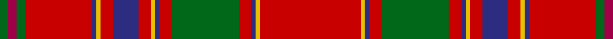

In pattern [GRGRBYRBRYBRGRBYR](/patterns/grgrbyrbrybrgrbyr/).

This was sourced from house-of-tartan.  It is a [17 stripes tartan](/stripes/stripes17/).

Original link http://www.house-of-tartan.scotland.net/house/TartanViewjs.asp?colr=Def&tnam=974

## Thread count
G/4 R4 G4 Ra32 DB2 Y2 Ra6 DB12 Ra6 Y2 DB2 Ra6 G32 Ra6 DB2 Y2 Ra/48

## Palette
Each colour and its ΔE from the base-6 reference it is a variant of.

| Colour | Shade | Base | ΔE (OKLab) |
|---|---|---|---|
| DB | <code style="background-color:#2C2C80;">#2C2C80</code> `#2C2C80` | B <code style="background-color:#2C4084;">#2C4084</code> | 0.05 |
| G | <code style="background-color:#006818;">#006818</code> `#006818` | G <code style="background-color:#006400;">#006400</code> | 0.02 |
| R | <code style="background-color:#A00048;">#A00048</code> `#A00048` | R <code style="background-color:#C80000;">#C80000</code> | 0.11 |
| Ra | <code style="background-color:#C80000;">#C80000</code> `#C80000` | R <code style="background-color:#C80000;">#C80000</code> | 0.00 |
| Y | <code style="background-color:#E8C000;">#E8C000</code> `#E8C000` | Y <code style="background-color:#E8C000;">#E8C000</code> | 0.00 |

ID: /setts/s17/r48y2b2r6g32r6b2y2r6b12r6y2b2r32g4ra4g4-b2c2c80-g006818-rc80000-raa00048-ye8c000/
