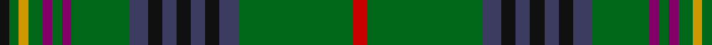

In pattern [KGYGBGBGBKBKBKBGR](/patterns/kgygbgbgbkbkbkbgr/).

This was sourced from tartans-authority.  It is a [17 stripes tartan](/stripes/stripes17/).

Original link http://www.tartansauthority.com/tartan-ferret/display/1123/

## Thread count
K/4 G4 DY4 G6 P4 G4 P4 G24 N8 K6 N6 K6 N6 K6 N8 G48 R/6

## Palette
Each colour and its ΔE from the base-6 reference it is a variant of.

| Colour | Shade | Base | ΔE (OKLab) |
|---|---|---|---|
| DY | <code style="background-color:#D09800;">#D09800</code> `#D09800` | Y <code style="background-color:#F2BF00;">#F2BF00</code> | 0.12 |
| G | <code style="background-color:#006818;">#006818</code> `#006818` | G <code style="background-color:#006100;">#006100</code> | 0.02 |
| K | <code style="background-color:#101010;">#101010</code> `#101010` | K <code style="background-color:#000000;">#000000</code> | 0.17 |
| N | <code style="background-color:#3C3C60;">#3C3C60</code> `#3C3C60` | B <code style="background-color:#2A418A;">#2A418A</code> | 0.07 |
| P | <code style="background-color:#840068;">#840068</code> `#840068` | B <code style="background-color:#2A418A;">#2A418A</code> | 0.19 |
| R | <code style="background-color:#C80000;">#C80000</code> `#C80000` | R <code style="background-color:#CC0000;">#CC0000</code> | 0.01 |

## Nearest tartans

The nearest existing variants by ΔTartan distance.

1. [MacClure Htg (Name)](/setts/s12/k8w4g8ga24g8b16g8k8g60r8g8k4-b003c64-g006818-ga603800-k101010-ra00000-wf8f8f8/) — ΔT 0.93
1. [MacClure Hunting Clan/Family Tartan Tartan Number: 3331. Earliest known date: pre 2002 Designed by Phil Smith for all MacClures. (note by Phil Smith Sept 2004) and originally woven by D C Dalgliesh. MacClures and MacLures are a sept of MacLeod. See products available Copyright © Blair Urquhart, Comrie, 2015](/setts/s12/k8y4g8ga24g8b16g8k8g60r8g8k4-b003c64-g006818-ga603800-k101010-rcc4438-yb8b8b8/) — ΔT 1.00
1. [Myron Family Tartan Tartan Number: 1105. Earliest known date: pre 2003 Designed for the town celebrations of 1958-59 by G. Lawson of the Musselburgh Co-operative Society. See products available Copyright © Blair Urquhart, Comrie, 2015](/setts/s17/k6g6r4g6y4g4y4g22b6k6b6k6b6k6b6g40ra6-b2c2c80-g006818-k101010-r901c38-rac80000-ye8c000/) — ΔT 1.03
1. [Bottle Green (Fashion)](/setts/s12/g60y8k12ya4k4g8k4b10ga8k4ga6g4-b2c2c80-g006818-ga808080-k101010-ya08858-yad09800/) — ΔT 1.05
1. [Heneghan Commemorative Family Tartan Tartan Number: 3841. Earliest known date: May 2002 Designed by Phil Heneghan for his family in San Francisco, Maryland and Alaska. The whole family took part in finalizing the design in preparation for parents 50th wedding anniversary celebration. See products available Copyright © Blair Urquhart, Comrie, 2015](/setts/s14/g64r12w4b8g16r8b16g8r4y4ya4y4b24g48-b2c2c80-g006818-rc80000-we0e0e0-yd87c00-yaf0c400/) — ΔT 1.22
1. [Kennedy Clan Tartan Tartan Number: 1123. Earliest known date: 1847 The Earls of Cassilis built Culzean Castle on the site of an ancient Kennedy stronghold. Dunure Castle near Culzean on the Ayrshire coast, was also owned by the Kennedys. The tartan was first recorded by MacIan in his book 'The Clans of the Scottish Highlands' (1847) which he co-authored with James Logan. See products available Copyright © Blair Urquhart, Comrie, 2015](/setts/s17/k4g4y2g6r2g4r2g24b8k6b6k6b6k6b8g48ra4-b2c2c80-g006818-k101010-ra00048-rac8002c-ye8c000/) — ΔT 1.26
1. [Lorne Asymmetric (Artefact)](/setts/s18/b6k6g4k28g4k4g40r4g4w4g4y4g40k4g4k28g4k6-b1c0070-g006818-k101010-rc80000-we0e0e0-yd09800/) — ΔT 1.28
1. [Stewart (King George VI)](/setts/s14/r8g44g8b8k12y4k4ya4k4g16r8k4r8ya4-b2474e8-g006818-k101010-r880000-ybc8c00-yab8b8b8/) — ΔT 1.32
1. [Kennedy #3](/setts/s32/g48b8k6b6k6b6k6b8g24ba4g4ba4g6y4g4k4g4y4g6ba4g4ba4g24b8k6b6k6b6k6b8g48r6-b3c3c60-ba840068-g006818-k101010-rc80000-yd09800/) — ΔT 1.32
1. [Boyle, Cameron (Personal)](/setts/s13/g10b40g40b4g4b4g50r4g4r34k16g4w4-b2c2c80-g006818-k101010-r901c38-we0e0e0/) — ΔT 1.34

## Neighbour map

Every grey dot is one of 15726 variants placed by the first two principal components of the ΔTartan feature space (44% of its variance). Red is this tartan; blue dots are its nearest — click one to open its page.

<svg viewBox="0 0 640 380" role="img" style="max-width:100%;height:auto;border:1px solid #e0e0e0;border-radius:4px;display:block" xmlns="http://www.w3.org/2000/svg"><image href="/nn/cloud.v1.png" width="640" height="380"/><a href="/setts/s12/k8w4g8ga24g8b16g8k8g60r8g8k4-b003c64-g006818-ga603800-k101010-ra00000-wf8f8f8/"><circle cx="293.1" cy="139.8" r="4" fill="#3465a4"><title>MacClure Htg (Name)</title></circle></a><a href="/setts/s12/k8y4g8ga24g8b16g8k8g60r8g8k4-b003c64-g006818-ga603800-k101010-rcc4438-yb8b8b8/"><circle cx="302.4" cy="143.7" r="4" fill="#3465a4"><title>MacClure Hunting Clan/Family Tartan Tartan Number: 3331. Earliest known date: pre 2002 Designed by Phil Smith for all MacClures. (note by Phil Smith Sept 2004) and originally woven by D C Dalgliesh. MacClures and MacLures are a sept of MacLeod. See products available Copyright © Blair Urquhart, Comrie, 2015</title></circle></a><a href="/setts/s17/k6g6r4g6y4g4y4g22b6k6b6k6b6k6b6g40ra6-b2c2c80-g006818-k101010-r901c38-rac80000-ye8c000/"><circle cx="230.8" cy="128.7" r="4" fill="#3465a4"><title>Myron Family Tartan Tartan Number: 1105. Earliest known date: pre 2003 Designed for the town celebrations of 1958-59 by G. Lawson of the Musselburgh Co-operative Society. See products available Copyright © Blair Urquhart, Comrie, 2015</title></circle></a><a href="/setts/s12/g60y8k12ya4k4g8k4b10ga8k4ga6g4-b2c2c80-g006818-ga808080-k101010-ya08858-yad09800/"><circle cx="283.3" cy="116.8" r="4" fill="#3465a4"><title>Bottle Green (Fashion)</title></circle></a><a href="/setts/s14/g64r12w4b8g16r8b16g8r4y4ya4y4b24g48-b2c2c80-g006818-rc80000-we0e0e0-yd87c00-yaf0c400/"><circle cx="311.9" cy="119.5" r="4" fill="#3465a4"><title>Heneghan Commemorative Family Tartan Tartan Number: 3841. Earliest known date: May 2002 Designed by Phil Heneghan for his family in San Francisco, Maryland and Alaska. The whole family took part in finalizing the design in preparation for parents 50th wedding anniversary celebration. See products available Copyright © Blair Urquhart, Comrie, 2015</title></circle></a><a href="/setts/s17/k4g4y2g6r2g4r2g24b8k6b6k6b6k6b8g48ra4-b2c2c80-g006818-k101010-ra00048-rac8002c-ye8c000/"><circle cx="327.4" cy="94.3" r="4" fill="#3465a4"><title>Kennedy Clan Tartan Tartan Number: 1123. Earliest known date: 1847 The Earls of Cassilis built Culzean Castle on the site of an ancient Kennedy stronghold. Dunure Castle near Culzean on the Ayrshire coast, was also owned by the Kennedys. The tartan was first recorded by MacIan in his book 'The Clans of the Scottish Highlands' (1847) which he co-authored with James Logan. See products available Copyright © Blair Urquhart, Comrie, 2015</title></circle></a><a href="/setts/s18/b6k6g4k28g4k4g40r4g4w4g4y4g40k4g4k28g4k6-b1c0070-g006818-k101010-rc80000-we0e0e0-yd09800/"><circle cx="258.4" cy="125.3" r="4" fill="#3465a4"><title>Lorne Asymmetric (Artefact)</title></circle></a><a href="/setts/s14/r8g44g8b8k12y4k4ya4k4g16r8k4r8ya4-b2474e8-g006818-k101010-r880000-ybc8c00-yab8b8b8/"><circle cx="212.2" cy="129.0" r="4" fill="#3465a4"><title>Stewart (King George VI)</title></circle></a><a href="/setts/s32/g48b8k6b6k6b6k6b8g24ba4g4ba4g6y4g4k4g4y4g6ba4g4ba4g24b8k6b6k6b6k6b8g48r6-b3c3c60-ba840068-g006818-k101010-rc80000-yd09800/"><circle cx="287.6" cy="102.0" r="4" fill="#3465a4"><title>Kennedy #3</title></circle></a><a href="/setts/s13/g10b40g40b4g4b4g50r4g4r34k16g4w4-b2c2c80-g006818-k101010-r901c38-we0e0e0/"><circle cx="266.8" cy="156.0" r="4" fill="#3465a4"><title>Boyle, Cameron (Personal)</title></circle></a><circle cx="284.2" cy="125.4" r="5" fill="#c00000"/></svg>

ID: /setts/s17/r6g48b8k6b6k6b6k6b8g24ba4g4ba4g6y4g4k4-b3c3c60-ba840068-g006818-k101010-rc80000-yd09800/
