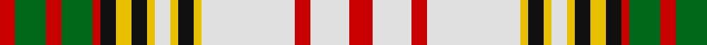

In pattern [RGRGRKYKYWYKYWRWR](/patterns/rgrgrkykywykywrwr/).

This was sourced from house-of-tartan.  It is a [17 stripes tartan](/stripes/stripes17/).

Original link http://www.house-of-tartan.scotland.net/house/TartanViewjs.asp?colr=Def&tnam=1514

## Thread count
R/4 G8 R4 G8 R2 K4 Y4 K4 Y2 LN4 Y2 K4 Y2 LN24 R4 LN10 R/6

## Palette
Each colour and its ΔE from the base-6 reference it is a variant of.

| Colour | Shade | Base | ΔE (OKLab) |
|---|---|---|---|
| G | <code style="background-color:#006818;">#006818</code> `#006818` | G <code style="background-color:#006400;">#006400</code> | 0.02 |
| K | <code style="background-color:#101010;">#101010</code> `#101010` | K <code style="background-color:#000000;">#000000</code> | 0.17 |
| LN | <code style="background-color:#E0E0E0;">#E0E0E0</code> `#E0E0E0` | W <code style="background-color:#F4F4F0;">#F4F4F0</code> | 0.06 |
| R | <code style="background-color:#C80000;">#C80000</code> `#C80000` | R <code style="background-color:#C80000;">#C80000</code> | 0.00 |
| Y | <code style="background-color:#E8C000;">#E8C000</code> `#E8C000` | Y <code style="background-color:#E8C000;">#E8C000</code> | 0.00 |

## Nearest tartans

The nearest existing variants by ΔTartan distance.

1. [Anderson Dress](/setts/s17/r6w10r4w24y2k4y2w4y2k4y4k4r2g8r4g8r4-g005020-k101010-rdc0000-we0e0e0-ye8c000/) — ΔT 0.18
1. [Anderson, dress](/setts/s17/r6w10r4w24y2k4y2w4y2k4y4k4r2g8r4g8r4-g008000-k000000-rc00000-we0e0e0-yf0c000/) — ΔT 0.29
1. [Stuart-Houghton Dress (Personal)](/setts/s16/w22g8w8b4w8g8w22r52g8w6g8w4b28ga20w32ga12-b141e46-g808080-ga003c14-rb03000-wf8f4d0/) — ΔT 0.52
1. [Stuart-Houghton Dress (Personal)](/setts/s16/w22b8w8b4w8r8w22ra52r8w6r8w4b28g20w32g12-b202060-g003820-r888888-rac04c08-wfcfcfc/) — ΔT 1.00
1. [Wombles](/setts/s15/w10b4w2g16w2b4r4w2r4b4w2y16w2b4w10-b304080-g008000-r900030-we0e0e0-yff8500/) — ΔT 1.04
1. [Maple Leaf Dress](/setts/s24/r24g20r24ga4r4ga36ra12g12ra12r36r4ga4r24g20r24ga4r4w4r4w48g4w48r4w4-g006818-ga003820-r880000-ra98481c-wfcfcfc/) — ΔT 1.12
1. [Wombles 5 (Corporate)](/setts/s15/w20b8w4g32w4b8r8w4r8b8w4y32w4b8w20-b2c2c80-g006818-ra00048-wfcfcfc-yd87c00/) — ΔT 1.12
1. [MacBean Dress](/setts/s16/g20w8r8ra8g4ra8r8w8g20w8b8w4b8w46k4r4-b5c8ca8-g006818-k101010-rc80000-ra901c38-we0e0e0/) — ΔT 1.13
1. [Wombles Corporate Tartan Tartan Number: 1783. Earliest known date: pre 2003 Wombles International, of Jacob's Well Mews, London, patented this design which is a variant of the Jacobite tartan. Wombles are television puppet characters. See products available Copyright © Blair Urquhart, Comrie, 2015](/setts/s15/w10b4w2g16w2b4r4w2r4b4w2y16w2b4w10-b2c2c80-g006818-ra00048-we0e0e0-yd87c00/) — ΔT 1.16
1. [MacBean dress](/setts/s16/g20w8r8ra8g4ra8r8w8g20w8b8w4b8w46k4r4-b5480b0-g008000-k000000-rc00000-ra802040-we0e0e0/) — ΔT 1.17

## Neighbour map

Every grey dot is one of 15726 variants placed by the first two principal components of the ΔTartan feature space (44% of its variance). Red is this tartan; blue dots are its nearest — click one to open its page.

<svg viewBox="0 0 640 380" role="img" style="max-width:100%;height:auto;border:1px solid #e0e0e0;border-radius:4px;display:block" xmlns="http://www.w3.org/2000/svg"><image href="/nn/cloud.v1.png" width="640" height="380"/><a href="/setts/s17/r6w10r4w24y2k4y2w4y2k4y4k4r2g8r4g8r4-g005020-k101010-rdc0000-we0e0e0-ye8c000/"><circle cx="121.4" cy="104.3" r="4" fill="#3465a4"><title>Anderson Dress</title></circle></a><a href="/setts/s17/r6w10r4w24y2k4y2w4y2k4y4k4r2g8r4g8r4-g008000-k000000-rc00000-we0e0e0-yf0c000/"><circle cx="114.7" cy="103.5" r="4" fill="#3465a4"><title>Anderson, dress</title></circle></a><a href="/setts/s16/w22g8w8b4w8g8w22r52g8w6g8w4b28ga20w32ga12-b141e46-g808080-ga003c14-rb03000-wf8f4d0/"><circle cx="121.2" cy="112.9" r="4" fill="#3465a4"><title>Stuart-Houghton Dress (Personal)</title></circle></a><a href="/setts/s16/w22b8w8b4w8r8w22ra52r8w6r8w4b28g20w32g12-b202060-g003820-r888888-rac04c08-wfcfcfc/"><circle cx="118.4" cy="111.2" r="4" fill="#3465a4"><title>Stuart-Houghton Dress (Personal)</title></circle></a><a href="/setts/s15/w10b4w2g16w2b4r4w2r4b4w2y16w2b4w10-b304080-g008000-r900030-we0e0e0-yff8500/"><circle cx="89.2" cy="136.2" r="4" fill="#3465a4"><title>Wombles</title></circle></a><a href="/setts/s24/r24g20r24ga4r4ga36ra12g12ra12r36r4ga4r24g20r24ga4r4w4r4w48g4w48r4w4-g006818-ga003820-r880000-ra98481c-wfcfcfc/"><circle cx="125.0" cy="96.8" r="4" fill="#3465a4"><title>Maple Leaf Dress</title></circle></a><a href="/setts/s15/w20b8w4g32w4b8r8w4r8b8w4y32w4b8w20-b2c2c80-g006818-ra00048-wfcfcfc-yd87c00/"><circle cx="77.1" cy="131.1" r="4" fill="#3465a4"><title>Wombles 5 (Corporate)</title></circle></a><a href="/setts/s16/g20w8r8ra8g4ra8r8w8g20w8b8w4b8w46k4r4-b5c8ca8-g006818-k101010-rc80000-ra901c38-we0e0e0/"><circle cx="130.7" cy="98.3" r="4" fill="#3465a4"><title>MacBean Dress</title></circle></a><a href="/setts/s15/w10b4w2g16w2b4r4w2r4b4w2y16w2b4w10-b2c2c80-g006818-ra00048-we0e0e0-yd87c00/"><circle cx="87.4" cy="136.7" r="4" fill="#3465a4"><title>Wombles Corporate Tartan Tartan Number: 1783. Earliest known date: pre 2003 Wombles International, of Jacob's Well Mews, London, patented this design which is a variant of the Jacobite tartan. Wombles are television puppet characters. See products available Copyright © Blair Urquhart, Comrie, 2015</title></circle></a><a href="/setts/s16/g20w8r8ra8g4ra8r8w8g20w8b8w4b8w46k4r4-b5480b0-g008000-k000000-rc00000-ra802040-we0e0e0/"><circle cx="127.8" cy="97.9" r="4" fill="#3465a4"><title>MacBean dress</title></circle></a><circle cx="121.9" cy="105.4" r="5" fill="#c00000"/></svg>

ID: /setts/s17/r6w10r4w24y2k4y2w4y2k4y4k4r2g8r4g8r4-g006818-k101010-rc80000-we0e0e0-ye8c000/
