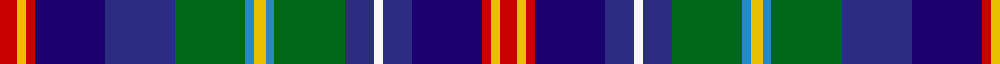

In pattern [RYRBBGBYBGBWBBRYR](/patterns/ryrbbgbybgbwbbryr/).

This was sourced from tartans-authority.  It is a [17 stripes tartan](/stripes/stripes17/).

Original link http://www.tartansauthority.com/tartan-ferret/display/6664/

## Thread count
R/6 Y3 R3 DBa24 DB24 G24 B3 Y4 B3 G24 DB10 W3 DB10 DBa24 R3 Y3 R/6

## Palette
Each colour and its ΔE from the base-6 reference it is a variant of.

| Colour | Shade | Base | ΔE (OKLab) |
|---|---|---|---|
| B | <code style="background-color:#2888C4;">#2888C4</code> `#2888C4` | B <code style="background-color:#2A418A;">#2A418A</code> | 0.21 |
| DB | <code style="background-color:#2C2C80;">#2C2C80</code> `#2C2C80` | B <code style="background-color:#2A418A;">#2A418A</code> | 0.06 |
| DBa | <code style="background-color:#1C0070;">#1C0070</code> `#1C0070` | B <code style="background-color:#2A418A;">#2A418A</code> | 0.14 |
| G | <code style="background-color:#006818;">#006818</code> `#006818` | G <code style="background-color:#006100;">#006100</code> | 0.02 |
| R | <code style="background-color:#C80000;">#C80000</code> `#C80000` | R <code style="background-color:#CC0000;">#CC0000</code> | 0.01 |
| W | <code style="background-color:#F8F8F8;">#F8F8F8</code> `#F8F8F8` | W <code style="background-color:#F7F7F7;">#F7F7F7</code> | 0.00 |
| Y | <code style="background-color:#E8C000;">#E8C000</code> `#E8C000` | Y <code style="background-color:#F2BF00;">#F2BF00</code> | 0.02 |

## Nearest tartans

The nearest existing variants by ΔTartan distance.

1. [Man, Isle of](/setts/s13/r4b44g8y6ga14ya4ga8y4ga18ba12ya4ba8y4-b00008c-ba640064-g64340c-ga004c00-r8c0000-yb0b0b0-yac89800/) — ΔT 0.92
1. [McCulloch (Military Colours)](/setts/s15/b24ba4b4ba4b12y4w4r4w4y4g12k4g4k4g24-b0064ac-ba000064-g324114-k001e00-rdc0000-wc0c0c0-ya9a0a0/) — ΔT 1.12
1. [South Lanarkshire](/setts/s16/b4ba28k4g24k4bb28w4k8w4bb28k4g24k4ba28b4k4-b2888c4-ba2c2c80-bb780078-g006818-k101010-we0e0e0/) — ΔT 1.15
1. [Kukri](/setts/s18/b16k4b6g6k6r6g20ga6k6w6k6ba32g12k6b12w16k4ba4-b202060-ba780078-g003820-ga006818-k101010-rc80000-wfcfcfc/) — ΔT 1.17
1. [Stuart/Stewart Black #3](/setts/s12/b40ba12k16y4k8w8k8g26r14k8r6w4-b2c4084-ba3c82af-g005020-k101010-rdc0000-we0e0e0-ye8c000/) — ΔT 1.17
1. [Iowa](/setts/s14/r8y6g24k32ga10b40k8w4k8b40ga10k32g24y6-b2c2c80-g006818-ga604000-k101010-rc80000-wf8f8f8-ye8c000/) — ΔT 1.18
1. [Iowa American District Tartan Tartan Number: 6051. Earliest known date: 2004 Iowa has a rich history of Scottish influence in the towns and cities. The Iowa Scottish Heritage Society desired to give to the people of Iowa a tartan that symbolizes the state. Blue for the sky, rivers & lakes, Green for the fields our farmers plant. Black for the rich soil for which we are blessed. White for the snow. Red for the barns and the wild rose. Brown for the earth. Yellow for corn and the Goldfinch. Adopted by the State of Iowa General Assembly, resolution No 149 by Heaton & Whitaker. See products available Copyright © Blair Urquhart, Comrie, 2015](/setts/s14/g24k32ga10b40k8w4k8b40ga10k32g24y6r8y6-b2c2c80-g006818-ga604000-k101010-rc80000-wf8f8f8-ye8c000/) — ΔT 1.18
1. [Ross Anderson (Fashion) #2](/setts/s14/g16r8b12r4b12y4k8y4k8w8k8ra44r4k4-b202060-g003820-k101010-r880000-ra888888-wc0c0c0-yd09800/) — ΔT 1.24
1. [Haughey (Personal)](/setts/s16/b12r4b4r8b28r4g24r4g6w4g6k22ba18g4ba12w4-b2c2c80-ba780078-g006818-k101010-rc80000-wf8f8f8/) — ΔT 1.24
1. [Culloden 1746 Artefact Tartan Tartan Number: 7422. Earliest known date: 1746 Count from the original Culloden coat discovered and later examined by Peter MacDonald on display at the Kelvingrove Museum, Glasgow. See products available Copyright © Blair Urquhart, Comrie, 2015](/setts/s14/r20w4b40wa8k40g40k4y12k4g40k40wa8b40w4-b003c64-g5c6428-k101010-rc80000-w98c8e8-wafcfcfc-ye8c000/) — ΔT 1.27

## Neighbour map

Every grey dot is one of 15726 variants placed by the first two principal components of the ΔTartan feature space (44% of its variance). Red is this tartan; blue dots are its nearest — click one to open its page.

<svg viewBox="0 0 640 380" role="img" style="max-width:100%;height:auto;border:1px solid #e0e0e0;border-radius:4px;display:block" xmlns="http://www.w3.org/2000/svg"><image href="/nn/cloud.v1.png" width="640" height="380"/><a href="/setts/s13/r4b44g8y6ga14ya4ga8y4ga18ba12ya4ba8y4-b00008c-ba640064-g64340c-ga004c00-r8c0000-yb0b0b0-yac89800/"><circle cx="90.0" cy="113.2" r="4" fill="#3465a4"><title>Man, Isle of</title></circle></a><a href="/setts/s15/b24ba4b4ba4b12y4w4r4w4y4g12k4g4k4g24-b0064ac-ba000064-g324114-k001e00-rdc0000-wc0c0c0-ya9a0a0/"><circle cx="87.6" cy="142.2" r="4" fill="#3465a4"><title>McCulloch (Military Colours)</title></circle></a><a href="/setts/s16/b4ba28k4g24k4bb28w4k8w4bb28k4g24k4ba28b4k4-b2888c4-ba2c2c80-bb780078-g006818-k101010-we0e0e0/"><circle cx="79.9" cy="150.4" r="4" fill="#3465a4"><title>South Lanarkshire</title></circle></a><a href="/setts/s18/b16k4b6g6k6r6g20ga6k6w6k6ba32g12k6b12w16k4ba4-b202060-ba780078-g003820-ga006818-k101010-rc80000-wfcfcfc/"><circle cx="14.0" cy="119.0" r="4" fill="#3465a4"><title>Kukri</title></circle></a><a href="/setts/s12/b40ba12k16y4k8w8k8g26r14k8r6w4-b2c4084-ba3c82af-g005020-k101010-rdc0000-we0e0e0-ye8c000/"><circle cx="32.1" cy="126.7" r="4" fill="#3465a4"><title>Stuart/Stewart Black #3</title></circle></a><a href="/setts/s14/r8y6g24k32ga10b40k8w4k8b40ga10k32g24y6-b2c2c80-g006818-ga604000-k101010-rc80000-wf8f8f8-ye8c000/"><circle cx="78.4" cy="141.2" r="4" fill="#3465a4"><title>Iowa</title></circle></a><a href="/setts/s14/g24k32ga10b40k8w4k8b40ga10k32g24y6r8y6-b2c2c80-g006818-ga604000-k101010-rc80000-wf8f8f8-ye8c000/"><circle cx="78.4" cy="141.2" r="4" fill="#3465a4"><title>Iowa American District Tartan Tartan Number: 6051. Earliest known date: 2004 Iowa has a rich history of Scottish influence in the towns and cities. The Iowa Scottish Heritage Society desired to give to the people of Iowa a tartan that symbolizes the state. Blue for the sky, rivers &amp; lakes, Green for the fields our farmers plant. Black for the rich soil for which we are blessed. White for the snow. Red for the barns and the wild rose. Brown for the earth. Yellow for corn and the Goldfinch. Adopted by the State of Iowa General Assembly, resolution No 149 by Heaton &amp; Whitaker. See products available Copyright © Blair Urquhart, Comrie, 2015</title></circle></a><a href="/setts/s14/g16r8b12r4b12y4k8y4k8w8k8ra44r4k4-b202060-g003820-k101010-r880000-ra888888-wc0c0c0-yd09800/"><circle cx="68.9" cy="103.7" r="4" fill="#3465a4"><title>Ross Anderson (Fashion) #2</title></circle></a><a href="/setts/s16/b12r4b4r8b28r4g24r4g6w4g6k22ba18g4ba12w4-b2c2c80-ba780078-g006818-k101010-rc80000-wf8f8f8/"><circle cx="49.2" cy="146.6" r="4" fill="#3465a4"><title>Haughey (Personal)</title></circle></a><a href="/setts/s14/r20w4b40wa8k40g40k4y12k4g40k40wa8b40w4-b003c64-g5c6428-k101010-rc80000-w98c8e8-wafcfcfc-ye8c000/"><circle cx="50.7" cy="127.1" r="4" fill="#3465a4"><title>Culloden 1746 Artefact Tartan Tartan Number: 7422. Earliest known date: 1746 Count from the original Culloden coat discovered and later examined by Peter MacDonald on display at the Kelvingrove Museum, Glasgow. See products available Copyright © Blair Urquhart, Comrie, 2015</title></circle></a><circle cx="46.5" cy="121.2" r="5" fill="#c00000"/></svg>

ID: /setts/s17/r6y3r3b24ba24g24bb3y4bb3g24ba10w3ba10b24r3y3r6-b1c0070-ba2c2c80-bb2888c4-g006818-rc80000-wf8f8f8-ye8c000/
