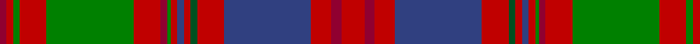

In pattern [RRGRGRRGRBRGRBRRR](/stripes/rrgrgrrgrbrgrbrrr/).

This was sourced from weddslist.  It is a [17 stripe tartan](/stripes/stripes17/).

Original link http://www.weddslist.com/cgi-bin/tartans/pg.pl?source=sts

## Thread count
R/14 DR6 R12 B52 R16 G4 R4 B4 R4 Ga2 DR4 R16 Ga52 R16 Ga4 R4 DR/4

## Palette
Each colour and the base-6 reference it is a variant of.

| Colour | Shade | Base |
|---|---|---|
| B | <code style="background-color:#304080;">#304080</code> `oklch(39.4% 0.109 270.2)` <small>#304080</small> | B <code style="background-color:#2A418A;">#2A418A</code> |
| DR | <code style="background-color:#900030;">#900030</code> `oklch(41.6% 0.166 13.6)` <small>#900030</small> | R <code style="background-color:#CC0000;">#CC0000</code> |
| G | <code style="background-color:#005020;">#005020</code> `oklch(37.7% 0.105 149.6)` <small>#005020</small> | G <code style="background-color:#006100;">#006100</code> |
| Ga | <code style="background-color:#008000;">#008000</code> `oklch(52.0% 0.177 142.5)` <small>#008000</small> | G <code style="background-color:#006100;">#006100</code> |
| R | <code style="background-color:#C00000;">#C00000</code> `oklch(50.7% 0.208 29.2)` <small>#C00000</small> | R <code style="background-color:#CC0000;">#CC0000</code> |

## Nearest tartans

The nearest existing variants by ΔTartan distance, with this tartan at the top so the swatches line up against it.

ΔTartan

Tartan

Sett

—

<a href="/ttd/edit/#slug=r7r3r6db26r8dg2r2db2r2g1r2r8g26r8g2r2r2~x2">MacColl, Ancient</a> <a class="nn-out" href="/setts/s17/r7r3r6db26r8dg2r2db2r2g1r2r8g26r8g2r2r2~x2/" title="open its dictionary page">↗</a>

0.74

<a href="/ttd/edit/#slug=r6m3r6db22r7m2w1r2db2r2w1m2r7g22r7g2r2m2~x2">MacColl Hunting</a> <a class="nn-out" href="/setts/s18/r6m3r6db22r7m2w1r2db2r2w1m2r7g22r7g2r2m2~x2/" title="open its dictionary page">↗</a>

0.80

<a href="/setts/s16/r24lb1k3lb1g14r8k3dp3lb2~x4/">Leach Family Tartan Tartan Number: 2356. Earliest known date: pre 1997 Originally the name given to physicians and has been in Scotland for centuries. Can be worn by all people with all spellings of the name Leach. See products available Copyright © Blair Urquhart, Comrie, 2015</a>

0.91

<a href="/ttd/edit/#slug=w1dp2r1dg22r3dg1r3db9dp2r1dp2dg8r8dg8r1db1r22dp2r2w1~x2">MacDougall (Paton)</a> <a class="nn-out" href="/setts/s20/w1dp2r1dg22r3dg1r3db9dp2r1dp2dg8r8dg8r1db1r22dp2r2w1~x2/" title="open its dictionary page">↗</a>

0.91

<a href="/ttd/edit/#slug=w1r2p2r22db1r1g8r8g8p2r1p2db9r3g1r3g22r1p2w1~x2">MacDougall 7</a> <a class="nn-out" href="/setts/s20/w1r2p2r22db1r1g8r8g8p2r1p2db9r3g1r3g22r1p2w1~x2/" title="open its dictionary page">↗</a>

0.95

<a href="/ttd/edit/#slug=w2r2lp2r22db2r2g8r8g8lp2r2lp2db9r3g1r3g22r2lp2w2~x2">MacDougall Clan Tartan Tartan Number: 1776. Earliest known date: 1977 Matched to a sample by B Urquhart in 2004, from Lochcarron reiver cloth. The purple colour was lightened considerably to a pale mauve, giving an almost equal prominence to the white. See products available Copyright © Blair Urquhart, Comrie, 2015</a> <a class="nn-out" href="/setts/s20/w2r2lp2r22db2r2g8r8g8lp2r2lp2db9r3g1r3g22r2lp2w2~x2/" title="open its dictionary page">↗</a>

0.98

<a href="/ttd/edit/#slug=g14r6r2dt3r65dt2t2r6dt34r6t2dt2r4g66r12r2dt2t4">Stewart of Ardshiel Clan Tartan Tartan Number: 73. Earliest known date: 1822 There are minor differences between the warp and weft in the blue not shown in the illustration. This is the earliest record of a Stewart of Ardshiel tartan. It differs from the Stewart of Appin in that the Red is interchanged with the blue. Ardshiel is part of Appin and it may be a variation on a sett common to the area. Stewarts of Ardshiel are regarded as a sept of the Appin branch. See products available Copyright © Blair Urquhart, Comrie, 2015</a> <a class="nn-out" href="/setts/s18/g14r6r2dt3r65dt2t2r6dt34r6t2dt2r4g66r12r2dt2t4/" title="open its dictionary page">↗</a>

1.02

<a href="/ttd/edit/#slug=dp1r1dp1r6g26dp14r20t1r1t1r2lr1~x2">Scobie (Name)</a> <a class="nn-out" href="/setts/s12/dp1r1dp1r6g26dp14r20t1r1t1r2lr1~x2/" title="open its dictionary page">↗</a>

1.04

<a href="/ttd/edit/#slug=r7r3r6db26r8r2r2db2r2dg1r2r8dg26r8dg2r2r2~x2">MacColl Ancient</a> <a class="nn-out" href="/setts/s17/r7r3r6db26r8r2r2db2r2dg1r2r8dg26r8dg2r2r2~x2/" title="open its dictionary page">↗</a>

1.04

<a href="/ttd/edit/#slug=r6r3r6db22r7r2w1r2db2r2w1r2r7y22r7y2r2r2~x2">MacColl, hunting</a> <a class="nn-out" href="/setts/s18/r6r3r6db22r7r2w1r2db2r2w1r2r7y22r7y2r2r2~x2/" title="open its dictionary page">↗</a>

1.06

<a href="/ttd/edit/#slug=r4dt1ly3dt1r20dt4g9r3g9dt4lb3dt1g7dt2r6ly2~x2">Brown-Wells (Personal)</a> <a class="nn-out" href="/setts/s16/r4dt1ly3dt1r20dt4g9r3g9dt4lb3dt1g7dt2r6ly2~x2/" title="open its dictionary page">↗</a>

## Neighbour map

Every grey dot is one of 14299 variants placed by the first two principal components of the ΔTartan feature space (44% of its variance). Red is this tartan; blue dots are its nearest — click one to open its page.

<svg viewBox="0 0 640 380" role="img" style="max-width:100%;height:auto;border:1px solid #e0e0e0;border-radius:4px;display:block" xmlns="http://www.w3.org/2000/svg"><image href="/nn/cloud.v1.png" width="640" height="380"/><a href="/setts/s18/r6m3r6db22r7m2w1r2db2r2w1m2r7g22r7g2r2m2~x2/"><circle cx="232.4" cy="93.7" r="4" fill="#3465a4"><title>MacColl Hunting</title></circle></a><a href="/setts/s16/r24lb1k3lb1g14r8k3dp3lb2~x4/"><circle cx="253.5" cy="106.4" r="4" fill="#3465a4"><title>Leach Family Tartan Tartan Number: 2356. Earliest known date: pre 1997 Originally the name given to physicians and has been in Scotland for centuries. Can be worn by all people with all spellings of the name Leach. See products available Copyright © Blair Urquhart, Comrie, 2015</title></circle></a><a href="/setts/s20/w1dp2r1dg22r3dg1r3db9dp2r1dp2dg8r8dg8r1db1r22dp2r2w1~x2/"><circle cx="250.7" cy="81.1" r="4" fill="#3465a4"><title>MacDougall (Paton)</title></circle></a><a href="/setts/s20/w1r2p2r22db1r1g8r8g8p2r1p2db9r3g1r3g22r1p2w1~x2/"><circle cx="252.4" cy="83.7" r="4" fill="#3465a4"><title>MacDougall 7</title></circle></a><a href="/setts/s20/w2r2lp2r22db2r2g8r8g8lp2r2lp2db9r3g1r3g22r2lp2w2~x2/"><circle cx="236.0" cy="83.8" r="4" fill="#3465a4"><title>MacDougall Clan Tartan Tartan Number: 1776. Earliest known date: 1977 Matched to a sample by B Urquhart in 2004, from Lochcarron reiver cloth. The purple colour was lightened considerably to a pale mauve, giving an almost equal prominence to the white. See products available Copyright © Blair Urquhart, Comrie, 2015</title></circle></a><a href="/setts/s18/g14r6r2dt3r65dt2t2r6dt34r6t2dt2r4g66r12r2dt2t4/"><circle cx="297.2" cy="67.6" r="4" fill="#3465a4"><title>Stewart of Ardshiel Clan Tartan Tartan Number: 73. Earliest known date: 1822 There are minor differences between the warp and weft in the blue not shown in the illustration. This is the earliest record of a Stewart of Ardshiel tartan. It differs from the Stewart of Appin in that the Red is interchanged with the blue. Ardshiel is part of Appin and it may be a variation on a sett common to the area. Stewarts of Ardshiel are regarded as a sept of the Appin branch. See products available Copyright © Blair Urquhart, Comrie, 2015</title></circle></a><a href="/setts/s12/dp1r1dp1r6g26dp14r20t1r1t1r2lr1~x2/"><circle cx="279.9" cy="95.8" r="4" fill="#3465a4"><title>Scobie (Name)</title></circle></a><a href="/setts/s17/r7r3r6db26r8r2r2db2r2dg1r2r8dg26r8dg2r2r2~x2/"><circle cx="268.8" cy="106.9" r="4" fill="#3465a4"><title>MacColl Ancient</title></circle></a><a href="/setts/s18/r6r3r6db22r7r2w1r2db2r2w1r2r7y22r7y2r2r2~x2/"><circle cx="259.6" cy="105.8" r="4" fill="#3465a4"><title>MacColl, hunting</title></circle></a><a href="/setts/s16/r4dt1ly3dt1r20dt4g9r3g9dt4lb3dt1g7dt2r6ly2~x2/"><circle cx="219.4" cy="112.7" r="4" fill="#3465a4"><title>Brown-Wells (Personal)</title></circle></a><circle cx="250.4" cy="94.8" r="5" fill="#c00000"/></svg>

ID: /setts/s17/r7r3r6db26r8dg2r2db2r2g1r2r8g26r8g2r2r2~x2/
